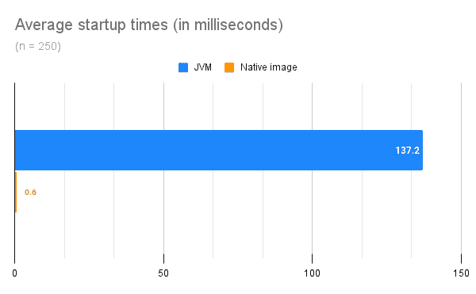

# 谷歌云技术金块—2022 年 7 月 1 日至 15 日版

> 原文：<https://medium.com/google-cloud/google-cloud-technology-nuggets-july-1-15-2022-edition-82549fee20af?source=collection_archive---------1----------------------->

欢迎参加 2022 年 7 月 1 日至 15 日的谷歌云技术金块。

**//几个谷歌云资源的快速链接**

如果您正在跟踪 Google Cloud 的新功能以及发行说明，请将这些链接放在手边。如果你喜欢播客，可以去播客网站看看，上面列出了 3 个谷歌云的播客，涉及各种主题。

*   [谷歌云](https://cloud.google.com/blog/topics/inside-google-cloud/whats-new-google-cloud)的新功能。
*   [谷歌云发布说明](https://cloud.google.com/release-notes)
*   [谷歌云播客网站](http://cloud.google.com/podcasts?utm_source=ext&utm_medium=partner&utm_campaign=CDR_rom_gcp_gcptechnuggets_feb-a-2022_021622&utm_content=-)

# **基础设施**

基于 Arm 的计算将会继续存在，Google Cloud 已经[宣布了基于 Tau 系列虚拟机的首批基于 Arm 的机器类型的预览](https://cloud.google.com/blog/products/compute/tau-t2a-is-first-compute-engine-vm-on-an-arm-chip)。Tau T2A 虚拟机有多种预定义的虚拟机形状，每个虚拟机最多有 48 个 vCPU，每个 vCPU 有 4GB 内存。

要了解更多关于 Tau T2A 虚拟机或其他计算引擎虚拟机选项的信息，请查看我们的[机器类型](https://cloud.google.com/compute/docs/machine-types)和[定价](https://cloud.google.com/compute/all-pricing)页面。

一些谷歌云服务也可用于 T2A 虚拟机，其中包括 GKE，数据流和新的批处理服务。查看关于在 Tau T2A 虚拟机上运行 GKE 工作负载的[博文](https://cloud.google.com/blog/products/containers-kubernetes/gke-supports-new-arm-based-tau-t2a-vms)。

批处理计算无需介绍。Google Cloud 在 preview 中提供了一个名为 Batch 的新服务，它可以帮助您使用 Google Cloud 中可用的各种计算资源来运行批处理工作负载。

它管理作业队列，提供和自动缩放资源，运行作业，执行子任务，并处理常见错误。查看[博客文章](https://cloud.google.com/blog/products/compute/new-batch-service-processes-batch-jobs-on-google-cloud)了解关于该服务的更多细节，您需要熟悉的概念以及早期访问周期中的一些客户如何利用批处理服务。有关批处理服务的更多信息，请查看[产品页面](http://cloud.google.com/batch)。除了运行向您收取的服务所需的资源之外，没有任何额外费用。

# **谷歌 I/O 冒险云架构**

希望你今年有机会以虚拟形式参加谷歌 I/O 2022。有几个重要的公告，如果你想赶上录音，他们是[可在这里](https://io.google/2022/program/?q=7e71258b-2ba6-4981-bcb9-6abfe678a99e)。

Google I/O 和名为 Google I/O Adventure 的在线体验是一个有趣的实验。你知道吗，它完全是由谷歌云服务驱动的。最有趣的是，我们现在有一篇关于架构、服务和在谷歌云上托管这种体验的所有细节的文章。

# **安全**

从内部迁移到云并尝试构建安全威胁模型？由于不同的威胁环境、It 环境和检测方法，这不是一项容易的任务。

网络安全行动小组写了一篇出色的博文[列出了减轻云中威胁的方法。](https://cloud.google.com/blog/products/identity-security/how-to-think-about-threat-detection-in-the-cloud)

由于在开发周期的更早阶段就发现了安全缺陷和错误配置，所以现在广泛建议在安全性上左移，并在以后的生产中导致更少的与软件相关的安全缺陷。

Google Cloud 中有助于解决上述问题的关键工具是安全指挥中心和云构建。查看讨论两个具体用例的[博客文章](https://cloud.google.com/blog/products/identity-security/shift-left-on-google-cloud-security-invest-now-save-later):安全健康检查器和安全管道检查器，以及有助于 Google 服务“左移”的 Github 库。

在安全性方面，标准机构和组织的后量子加密计划进展顺利。目标是开发对量子计算机和经典计算机都安全的加密系统，并且可以与现有的通信协议和网络互操作。如果你想了解谷歌在后量子密码术(PQC)领域的努力，以及谷歌如何为标准做出贡献，准备其服务并帮助客户做好准备，请查看这篇[帖子](https://cloud.google.com/blog/products/identity-security/how-google-is-preparing-for-a-post-quantum-world)。

# **数据库、分析和机器学习**

Google Cloud 上的数据库指南继续第 3 部分。在这一部分，一个完整的 CRUD 例子，在云上运行一个 Spring Boot 应用程序，与 Google Cloud Spanner 接口。查看[的博客文章](https://cloud.google.com/blog/topics/developers-practitioners/cloud-spanner-crud-it-spring-boot-cloud-run)了解更多细节。

如果您正在使用 Cloud Spanner，这里有一篇详细的[博客文章](https://cloud.google.com/blog/topics/developers-practitioners/debugging-cloud-spanner-latency-using-opencensus-and-go-client-library)强调了客户端应用程序报告的性能指标与 Cloud Spanner 指标报告的性能指标之间的差异是如何在 OpenCensus 和 Go 客户端库的帮助下进行调试的。

希望为 SQL Server 调优和优化 Google Cloud SQL？查看这篇[文章](https://cloud.google.com/blog/products/databases/sql-server-performance-analysis-and-query-tuning)，它涵盖了数据库管理员目前可以使用的流行性能分析工具和技术。

继续使用 Cloud SQL for SQL Server，您现在可以通过支持 SQL Server 的事务复制功能来保持数据库的最新副本。查看[博客文章](https://cloud.google.com/blog/topics/developers-practitioners/data-here-data-there-replicating-your-data-cloud-sql)，它展示了如何为 SQL Server 实例设置一个云 SQL，作为另一个云 SQL 实例的发布者。

将数据加载到 BigQuery 时，典型的流程是获取 Google 云存储中的数据，然后将其加载到 BigQuery 中。有多种数据格式，如逗号分隔值(CSV)、Avro、Parquet、JSON 和 ORC 格式。你应该使用哪一个？哪种格式最有效？您应该将数据压缩还是解压缩？看看这篇通过这些实验帮助你做出更好选择的[博文](https://cloud.google.com/blog/products/data-analytics/data-loading-into-bigquery)。

您如何管理您的数据科学团队所做的实验？跟踪这些实验的过程和结果，能够在开发模型的同时快速迭代实验是一个巨大的挑战。为了帮助解决这个问题，Vertex AI Experiments 提供了 Vertex AI 上的托管实验跟踪服务，它已经正式上市(GA)。正如博客文章所述，“你不仅可以跟踪参数，可视化和比较你的模型的性能指标，你还可以建立管理实验，这些实验可以快速投入生产，因为 ML 管道和 Vertex AI 的元数据沿袭集成功能。”

# **开发者和从业者**

无服务器 orchestrator 服务 [Workflows](https://cloud.google.com/workflows) 在预览模式中增加了并行执行流程。想想以前必须一个接一个串行执行的长时间运行的操作。您现在可以使用并行步骤特性来并行执行它们。这大大增加了执行时间，并且有助于更有效地管理资源需求，而不是在串行执行时提前增加资源需求。

查看[博客文章](https://cloud.google.com/blog/topics/developers-practitioners/introducing-parallel-steps-workflows-speed-up-workflow-executions-by-running-steps-concurrently)，它展示了一系列 5 个 BigQuery 作业，这些作业首先被串行执行，然后被并行执行。

原生映像技术允许您预先编译 Java 应用程序，并将其编译成可执行代码，这可以提供显著的性能优势，尤其是在冷启动时。Java 客户端库现在支持本机映像编译。这些库现在提供了同样所需的配置支持。

查看[博客文章](https://cloud.google.com/blog/topics/developers-practitioners/announcing-native-image-support-java-client-libraries-optimize-your-short-lived-workloads)，它涵盖了一个详细的分步示例，您可以尝试看看在启动时间和内存使用方面的好处。

Google logging client library for Go 发布了新的 1.5 版。发布的一些关键特性包括支持结构化日志、支持 W3C 跟踪上下文头、通过部分成功标志控制日志的批量接收等等。查看[博客文章](https://cloud.google.com/blog/products/devops-sre/more-support-for-structured-logs-in-new-version-of-go-logging-library)了解更多详情。

# **让我们来了解一下谷歌云**

首先，如果你是谷歌云的新手，并且想获得认证，那么你有以下机会:

*   在 Coursera 上免费获得一个月的 Google Cloud Professional 证书，帮助您准备相关的 Google Cloud 认证考试。
*   在 2022 年 8 月 31 日之前完成 Coursera 上的专业证书，可以获得谷歌云认证考试费用的折扣券。

要开始，点击[这里](http://coursera.org/promo/googlecloud-training-promotion?utm_medium=institutions&utm_source=googlecloud&utm_campaign=July22_blog)。

接下来说说[谷歌云专业安全工程师](https://cloud.google.com/certification/cloud-security-engineer)认证。如果你计划参加这次考试，从[这里](/google-cloud/preparing-for-the-google-cloud-professional-cloud-security-engineer-exam-56bc34d02c45)列出的可靠资源列表开始。它包括课程、实验、重点关注的主题等等。

您如何保护您的应用程序免受基于网络的威胁？通过这篇[博文](https://cloud.google.com/blog/topics/developers-practitioners/network-application-security-google-cloud)了解网络和应用安全。

[安全指挥中心](https://cloud.google.com/security-command-center)持续监控您的 Google 云环境，帮助您发现漏洞、检测威胁并帮助实现合规性。查看这篇[文章](https://cloud.google.com/blog/topics/developers-practitioners/security-monitoring-google-cloud)以了解关于这项服务的更多信息。

# 保持联系

对这份时事通讯有任何问题、意见或其他反馈吗？请发送[反馈](https://forms.gle/UAsAS7YLxYSBTNBy9)。

想要关注新的谷歌云产品发布吗？我们有一个方便的页面，您可以将它加入书签→[Google Cloud 的新功能](https://bit.ly/3umz3cA?utm_source=ext&utm_medium=partner&utm_campaign=CDR_rom_gcp_gcptechnuggets_feb-a-2022_021622&utm_content=-)。