# 谷歌云技术金块—2022 年 7 月 16 日至 31 日版

> 原文：<https://medium.com/google-cloud/google-cloud-technology-nuggets-july-16-31-2022-edition-beedf1e6e353?source=collection_archive---------2----------------------->

欢迎参加 2022 年 7 月 16 日至 31 日的谷歌云技术金块。

# **专业云数据库工程师认证**

最新的专业认证是[云数据库工程师认证](https://cloud.google.com/certification/cloud-database-engineer)。查看[的博客文章](https://cloud.google.com/blog/topics/training-certifications/new-google-cloud-training-and-certification-available)，它提供了关于该认证的信息，以及[考试指南](https://cloud.google.com/certification/guides/cloud-database-engineer)和认证[学习路径](https://www.cloudskillsboost.google/paths/22?utm_source=cgc&utm_medium=et&utm_campaign=-&utm_content=cgc-cert-database&utm_term=-)。

# **基础设施**

一个新的云区正在向墨西哥靠近。该地区上线后，将成为拉丁美洲的第三个地区，另外三个是智利的圣地亚哥和巴西的圣保罗。查看[博客文章](https://cloud.google.com/blog/products/infrastructure/announcing-a-new-google-cloud-region-in-mexico)了解更多详情。请访问[全球云基础设施页面](https://cloud.google.com/infrastructure)了解当前和未来地区的更多信息。

# **集装箱和 GKE**

GKE 自动驾驶仪现在支持横向扩展计算类，该类提供高性能 x86 和 Arm 计算。该功能在预览中可用。横向扩展计算类专为针对每核单线程和横向扩展而优化的工作负载而设计。查看[博客文章](https://cloud.google.com/blog/products/containers-kubernetes/deploying-arm-workloads-on-gke-autopilot-with-the-scale-out-compute-class)了解更多详情。

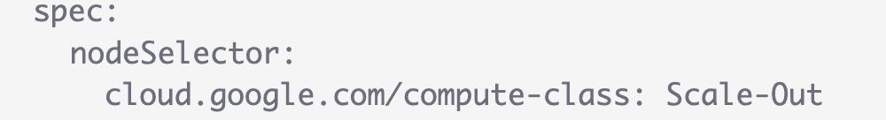

如果你想在 GKE 上运行数据密集型工作负载，可以看看[博客文章](https://cloud.google.com/blog/products/containers-kubernetes/gke-and-mariadb-better-together)，这篇文章强调了如何使用 MariaDB SkySQL 运行这些工作负载。

# **安全**

云 CISO 对 2022 年 7 月的展望是[出](https://cloud.google.com/blog/products/identity-security/cloud-ciso-perspectives-july-2022)。本月的版本重点关注组织的董事会与其网络安全之间的关系，以及向云的数字化转型之旅。这篇博客文章重点介绍了围绕公司使命和文化实现这些目标的 3 种可能场景和最佳实践。查看该版本，获取更多关于安全更新、最佳实践等的文章。

如果您是托管安全解决方案提供商(MSSP)，您可能会发现自疫情以来，对您服务的需求不断增加。为了保持这一势头，中小企业需要解决[这篇博文](https://cloud.google.com/blog/products/identity-security/how-secops-can-help-solve-these-6-key-mssp-conundrums)中强调的六个关键挑战。这些挑战包括缺乏中央可见性、人员成本增加、全天候运营等。这篇博客文章随后提供了一个方向，说明综合 secops 如何通过 [chronicle.security](https://chronicle.security/) 帮助解决这些问题。

PostgreSQL 和 MySQL 的 Cloud SQL 本地用户密码验证功能现已正式上市。此功能帮助您设置密码规则，包括最少字符数、密码复杂性、密码需要更改前的最少天数等。

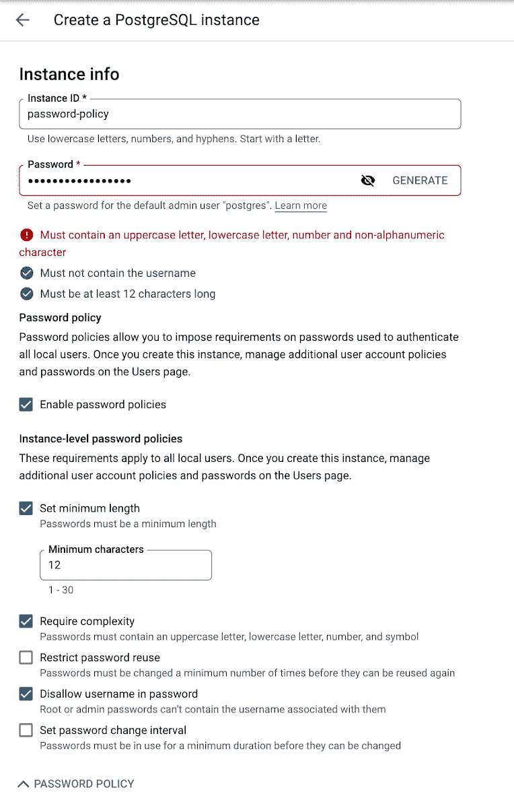

查看[博客文章](https://cloud.google.com/blog/products/identity-security/introducing-password-policies-for-cloud-sql-for-postgresql-and-mysql-local-users)了解更多细节，以及它如何解释本地密码和 IAM 之间的关系，以及如何让它们一起工作。

凭据填充是最难检测的攻击之一。查看这篇关于如何利用 Google reCAPTCHA 和 Cloud Armor 解决凭证填充攻击的详细博客文章。

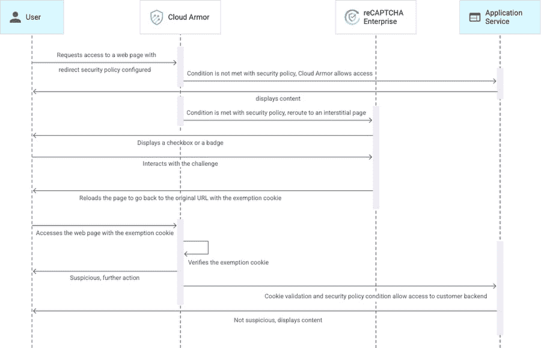

# **数据库、分析和机器学习**

在此期间，Dataflow 发布了重要公告。首先，数据流有 3 个特性:

1.  Dataflow Prime:为您的流数据处理工作负载自动利用水平自动扩展(更多机器)和垂直自动扩展(更大的机器和更多内存)。
2.  数据流 Go:对 Go 语言的本地支持。
3.  Dataflow ML:直接在管道中运行 PyTorch 和 scikit-learn 模型的现成支持。

查看[博客文章](https://cloud.google.com/blog/products/data-analytics/latest-dataflow-innovations-for-real-time-streaming-and-aiml)了解更多详情。

Google Cloud Data Catalog 正在通过 Dataplex 统一到一个用户界面中。统一的体验使您能够跨大规模分布式数据自动进行数据管理、治理、发现和探索。查看[的博文](https://cloud.google.com/blog/products/data-analytics/manage-and-govern-data-with-the-unified-dataplex-and-data-catalog)了解更多细节。

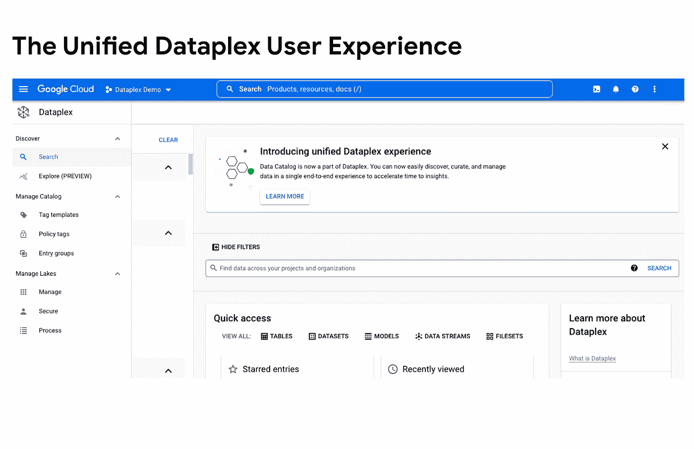

最后，BigLake 现已正式上市(GA)。查看[的帖子](https://cloud.google.com/blog/products/data-analytics/unify-data-lakes-and-warehouses-with-biglake-now-generally-available)，了解更多细节以及客户如何利用它。

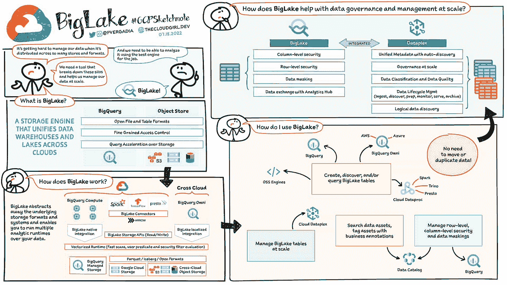

Google Cloud 上的数据库指南继续第 4 部分。在这一部分中，一个完整的 CRUD 示例将在云 Run 上运行 Spring Boot 应用程序，并与云 Firestore 接口。查看[博客文章](https://cloud.google.com/blog/topics/developers-practitioners/databases-google-cloud-part-4-query-index-crud-and-crush-your-java-app-firestore-apis)了解更多细节。

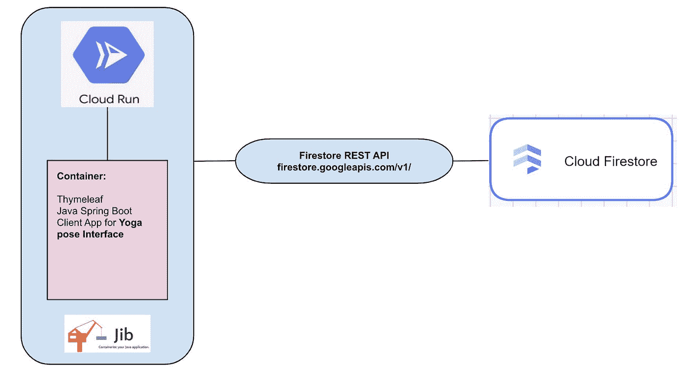

希望在顶点人工智能管道中操作 BigQuery 和 BQML 作业？为了实现这一目标，已经发布了 20 多个 BQML 管道操作员，这将有助于自动化和监控 BQML 模型从培训到服务的整个模型生命周期。

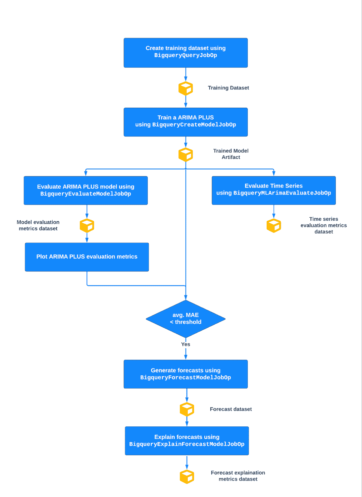

查看这篇[文章](https://cloud.google.com/blog/topics/developers-practitioners/new-20-pipeline-operators-bqml)，了解更多关于运营商的详细信息，以及在 BQML 中创建需求预测管道的详细指南。

无需编写自己的管道将数据从发布/订阅移动到 BigQuery。一种称为“BigQuery 订阅”的新型发布/订阅直接从发布/订阅写入 BigQuery。查看[博客文章](https://cloud.google.com/blog/products/data-analytics/pub-sub-launches-direct-path-to-bigquery-for-streaming-analytics)了解更多详情。

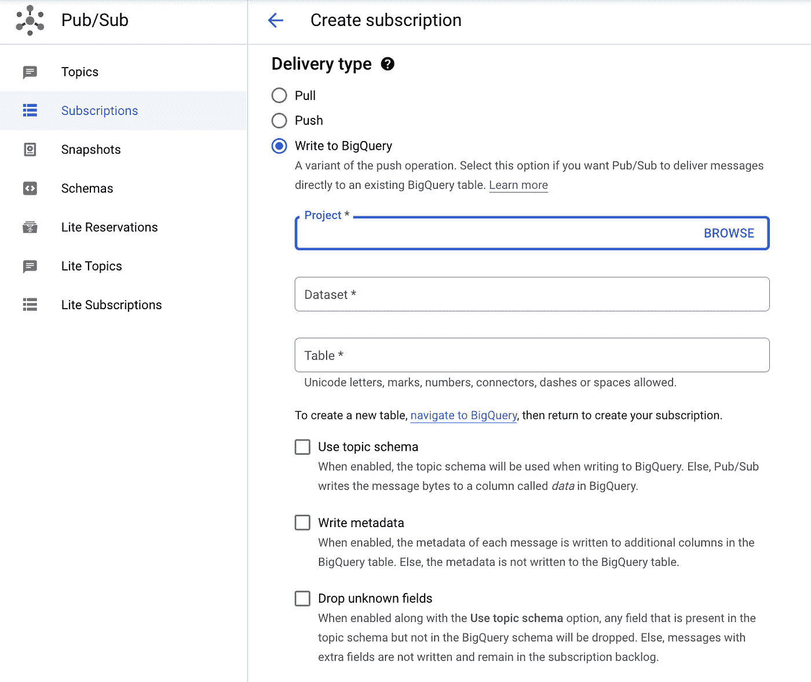

# **开发者和从业者**

如果您在容器上存储特定于客户端的状态，那么您会希望来自该客户端的后续请求被路由到同一个容器实例。云运行最近发布的会话相似性作为预览功能。查看这篇[博文](https://cloud.google.com/blog/topics/developers-practitioners/improve-responsiveness-session-affinity-cloud-run)，这篇博文详细解释了什么是会话亲和性，以及云运行如何帮助实现它。

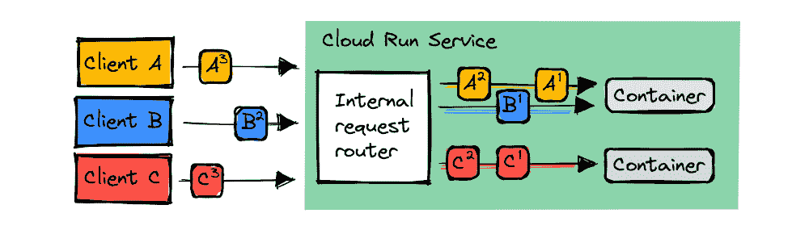

如果你使用过新的谷歌云控制台主页，你会注意到**快速访问**功能。这个特性的目标是引入快捷方式来预测您的下一步操作，从而减少您通过控制台导航到该步骤并最终完成任务所花费的时间。

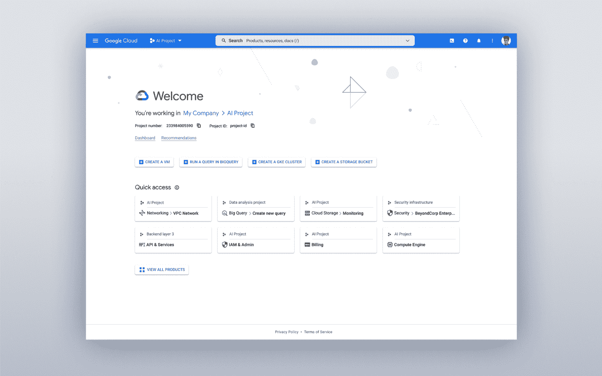

正如[博客文章](https://cloud.google.com/blog/topics/developers-practitioners/quick-access-intelligence-behind-google-clouds-new-homepage)所指出的，快速访问基于 Active Assist，这是一种 AIOPs 功能，使用机器学习来减少操作负担，并已用于识别闲置资源、防火墙配置等功能。这是第一个使用主动辅助的个性化推荐。

# **让我们来了解一下谷歌云**

首先是深入了解全局外部 HTTP(s)负载平衡器。Google Cloud 提供多种模式的负载均衡服务:全球外部、区域外部和区域内部。本[指南](https://cloud.google.com/blog/topics/developers-practitioners/google-cloud-global-external-https-load-balancer-deep-dive)详细介绍了全局外部 HTTP(s)负载平衡器。

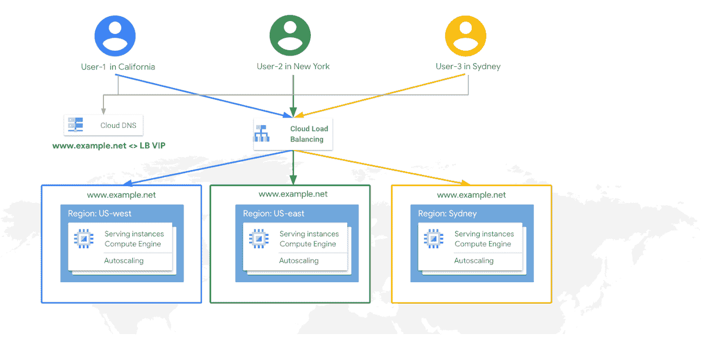

客户敏感数据潜伏在您的系统中，因此您有一个处理、识别和屏蔽敏感信息的流程非常重要。Google Cloud 提供了一项名为 Cloud DLP(数据丢失预防)的托管服务，正是为了做到这一点。查看 DLP 的[介绍](https://cloud.google.com/blog/topics/developers-practitioners/cloud-data-loss-prevention-cloud-dlp-overview)以及它如何为您提供帮助。

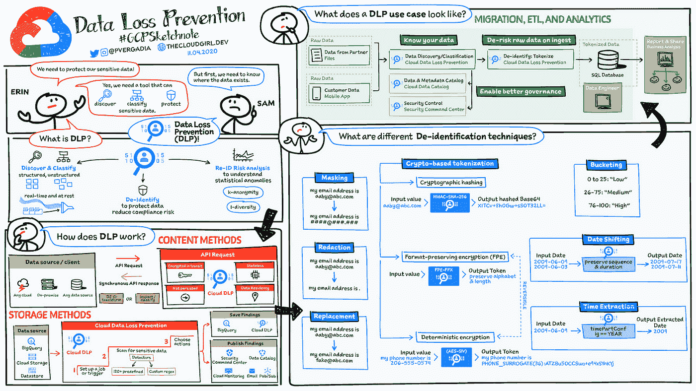

谁能在哪些资源上做什么？谷歌云是如何处理的呢？它通过身份和访问管理(IAM)来实现。查看这篇[文章](https://cloud.google.com/blog/topics/developers-practitioners/cloud-iam-google-cloud)，它可以帮助您理解 IAM 以及围绕它的关键最佳实践。

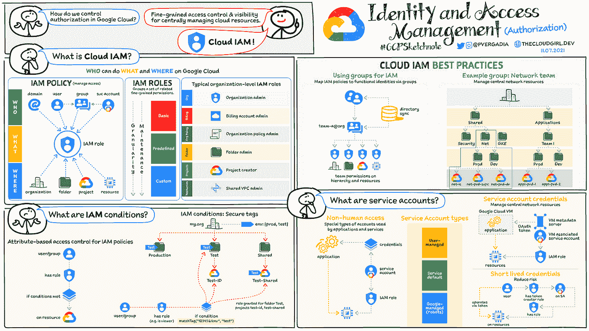

# **保持联系**

对这份时事通讯有任何问题、意见或其他反馈吗？请发送[反馈](https://forms.gle/UAsAS7YLxYSBTNBy9)。

想要关注新的谷歌云产品发布吗？我们有一个方便的页面，您可以将它加入书签→[Google Cloud 的新功能](https://bit.ly/3umz3cA?utm_source=ext&utm_medium=partner&utm_campaign=CDR_rom_gcp_gcptechnuggets_feb-a-2022_021622&utm_content=-)。