# 谷歌云技术金块—2022 年 6 月 1 日至 15 日版

> 原文：<https://medium.com/google-cloud/google-cloud-technology-nuggets-june-1-15-2022-edition-d302ba9f3418?source=collection_archive---------4----------------------->

欢迎参加 2022 年 6 月 1 日至 15 日的谷歌云技术金块。

# **谷歌云帮助创造新的圆周率(100 万亿位数)世界纪录**

谷歌云已经帮助计算了数学常数π (Pi)的创纪录位数。有特定的服务，如计算引擎 N2 机器家族，100 Gbps 出口带宽，谷歌虚拟网卡，平衡持久磁盘。这篇博文详细介绍了架构、关键设计决策等。

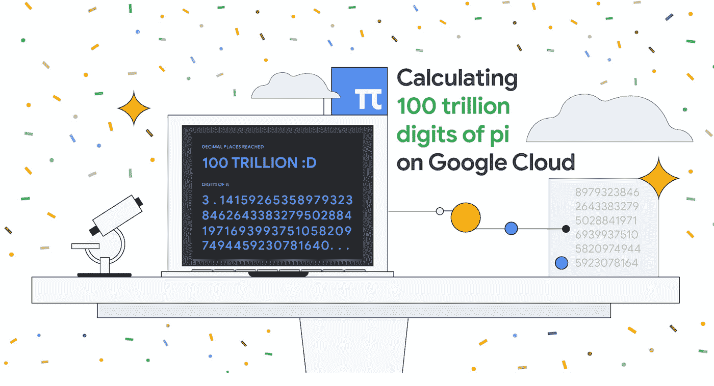

如果你想在计算引擎上做一个计算圆周率的代码实验室，试试这里的。创造新世界纪录(100 万亿位数)的应用程序的源代码可以在 [Github](https://github.com/GoogleCloudPlatform/pi-delivery/tree/main/pi-100t) 上获得。

# **基础设施**

自上一版以来，谷歌云增加了两个新地区:[德克萨斯州达拉斯](https://cloud.google.com/blog/products/infrastructure/a-google-cloud-region-now-available-in-dallas-texas?utm_source=ext&utm_medium=partner&utm_campaign=CDR_rom_gcp_gcptechnuggets_feb-a-2022_021622&utm_content=-)和[意大利米兰](https://cloud.google.com/blog/products/infrastructure/new-google-cloud-region-in-milan-italy-now-open?utm_source=ext&utm_medium=partner&utm_campaign=CDR_rom_gcp_gcptechnuggets_feb-a-2022_021622&utm_content=-)。这使得区域数量达到 34 个。

查看官方的 [Google Cloud Locations 页面](https://cloud.google.com/about/locations?utm_source=ext&utm_medium=partner&utm_campaign=CDR_rom_gcp_gcptechnuggets_feb-a-2022_021622&utm_content=-),了解更多地区信息、各种服务以及更多信息。

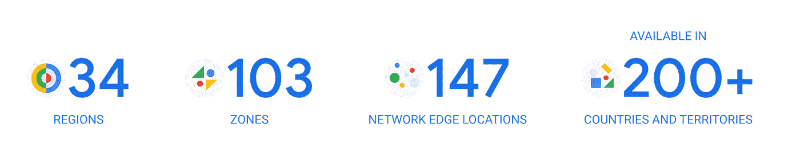

谈到包管理，拥有云环境的组织关注包下载，并希望控制其出口成本。看看这篇博文，它讲述了如何使用 packages.cloud.google.com 子域和谷歌管理的存储库

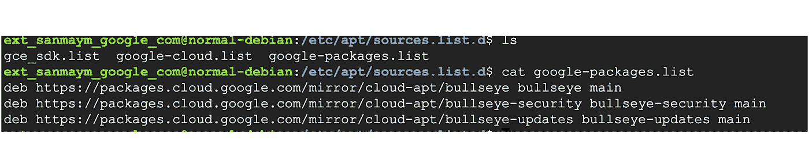

# **集装箱和 GKE**

GKE 托管服务大大简化了客户运行容器化工作负载的过程。运行和维护群集的一个关键因素是确保定期 GKE 更新应用于控制平面和节点。GKE 一直在提高这一领域的标准，对客户可以订阅的发布渠道、升级/不升级的时间间隔等进行各种控制。这不仅有助于在升级过程中帮助客户搬运重物，还能以灵活的方式满足他们的需求。

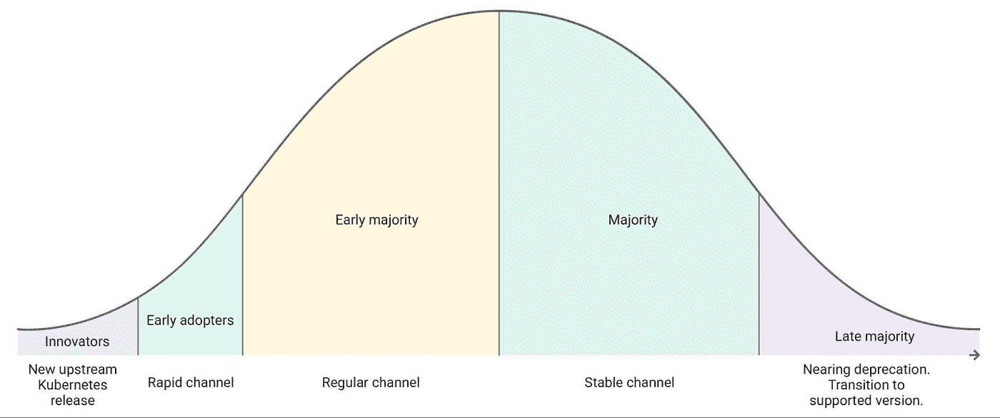

请看这篇[博客文章](https://cloud.google.com/blog/products/containers-kubernetes/gke-release-channels-get-enhanced-maintenance-windows?utm_source=ext&utm_medium=partner&utm_campaign=CDR_rom_gcp_gcptechnuggets_feb-a-2022_021622&utm_content=-)，它强调了最近发布的一些关键功能，以帮助管理 GKE 升级，以及客户、交付英雄如何使用发布渠道。

看看 [Brain Corp](https://cloud.google.com/blog/products/containers-kubernetes/brain-corp-migrates-from-aws-eks-to-gke-autopilot?utm_source=ext&utm_medium=partner&utm_campaign=CDR_rom_gcp_gcptechnuggets_feb-a-2022_021622&utm_content=-) 是如何将数以千计的机器人从 AK 转移到 GKE 的。更具体地说，GKE 自动驾驶仪极大地帮助提高了他们环境的可靠性，改善了开发人员的体验。GKE 自动驾驶仪中引入的护栏减少了错误配置，从而带来了更稳定的开发环境和体验。

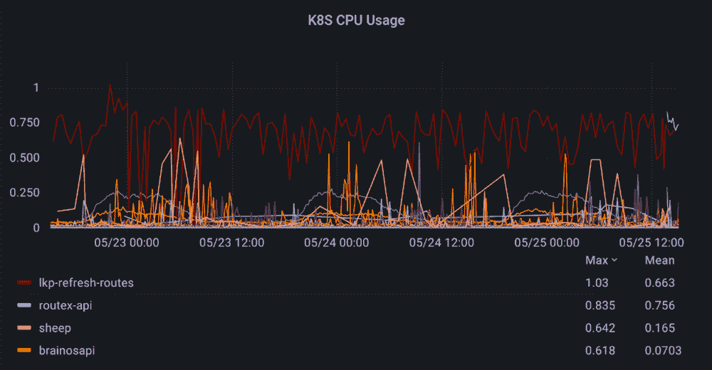

# **客户和合作伙伴**

第二届年度谷歌云客户奖已经揭晓。[查看](https://cloud.google.com/blog/products/gcp/celebrating-the-winners-of-google-cloud-customer-awards?utm_source=ext&utm_medium=partner&utm_campaign=CDR_rom_gcp_gcptechnuggets_feb-a-2022_021622&utm_content=-)不同类别的客户奖项。

谷歌云合作伙伴在帮助客户实现云计算之旅方面发挥了关键作用。2021 年谷歌云合作伙伴奖也已经[揭晓](https://cloud.google.com/blog/topics/partners/google-cloud-announces-2021-partner-of-the-year-awards?utm_source=ext&utm_medium=partner&utm_campaign=CDR_rom_gcp_gcptechnuggets_feb-a-2022_021622&utm_content=-)。

恭喜获奖者。

# **安全**

CISO 对 2022 年 5 月的展望是[出](https://cloud.google.com/blog/products/identity-security/cloud-ciso-perspectives-may-2022?utm_source=ext&utm_medium=partner&utm_campaign=CDR_rom_gcp_gcptechnuggets_feb-a-2022_021622&utm_content=-)。它涵盖了谷歌云的安全峰会，机密计算和与 AMD 的合作伙伴关系以及其他更新。

基础设施安全是谷歌云的基础部分。这篇[博客文章](https://cloud.google.com/blog/topics/developers-practitioners/infrastructure-security-in-google-cloud?utm_source=ext&utm_medium=partner&utm_campaign=CDR_rom_gcp_gcptechnuggets_feb-a-2022_021622&utm_content=-)是理解深度防御和组成它的各个层次的关键。

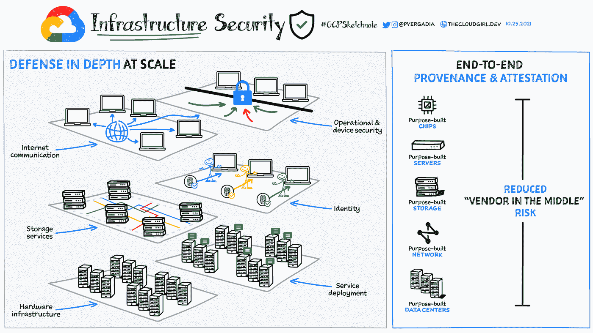

在我们上一期的文章中，我们谈到了[安全开源软件服务](https://cloud.google.com/blog/products/identity-security/introducing-assured-open-source-software-service?utm_source=ext&utm_medium=partner&utm_campaign=CDR_rom_gcp_gcptechnuggets_feb-a-2022_021622&utm_content=-)，它通过使用与谷歌相同的开源软件包来帮助客户保护他们的开源软件。查看这篇[博客文章](https://cloud.google.com/blog/products/identity-security/how-google-cloud-can-help-secure-your-software-supply-chain?utm_source=ext&utm_medium=partner&utm_campaign=CDR_rom_gcp_gcptechnuggets_feb-a-2022_021622&utm_content=-)，它描述了您如何在自己的软件交付过程中利用可靠的开源软件服务。

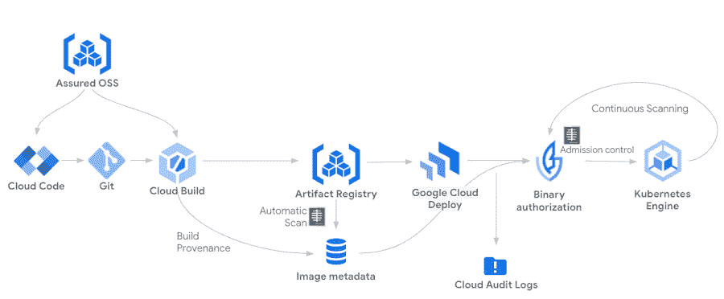

跨多个站点重复使用密码仍然是用户之间的一种常见模式，黑客显然意识到了这一点。reCAPTCHA 企业密码泄漏检测现在可以解决这种情况。查看[博客文章](https://cloud.google.com/blog/products/identity-security/announcing-recaptcha-enterprise-password-leak-detection-in-ga?utm_source=ext&utm_medium=partner&utm_campaign=CDR_rom_gcp_gcptechnuggets_feb-a-2022_021622&utm_content=-)了解更多详情。

# **数据库、分析和机器学习**

将数据仓库迁移到 Google Cloud 给组织带来了好处，但这一过程也有其挑战。其中的关键是需要将遗留查询转换成在 BigQuery 中运行的查询。为了解决这个问题，自动化 SQL 翻译现在作为 BigQuery 迁移服务(BQMS)的一部分免费提供。

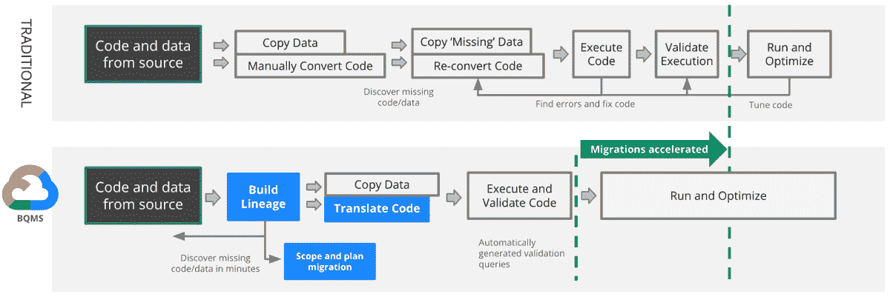

查看[博客文章](https://cloud.google.com/blog/products/data-analytics/automated-sql-translation-to-accelerate-bigquery-migrations?utm_source=ext&utm_medium=partner&utm_campaign=CDR_rom_gcp_gcptechnuggets_feb-a-2022_021622&utm_content=-)了解更多细节和相关的[文档](https://cloud.google.com/bigquery/docs/migration-intro?utm_source=ext&utm_medium=partner&utm_campaign=CDR_rom_gcp_gcptechnuggets_feb-a-2022_021622&utm_content=-)。

想入门 Vertex AI 却不确定从何入手？看看这篇[的博客文章](https://cloud.google.com/blog/products/ai-machine-learning/getting-started-with-vertex-ai?utm_source=ext&utm_medium=partner&utm_campaign=CDR_rom_gcp_gcptechnuggets_feb-a-2022_021622&utm_content=-)，它会根据你的角色给你如何去做的指导。指定的角色有:数据分析师、数据科学家、ML 工程师或软件工程师。按角色和任务推荐超过 25 个以上的资源。

你多久填写一次需要你的详细信息和身份证明的在线申请？如果您可以使用一个构建模块来帮助从您拥有的 ID 卡/文档中自动捕获 ID 信息，那会怎么样？请查看此[深入了解最近通过文档人工智能身份处理器对护照、驾驶执照(美国)等 ID 文档的支持。点击](https://cloud.google.com/blog/topics/developers-practitioners/automate-identity-document-processing-document-ai?utm_source=ext&utm_medium=partner&utm_campaign=CDR_rom_gcp_gcptechnuggets_feb-a-2022_021622&utm_content=-)查看[的原始公告。](https://cloud.google.com/blog/products/ai-machine-learning/google-cloud-extends-document-ai-with-new-parsers-for-identity?utm_source=ext&utm_medium=partner&utm_campaign=CDR_rom_gcp_gcptechnuggets_feb-a-2022_021622&utm_content=-)

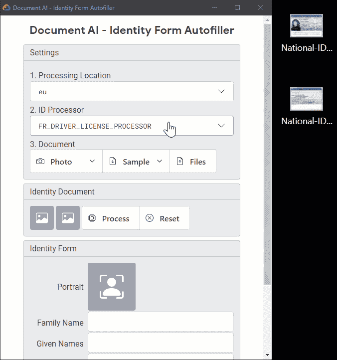

# **开发者和从业者**

您熟悉 Google Cloud 账单页面，并使用它来查看您的账单，比如过去 N 天的账单，跨重要的 SKU 等。您知道吗，有一个“保存视图”功能可以帮助您保存带有所有过滤器的视图，这样下次您就不需要再次设置所有过滤器了。对于每个访问该计费帐户的人来说，简单地使用视图并快速获得报告也是非常有用的。

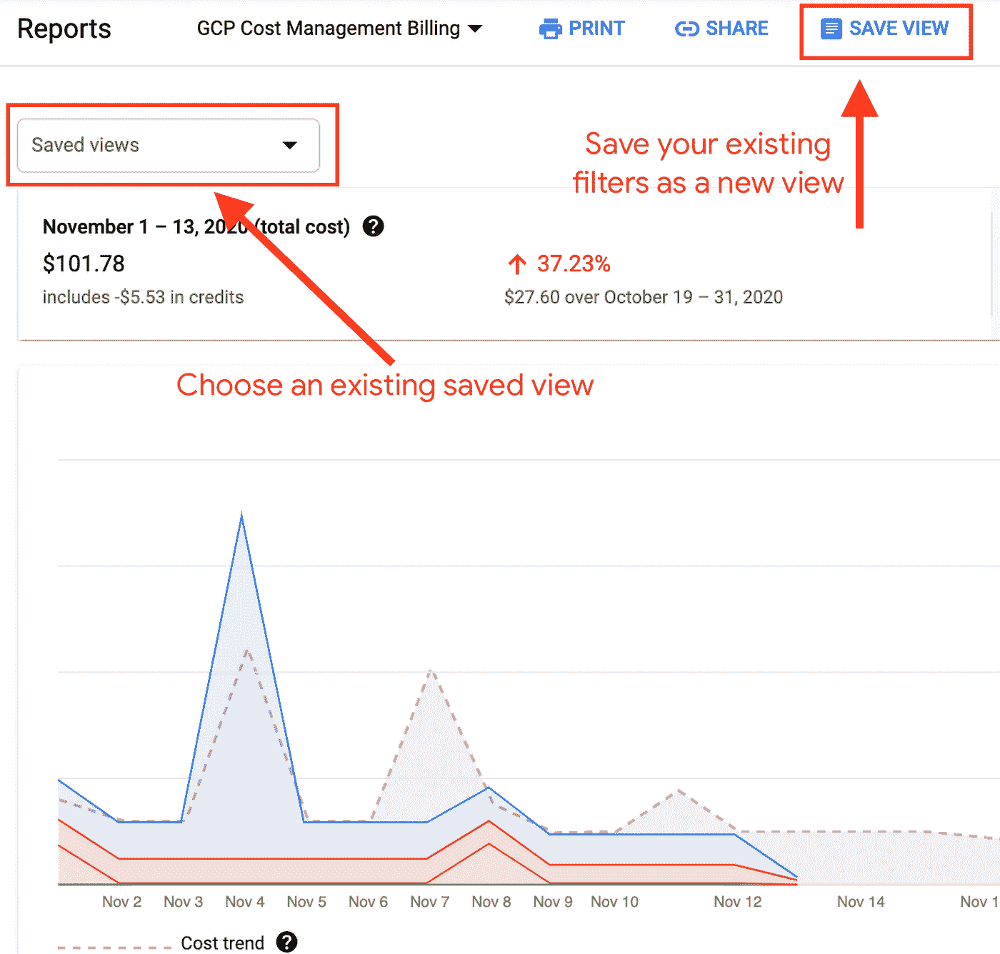

查看这篇[博客文章](https://cloud.google.com/blog/topics/developers-practitioners/billing-reports-and-saved-cost-views?utm_source=ext&utm_medium=partner&utm_campaign=CDR_rom_gcp_gcptechnuggets_feb-a-2022_021622&utm_content=-)了解更多细节。

如果你对堆栈感兴趣，看看这个[深度探索](https://cloud.google.com/blog/topics/developers-practitioners/serverless-with-cloud-run-mongodb-atlas?utm_source=ext&utm_medium=partner&utm_campaign=CDR_rom_gcp_gcptechnuggets_feb-a-2022_021622&utm_content=-)，在这里你可以使用 Cloud Run 和 MongoDB 建立一个完整的无服务器容器化应用程序。

​​

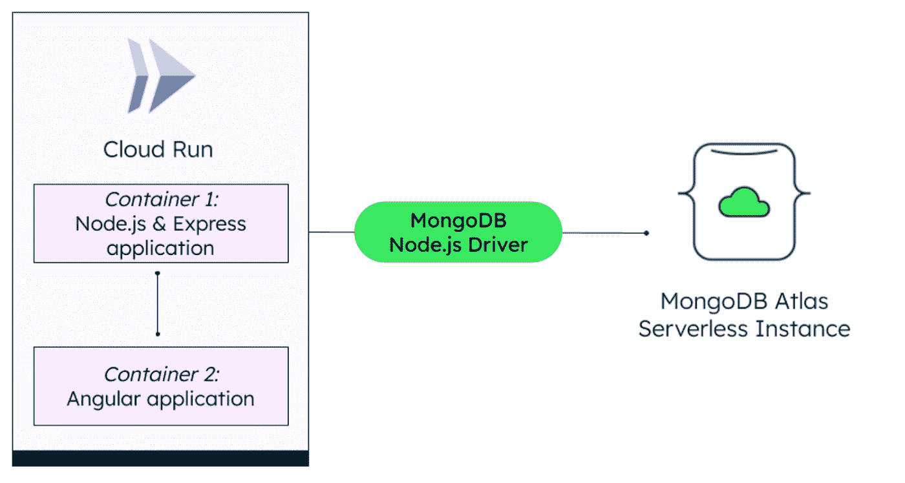

# **让我们来了解一下谷歌云**

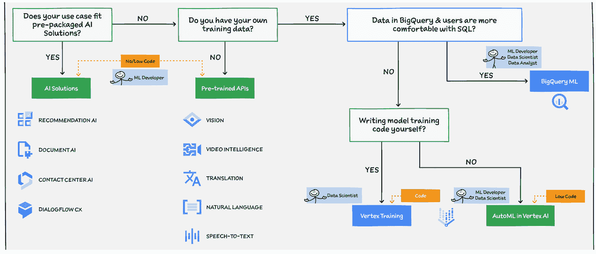

如果你想开始使用谷歌云中的各种人工智能/人工智能服务，你经常会被选择难住，特别是在开始使用这些服务之前，你需要了解多少人工智能？什么样的用例我不需要了解太多就可以开始实现？或者如果你已经熟悉了机器学习，想要实现具体的用例，那么你应该使用哪些服务呢？数据呢？我需要多少训练数据？查看这篇[博客文章](https://cloud.google.com/blog/topics/developers-practitioners/pick-your-aiml-path-google-cloud?utm_source=ext&utm_medium=partner&utm_campaign=CDR_rom_gcp_gcptechnuggets_feb-a-2022_021622&utm_content=-)，它清晰地概述了各种途径和适用于它们的特定标准。

# 保持联系

对这份时事通讯有任何问题、意见或其他反馈吗？请发送[反馈](https://forms.gle/UAsAS7YLxYSBTNBy9)。

想要关注新的谷歌云产品发布吗？我们有一个方便的页面，您可以将它加入书签→[Google Cloud](https://bit.ly/3umz3cA?utm_source=ext&utm_medium=partner&utm_campaign=CDR_rom_gcp_gcptechnuggets_feb-a-2022_021622&utm_content=-)的新功能。