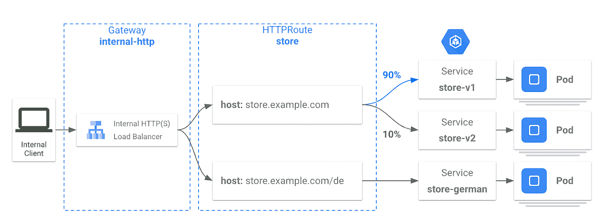
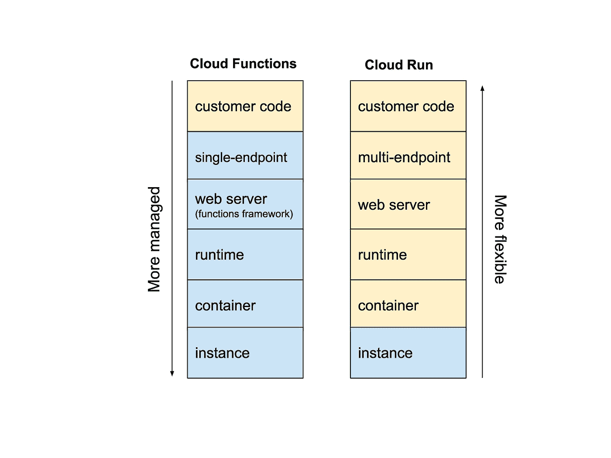

# 谷歌云技术金块—2022 年 11 月 1 日至 15 日版

> 原文：<https://medium.com/google-cloud/google-cloud-technology-nuggets-november-1-15-2022-edition-e9ef5d018937?source=collection_archive---------1----------------------->

欢迎参加 2022 年 11 月 1 日至 15 日的谷歌云技术金块。

# **基础设施**

云工作站现已公开预览。它在 Google Cloud 上提供全面管理和集成的开发环境。

如果您是一名开发人员，请考虑一个远程 IDE，它为您设置了特定的环境，可定制并支持您熟悉的 IDE。作为管理员，它可以帮助您以快速、一致、最重要的是安全的方式配置开发人员环境。

查看[的博文](https://cloud.google.com/blog/products/application-development/introducing-cloud-workstations)了解更多细节。云工作站的一些有用链接:

*   访问您的[控制台](https://console.cloud.google.com/workstations/)，立即体验云工作站。
*   通过[文档](https://cloud.google.com/workstations/docs/)了解更多信息。
*   观看云工作站[云下一期](https://www.youtube.com/watch?v=C6Dpmujxp9Q)。

希望节省计算引擎实例的成本？除了承诺使用折扣(cud)之外，Google Cloud 现在还推出了灵活的 cud，这些 cud 是基于支出的承诺，提供可预测且简单的统一费率折扣(1 年折扣 28%，3 年折扣 46%)，适用于多个虚拟机系列和地区。查看[博客文章](https://cloud.google.com/blog/products/compute/save-money-with-the-new-compute-engine-flexible-cuds)了解更多详情。

# **应用现代化**

如果你是一名管理员，想要控制你的用户安装在谷歌云项目中的应用程序，这里有一个有趣的服务，可以在 Preview 中使用。Google Cloud Private Marketplace，正如[博客文章](https://cloud.google.com/blog/products/application-modernization/google-cloud-private-marketplace-preview)所述，“允许 IT 和云管理员创建 Google Cloud Marketplace 的私有管理版本，供组织内的员工访问。”使用此服务，您可以为您的组织策划产品，从而避免跨组织设置的冗余产品。

# **谷歌 Kubernetes 引擎**

GKE 团队在最近的容量规划实践中分享了这些数字:

*   GKE 舰队中十分之一的集群在任何时候都是空闲的。
*   在过度调配的工作负载中，40%调配了 30 倍于实际使用量的资源。
*   其中 11%的工作负载调配了超过所需资源 100 倍的资源。

这显然要求客户考虑节约成本的方法。该团队强调了 4 个具体的最佳实践来做到这一点。看看今天的[帖子](https://cloud.google.com/blog/products/containers-kubernetes/4-ways-to-optimize-your-gke-costs)。

Google Cloud 宣布 Google Kubernetes 引擎(GKE)网关控制器正式上市，这是 Google Cloud 的网关 API 实现，支持 GKE 1.24+集群中的单集群部署。

正如[的博客文章](https://cloud.google.com/blog/products/containers-kubernetes/google-kubernetes-engine-gateway-controller-is-now-ga)所述，“通过网关 API，平台管理员可以定义网络基础设施上的策略和约束，并允许不同的团队或组织使用共享的网络服务，如 L4 和 L7 负载平衡，同时保持一致性和控制。”

# **存储、数据库和数据分析**

谷歌云存储(GCS)是谷歌云服务的集成主干。客户经常会问，监控他们的 GCS 基础架构、其性能、需要注意哪些指标等的最佳方式是什么。牢记这一点，该团队发布了一组新的云存储监控仪表板的公开预览，这些仪表板在项目级别和存储桶级别都可用。这些都可以从控制台的云存储服务菜单中的监控部分获得。查看[帖子](https://cloud.google.com/blog/products/infrastructure/better-system-insights-with-cloud-monitoring-customizable-dashboards)了解更多详情。

在线游戏在参与度、用户体验等方面不断挑战极限。鉴于这些服务的分布式性质，这些挑战是独特的，需要大规模解决。选择正确的数据库是实现这一目标的关键。这篇[博文](https://cloud.google.com/blog/products/databases/choosing-cloud-spanner-for-game-development)强调了为什么云扳手是游戏公司的正确选择。

# **身份和安全**

您使用云构建和工件注册来构建和分发工件吗？您是否使用最小特权原则来实现这一点？查看这篇[博客文章](https://cloud.google.com/blog/topics/developers-practitioners/practicing-principle-least-privilege-cloud-build-and-artifact-registry)，它强调了这方面的最佳实践。

2022 年 10 月的云 CISO 前景已经出炉。查看[博客文章](https://cloud.google.com/blog/products/identity-security/cloud-ciso-perspectives-october-2022)了解详情。如果你想定期收到邮件，请[订阅](https://go.chronicle.security/cloudciso-newsletter-signup)。

# **机器学习**

我们已经在早期版本中介绍了文档人工智能以及随后如何在 Cloud NEXT’22 上宣布两项服务:文档人工智能工作台和文档人工智能仓库。一篇[博客文章](https://cloud.google.com/blog/products/ai-machine-learning/inside-google-clouds-new-document-ai-agents)强调了这两种服务所能提供的。看看这个。

您是否在不同的开发阶段纠结于多个 ML 项目和管道？你是怎么做到的？我们能不能把 DevOps 的概念拿来应用到这个 ML 特有的问题上？查看这篇[博文](https://cloud.google.com/blog/topics/developers-practitioners/best-practices-managing-vertex-pipelines-code)，这篇博文强调了如何使用最佳实践来帮助简化管道，以及 Vertex AI 管道模板的可用性。

# **开发者和从业者**

如果你在 Firestore 工作，一定要看看这篇[文章](https://cloud.google.com/blog/products/databases/whats-new-in-firestore-from-cloud-next-and-firebase-summit-2022),这篇文章重点介绍了已经添加到服务中的新功能。这些功能是在 Cloud NEXT 和最近举行的 Firestore 峰会上宣布的。功能包括计数功能、集成查询控制台、将服务扩展到每秒 10000 次以上的能力、生存时间(TTL)功能等等。

您如何确定您的 API 是否按照您向用户承诺的 SLA 运行？现在将这个问题乘以 10 个你可能需要监控的 API？传统工具是否足以做到这一点，或者你为自己创造了太多的工作？这篇[博客文章](https://cloud.google.com/blog/products/api-management/3-best-practices-to-monitor-apis-using-google-cloud)强调了 Apigee API 监控，它为您提供了监控 API 的关键最佳实践。重点是对需要注意的警报进行优先级排序，使用仪表板来隔离问题，并使用分布式跟踪。

最后，探索谷歌云中各种数据库服务的长期系列文章刚刚发布了它的最后一篇[部分](https://cloud.google.com/blog/topics/developers-practitioners/databases-google-cloud-part-7-managed-service-prometheus-serverless-mongodb-atlas-and-finale)。这部分进入 MongoDB Atlas 服务，Google Managed Prometheus 服务等等。

# **了解谷歌云**

期待利用今年剩下的时间在 Google Cloud 上获得一些新技能？查看谷歌云和 Coursera 免费提供的课程列表。这些课程从认证课程到谷歌云中的关键领域都有。不要错过这个机会。查看[的博文](https://cloud.google.com/blog/topics/training-certifications/get-cloud-skills--training-needed-for-in-demand-job-roles)了解更多细节，以及[注册/签约](https://www.coursera.org/promo/googlecloud-training-promotion?utm_medium=institutions&utm_source=googlecloud&utm_campaign=november22_blog)的具体课程页面。

如果您正在使用 Google Cloud 上的各种无服务器运行时，您经常会面临这样一个问题:您应该使用云运行还是云功能？看看这篇[博客文章](https://cloud.google.com/blog/products/serverless/cloud-run-vs-cloud-functions-for-serverless)，它强调了两者的主要区别，以及何时使用其中一个。

Cloud Armor 是企业级 DDoS 防御和 web 应用防火墙服务，有助于防范访问控制被破坏、安全错误配置、加密故障等。它支持现成的基于 OWASP 的预定义 WAF 规则和集成。

在哪些场景下云甲是一个很好的选择？在[博客文章](https://cloud.google.com/blog/topics/developers-practitioners/when-should-i-use-cloud-armor)中的作者详细介绍了 5 个这样的场景，并帮助你理解最适合云装甲的场景。

# 保持联系

对这份时事通讯有任何问题、意见或其他反馈吗？请发送[反馈](https://forms.gle/UAsAS7YLxYSBTNBy9)。

想要关注新的谷歌云产品发布吗？我们有一个方便的页面，您可以将它加入书签→[Google Cloud 的新功能](https://bit.ly/3umz3cA?utm_source=ext&utm_medium=partner&utm_campaign=CDR_rom_gcp_gcptechnuggets_feb-a-2022_021622&utm_content=-)。