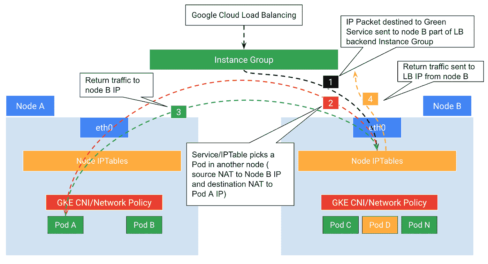
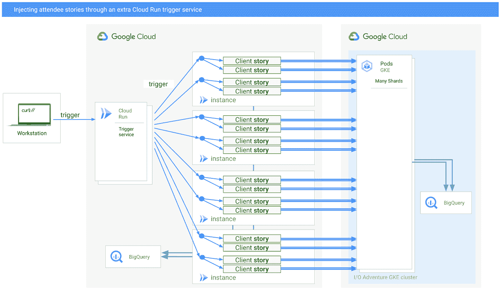

# 谷歌云技术金块—2022 年 11 月 16 日至 30 日版

> 原文：<https://medium.com/google-cloud/google-cloud-technology-nuggets-november-16-30-2022-edition-621a5489d8c?source=collection_archive---------2----------------------->

欢迎参加 2022 年 11 月 16 日至 30 日的谷歌云技术金块。

# **应用现代化**

API 管理是一个关键的解决方案。正如博客文章所述，在 Google Cloud，我们为您的 API 用例提供了三种解决方案:Apigee API 管理、API 网关和云端点。你如何选择一个而不是另一个？哪些功能是您决定选择其中一种解决方案的关键。查看[的博客文章](https://cloud.google.com/blog/products/application-modernization/choosing-between-apigee-api-gateway-and-cloud-endpoints)了解更多信息。

说到 API 管理，如果你正在使用 Apigee，看看这篇[的帖子](https://cloud.google.com/blog/topics/cost-management/managing-api-management-costs-with-apigee-pay-as-you-go-pricing)，它强调了优化 Apigee 支出的方法。

# **集装箱和 GKE**

如果您可以从外部负载均衡器直接看到容器的健康状况，这将对容器化应用程序的弹性增加产生影响。查看这篇详细的[博客文章](https://cloud.google.com/blog/topics/developers-practitioners/how-gke-anthos-container-aware-load-balancing-increases-applications-reliability)，它建立在一篇关于提高应用程序可靠性的早期文章的基础上。

# **SRE 和德沃普斯**

现场可靠性工程(SRE)的关键原则之一是，可靠性是任何系统最重要的特征之一。你经常通过可用性等关键信号来衡量可靠性，然后使用 SLI + SLO，你渴望达到这个目标。然而，任何系统通常都依赖于多个其他服务。这些可能是谷歌云系统服务，甚至是第三方服务或你自己的服务。可能存在顺序依赖性或并行性。因此，您如何做决定了这样一个系统的综合可用性。这篇博文[提供了指导和公式来帮助你计算。](https://cloud.google.com/blog/products/devops-sre/composite-cloud-availability)

# **存储、数据库和数据分析**

组织发现他们的存储需求成倍增长。虽然 Google Cloud 提供了多个存储类别来帮助优化您的存储成本，但理解这些类别并设置正确的生命周期策略以将对象移动到具有适当存储类别的正确存储桶仍然是一个挑战。

[Autoclass](https://cloud.google.com/storage/docs/using-autoclass#set-autoclass) 是一个易于使用的存储桶级别设置，可根据上次访问时间简化和自动化所有云存储数据的生命周期管理。这对于组织帮助优化存储成本等非常有用。查看[的博文](https://cloud.google.com/blog/products/storage-data-transfer/optimize-your-cloud-storage-spend)了解更多细节。

Google Cloud 提供了一套托管数据库服务，支持开源、第三方和云优先的数据库引擎。从 Oracle 和 Microsoft SQL Server 等数据库迁移到 Google Cloud，甚至选择 Google Cloud 上其他云优先的数据库服务，都不是一件容易的事情。这个具体的 5 部分云 Next’22 播放列表是了解旅程和帮助您实现这一目标的具体服务的好方法。查看[的博客文章](https://cloud.google.com/blog/products/databases/migrate-oracle-and-sql-server-to-google-cloud-databases)了解更多细节。

Spanner 是谷歌的一个独特的数据库，它是作为解决自身挑战的一种方式回来的。最初的[扳手论文](https://cloud.google.com/blog/products/databases/reflecting-on-spanner-papers-sigops-hall-of-fame-award)获得了 2022 年 SIGOPS 名人堂奖，这是一项授予该组织发表的最具影响力的操作系统论文的荣誉。查看这篇论文的一位原始作者的博客文章[来一窥它的历史和更多。](https://cloud.google.com/blog/products/databases/reflecting-on-spanner-papers-sigops-hall-of-fame-award)

# **身份和安全**

IAM 拒绝策略现已正式发布。这可以是一种简单的机制，用于宽泛地定义一组策略，以在粗略的级别上控制对资源的访问。IAM 拒绝策略始终取代 IAM 允许策略，并覆盖冲突的 IAM 允许规则。查看[博客文章](https://cloud.google.com/blog/products/identity-security/introducing-iam-deny)了解更多详情。

每季度举行一次的云安全会谈将于 12 月 7 日举行最后一次。这一期将重点介绍如何通过自动化以及有关当前威胁和零信任的信息，使用自动化来提高您的预防、检测和响应能力。

在此报名参加活动[。](https://cloudonair.withgoogle.com/events/security-talks-december?_gl=1*n06fgz*_ga*NTE0NDEzMjEzLjE2NjkyOTE3MzQ.*_ga_WH2QY8WWF5*MTY2OTg4OTkwMS4yNi4xLjE2Njk4OTUwNDEuMC4wLjA.)

Cloud Armor 看到了在 Cloud Next’22 上宣布的几项功能，这些功能有助于对应用预配置的 Web 应用程序防火墙(WAF)规则进行更精细的控制，以及一个针对由 [Cloud Armor 自适应保护](https://cloud.google.com/blog/products/identity-security/announcing-new-cloud-armor-rate-limiting-adaptive-protection-and-bot-defense)生成的拟议缓解规则的[自动部署](https://cloud.google.com/armor/docs/adaptive-protection-auto-deploy)选项，这是一种基于机器学习的攻击检测和响应功能。查看这篇详细介绍这些特性的博客文章。

最后，2022 年 11 月的云 CISO 展望[出来](https://cloud.google.com/blog/products/identity-security/cloud-ciso-perspectives-november-2022)。

# **机器学习**

支持票证的最大贡献者之一是寻找知识库文章的用户，这些文章可以指导他们解决他们希望用您的产品解决的问题。对此的传统方法是通过人工代理搜索您的知识库，并使用相关的知识库文章集对票证做出响应。如果这项任务由一个机器学习模型来处理，该模型有助于显示正确的知识库文章，从而节省代理的时间，并为流程带来更大、更及时的效率，会怎么样？

这正是谷歌一组工程师的任务。在[博客文章](https://cloud.google.com/blog/topics/developers-practitioners/automating-self-service-tech-support-with-tensorflow)中查看他们的旅程和发现。

# **开发者和从业者**

如果你参加过 Google Cloud I/O Online，你会了解在线 Cloud I/O Adventure 体验。早先的一篇博客文章已经介绍了这个架构。

你如何对这样一个系统和一些 Google Cloud 无服务器产品进行负载测试？[博客文章](https://cloud.google.com/blog/topics/developers-practitioners/load-testing-io-adventure-cloud-run)给出了使用 Cloud Run 作为触发器来模拟应用程序负载测试的奇妙细节。

负载测试总结如下:

*   4000 个触发器，每个触发器对应 40 个用户故事
*   每个云运行实例最多并发 40 个请求
*   测试使用了 100 多个实例，并成功注入了 160，000 个并发活动参与者
*   负载测试脚本在几天内运行了几次，总成本约为 100 美元

这些工具的成本和易用性应该有助于你从不同的角度看待你在 Google Cloud 上的负载测试策略。

如果您正在使用 Google Cloud 工作流，一个关于工作流模式和最佳实践的新系列已经发布了两个部分([第 1 部分](https://cloud.google.com/blog/topics/developers-practitioners/workflows-patterns-and-best-practices-part-1)和[第 2 部分](https://cloud.google.com/blog/topics/developers-practitioners/workflows-patterns-and-best-practices-part-2))。主题包括事件编排、并行任务、工作流连接器、弹性设计、长时间运行任务的异步通知等。

如何使用 Google Cloud 无服务器技术构建聊天服务器的典型示例？嗯，我们有一个参考的[博客帖子](https://cloud.google.com/blog/topics/developers-practitioners/build-chat-server-cloud-run)，向你展示如何使用谷歌云运行来实现这一点，并附有源代码。这篇博文也是一个让你熟悉无服务器构建工具的好方法，比如 Cloud Build 和在代码变更时触发它。

你是否有几个谷歌云项目无人问津，暂时不用？您是否想要一种方法来确定该列表并自动执行该过程？查看介绍 Remora 的[博客文章](https://cloud.google.com/blog/topics/developers-practitioners/automated-cleanup-unused-google-cloud-projects)，它是一种无服务器架构，可以帮助你做到这一点。

# **了解谷歌云**

一个关于[谷歌云技能提升年度订阅](https://cloud.google.com/blog/topics/training-certifications/discover-the-google-cloud-skills-boost-annual-subscription-benefits)的友好提醒，该订阅在 Cloud Next’22 上发布。根据[博客文章](https://cloud.google.com/blog/topics/training-certifications/google-cloud-developer-subscription-benefits)，年度订阅包括:

*   访问 700 多个实践实验室、技能徽章和课程
*   500 美元谷歌云信用
*   谷歌云认证考试代金券
*   每年获得第一个认证后，奖励 500 美元的谷歌云积分
*   由谷歌云专家领导的现场学习活动
*   由谷歌云高管主持的季度技术简报会

需要了解你的营销活动的功效吗？你知道吗，谷歌云有一套叫做营销分析的服务可以帮助你解决这个问题。在这篇[博客文章](https://cloud.google.com/blog/topics/developers-practitioners/marketing-analytics-google-cloud)中了解更多关于这些解决方案的信息。

您知道云运行有两种类型的健康检查:启动和活动。查看这个[指南](https://cloud.google.com/blog/products/serverless/cloud-run-healthchecks)，了解更多关于他们的信息。

# 保持联系

对这份时事通讯有任何问题、意见或其他反馈吗？请发送[反馈](https://forms.gle/UAsAS7YLxYSBTNBy9)。

想要关注新的谷歌云产品发布吗？我们有一个方便的页面，你可以把它加入书签→ [谷歌云的新功能](https://bit.ly/3umz3cA?utm_source=ext&utm_medium=partner&utm_campaign=CDR_rom_gcp_gcptechnuggets_feb-a-2022_021622&utm_content=-)。