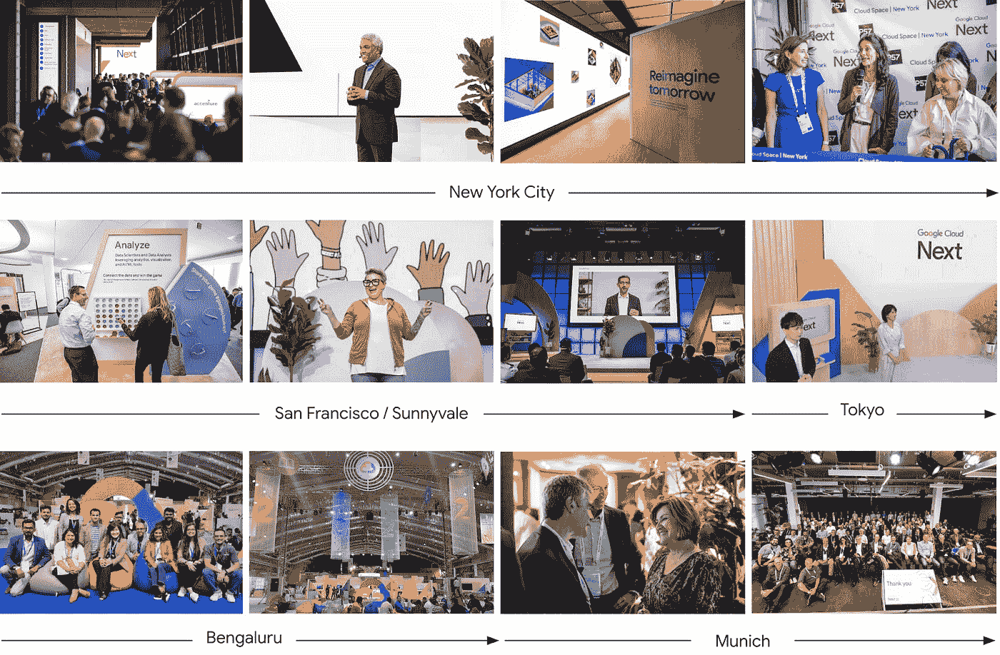
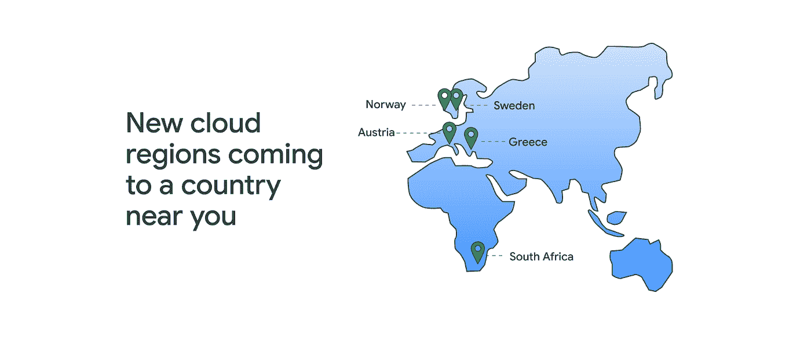
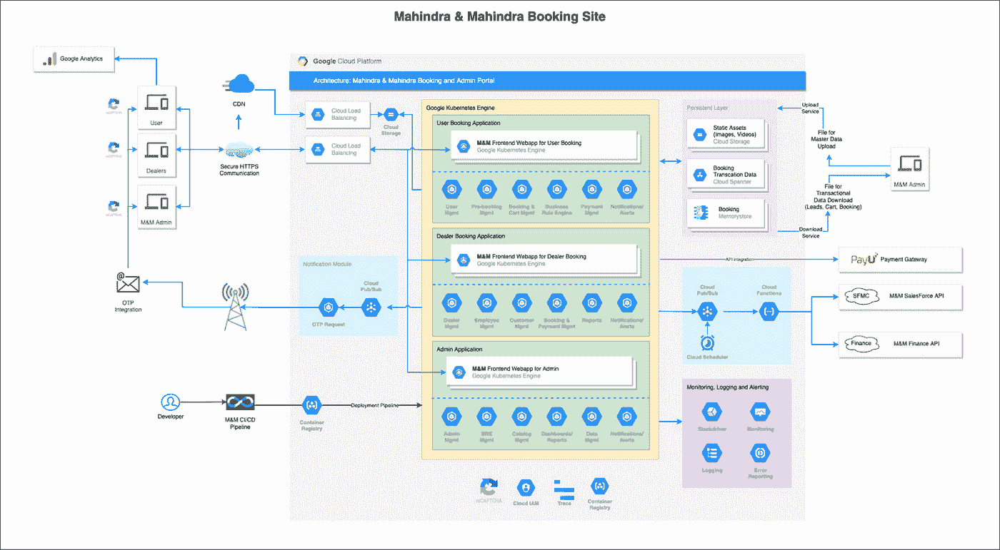
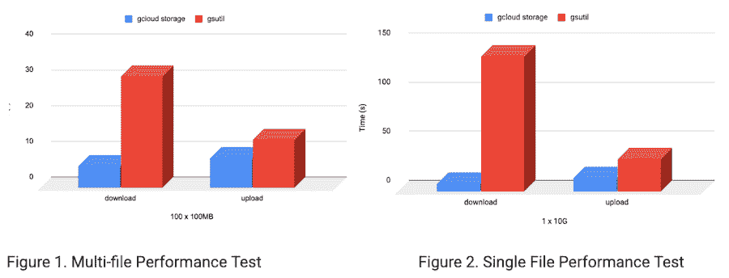
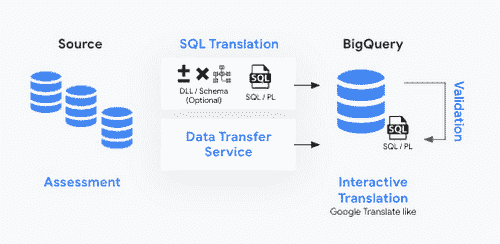
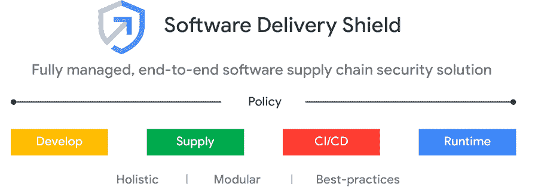
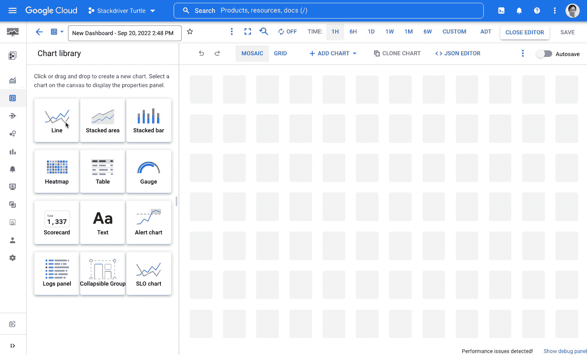
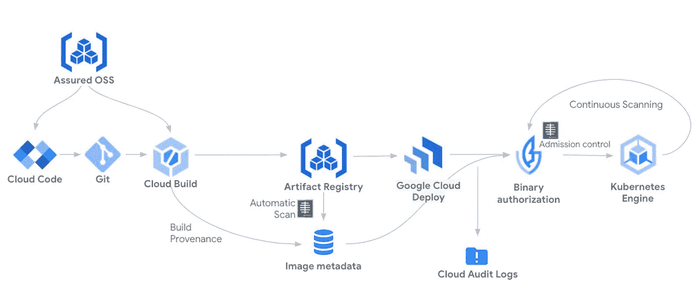
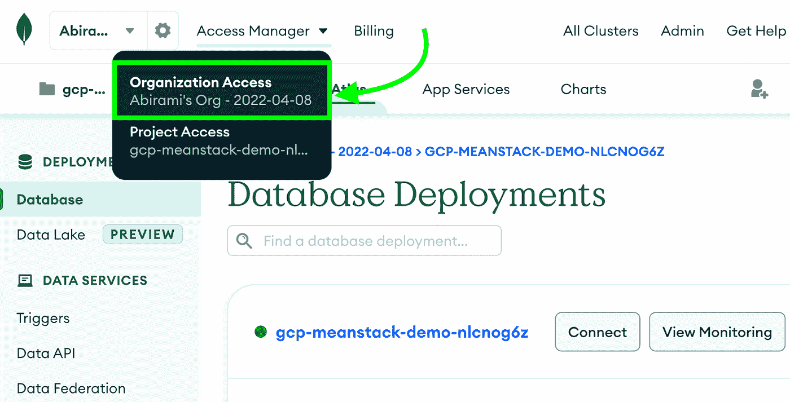
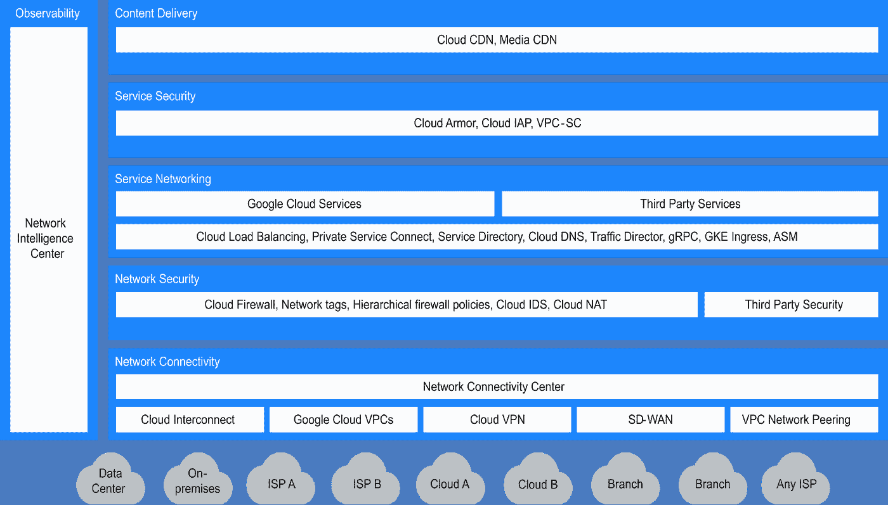

# 谷歌云技术金块—2022 年 10 月 1 日至 15 日版

> 原文：<https://medium.com/google-cloud/google-cloud-technology-nuggets-october-1-15-2022-edition-2e26ce788af1?source=collection_archive---------1----------------------->

欢迎参加 2022 年 10 月 1 日至 15 日的谷歌云技术金块。

# **Google Cloud Next’22 更新**

这个版本是今年的旗舰活动“云下一届 22”的重头戏。包括主题演讲在内的所有会议均可点播，并可从[主网站](https://cloud.withgoogle.com/next)访问。

除此之外，如果您的时间不多，并且希望获得公告的概述，我建议您采取以下措施:

1.  查看突出重要公告的 [GCP 播客第](https://www.gcppodcast.com/post/episode-323-next-2022-with-forrest-brazeal/)集。
2.  查看[博客文章](https://cloud.google.com/blog/topics/google-cloud-next/google-cloud-next22-wrap-up)，其中列出了 2022 年 Cloud NEXT 大会上发布的 123 个公告。

# **基础设施**

在 Cloud NEXT’22 上，宣布了 5 个新的 Google 云区域，分布在以下国家:奥地利、希腊、挪威、南非和瑞典。

以前被称为可抢占虚拟机的现场虚拟机价格有了新的下降。降价适用于 37 个资源池中的标准和自定义虚拟机和内存。查看[定价详情](https://cloud.google.com/blog/topics/cost-management/new-google-cloud-spot-vm-price-reductions)。这篇文章还介绍了选择 Spot VM 的 5 个最佳实践。

在 Cloud NEXT’22 大会上，围绕基础架构发布了大量公告。下面的[帖子](https://cloud.google.com/blog/products/infrastructure-modernization/open-infrastructure-announcements-at-google-cloud-next)总结了所有这些问题，需要注意的几个关键问题包括:

*   云 TPU v4 pod 和 A2 Ultra GPU VM 实例现已正式发布，可支持 ML 工作负载。
*   采用第四代英特尔至强处理器的新 C3 机型预览。
*   媒体 CDN 支持 LiveStream API。
*   在 preview 中，云工作站提供了完全托管的开发环境，旨在满足安全敏感型企业的需求。

如果您想了解 Cloud NEXT’22 的网络公告，请查看下面的[帖子](https://cloud.google.com/blog/products/networking/networking-announcement-at-google-cloud-next22)。

# **客户**

30 分钟预订 10 万辆 SUV！是的，这就是 Mahindra Group 在预订 Scorpio-N 方面取得的成就，Scorpio-N 是他们 SUV 系列的最新版本。查看[博客文章](https://cloud.google.com/blog/products/infrastructure/how-mahindra-reimagined-the-suv-buying-process-with-google-cloud)，它详细介绍了所使用的各种服务、架构、发布计划等等。

# **存储和数据分析**

谷歌云存储(GCS)是从谷歌云获取和下载数据的关键服务。来回传输数据时，速度通常是一个关键要求，尤其是大型数据传输。Google 云存储现已在 GCloud SDK CLI 中提供，旨在通过其默认的并行支持，为大型数据传输提供良好的功能。您可以通过下载最新版本的 CLI SDK 来获得对 GCloud 存储的支持。查看[的博客文章](https://cloud.google.com/blog/products/storage-data-transfer/new-gcloud-storage-cli-for-your-data-transfers)了解更多细节。

Looker 现在是统一谷歌云中所有商业智能工具的总括产品名称。Data Studio 也被称为 Looker Studio。查看[博客文章](https://cloud.google.com/blog/products/data-analytics/looker-next-evolution-business-intelligence-data-studio)，该文章强调了 Looker 产品组合的一些改进和关键客户案例。

BigQuery 迁移服务是一套托管工具，使用户能够可靠地规划和执行迁移。它将旅程分为 4 个步骤:评估、SQL 转换、数据传输和验证。查看[博客文章](https://cloud.google.com/blog/products/data-analytics/simplify-data-warehouse-migrations-using-bigquery-migration-service)，它详细介绍了每一个步骤，以及你今天可以如何开始。

在 Cloud NEXT’22 上，围绕数据库管理服务发布了一系列公告。首先理解 Google Cloud 的主题和策略是很重要的，这也是这篇博文[设置背景并引导你进入各种服务和公告的地方。](https://cloud.google.com/blog/products/databases/unifying-expanding-optimizing-databases-next22)

# **身份和安全**

cloud NEXT’22 对安全性给予了高度关注，发布了 5 个主要产品，还发布了其他几个关于特定服务的产品。本新闻稿中涉及的一些重要公告包括:

*   软件交付盾，一个全面管理的软件供应链解决方案。
*   欧洲云服务的数字主权更新。
*   Chronicle Security Operations 是一项新的服务，以谷歌的速度、规模和智能帮助检测、调查和应对网络威胁

查看[博客文章](https://cloud.google.com/blog/products/identity-security/introducing-new-capabilities-for-secure-transformations)，了解所有与安全相关的公告。

在 2012 年云计算大会上，查看由[策划的安全会议播放列表](https://cloud.google.com/blog/products/identity-security/security-breakout-sessions-at-google-cloud-next22)。

# **机器学习**

CCAI 平台现已在美国、加拿大、英国、德国、法国、意大利和西班牙全面上市，更多市场即将推出。CCAI 由 3 个关键服务组成:

*   Dialogflow，一个搭建文本和语音虚拟助手的平台。
*   Agent Assist，基于历史对话、知识库和经验丰富的代理的最佳实践，为代理提供实时指导和建议。
*   CCAI 洞察提供关于客户查询、代理绩效、情绪趋势和自动化机会的实时、可操作的数据点。

查看[博客文章](https://cloud.google.com/blog/products/ai-machine-learning/google-cloud-contact-center-ai-platform-now-ga)了解更多细节。

继续人工智能代理产品组合，CCAI 平台是其中的一部分，有几个增强功能添加到文档人工智能平台和一个全新的平台，翻译中心。该服务为客户提供自助文档翻译，并支持 135 种以上的语言。文档人工智能平台提供两种服务:文档人工智能工作台(Document AI Workbench)，它提供了一个简单的接口来标记数据和一键模型训练。另一项服务是文档人工智能仓库，它将谷歌搜索技术引入文档人工智能。查看[博客文章](https://cloud.google.com/blog/products/ai-machine-learning/google-ai-agents-translation-documents-contact-centers)了解更多信息。

此外，请查看 Cloud NEXT’22[播放列表，其中重点介绍了一些顶级人工智能/人工智能会议](https://cloud.google.com/blog/products/ai-machine-learning/top-google-next22-ai-and-machine-learning-sessions)

# **SRE 和德沃普斯**

软件交付盾，一个全面管理的软件供应链安全解决方案，现在可以在谷歌云上使用。该解决方案跨越了各种 Google 云服务，包括 GKE、云代码、云构建、云部署、工件注册、二进制授权等等。该解决方案在如下所示的 5 个领域提供服务:

查看[博客文章](https://cloud.google.com/blog/products/devops-sre/introducing-software-delivery-shield-from-google-cloud)了解更多关于该解决方案的细节。

随着 Kubernetes 越来越受欢迎，PromQL 已经成为开发人员在查询时间序列时采用的事实上的标准。PromQL 遍及云监控用户界面，包括 Metrics Explorer 和 Dashboard Builder。查看[的博文](https://cloud.google.com/blog/products/devops-sre/cloud-monitoring-ui-now-features-promql-querying)了解更多细节。

你知道吗，在 2021 年，[前 10%最流行的 OSS 项目版本平均有 29%的可能性](https://www.sonatype.com/hubfs/Q3%202021-State%20of%20the%20Software%20Supply%20Chain-Report/SSSC-Report-2021_0913_PM_2.pdf?hsLang=en-us)包含已知漏洞？您自己的软件很可能面临风险，因为您依赖于可能存在已知漏洞的软件。工件注册和容器扫描现在可供每个人使用。Artifact Registry 可以用来托管您的软件工件，通过对它们启用容器扫描，可以不断地分析图像中已知的漏洞。这是在安全问题上向左转的重要一步。查看[博客文章](https://cloud.google.com/blog/products/devops-sre/use-artifact-registry-and-container-scanning-to-streamline-deployments)了解更多细节。

# **开发者和从业者**

如果您是一名普通的堆栈开发人员，作为开发人员，您的一个关键要求是拥有一个部署环境，使您能够轻松地专注于开发应用程序，同时将运行应用程序的重担留给云提供商。看看[博客文章](https://cloud.google.com/blog/topics/developers-practitioners/easy-deployment-mean-stack-w-mongodb-atlas-cloud-run-and-hashicorp-terraform)吧，它介绍了如何将 MongoDB Atlas 用于您的 MongoDB 数据库，云运行(在 Google Cloud 上)来托管您的应用程序，最棒的是，它是一个可以为您编写环境脚本的 Terraform 脚本。

[https://cloud . Google . com/blog/topics/developers-从业者/easy-deployment-mean-stack-w-MongoDB-atlas-cloud-run-and-hashi corp-terraform](https://cloud.google.com/blog/topics/developers-practitioners/easy-deployment-mean-stack-w-mongodb-atlas-cloud-run-and-hashicorp-terraform)

Google Cloud NEXT’22 为应用开发人员举办了几场会议，但如果有几场会议是必看的，请看看下面的[播放列表](https://cloud.google.com/blog/products/application-development/app-dev-breakout-sessions-at-google-cloud-next-22)，它突出了有趣的应用开发会议。具体来说，如果您对无服务器运行时和事件驱动架构感兴趣，请查看一个会话，它可以帮助您在几分钟内构建一个[完整的事件驱动无服务器应用。](https://cloud.withgoogle.com/next/google-playlists?session=BLD201&_ga=2.99640286.-11410891.1664514567#technical)

# **让我们了解一下谷歌云**

谷歌云技能提升计划现已推出，年费为 299 美元/年。订阅提供了几个好处，包括(根据[博客文章](https://cloud.google.com/blog/topics/training-certifications/discover-the-google-cloud-skills-boost-annual-subscription-benefits)):

*   访问 700 多个实践实验室、技能徽章和课程
*   500 美元谷歌云信用
*   谷歌云认证考试代金券
*   每年获得第一个认证后，奖励 500 美元的谷歌云积分
*   由谷歌云专家领导的现场学习活动
*   由谷歌云高管主持的季度技术简报会

网络是云架构的关键组成部分。考虑性能、安全性等因素对于成功实施至关重要。构成网络的基石是什么。查看这篇详细的[博客文章](https://cloud.google.com/blog/topics/developers-practitioners/6-building-blocks-cloud-networking-networking-architecture)。

# 保持联系

对这份时事通讯有任何问题、意见或其他反馈吗？请发送[反馈](https://forms.gle/UAsAS7YLxYSBTNBy9)。

想要关注新的谷歌云产品发布吗？我们有一个方便的页面，您可以将它加入书签→[Google Cloud 的新功能](https://bit.ly/3umz3cA?utm_source=ext&utm_medium=partner&utm_campaign=CDR_rom_gcp_gcptechnuggets_feb-a-2022_021622&utm_content=-)。