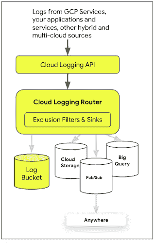

# 谷歌云技术金块—2022 年 10 月 16 日至 31 日版

> 原文：<https://medium.com/google-cloud/google-cloud-technology-nuggets-october-16-31-2022-edition-22cae8de129f?source=collection_archive---------1----------------------->

欢迎参加 2022 年 10 月 16 日至 31 日的谷歌云技术金块。

# **Google Cloud Next’22 目录**

这个版本是今年的旗舰活动“云下一届 22”的重头戏。包括主题演讲在内的所有会议均可点播，并可从[主网站](https://cloud.withgoogle.com/next)访问。

# **谷歌云媒体出版**

Google Cloud Medium 是一个社区驱动的出版物，谷歌员工和非谷歌员工都可以在这里发表跨越 Google Cloud 各个领域的文章。我们刚刚完成了今年的 400 多篇文章，如果你还没有检查过中型网站，现在就做吧。如果您想分享您对该出版物的了解，请在 Twitter 上 ping @alexismp 或@iRomin！

# **基础设施**

在 Gartner 的报告中，Google Cloud 被评为云基础设施和平台服务的领导者。这是一个很好的证明，证明了其基础架构产品在过去一年中推出的多项创新。查看[博客文章](https://cloud.google.com/blog/products/infrastructure/google-a-leader-in-gartner-magic-quadrant-for-cloud-infrastructure-and-platform-services)，在那里您可以[下载免费报告](https://cloud.google.com/resources/gartner-cloud-infrastructure-and-platform-services-2022)并获得该领域全年各种公告的摘要。

以色列一个新的谷歌云区域已经开放。现在全球共有 35 个地区可以使用谷歌云。查看[基础设施页面](https://cloud.google.com/about/locations)了解区域、分区等信息。

Spot 虚拟机，以前称为可抢占虚拟机，是容错工作负载的理想选择，并在价格上提供大幅折扣。通常，这不仅取决于定价，还取决于围绕现场虚拟机的场景和最佳实践。查看这篇[详细的博客文章](https://cloud.google.com/blog/topics/cost-management/rethinking-your-vm-strategy-spot-vms)，它涉及了用例、如何创建现场虚拟机的指南和最佳实践。

迁移到 Google Cloud 会给组织带来重要的好处。有各种工具、指南、流程等来帮助组织评估、规划和执行迁移。这些工具通常是单独提供的，由团队将所有这些资源放在一个地方并管理迁移。在 Google Cloud Next’22 上，这一问题已经通过云迁移中心得到解决，这是 Google Cloud 控制台中提供的第一方服务。迁移中心旨在通过智能、数据驱动的洞察和可行的建议来简化您的云之旅。该服务目前在预览版中可用。查看[博客文章](https://cloud.google.com/blog/products/compute/streamline-migration-and-modernization-to-google-cloud-with-migration-center)了解详情。

# **应用现代化**

Google Cloud 的区块链节点引擎现已在私有预览版中提供。这是一个完全托管的节点托管服务，由谷歌云的计算和网络基础设施提供支持。如果您需要专用节点，您可以使用它来中继事务、部署智能合约和读/写区块链数据。以太坊是该服务支持的第一个区块链。更多信息，请查看[的博客文章](https://cloud.google.com/blog/products/infrastructure-modernization/introducing-blockchain-node-engine)。

# **联网**

业务连续性是企业组织的一项关键要求，在设计应用程序时牢记这一点非常重要。该架构在很大程度上依赖于平台提供的底层服务。云 DNS 路由策略可以在高可用性全球应用中发挥关键作用。虽然这已经足够了，但是在出现故障的情况下，它需要手动干预来更新 ge-location 策略配置，正如这篇博文[所展示的那样。在前一篇博文的扩展中，讨论了一个特性，您可以使用内部负载平衡器的云 DNS 健康检查来自动故障转移到健康的实例。查看](https://cloud.google.com/blog/products/networking/dns-based-traffic-routing-for-global-application-deployment)[博客文章](https://cloud.google.com/blog/products/networking/introducing-automated-failover-for-private-workloads-using-cloud-dns-routing-policies-with-health-checks)了解更多详情。

# **存储、数据库和数据分析**

有几篇文章强调了 BigQuery 使用的一些关键特性:

*   围绕 BigQuery 寻找备份和灾难恢复策略，请查看这篇[博客文章](https://cloud.google.com/blog/topics/developers-practitioners/backup-disaster-recovery-strategies-bigquery)。
*   以为 BigQuery 是纯 SQL 接口？随着在 Cloud Next’22 上宣布的围绕[支持不同编程模型/扩展](https://cloud.google.com/blog/products/data-analytics/build-limitless-workloads-on-bigquery)的一系列声明，这种情况不再真实。这些特性包括对 Apache Spark 存储过程的预览支持、将无服务器笔记本服务、Colab 集成到 BigQuery 控制台中，以及对远程功能的支持，其中您可以使用部署在云函数或云运行中的功能来扩充 BigQuery 的 SQL 库。

*   BigQuery 中的搜索索引和搜索功能现在是 GA。该功能允许在 BigQuery 中跨结构化和非结构化数据进行高效搜索。在一篇有趣而详细的博客文章中，作者带您通过在大型数据集上执行的性能测试来提取特定信息。使用搜索索引和函数，查询在 BigQuery 槽的使用上也更快更有效。讨论了几个例子，尤其是一个被强调为“大海捞针”的例子。查看[的博客文章](https://cloud.google.com/blog/products/data-analytics/improved-text-analytics-in-bigquery-search-indexes-now-ga)了解更多细节。
*   想要在 Google Cloud 上构建一个数据网格，请看这篇[博客文章](https://cloud.google.com/blog/products/data-analytics/building-a-data-mesh-on-google-cloud-using-bigquery-and-dataplex)，其中有详细信息，包括白皮书、架构等等。

主动协助不仅越来越多地应用于各种产品，也越来越多地应用于特定产品。云 SQL 根据客户的建议，增加了额外的主动协助建议。这些针对云 SQL 的前瞻性健康建议分为以下 4 个方面。查看博文了解更多[细节](https://cloud.google.com/blog/products/databases/proactive-database-wellness-with-active-assist)。

关于 Google Cloud Next’22 数据分析的所有新闻和公告，请查看这篇[帖子](https://cloud.google.com/blog/products/data-analytics/recap-of-the-news-and-announcements-for-data-analytics-at-google-cloud-next22)。

# **身份和安全**

Preview 现在提供了一个有趣的功能，称为敏感操作，用于识别可能使您的客户面临风险的危险行为。例如，如果有人提供了太多的实例、更改了组织策略、添加了敏感角色、添加了 SSH 密钥等等，该怎么办呢？这些行为可能是某人计划破坏你的环境的前兆。敏感动作功能正是为了捕捉这一点。下面给出了一些可以标记的示例操作。

这些操作将出现在安全指挥中心(SCC)高级版和云日志中，然后可以对其进行监控以发出警报。查看[博客文章](https://cloud.google.com/blog/products/identity-security/announcing-sensitive-actions-to-help-keep-accounts-secure)了解更多详情。

迁移到 Kubernetes 现在被认为是实现应用程序现代化的重要途径，而 GKE 为你提供了一个在 Google Cloud 上运行这些工作负载的好方法。这一举动还可能会使您的工作负载面临新的安全威胁，这是您始料未及的。虽然底层基础架构安全性提供了一种增强您的安全状况的方法，但您的工作负载通常仍会因 CVE、错误配置、过于宽松的策略等因素而面临风险。牢记这一点，并与无形安全的主题，GKE 团队推出了 GKE 安全态势管理仪表板，可在预览。

GKE 团队凭借其多年的经验，不仅提供改进指导，还提供对漏洞和工作负载配置检查的洞察，并提供集成的事件日志记录，以便您可以订阅警报并在其他地方传输洞察数据。查看[的博文](https://cloud.google.com/blog/products/identity-security/introducing-new-gke-interface-for-streamlined-security-management)了解详情。

Assured Workloads 是一项 Google 云服务，帮助客户创建和管理受控环境，满足实施数据驻留、安全控制等特定要求。保证工作负载[将在更多地区](https://cloud.google.com/blog/products/identity-security/introducing-assured-workloads-in-canada-and-australia)推出，现已在加拿大推出，并在澳大利亚提供预览版。还宣布了有保证的工作负载监控。

要了解更多关于有保证的工作负载的信息，请查看来自 Cloud Next '22 的[专题讲座。](https://cloud.withgoogle.com/next?session=SEC204&_ga=2.127860751.-308086078.1666945243&_gl=1%2ahzrzls%2a_ga%2aMzA4MDg2MDc4LjE2NjY5NDUyNDM.%2a_ga_WH2QY8WWF5%2aMTY2NzI3NTM2Ni4xMS4xLjE2NjcyNzg5MTAuMC4wLjA.)

# **机器学习**

随着 Document AI Workbench 的发布，将 ML 应用于任何基于文档的工作流变得更加容易。控制台中提供的这项服务注重速度，减少了获取数据以训练模型和从文档中提取相关字段用于业务流程的时间。查看[细节](https://cloud.google.com/blog/products/ai-machine-learning/google-cloud-document-ai-workbench-guide)以及顾客如何使用它。

虽然以上解决了从文档中提取含义的问题，但已经发布了一个类似的服务来处理视觉应用程序。在谷歌云 Next’22， [Vertex AI Vision，](https://cloud.google.com/vertex-ai-vision)发布了一个完全托管的端到端应用开发环境，让企业可以轻松构建、部署和管理计算机视觉应用。

正如[博客帖子](https://cloud.google.com/blog/products/ai-machine-learning/computer-vision-for-vertex-ai)所述,“这是一个一站式应用程序，提供了一个集成的环境，包括开发计算机视觉应用程序所需的所有工具；开发人员可以轻松摄取实时视频流(他们只需要 IP 地址)，为常见任务添加预训练模型，如“占用分析”、“PPE 检测”、“视觉检查”，为专门任务添加 Vertex AI 的自定义模型，并为输出/分析定义目标位置。”

BigQuery ML 最近也受到了很多关注。首先，是一篇[博文](https://cloud.google.com/blog/products/data-analytics/how-to-use-bigquery-machine-learning)，展示了如何使用 [BigQuery ML](https://cloud.google.com/bigquery-ml/docs/introduction) 和 [Vertex AI](https://cloud.google.com/vertex-ai) 来简化 ML 工作流。

接下来，是一个有趣的预览功能，称为对象表。它是 BigQuery 中的一种新的表类型，允许您为存储在 Google 云存储中的对象提供元数据。这允许 BigQuery 用于非结构化数据(视频、图像、音频等)分析，从而在单一管理界面中使用。

查看[博客文章](https://cloud.google.com/blog/products/data-analytics/how-to-apply-machine-learning-to-unstructured-data-using-bigqueryml)了解更多详情。

# **SRE 和德沃普斯**

最近，围绕云成本计算的讨论数量显著增加。可能导致高云成本的因素之一是打开所有服务的可观察性日志。具体来说，当谈到谷歌云时，我们在这里指的是云日志记录服务。您必须了解云日志是什么，您的费用是多少，以及如何管理成本，同时获取对您来说重要的日志。这篇[博客文章](https://cloud.google.com/blog/topics/cost-management/how-to-approach-cloud-logging-pricing-for-cloud-admins)非常详细地帮助您了解云日志记录的不同组成部分、收费标准以及多种定价方案，其中包含帮助您管理成本的最佳实践。对于管理和运行谷歌云环境的团队来说，这是一本必不可少的读物。

# **开发者和从业者**

最近几周，Firestore 发布了一些重要公告。这包括以下内容:

*   每个数据库每秒 10，000 次写操作的限制已经取消。新模型允许系统随着写入流量的增加而自动扩展。这将是完全向后兼容的，并且不需要改变现有的应用程序。查看[对支持这一点的系统架构](https://cloud.google.com/blog/products/databases/building-scalable-real-time-applications-with-firestore)的深入探究。

*   预览 count()的启动，使您能够轻松且经济高效地直接在 Firestore 中执行 count()。它可以通过服务器、客户端 SDK、谷歌云和 Firebase 控制台获得。查看[博客文章](https://cloud.google.com/blog/products/databases/aggregating-data-with-firestore)了解详情。

*   无需自行管理 Firestore 中不再需要的数据(无论是本机模式还是数据存储模式)。Firestore now [支持](https://cloud.google.com/blog/products/databases/manage-storage-costs-using-time-to-live-in-firestore) TTL(生存时间)数据功能。

二进制授权和工件注册是帮助组织构建安全的容器化软件的关键构件。在 Google Cloud 中部署容器的两个流行的运行时环境是 GKE 和 Cloud Run。在部署到这些环境中时，您可能希望利用二进制身份验证和工件注册，并且根据您可能希望在组织或单个项目中应用的不同策略而具有灵活性，这取决于环境。这篇[博客文章](https://cloud.google.com/blog/topics/developers-practitioners/securing-cloud-run-deployments-binary-authorization)展示了使用 Cloud Run 实施二进制授权是多么容易。

想了解 Google Cloud 必须构建、部署、监控和吸引用户的工具/服务的概况吗？查看这篇[博客文章](https://cloud.google.com/blog/products/application-modernization/google-cloud-technical-guides-for-startups)，它向你介绍了在这些阶段中帮助你的服务。这对于希望减少功能交付时间的初创公司来说至关重要。

Skaffold 是一个命令行工具，可以帮助开发人员在开发基于容器的应用程序时优化他们的内部开发循环，它已经在 V2 发布了。这次发布的特点(来自[的博文](https://cloud.google.com/blog/products/application-development/skaffold-v2-is-generally-available)):

*   支持云作为部署环境运行。
*   支持构建和部署到 ARM 和 x86 架构。
*   通过引入“skaffold render”阶段、“verify”阶段和 kpt 集成，增强了对 CI/CD 和 GitOps 工作流的支持。
*   现有的 ska fold 配置与 ska fold V2 完全兼容，从 V1 升级就像运行“skaffold fix”一样简单。

# **了解谷歌云**

在本期中，了解[对等](https://cloud.google.com/blog/products/networking/reliable-google-peering-interconnection-with-isp)，即谷歌等网络与你的互联网服务提供商(ISP)之间，或者谷歌与云客户之间的物理光纤互联。

# **新的谷歌云认证优势和 Looker BI 黑客马拉松**

那些首次获得谷歌云认证的人和那些再次获得认证的人，可以获得一系列数字优势。这包括 Google Meet 背景、电子邮件签名和社交媒体横幅，以展示您的认证状态。查看[博客文章](https://cloud.google.com/blog/topics/training-certifications/new-google-cloud-certified-benefits-for-the-certified-community)了解更多详情。

你是 Looker and Looker 工作室的开发者吗？如果是的话，有一个有趣的为期两天的虚拟谷歌云商业智能黑客马拉松，定于 12 月 6 日举行。查看[的博文](https://cloud.google.com/blog/products/data-analytics/join-the-google-cloud-bi-hackathon)了解更多详情和注册链接。

# 保持联系

对这份时事通讯有任何问题、意见或其他反馈吗？请发送[反馈](https://forms.gle/UAsAS7YLxYSBTNBy9)。

想要关注新的谷歌云产品发布吗？我们有一个方便的页面，你可以把它加入书签→ [谷歌云的新功能](https://bit.ly/3umz3cA?utm_source=ext&utm_medium=partner&utm_campaign=CDR_rom_gcp_gcptechnuggets_feb-a-2022_021622&utm_content=-)。