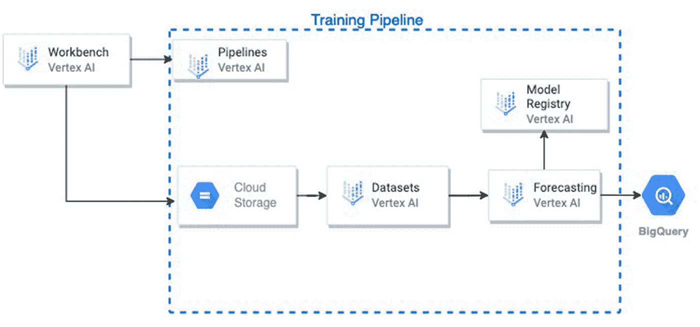
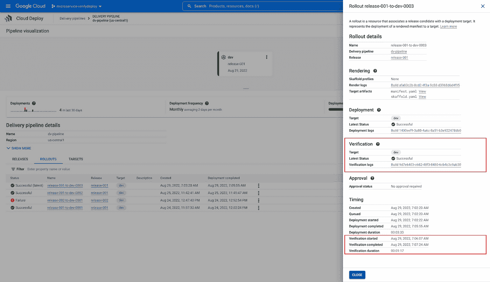

# 谷歌云技术金块—2022 年 9 月 16 日至 30 日版

> 原文：<https://medium.com/google-cloud/google-cloud-technology-nuggets-sep-16-30-2022-edition-150ae1af7cf7?source=collection_archive---------0----------------------->

欢迎参加 2022 年 9 月 16 日至 30 日的谷歌云技术金块。

# **注册 Google Cloud Next’22**

**距离 2012 年谷歌云大会还有不到两周的时间。**太平洋时间 10 月 11 日至 12 日，全球数字广播将在全球五个地点(纽约、桑尼维尔、东京、孟加拉鲁鲁和慕尼黑)现场直播主题演讲，敬请参加这一年度最大的活动。

查看 [Google Cloud Next 网站](http://g.co/cloudnext)了解更多详情，并[立即注册](https://cloud.withgoogle.com/next?utm_source=cgc-blog&utm_medium=blog&utm_campaign=FY22-Q4-global-ENTD217-onlineevent-er-next-2022-mc&utm_content=register-for-google-cloud-next-sept-14&utm_term=-&_ga=2.132211270.-990627277.1663316213)。[博客文章](https://cloud.google.com/blog/topics/google-cloud-next/google-cloud-next-2022-register-now)总结了活动形式、世界各地发生的物理事件等等。

# **联网**

如果您希望配置一个中央和全局负载平衡器，可以管理内部 HTTP(s)负载平衡和区域外部 HTTP(s)负载平衡的服务，现在就可以这样做。此功能肯定有助于降低操作复杂性，并为管理员提供更好的控制，以管理跨团队的服务访问和围绕其使用的特定策略。查看[博客文章](https://cloud.google.com/blog/products/networking/cloud-load-balancing-gets-cross-project-service-referencing)了解更多详情。

# **集装箱和 Kubernetes**

GKE 自动驾驶仪获得了两个功能的推动:GPU 支持和更大的吊舱。GPU 支持允许英伟达 T4 和 A100 GPUs 处理器，它所需要的只是 YAML 中的几条线。由于 AutoPilot 是基于 Pod 运行来收费的，所以不需要担心 Pod 不运行时的费用。对于更大的工作负载，新推出的平衡计算类支持高达 222vCPU 和 851Gi 的 Pod 资源大小。查看[博客文章](https://cloud.google.com/blog/products/containers-kubernetes/run-gpu-workloads-on-gke-autopilot)了解更多详情。

自定义组织策略现在[在预览模式下](https://cloud.google.com/blog/products/identity-security/introducing-custom-organization-policy-for-gke-in-preview)可用，以便与 GKE 集成。

# **存储和数据分析**

您在测试数据流管道的性能时是否面临挑战？随着 [PerfKit Benchmarker](https://github.com/GoogleCloudPlatform/PerfKitBenchmarker) (PKB)的集成，测试数据流作业现在应该更容易了。查看这篇[博客文章](https://cloud.google.com/blog/products/data-analytics/benchmarking-dataflow-jobs)，它讲述了如何使用 PKB 设置和测试数据流作业。所选择的特定数据流管道是对 BigQuery 模板的发布/订阅。

数据质量是数据治理的一个关键部分，Dataplex [为跨 Google 云存储和 BigQuery 资源验证您的数据提供支持](https://cloud.google.com/dataplex/docs/check-data-quality)。

查看这篇[博文](https://cloud.google.com/blog/products/data-analytics/american-eagle-outfitters-builds-a-data-fabric-with-dataplex)，这篇博文强调了 Dataplex 数据质量任务的特性，以及领先的服装供应商之一 American Eagle 如何分享他们在这方面的经验。

# **身份和安全**

在这一期的时事通讯中，有不少关于安全的更新。查看 2022 年 9 月的 [CISO 观点](https://cloud.google.com/blog/products/identity-security/cloud-ciso-perspectives-september-2022)，其中一个关键讨论是围绕谷歌云收购 Mandiant 及其重要性。如果安全是您感兴趣的关键领域，请查看 [Q2 2022 关键安全故事](https://cloud.google.com/blog/topics/developers-practitioners/security-roundup-stories-and-launches-second-quarter-2022)综述。

谷歌云防火墙服务引入了新功能。除了分层防火墙策略之外，还有一种新的策略结构，即网络防火墙策略，它有两种类型:全局和区域网络防火墙策略。还引入了对 IAM 标记的支持，它与网络防火墙策略相结合，提供了比网络标记和服务帐户更好的管理。网络情报中心的防火墙洞察也有所改进。查看[博客文章](https://cloud.google.com/blog/products/identity-security/announcing-new-firewall-policies-and-iam-governed-tags)了解更多详情。

Google Cloud 的组织策略服务是一个框架，允许安全管理员设置规则，规定特定用户可以对资源配置做什么。[博客文章](https://cloud.google.com/blog/products/identity-security/best-kept-security-secrets-harness-the-power-of-organization-policy-service)通过具体的例子和资源为组织利用组织策略服务提供了案例。

员工身份联盟现在在预览版中可用。这是一个关键的发展，让组织在一个地方集中查看和管理他们的 ID 提供者。正如[的博客文章](https://cloud.google.com/blog/products/identity-security/introducing-workforce-identity-federation)所说“消除了跨多个平台维护独立身份的需要。这意味着使用劳动力身份联盟的组织不再需要将劳动力用户身份从其现有的身份管理解决方案同步到 Google Cloud。”

# **机器学习**

Google Cloud 自然语言(NL) API，具有基于 LLM 的新内容分类模型。这些 LLM 已经在更大的数据集上进行了训练，这扩展了它们的内容分类能力。查看 [NLP API 参考](https://cloud.google.com/natural-language/docs/reference/rest)和[博客文章](https://cloud.google.com/blog/products/ai-machine-learning/google-cloud-supercharges-nlp-with-large-language-models)了解更多细节。

顶点 AI 匹配引擎和功能商店现在将支持预览中的实时流摄取。查看[博客文章](https://cloud.google.com/blog/products/ai-machine-learning/real-time-ai-with-google-cloud-vertex-ai)，其中涵盖了这些特性的细节以及它帮助实现的具体用例。

BISE 是一种特别大、干燥和麻烦的风。这和这份时事通讯有什么关系？在一个有趣的案例研究中，BISE 严重影响了瑞士苏黎世的飞机运营，因为飞机有时会被迫改变跑道，从而引发多种物流、时间安排和客户满意度问题。本[案例研究](https://cloud.google.com/blog/products/ai-machine-learning/how-lufthansa-reduce-flight-delays-with-google-cloud-ml)展示了汉莎航空如何直面这一问题，并与谷歌云 ML 技术合作，以帮助提前预测这种风，从而抢先制定缓解这种风的规划流程。

在另一个有趣的 [ML 案例研究](https://cloud.google.com/blog/products/ai-machine-learning/volkswagen-uses-google-cloud-ai-for-more-efficient-cars)中，大众汽车与谷歌云合作，研究 ML 技术如何帮助有效计算不同车型的阻力系数，以帮助他们设计更节能的汽车。

# **SRE 和德沃普斯**

DORA 计划发布了 2022 年 DevOps 加速状态报告。正如你所知道的，DORA 是运行时间最长的研究项目之一，它研究是什么使得精英软件交付组织创建/交付具有规模和稳定性的软件。2021 年，出现的一个关键领域是在 4 个关键 DORA 指标和可靠性方面表现良好的组织之间的直接关联。今年的重点是确定安全性与关键的 DORA 组织和交付绩效指标之间的关系。查看[博客文章](https://cloud.google.com/blog/products/devops-sre/dora-2022-accelerate-state-of-devops-report-now-out)的摘要，并下载完整的 2022 年报告。

云部署经历了重要的重大更新。首先，添加了云运行作为部署目标。接下来是添加部署验证的能力，这意味着您现在可以指定一个或多个(测试)容器，以便在成功部署应用程序时立即执行。查看[博客文章](https://cloud.google.com/blog/topics/developers-practitioners/google-cloud-deploy-introduces-post-deployment-verification)了解关于这两个特性的更多细节，以及一篇[文章部署验证特性](https://cloud.google.com/blog/topics/developers-practitioners/google-cloud-deploy-introduces-post-deployment-verification)博客文章..

日志分析现在在云日志的预览中可用。这个由 BigQuery 提供的特性允许您使用 SQL 的能力对日志执行特定的分析和可视化。该流程还为您提供了一种标准且安全的方法，让您可以通过 LogRouter 接收日志，并出于查询和合规目的对其进行集中管理。查看[博客文章](https://cloud.google.com/blog/products/devops-sre/introducing-cloud-loggings-log-analytics-powered-by-big-query)了解更多详情。

Pub/Sub 是 Google Cloud 中的一个关键集成服务。以前有各种关于发布/订阅的指标，但是很难找到和使用。现在提供了现成的发布/订阅控制面板，可帮助您在 snap 中设置此服务的可观察性。查看[详细的博客文章](https://cloud.google.com/blog/products/management-tools/pubsub-metrics-dashboards-offer--improved-observability)，它不仅涵盖了如何设置它，还提供了如何诊断问题的各种场景。

# **开发者和从业者**

冷启动往往是云运行、云功能等服务使用的瓶颈。它指的是在处理请求时遇到的延迟，这是由于启动了一个新的容器实例来为该请求提供服务。一项新功能**启动 CPU Boost** 旨在显著减少冷启动问题。在您的服务中启用此功能的基准测试几乎达到 30–50%。查看[博客文章](https://cloud.google.com/blog/products/serverless/announcing-startup-cpu-boost-for-cloud-run--cloud-functions)了解更多关于这方面的信息，以及从中受益最大的应用类型。最重要的是，您只需要一个命令就可以跨服务启用 CPU Boost。请记住，此功能处于预览模式。

Cloud Run 是一项出色的服务，可以托管公共网站，甚至是您希望任何人都可以调用的公共服务。虽然云运行通过“允许未经身份验证的请求”允许这样做，但有一些组织级别的最佳实践(如域受限共享)不允许这样做。查看这篇[博客文章](https://cloud.google.com/blog/topics/developers-practitioners/how-create-public-cloud-run-services-when-domain-restricted-sharing-enforced)，这是我们了解云运行中多层安全的好方法，即入口设置和 IAM 策略，以及我们如何在满足不同要求的同时配置和管理它，同时保持组织准则不变。

MySQL 查询洞察现已正式发布。正如[文档](https://cloud.google.com/sql/docs/mysql/using-query-insights)所述，“Query insights 帮助您检测、诊断和预防云 SQL 数据库的查询性能问题。”。在这篇[详细的博文](https://cloud.google.com/blog/topics/developers-practitioners/cloud-sql-query-insights-ga-mysql-query-load-tags-query-plans)中，您将在 Cloud Run 和 MySQL 上部署 Java Spring 中的 PetClinic 应用程序，并测试查询洞察。

如果您正在使用云工作流，您如何将 GitOps 应用于在测试环境中部署工作流、执行测试、将工作流推广到生产环境等整个过程。此外，当您在环境之间切换时，有哪些机制可以替代特定于环境的设置，如 URL 等。看看这个由两部分组成的系列，首先介绍如何[停止您的服务编排](https://cloud.google.com/blog/topics/developers-practitioners/gitsops-service-orchestration)，然后介绍如何管理[多环境工作流](https://cloud.google.com/blog/topics/developers-practitioners/multi-environment-service-orchestrations)。

# **让我们了解一下谷歌云**

人工智能和人工智能技术的开发通常既昂贵又耗时。查看[云智慧周刊](https://cloud.google.com/blog/topics/startups/4-ways-to-innovate-and-save-with-google-cloud-ai-and-ml)，它强调了组织可以使用谷歌云利用人工智能和人工智能的 4 种方式，并继续关注转型，同时控制成本。

希望了解和/或与他人交流 Google Cloud 上的关键无服务器产品(即云功能和云运行)如何帮助提高开发人员效率和成本优化，请查看本期[云智慧周刊](https://cloud.google.com/blog/topics/startups/cloud-wisdom-weekly-save-with-serverless)。

# **测试你的谷歌云知识**

Google Clout 是一系列的挑战，你可以通过它来测试你对 Google Cloud 的了解。作为 Google Cloud NEXT 准备活动的一部分，也就是仅仅两个星期之后，您可以提前了解为 NEXT 参与者设计的 Google Cloud 挑战赛。查看[博客文章](https://cloud.google.com/blog/topics/training-certifications/no-cost-google-cloud-learning-challenges)了解更多详情。

# 保持联系

对这份时事通讯有任何问题、意见或其他反馈吗？请发送[反馈](https://forms.gle/UAsAS7YLxYSBTNBy9)。

想要关注新的谷歌云产品发布吗？我们有一个方便的页面，您可以将它加入书签→[Google Cloud 的新功能](https://bit.ly/3umz3cA?utm_source=ext&utm_medium=partner&utm_campaign=CDR_rom_gcp_gcptechnuggets_feb-a-2022_021622&utm_content=-)。