# 谷歌云技术金块—2022 年 9 月 1 日至 15 日版

> 原文：<https://medium.com/google-cloud/google-cloud-technology-nuggets-september-1-15-2022-edition-687afd24da02?source=collection_archive---------2----------------------->

欢迎参加 2022 年 9 月 1 日至 15 日的谷歌云技术金块。

# **注册 Google Cloud Next’22**

谷歌云今年最大的活动定于 10 月 11 日至 12 日举行，其独特之处在于其全球数字广播，包括来自全球五个地点的现场主题演讲——纽约、桑尼维尔、东京、本加卢鲁和慕尼黑。

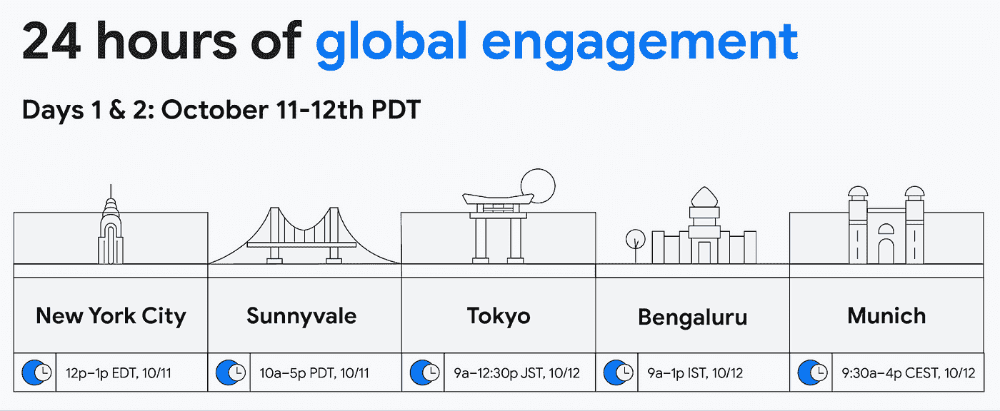

查看 [Google Cloud Next 网站](http://g.co/cloudnext)了解更多详情，并[今天就注册](https://cloud.withgoogle.com/next?utm_source=cgc-blog&utm_medium=blog&utm_campaign=FY22-Q4-global-ENTD217-onlineevent-er-next-2022-mc&utm_content=register-for-google-cloud-next-sept-14&utm_term=-&_ga=2.132211270.-990627277.1663316213)。[博客文章](https://cloud.google.com/blog/topics/google-cloud-next/google-cloud-next-2022-register-now)总结了活动形式、世界各地发生的物理事件等等。

# **容器和 Kubernetes**

如果你一直在使用 GKE，你会知道谷歌管理着 Kubernetes 控制平面。在故障排除过程中，访问各种控制平面指标以帮助您理解问题是非常重要的。这些指标包括 API 服务器的健康状况、Pod 状态等等。请记住，Kubernetes 控制平面指标现在不仅可以在云控制台(如下所示)中使用，还可以通过 Google 云监控指标来设置警报，并根据需要通过第三方集成来使用。查看[博客文章](https://cloud.google.com/blog/products/containers-kubernetes/kubernetes-control-plane-metrics-are-generally-available)了解更多详情。

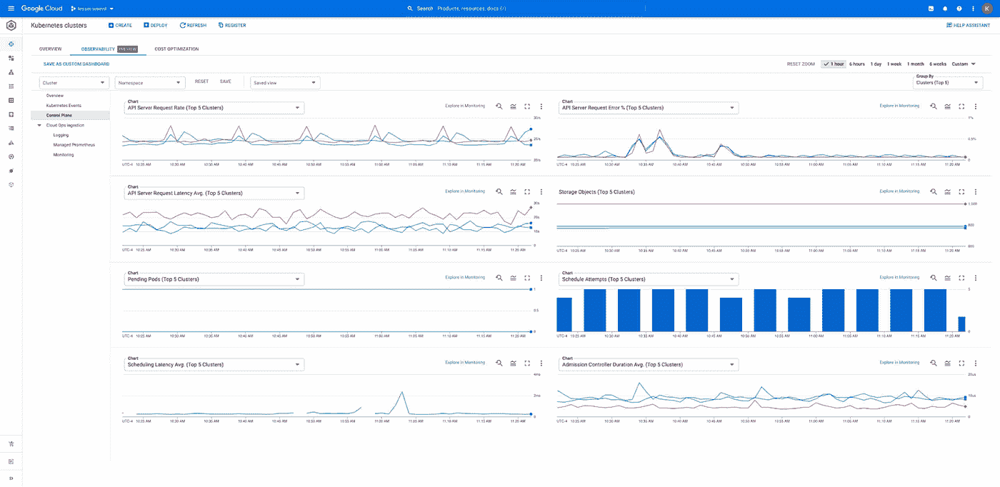

在每周的云智慧系列中，解决了我们的客户向我们提出的问题，本周的焦点是如何优化您的容器成本。随着从虚拟机到容器的迁移，了解几个领域非常重要，您可以研究这些领域，以优化通过容器实现应用程序现代化的迁移。这是一个很好的方式来了解在 Google Cloud 上运行容器的各种选项，并了解计算和 Google Kubernetes 引擎的各种创新，帮助您优化成本。查看[博客文章](https://cloud.google.com/blog/topics/startups/5-ways-to-reduce-costs-with-containers-on-google-cloud)了解更多详情。

# **存储和数据分析**

谷歌备份和灾难恢复现在可以直接从谷歌云控制台获得。该服务允许管理员为计算引擎、VMware 引擎或本地 VMware、数据库(如 SAP、MySQL 和 SQL Server)和文件系统上的虚拟机创建备份。。查看[博客文章](https://cloud.google.com/blog/products/storage-data-transfer/introducing-google-cloud-backup-and-dr)了解更多详情。

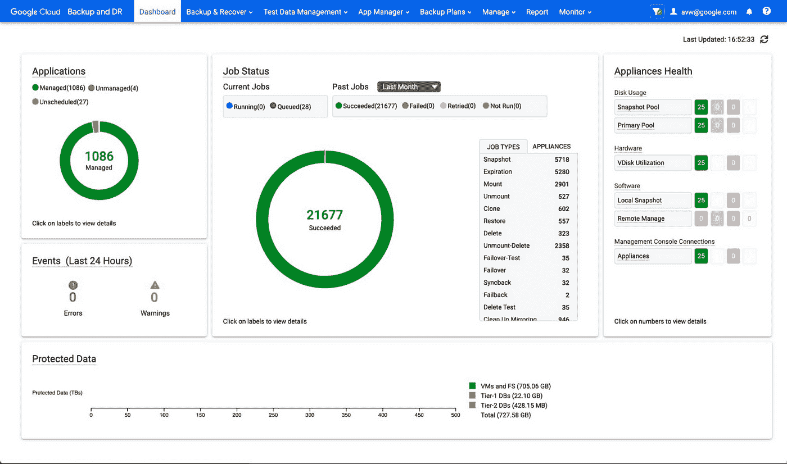

BigQuery 的数据流现在可以在预览中使用。它允许从各种数据库直接无缝复制到 BigQuery。这些数据库源可以是 AlloyDB for PostgreSQL、PostgreSQL、MySQL 和 Oracle。查看[帖子](https://cloud.google.com/blog/products/data-analytics/introducing-seamless-database-replication-to-bigquery)了解更多详情。

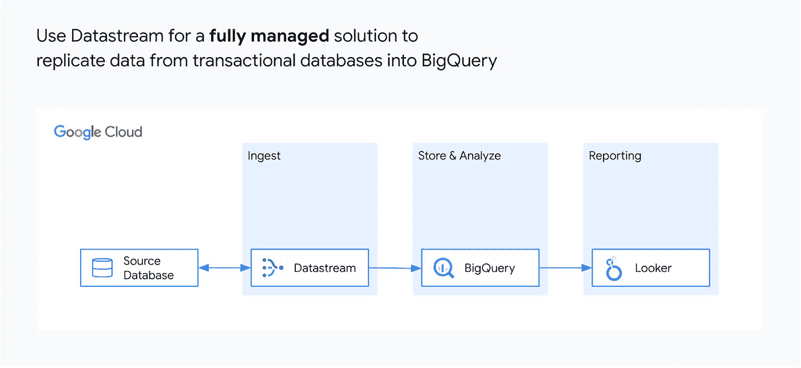

组织中的数据治理有助于解决数据的关键方面，即管理、保护、可发现性和责任。查看[的帖子](https://cloud.google.com/blog/products/data-analytics/achieving-data-governance-for-financial-services)，它不仅涵盖了对这些关键概念的理解，还涵盖了可以帮助你实现这些的各种谷歌服务。这是一个坚实的清单，你可以在这方面的书签。

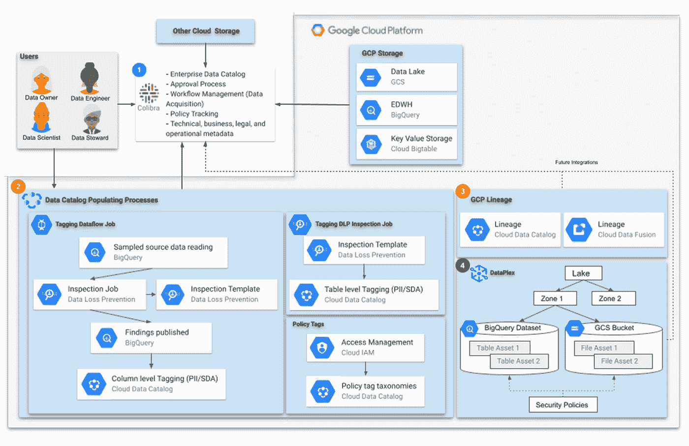

广告个性化是谷歌的一个关键用例。这得益于 Google Bigtable 提供的特性。查看这篇[博客文章](https://cloud.google.com/blog/products/data-analytics/how-google-scales-ad-personalization-with-bigtable)，它有助于映射 Bigtable 的各种特性，使之成为可能。

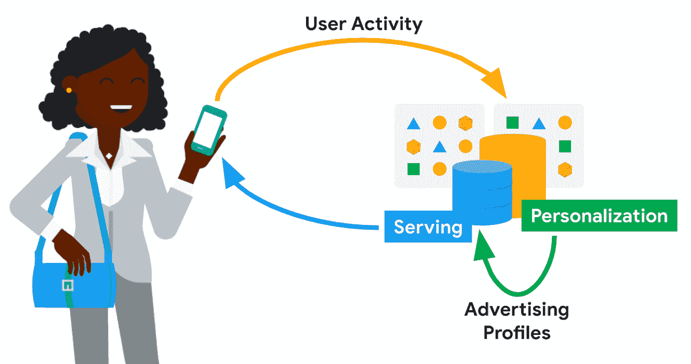

在本新闻简报的前面，我们看到《云智慧周刊》报道了优化您的集装箱化成本的各种方法。本期出版的另一份云智慧周刊[介绍了](https://cloud.google.com/blog/topics/startups/6-tips-to-optimize-data-management-and-analytics)优化数据管理和分析的方法。

# **身份和安全**

Bigquery 中的 PII(个人身份信息)数据提出了几个挑战:识别它并确保在访问该数据时有正确的安全控制。典型的解决方案是复制这些数据，然后开始识别这些数据的过程。如果您可以在 BigQuery 内部完成所有这些工作，那会怎么样。看看谷歌专业服务开发的[解决方案](https://cloud.google.com/blog/products/identity-security/how-to-use-google-cloud-to-find-and-protect-pii)就能做到这一点。

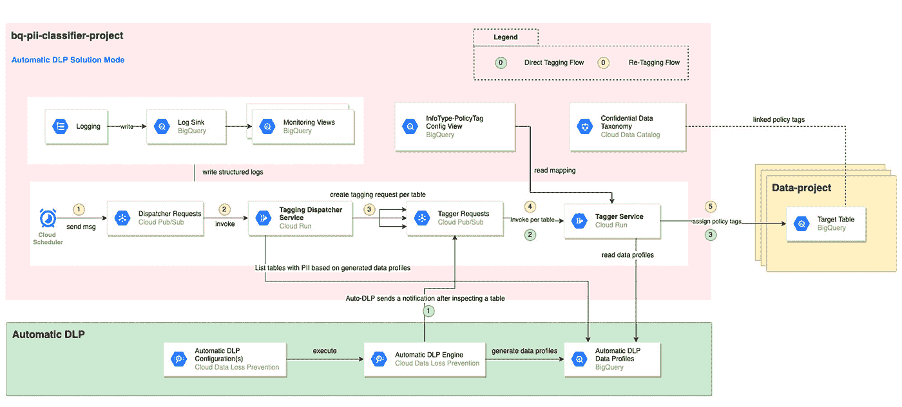

# **机器学习**

你如何把你的机器学习模型从原型变成产品。云提供商提供了哪些工具和服务来实现这一点。在一系列视频教程中，看看如何使用 Vertex AI 在谷歌云上构建、训练、扩展和部署机器学习模型的旅程。该列表包括:

*   面向机器学习的笔记本电脑入门
*   为机器学习存储数据
*   在顶点人工智能上训练定制模型
*   如何从 ML 模型中获得预测
*   调整和缩放您的 ML 模型

查看[博客文章](https://cloud.google.com/blog/products/ai-machine-learning/go-from-a-notebook-to-a-production-ml-model)了解更多详情。

# **DevOps**

我们熟悉持续集成(CI)和持续交付(CD)的概念。如何理解如何用 Google 云服务构建一个安全的 CI/CD 管道？[的博客文章](https://cloud.google.com/blog/products/devops-sre/devsecops-and-cicd-using-google-cloud-built-in-services)解释了如何构建一个，并涵盖了各种谷歌云服务，如云构建、工件注册、云部署、二进制授权、GKE、云发布/订阅和云功能。

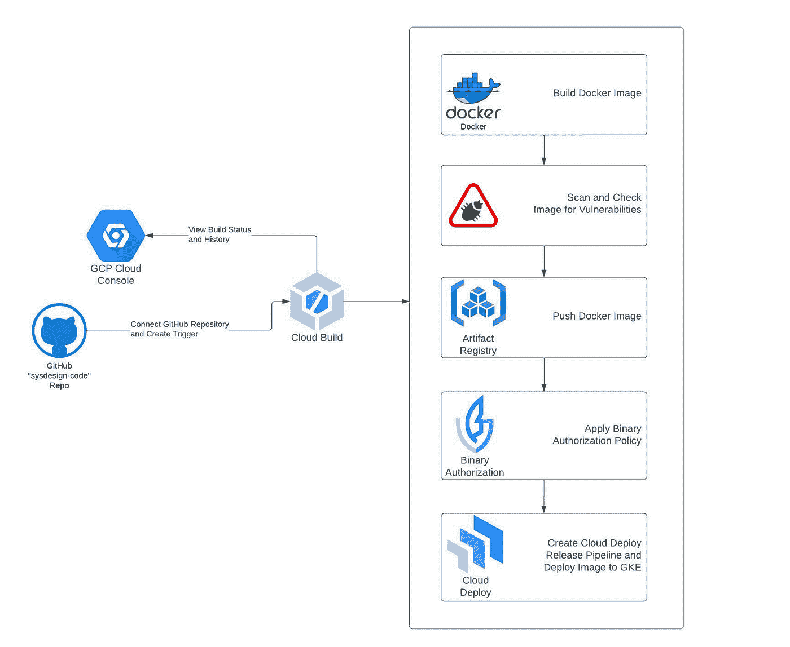

# **开发者和从业者**

Cloud Spanner 试用实例现已面向所有开发者开放，为期 90 天。Spanner 实例，用户可以在其中创建 GoogleSQL 或 PostgreSQL-dialect 数据库，探索 Spanner 功能，并构建在 Spanner 上运行的应用程序原型。让实例安装一个指导教程，帮助您开始使用 Cloud Spanner，怎么样？查看[博客文章](https://cloud.google.com/blog/products/spanner/try-cloud-spanner-databases)了解更多详情。

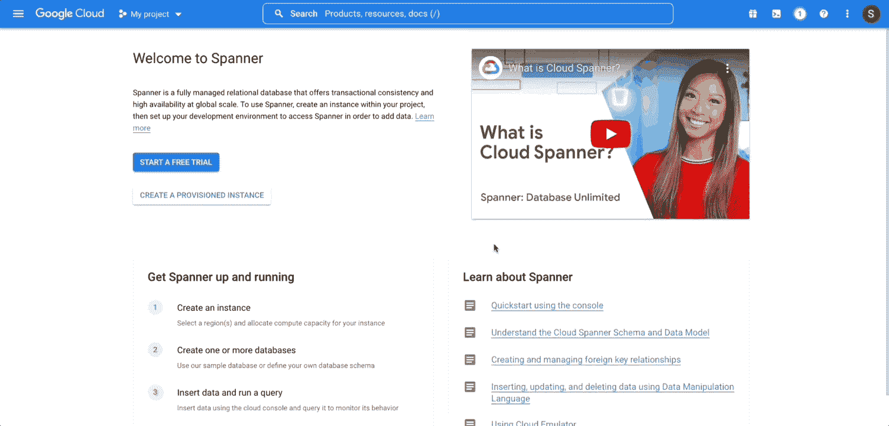

查看[帖子](https://cloud.google.com/blog/products/spanner/spanner-sample-apps-and-free-trial-instance)，它将帮助您了解示例实例、可用的演示应用程序等等。

如果您喜欢使用 IDE 进行开发，那么有趣的是，您现在可以从云代码中管理计算引擎实例。Cloud Code 是一个流行的 ide 插件，比如 VS Code，Jetbrains IDEA，也可以在 Cloud Shell 中使用。

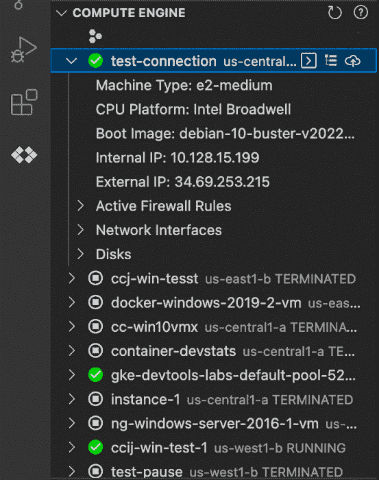

云代码中对计算引擎的支持包括查看虚拟机、通过 SSH 连接到虚拟机、向虚拟机上传文件、查看日志等。查看[博客文章](https://cloud.google.com/blog/products/application-development/develop-applications-for-compute-engine-in-your-ide-with-cloud-code)了解更多详情。有关云代码的更多信息，请查看[主文档](https://cloud.google.com/code)。

我们已经在这篇时事通讯中介绍了 Google Cloud 系列的数据库。[该系列的第六部分现在已经出来了](https://cloud.google.com/blog/topics/developers-practitioners/databases-google-cloud-part-6-bigquery-and-no-code-sql-only-ml)，这是一个有趣的预测电影成败的分步指南。该指南涵盖了使用 BigQuery ML 创建模型，以及通过使用具有相同 BigQuery 数据的 Vertex AI AutoML 创建模型的相同过程。

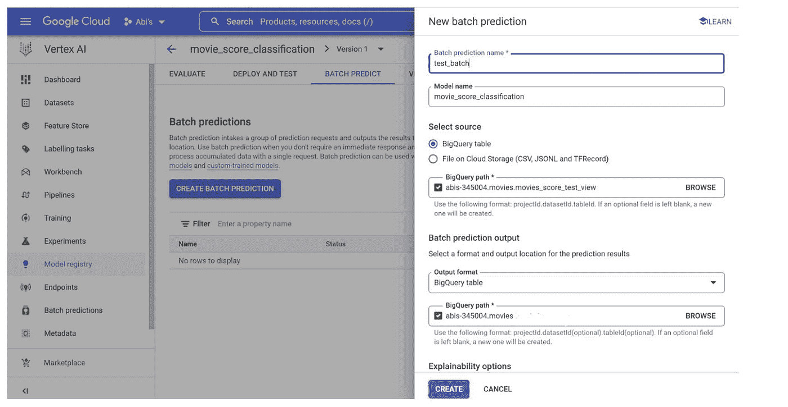

# 让我们来了解一下 GCP

云计算是发展最快的领域之一，在这一领域，许多工作机会正在涌现。但是，如果你来自传统的 IT 背景，非 IT 背景，没有学位，或者希望从不同的职业转向云计算，这似乎对你不利。然而，这不应该阻止你追求在云中工作的梦想。这篇[博客文章](https://cloud.google.com/blog/topics/training-certifications/cracking-the-google-cloud-career)着眼于几个这样的场景，并提出了实现这一点的途径。你也可以查看完整的[破解谷歌云职业播放列表](https://www.youtube.com/playlist?list=PLIivdWyY5sqKBEZkq4X5tojtTY3OhZfda)。

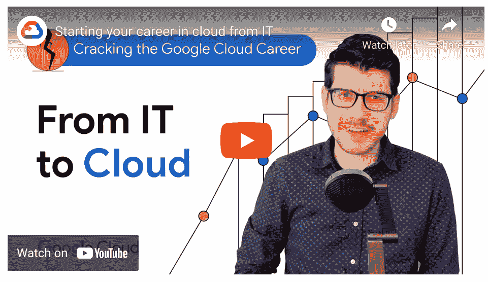

想学习一门新的编程语言吗？您知道吗，Go 语言被用于几个最流行的云基础设施项目，如 Kubernetes、Docker、Prometheus 等。看看这篇题为“[我为什么喜欢围棋](https://cloud.google.com/blog/products/application-modernization/why-david-yach-loves-go)”的有趣文章，并从中获得灵感，开始下一步学习围棋。首先从一次[围棋之旅开始。](https://go.dev/tour/welcome/1)

[Cloud Digital Leader](https://cloud.google.com/certification/cloud-digital-leader) 认证是 Google Cloud 中最受欢迎的认证之一。如果你想获得认证，有一个免费的谷歌云技能提升计划的谷歌数字领导者培训。查看[的博文](https://cloud.google.com/blog/topics/training-certifications/drive-digital-transformation-get-cloud-digital-leader-certified)了解更多细节。

# **黑客马拉松/竞赛**

有几场比赛有很多奖品等着你去争夺:

**谷歌云飞行杯挑战赛**:该挑战赛与无人机竞赛联盟(DRL)合作。参与者将被要求结合 DRL 的比赛数据和谷歌云数据分析工具来建立模型和预测比赛结果。该活动刚刚启动，将分 3 个阶段进行，从 2012 年开始，一直持续到今年年底。[立即注册](https://thedroneracingleague.com/googlecloud/)并阅读[博客文章](https://cloud.google.com/blog/topics/training-certifications/sign-up-for-the-google-cloud-fly-cup-challenge)了解更多详情。大奖获得者将赢得 2023 年初 DRL 决赛的免费 VIP 之旅。

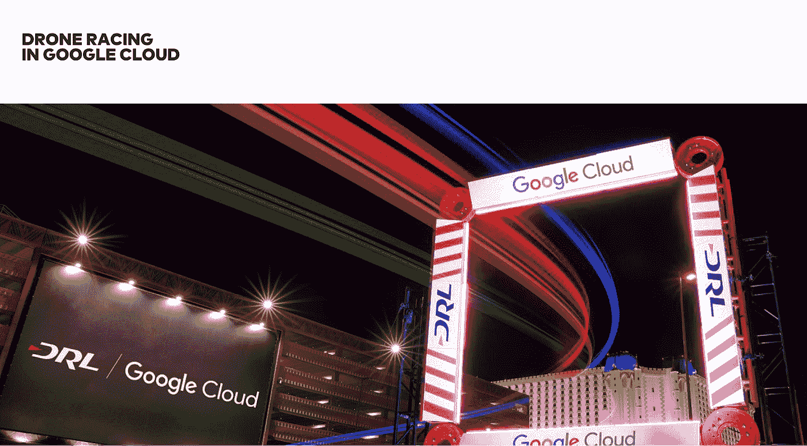

**谷歌地图平台黑客马拉松:**对于谷歌地图开发者来说，打造一个独特的体验，就有可能赢得几个奖项中的一个，奖金总额为 24000 美元。查看[博客文章](https://cloud.google.com/blog/products/maps-platform/test-your-skills-google-maps-platform-hackathon)了解更多详情，或者访问 [Devpost 黑客马拉松网站](https://googlemapsplatform.devpost.com/)。从[演示图库](https://mapsplatform.google.com/resources/demo-gallery/)中获得灵感。

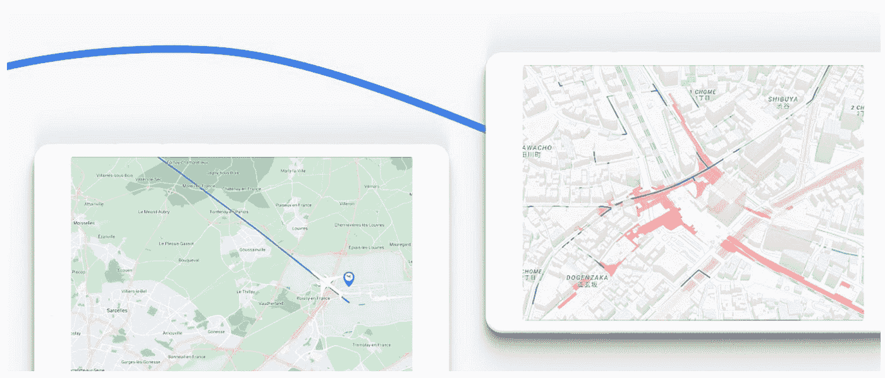

# 保持联系

对这份时事通讯有任何问题、意见或其他反馈吗？请发送[反馈](https://forms.gle/UAsAS7YLxYSBTNBy9)。

想要关注新的谷歌云产品发布吗？我们有一个方便的页面，您可以将它加入书签→[Google Cloud 的新功能](https://bit.ly/3umz3cA?utm_source=ext&utm_medium=partner&utm_campaign=CDR_rom_gcp_gcptechnuggets_feb-a-2022_021622&utm_content=-)。