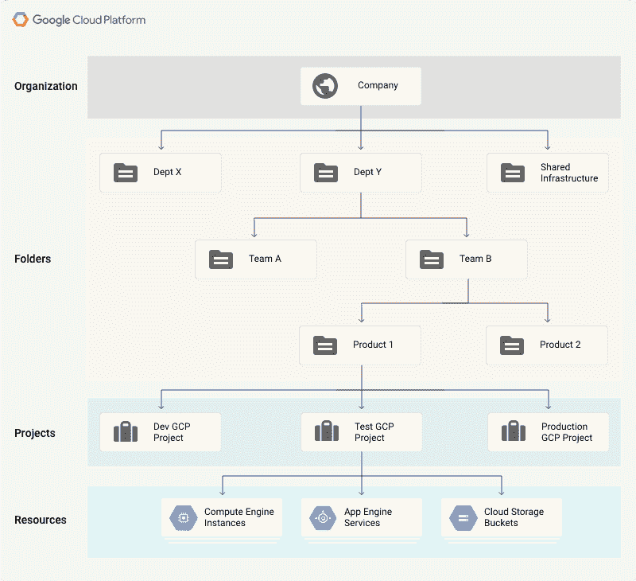
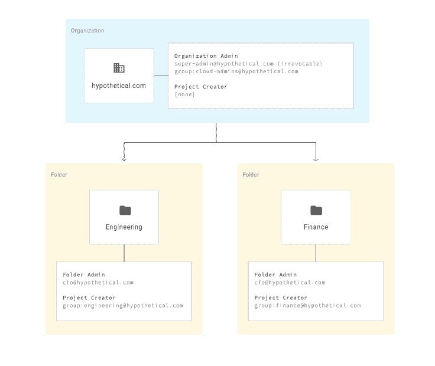
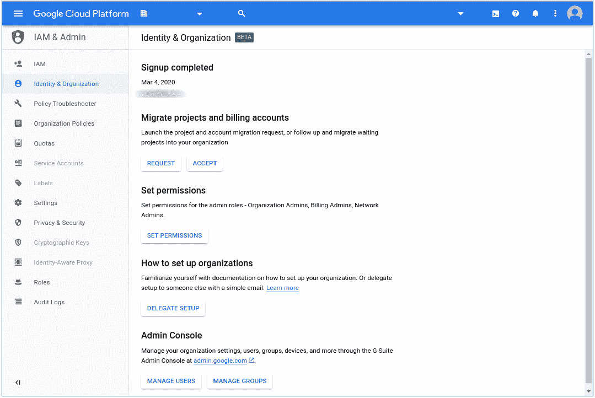
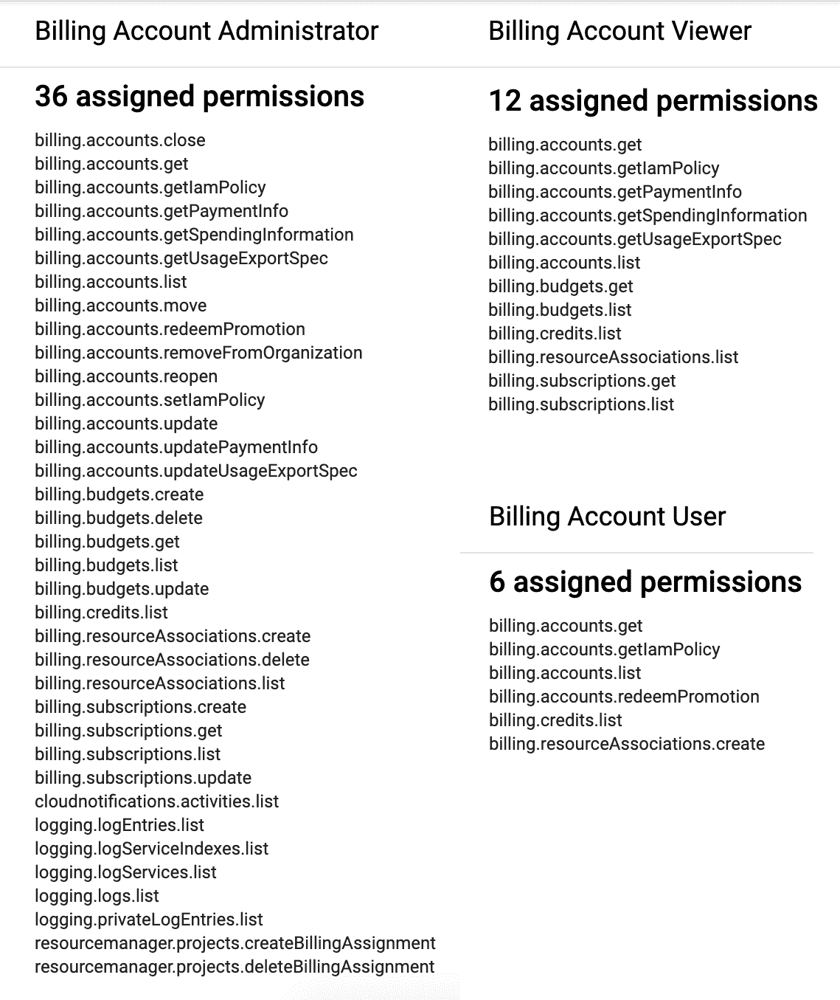

# 谷歌云提示和技巧:理解资源层次

> 原文：<https://medium.com/google-cloud/google-cloud-tips-and-tricks-understanding-the-resource-hierarchy-3227f225a8e7?source=collection_archive---------0----------------------->

所以，你想开始在谷歌云上构建你的基础设施。您已经阅读了所有关于云是未来的内容，并且您已经准备好采取行动。但是在云上进行构建似乎有些力不从心。从理论上讲，你可以在短短的几天内启动一台造价数千美元的巨型服务器。呀。

这听起来很可怕，但事实并非如此。我将分享一些在 Google Cloud 上组织资源的重要技巧(小建议)和诀窍(有用的提示)。我希望我将分享的内容能够帮助您更快地开始，并更好地理解您在云中运行的内容。让我们把事情变得更简单，更简单。

# 资源层次结构

我听说剥猫皮的方法不止一种。虽然我不知道这是什么意思，但我知道有不止一种方法来组织你的谷歌云资源。这就是资源层级。

该层级可以映射到您组织的结构，并允许您管理对所有云资源的访问和权限。下面是一个资源层级的例子，直接来自谷歌云的官方资源层级[文档](https://cloud.google.com/resource-manager/docs/cloud-platform-resource-hierarchy):

你的等级可能会有所不同

您的资源层次结构可以像一个组织下的单个项目一样简单，但是如果您有更大的计划，有更多的方法来组织事情，以便您可以更好地了解哪些团队使用哪些资源以及负责哪些成本。

## **提示:做一些规划**

了解资源层次结构将使您能够以最适合组织的方式组织资源。做一些类似于上面的图表，以了解您的资源层次结构可能是什么样子。如果您的组织是按部门分组的，那么这些部门映射到文件夹可能是有意义的。考虑访问管理的主要连接点—组织级别、文件夹级别和项目级别—并记住权限是自上而下继承的。

## **绝招:开始简单**

资源层次结构是灵活的。在初始设置后，您可以随时移动项目、文件夹和更改权限，所以不要对您的计划感到不知所措。在绘制图表时熟悉组织资源，这样您可以进行更小更快的更改。

# 领域和组织

这是资源层次结构的顶层。当你注册云身份或 G 套件时，你将被要求提供一个**域**。当这得到验证后，一个**组织**就创建了。它本质上是谷歌云创造的所有事物的保护伞。所有创建的项目都将属于组织，而不是创建它们的用户。这在项目所有者离开组织的情况下尤其重要。在组织级别设置的权限将被下面的文件夹和项目继承。

## **提示:你只需要一个组织**

您可能需要管理多个组织。但是，您的 G Suite 或云身份帐户仅限于一个组织和一个域。请考虑将您的子组织组织为文件夹。

如果这确实不能满足您的需求，您可以管理多个 G Suite 或云身份帐户，从而管理多个组织。不利的一面是，它们将相互隔离，需要单独的域，并且缺乏集中的访问和管理。这里有更多关于使用多个组织节点的效果的信息。

## **招数:从 IAM 开始**

如果您刚刚开始并设置您的组织，您开始使用的初始帐户将具有有限的权限。事实上，您将只有角色**组织管理员**。**组织管理员**将能够访问属于该组织的所有项目，并将 IAM 角色分配给其他用户。在探索您的组织下的文件夹和项目创建之前，花点时间检查一下[身份&组织页面。](https://console.cloud.google.com/projectselector2/iam-admin/org-onboarding)在这里，您可以迁移项目、创建计费帐户、为自己或其他用户扩展权限，甚至将组织管理权限委托给其他人。

IAM & Admin 的身份和组织页

# 账单账户和支付配置文件

**计费账户**是一个云端资源，用于管理与计费相关的功能。在这里，您将定义用于支付云使用费用的支付方式，访问成本报告和预测，生成预算以避免意外，以及几乎所有与账单相关的事情。

虽然计费帐户是在云控制台中管理的，但**支付配置文件**是一个谷歌级的资源，可以连接到所有的谷歌服务，如云、广告或 Chrome 许可证。我之所以在这里提到它，是因为需要将一个计费帐户链接到一个现有的支付配置文件，否则将会创建一个。如果你还没有支付其他谷歌服务，你可能不需要担心连接到现有的支付配置文件。

## **提示:使用单一计费账户**

您可以为每个组织配置多个计费帐户，但我建议坚持使用单个计费帐户。将您组织的所有项目关联到一个计费帐户将使您能够更完整、更集中地查看您的成本，并使其更易于跟踪。

## **诀窍:了解付费账户用户、观众和管理员**

您可以委派 3 种类型的计费帐户角色:计费帐户**用户**，计费帐户**查看者**，以及计费帐户**管理员**。虽然管理员可以取消项目链接、设置预算和启动计费导出，但计费帐户用户只能关联项目和查看支出。计费帐户管理员也是唯一可以联系计费支持的人。付费帐户查看者拥有与用户相同的权限，但有更多的可见性。要特别注意用户、查看者和管理员之间的差异，并相应地将每个角色分配给不同的组或人。作为参考，下面并列列出了每个角色的权限:

# 资源

面包和黄油。肉和土豆。资源是任何谷歌云服务，像 BigQuery，Compute Engine，云存储等。资源被组织成**个项目。**

## **提示:想想你的文件夹**

项目可以组织到**文件夹**中。与基本的文件系统非常相似，一个项目将从它所属的文件夹中继承权限和访问权，以及它上面的组织。如果您计划在 Google Cloud 上有多个项目，或者如果您的组织下有多个团队将部署到 Google Cloud，那么一定要考虑使用文件夹。正如我前面提到的，文件夹是访问管理的一个附加点，可以更容易地委派角色和权限。如果您导出到 Big Query，它还将为您提供另一种方式来分解月底的账单费用，允许您通过文件夹[而不是单个项目](https://cloud.google.com/blog/products/data-analytics/analyzing-gcp-costs-using-folders-and-bigquery-billing-export)来分析成本。

## **诀窍:使用标签获得额外的粒度**

标签提供了一种横向组织项目资源的方式，并帮助您获得更精细的成本视图。例如，假设您有一个项目，其中的虚拟机和 Kubernetes 集群对应于一个试运行或生产环境。通过应用带有关键字“环境”和值“暂存”或“生产”的标签，您可以看到每个环境的支出，而不仅仅是资源类型。你的粒度越细，你就能更好地理解你的成本并控制它们。你可以在这里阅读更多关于标签的信息。

# 更多资源开始使用

为了帮助你开始使用云计算，谷歌提供了一个价值 300 美元的[免费试用。](https://console.developers.google.com/billing/freetrial?hl=en)他们的定价登陆页面是正确的[这里](https://cloud.google.com/pricing)。要了解更多关于账单的信息，请查看 Youtube 上的 [Mark Mirchandani](https://twitter.com/markmirch) 的[超越你的账单系列](https://www.youtube.com/playlist?list=PLIivdWyY5sqKJx6FwJMRcsnFIkkNFtsX9)，它涵盖了上面的大部分内容以及更多内容。

祝你好运！

***不，提示和技巧之间没有明显的区别。*