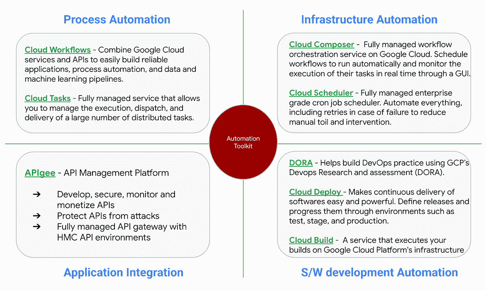
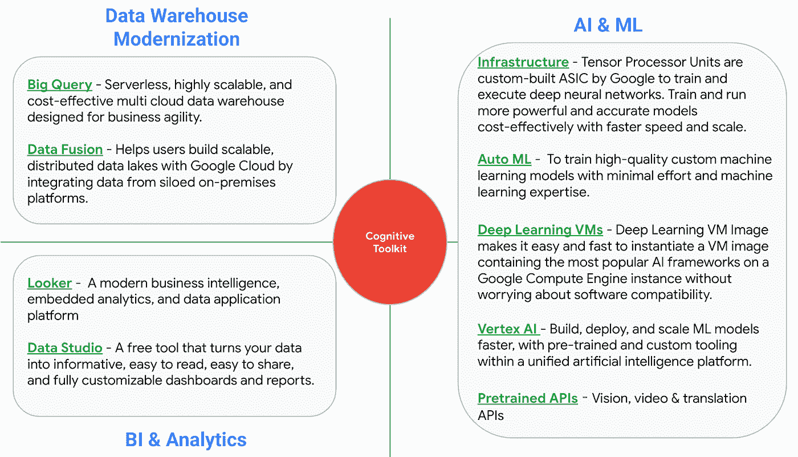
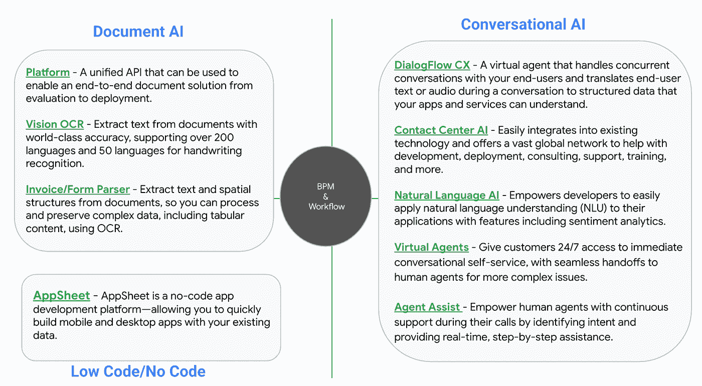
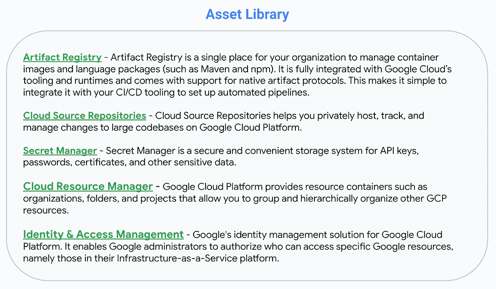

# 谷歌云工具包实现服务交付自动化

> 原文：<https://medium.com/google-cloud/google-cloud-toolkit-to-automate-service-delivery-e3a838929b5?source=collection_archive---------1----------------------->

跨国专业服务组织就数字化转型、IT/财务审计、网络安全、监管补救、适用性审查、反洗钱以及更多此类服务向全球其他组织提供咨询。为此，他们拥有一支利用手动流程和陈旧工具的员工队伍。由于这些原因，这些咨询公司花费**相当多的时间来吸纳客户，并最终减缓收入周期**。此外，人工执行任务所需的人力增加了雇佣周期，降低了利润率。

当这些咨询公司的顾问委员会通过展示自动化的优势来推动全球组织实现自动化时，正是咨询公司自动化其内部工具以更快更好地提供服务的时候。**这里是谷歌云帮助咨询机构实现预期结果的工具包列表**。

> **自动化工具包** —该工具包旨在自动化流程、基础设施部署、软件部署，并与现有应用程序堆栈集成。

> **认知工具包** —服务交付组织可以使用 Google Cloud 构建他们的数据湖和数据仓库，并使用 BI &分析数据来构建实时仪表板，从而获得更多见解。组织也可以从谷歌云中利用人工智能的力量，使用高度精确的预建模型，并建立定制的人工智能模型。

> **业务流程管理&工作流自动化** —来自谷歌云的人工智能(下文提到)在客户服务领域的深层能力可以用来改善客户服务。构建低代码/无代码平台，转变工作流的管理/自动化方式。

> **资产库** —下面提到的是来自 Google Cloud 的工具包，用于管理由服务交付组织构建的资产。

通过利用自动化和认知工具包、BPM 和工作流自动化以及资产库，全球各地的咨询公司正在转变其工具，以快速跟踪客户入职，减少每个项目的 fte 数量，并提高整体利润率。

**你准备好利用 Google Cloud toolkit 的强大功能了吗？**