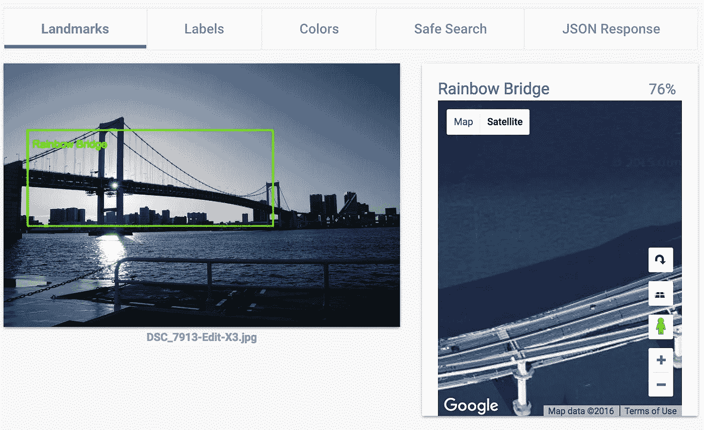

# 用我自己的旅行照片测试 Google Cloud Vision API 地标检测

> 原文：<https://medium.com/google-cloud/google-cloud-vision-landmark-detection-vacation-photos-41392d4b5765?source=collection_archive---------0----------------------->

前几天，fellow [Google Cloud 开发者倡导者](https://twitter.com/googlecloud/lists/developer-advocates/members) [Sara Robinson](https://medium.com/u/7f2ab73b39f8?source=post_page-----41392d4b5765--------------------------------) 写了一篇关于[Cloud Vision API](https://cloud.google.com/vision/)([docs](https://cloud.google.com/vision/docs/)|[live demo](https://cloud.google.com/vision/#vision_demo_section)|[sample code](https://cloud.google.com/vision/docs/landmark-tutorial))地标检测特性的[大博文](https://cloud.google.com/blog/big-data/2016/09/around-the-world-landmark-detection-with-the-cloud-vision-api)。Sara 的结果给我留下了深刻的印象，所以我决定尝试我的一些旅行照片，看看 API 是否可以识别大量的地标。结果让我大吃一惊！

下面是我使用视觉应用编程接口的在线演示的一系列截图。你可以用自己的图片试试。

注意:这些图像都没有嵌入位置数据。我用各种没有 GPS 功能的单反拍摄了它们，所以你下面看到的位置是从 API 提供的 lat/long 结果推导出来的。

地标检测只是 Vision API 的众多功能之一。[来看看](https://cloud.google.com/vision/)！