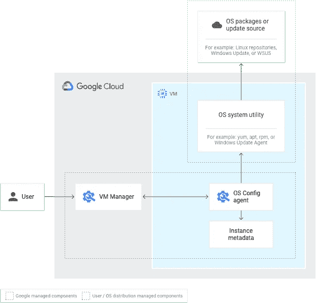
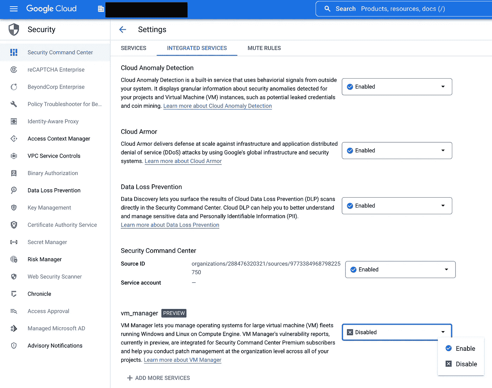

# 谷歌云—虚拟机管理器

> 原文：<https://medium.com/google-cloud/google-cloud-vm-manager-378f6c6bf6d7?source=collection_archive---------2----------------------->

虚拟机管理器(VMM)是一套工具，可用于管理 Windows 和 Linux 虚拟机(虚拟机)。如果您管理大量虚拟机，VMM 可以自动执行补丁安装、合规性监控和配置，从而简化操作。在高层次上，Google Cloud 安装一个代理来管理和监控操作系统，然后使用操作系统的实用程序来维护虚拟机的状态。

[](https://cloud.google.com/compute/docs/vm-manager)

虚拟机管理器架构

VMM 有三个特点:

1.  操作系统补丁程序管理—按需/按计划应用补丁程序，并分析操作系统的补丁程序合规性。
2.  操作系统库存管理—收集和审查操作系统信息。
3.  操作系统配置管理—安装、删除和自动更新软件包。

**步骤 1:启用操作系统配置服务 API。**这支持补丁管理、合规性和配置。


操作系统配置 API

**步骤 2:启用容器分析 API。**容器分析 API 在容器注册中心和工件注册中心为软件工件提供元数据存储。


容器分析 API 第 1 部分


容器分析 API 第 2 部分

**第 3 步:创建虚拟机并设置所需的元数据值。**任何构建日期为 v20200114 或更晚的映像(应该是最新一代的映像)都已经安装了操作系统配置代理。您所需要做的就是设置元数据值，这相当于一个“开/关”开关。您可以在云项目上应用元数据值，这将值应用于项目中的所有虚拟机，或者您可以在单个虚拟机上应用元数据值。由于虚拟机管理器是按虚拟机定价的，这种灵活性有助于控制成本。

如果您需要使用旧的映像，可以选择[手动安装代理](https://cloud.google.com/compute/docs/manage-os#agent-install)。


应用元数据值

**第四步:验证。**使用[验证清单](https://cloud.google.com/compute/docs/troubleshooting/vm-manager/verify-setup)验证 VM Manager 安装。它包括五个步骤:

1.  检查操作系统配置 API 是否已启用。
2.  检查元数据是否已启用。
3.  检查操作系统配置代理是否已安装并正在运行。
4.  检查服务帐户是否已启用。
5.  检查虚拟机是否可以与操作系统配置 API 通信。

您需要一段时间才能在仪表板中看到任何内容。

在 2022 年 8 月>的这篇文章中， [VMM 和](https://cloud.google.com/security-command-center/docs/how-to-configure-security-command-center#vulnerability_reports)(SCC)preview<中的 Premium Tier 之间也有一个集成。VMM 识别虚拟机中的操作系统漏洞，然后将其漏洞报告写入 SCC。要启用此集成，请转到*“安全→安全命令中心→设置→虚拟机管理器→启用”。*



## 摘要

虚拟机管理器监控、清点和配置计算引擎虚拟机的操作系统。即使涉及到代理，Google Cloud 也会自动处理管理代理生命周期的复杂性，从而简化操作。VMM 还可以向安全指挥中心发送漏洞信息，以集中安全信息。

## 进一步观察

```
**Further Reading**[Google Cloud: VM Manager](https://cloud.google.com/compute/docs/vm-manager)
[Google Cloud: Setup VM Manager](https://cloud.google.com/compute/docs/manage-os)
[Google Cloud: Troubleshoot VM Manager](https://cloud.google.com/compute/docs/troubleshooting/vm-manager/troubleshoot-vm-manager)
[Google Cloud: Verify VM Manager Setup](https://cloud.google.com/compute/docs/troubleshooting/vm-manager/verify-setup)
[Google Cloud: VM Manager Vulnerability Reports](https://cloud.google.com/security-command-center/docs/how-to-configure-security-command-center#vulnerability_reports)
```