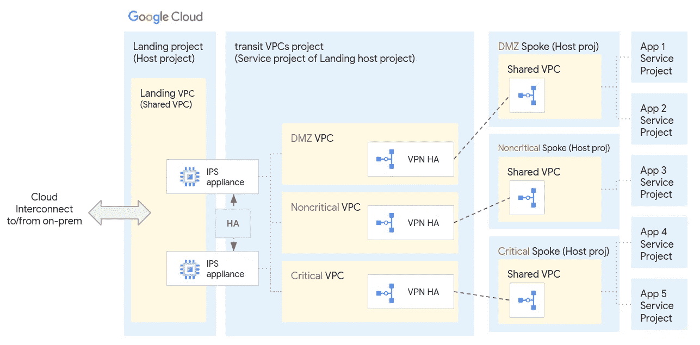
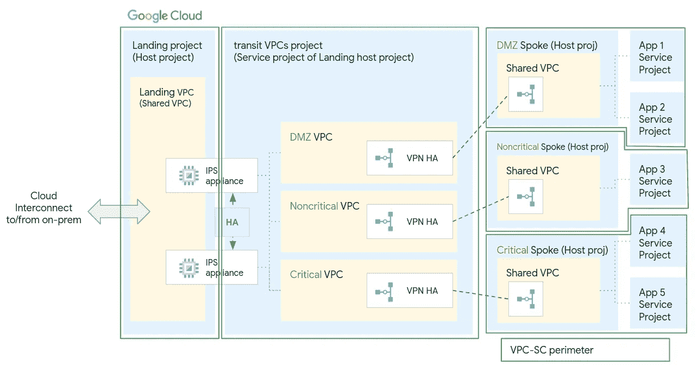
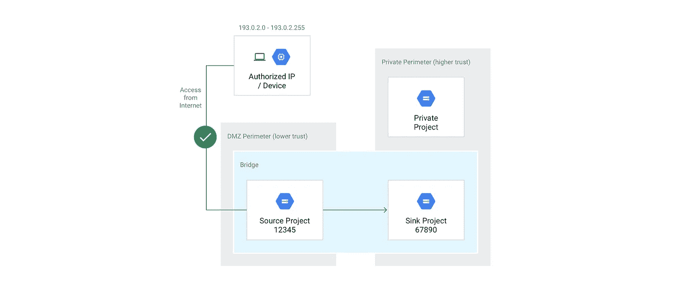

# 谷歌云 VPC-服务控制:经验教训

> 原文：<https://medium.com/google-cloud/google-cloud-vpc-service-controls-lessons-learned-670619c3d82c?source=collection_archive---------0----------------------->

作为谷歌云专业服务组织的一员，我有机会与我所在地区的一些最大的客户合作，支持他们在现实世界场景中设计和实施非常有趣的基础设施。

我决定写这篇文章，与大家分享我在将 [VPC 服务控制](https://cloud.google.com/vpc-service-controls)(又名 VPC-SC)应用于我们最大的客户之一的复杂网络基础设施时学到的重要经验。

# 客户网络基础设施概述

让我们首先来看一下客户项目和基础架构的高度概述。

GCP 客户网络的局部视图

从左侧开始，我们可以看到连接本地系统和 Google Cloud 中的登陆(非信任区)VPC 的云互连。

然后，网络流量流经一些 IPS 设备，这些设备可以检查数据包，并将它们发送到正确安全区域的中转 VPC。这些安全区域具有相同的内部隔离，因此客户将 Google Cloud 视为其内部的扩展。

转接 VPC 然后通过 HA-VPN 连接到一些分支项目，这些分支项目[与应用程序的服务项目共享它们的 VPC](https://cloud.google.com/vpc/docs/shared-vpc) 。

# 应用 VPC 服务控制

有了这个基础设施，我的客户的目标是保护他们的许多 GCP 项目的不同谷歌服务(通过谷歌 API 访问)免受互联网和不同安全区域(除了一些例外情况)的影响，这是另一个重要的需求。例如，这意味着本地关键安全区域必须能够访问 GCP 关键安全区域中的资源，但其他安全区域不应访问这些资源。

这一目标可以通过使用谷歌云 VPC 服务控件来创建需要保护的项目周围的安全边界来实现。

一旦安全边界到位并得到实施，它将保护边界内的服务免受边界外的访问，反之亦然(边界内的工作负载将无法访问边界外项目中受保护的服务)。

以下是 VPC-SC 周界如何围绕客户的项目进行配置，以保护不同的安全区域和网络基础设施:

*   3 个不同安全区域的周界
*   着陆区的 1 个边界
*   1 个中转区周界

将创建 VPC-SC 桥，以便根据需要进行不同周界之间的通信。
私有服务连接端点将被配置为允许内部安全区域 X 与 Google 云安全区域 X 之间的通信(本文稍后将提供更多关于私有服务连接端点的信息)。

围绕客户项目的 VPC-SC 周界

# VPC-服务控制:经验教训

简要介绍完客户的网络架构和目标后，我想与您分享我在设计和实施解决方案时学到的一系列经验:

## 保持简单(尽可能)

如果你的目标是保护谷歌应用编程接口和服务免受互联网攻击，那么你应该考虑建立一个包含你所有项目的单一 VPC-SC 边界，或者，如果你想保护不同的安全区域或环境，在这些项目周围建立边界(或者在专用的共享 VPC 周围)。

拥有太多的边界可能会让您对不同项目之间的单个请求有更多的控制，但是这将需要对所有那些异常的跨边界通信进行更多的关注和维护(相信我，这将是事实)。

## 在实施边界之前利用模拟运行模式

在实施之前，可以在[“演习”模式](https://cloud.google.com/vpc-service-controls/docs/dry-run-mode)下创建 VPC-SC 边界。此功能将在云日志中记录边界的违规，但它不会有效地阻止那些 API 请求。

这种方法使您能够分析这些违规行为，并在实施边界之前决定如何处理它们。我的一个同事就此写了一篇[很棒的文章](/google-cloud/create-a-data-studio-dashboard-to-monitor-vpc-sc-violations-on-your-google-cloud-organization-bf8f3bead691)。

## 仔细分析云日志中报告的违规

为了确保您在实施 VPC-SC 边界时不会中断任何东西，您应该让它在“预演”模式下运行几周(我认为至少一个月)。这是因为可能有一些计划好的进程每周或每月运行一次。

仔细分析您在日志中获得的违规，区分应该阻止的流量和应该允许的例外。

可以将日志提取到 BigQuery 表中，以便更好地查询和分析。我在之前提到的[文章描述了如何做到这一点。](/google-cloud/create-a-data-studio-dashboard-to-monitor-vpc-sc-violations-on-your-google-cloud-organization-bf8f3bead691)

为了更好地了解违规情况，检查日志中最有用的字段是:

*   时间戳(违规发生的日期和时间)
*   proto payload _ audit log . request metadata . callerip(客户端 Ip 地址)
*   proto payload _ audit log . method name(调用的 API 和方法)
*   proto payload _ audit log . authenticationinfo . principal email(调用 API 的用户电子邮件或服务帐户)
*   proto payload _ audit log . metadata Json(该字段包含 JSON 格式的有趣信息，例如:违反边界的名称、方向(入口/出口)、源项目、目标项目、唯一 id)

一旦边界得到加强，来自边界外部(甚至通过云控制台)的 API 调用对这些受保护资源的访问将被阻止。当这种情况发生时，将向用户显示唯一的标识符。可以在日志或 BigQuery 中查找这个 ID，以查看关于违规的所有细节。

## 从一开始就将 VPC-SC 纳入您的基础设施设计中

模拟运行模式和违规日志是了解和排除跨边界通信故障的重要工具。

更好的方法是从一开始就关注 VPC-SC 边界的设计，以及基础设施的其余部分。

根据我的经验，这种方法比在现有的复杂基础设施和网络设计中改造外围设备更容易引入和维护。

## 云壳

如果您使用 Cloud Shell 与项目中的 API 和资源进行交互，您应该计划一个替代方案。

云壳是谷歌提供给谷歌云用户的虚拟机，在许多情况下，它们是非常方便的工具。

这些虚拟机属于谷歌所有的项目，不在你的任何 VPC-SC 的范围内。因此，一旦实施了外围保护，就不可能再访问受保护的资源。

一种流行的替代方法是设置一个 Google 计算引擎或本地虚拟机，它可以访问外围环境。

## 地形(或一般的自动化)

在实施 VPC-SC 边界之前，您必须确保您的自动化工具无论位于何处(例如本地、公共 SaaS 或 GCP)，都仍然可以访问边界内的资源。

可以在外围级别配置例外(参见访问级别和入口/出口策略),以允许到特定源 IP 范围或特定身份(如自动化服务帐户)的入站或出站连接。

## VPC SC 不完全支持的服务

请仔细查看 VPC-SC 支持的[产品列表及其局限性](https://cloud.google.com/vpc-service-controls/docs/supported-products)。

当在 VPC-SC 环境中使用时，一些谷歌云服务不被支持，而其他的可能有限制。

例如，只有在使用了[私有池](https://cloud.google.com/build/docs/private-pools/private-pools-overview)的情况下，云构建才能很好地与 VPC-SC 协同工作。原因是默认情况下，云构建使用谷歌计算资源(在客户的边界之外)来运行构建步骤，而对于私有池，客户专用私有计算资源(在 VPC-SC 边界之内)来运行他们的构建。

## 通过访问级别、入口/出口策略和 VPC-SC 网桥管理异常

有些情况下，您可能需要向外围添加例外，以允许外围外部的连接访问受保护的资源，或者允许外围内部的工作负载访问外围外部的资源。例外可以通过 VPC-SC 边界网桥或入口/出口策略(或一种入口策略的访问级别)进行管理。

当您需要允许属于不同 VPC-SC 边界的不同 GCP 项目中的受保护服务之间的通信时，您可以简单地创建一个包含这些项目的 [VPC-SC 边界桥](https://cloud.google.com/vpc-service-controls/docs/share-across-perimeters)。

VPC-南卡罗来纳州周边大桥

相反，当通信的源或目的地在任何 VPC-SC 边界之外时(例如，互联网、本地、不在边界内的 GCP 项目)，则可以使用入口/出口策略(为了更好的控制，也可以使用入口/出口策略来代替 VPC-SC 网桥)。

传入请求(从外部到外围)由[入口策略](https://cloud.google.com/vpc-service-controls/docs/ingress-egress-rules)覆盖。它们允许我们指定我们希望在哪个目标项目和服务上允许的源和身份的类型。

同样,[出口策略](https://cloud.google.com/vpc-service-controls/docs/ingress-egress-rules)为离开边界的请求保留，并且还允许我们指定可以向边界外的服务以及目标项目和服务发出请求的身份。

我想说明的是，这些都是例外，不应该成为常规。如果你有太多这样的想法，你可能应该退后一步，重新思考你的周边设计。

## 共享 VPC

[将一个主机项目的 VPC 共享给一个或多个服务项目](https://cloud.google.com/vpc/docs/shared-vpc)是在管理网络的团队和负责不同应用项目的团队之间划分职责的一种流行方式。

在这种设置中运行的虚拟机(或其他计算服务)将呈现出可能会让一些人困惑的行为。

关键是，即使一个 VM 属于服务项目，它也有效地使用了主机项目共享的 VPC 网络。因此，如果主机项目和服务项目位于不同的边界，VM 将只能访问主机项目边界的受保护服务(而不能访问其自己项目内的受保护资源)。

为了避开这些限制，我们可以使用以下方法之一:

*   将服务项目和主机项目放在同一周界中
*   仅为应该允许的跨边界通信创建网桥
*   使用[私有服务连接端点来访问 Google API](https://cloud.google.com/vpc/docs/configure-private-service-connect-apis)(参见下一节)
*   为特定身份、项目和服务在外围配置入口/出口策略。

## 使用 Google APIs 的私有服务连接端点从外部(甚至从内部)访问边界内部的资源

[私有服务连接端点](https://cloud.google.com/vpc/docs/configure-private-service-connect-apis)可以在 VPC-SC 边界保护的项目 VPC 内创建，以提供对谷歌 API 的访问。

我们可以通过使用 DNS 和路由来利用这些端点，让它们解析对 Google APIs 的请求。

有趣的是，当 API 请求通过其中一个端点解析时，它将授予对包含该端点的边界的受保护服务的访问权限，即使该请求来自不同边界中的项目或来自内部。

如果您对这个过程的细节感兴趣，您可以阅读我的另一篇文章，在这篇文章中，我利用相同的概念从本地调用私有云功能:[从本地调用私有 Google 云功能](/google-cloud/calling-a-private-google-cloud-function-from-on-prem-91eb628c85ac)。

# 结论

VPC 服务控制是一种工具，用于保护对谷歌云 API 和服务的非法访问。

在这篇文章中，我介绍了在设计 VPC-SC 安全边界时需要注意的一些要点。

我希望这些信息对你有用，欢迎留下你的赞或评论。