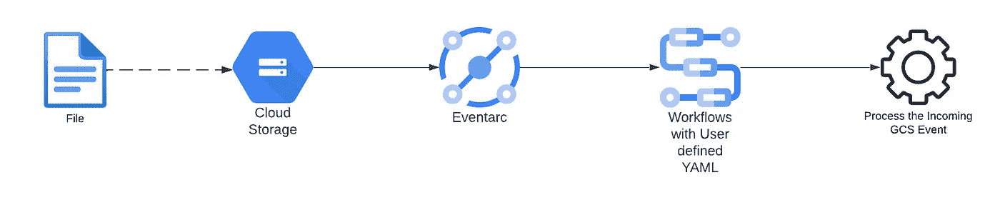

# Google 云工作流 Terraform 模块

> 原文：<https://medium.com/google-cloud/google-cloud-workflows-terraform-module-cfe91a257cf?source=collection_archive---------2----------------------->

*本* ***博客*** *对*[*terraform-Google-cloud-workflows*](http://terraform-google-cloud-workflows)*模块进行了高度概述。在这个博客中，我们将展示一些可以使用这个模块的用例。除此之外，我们将展示一些使用模块的例子。*

# 介绍

想要在 GCP 上实施 IT 流程自动化、业务流程自动化、应用集成和微服务编排、数据和 ML 管道的客户可以使用[云工作流 Terraform 模块](https://github.com/GoogleCloudPlatform/terraform-google-cloud-workflows)来实施。该模块在 GCP 上部署云工作流，该工作流可以由[云调度器](https://cloud.google.com/scheduler)触发，或者基于[事件弧](https://cloud.google.com/eventarc)触发。这将通过结合谷歌云服务和 API 来构建可靠的应用程序、流程自动化以及数据和机器学习管道，遵循基础设施即代码原则，从而使用户受益。

*   [**Google Cloud Workflows**](https://cloud.google.com/workflows/docs/overview)是一个完全托管的编排平台，按照您定义的顺序执行服务:一个*工作流*。这些工作流可以组合服务，包括托管在 Google 云服务上的定制服务，如 Cloud Run、Cloud Functions、Cloud Vision AI、BigQuery 等。或者任何基于 HTTP 的 API。
*   [**云调度器**](https://cloud.google.com/scheduler) 是一款完全托管的企业级 cron 作业调度器。它允许您安排几乎任何作业，包括批处理、大数据作业、云基础架构操作等。
*   [**Eventarc**](https://cloud.google.com/eventarc/docs) 让您能够使用响应状态变化的松散耦合服务，从谷歌服务、SaaS 和您自己的应用程序异步交付事件。Eventarc 不需要基础架构管理，您可以优化生产效率和成本，同时构建一个现代化的事件驱动型解决方案。

# 用例

有几个用例可以使用与云调度程序或事件 Arc 集成的云工作流 terraform 模块

*   **服务编排** : *通过组合服务来创建解决方案* —跨多个系统执行一系列操作，等待所有操作完成。可以由事件驱动。
*   **批处理作业** : *操作多个项目*——对一组项目或批处理数据进行操作。经常预定。例如:
*   **业务流程** : *自动化业务线工作流* —对业务流程中的步骤进行编码，包括条件、操作和人在回路事件。
*   **IT 流程自动化:** *服务操作的托管执行* —轻松编写 Google 云服务操作的脚本序列。

# Terraform 模块详情

以下是运行 terraform 工作流模块所需的变量。

**workflow_trigger** 变量定义了工作流的触发器。这将让用户定义**云调度器或事件弧触发器。下面是相同的 terraform 变量模式。**

## 定义云调度程序触发器

要将云调度程序定义为触发器，用户必须使用 *cloud_scheduler* 创建一个带有以下参数的映射

*   ***名称*** :云调度器名称
*   ***cron***:[cron job 格式](https://cloud.google.com/scheduler/docs/configuring/cron-job-schedules)进度表
*   ***time_zone*** :运行 cron 的时区
*   ***截止日期*** :作业尝试的截止日期
*   ***Service _ Account _ email***:运行云调度器的服务账号。

下面是一个例子

## 定义事件电弧触发器

要将事件弧定义为触发器，用户必须使用 *cloud_scheduler* 和以下参数创建地图

*   ***名称*** :事件电弧触发名称
*   ***Service _ Account _ email***:运行事件 Arc 触发器的服务账号。
*   ***匹配条件* :** 事件电弧触发的过滤条件。这是一个数组。因此，可以定义多个匹配标准。

下面是一个例子

# 模块使用示例

## 1.安排工作流调用 REST API

**云调度程序触发工作流**

要实现，请参考使用[地形模块](https://github.com/GoogleCloudPlatform/terraform-google-cloud-workflows)安排工作流的[示例](https://github.com/GoogleCloudPlatform/terraform-google-cloud-workflows/tree/main/examples/schedule_workflow)。在这个例子中，我们有一个基于 cron ***/3 * * * *调用 REST API 的工作流。**

**带调度器的云工作流**

> 在运行上述示例时，将创建一个调度器和工作流。工作流将使用云调度器作为触发器。

## 2.GCS 新对象事件触发工作流

**事件弧事件触发工作流程**

要实现，请参考[示例](https://github.com/GoogleCloudPlatform/terraform-google-cloud-workflows/tree/main/examples/schedule_workflow)，该示例使用 [terraform 模块](https://github.com/GoogleCloudPlatform/terraform-google-cloud-workflows)通过事件弧**基于在某个 GCS 桶中创建的新对象触发工作流。**

**在新 GCS 对象上触发事件弧的云工作流**

> 在运行上述示例时，您将创建一个事件 Arc 触发器和工作流。事件 Arc 触发器的事件类型为**Google . cloud . storage . object . v1 . finalized**。工作流将事件 Arc 触发器作为其触发器。

## 3.触发工作流的发布订阅事件

**云工作流，在新发布的消息上触发事件弧**

要实现，请参考[示例](https://github.com/GoogleCloudPlatform/terraform-google-cloud-workflows/tree/main/examples/pubsub_event_arc_trigger_workflow)，该示例使用 [terraform 模块](https://github.com/GoogleCloudPlatform/terraform-google-cloud-workflows)来触发基于通过事件弧**发布到 Pubsub 的新消息的工作流。**

**云工作流，在新发布的消息上触发事件弧**

> 在运行上述示例时，您将创建一个事件 Arc 触发器和工作流。事件 Arc 触发器的事件类型为**Google . cloud . pubsub . topic . v1 . message published**。工作流将事件 Arc 触发器作为其触发器。

# 结论

*总之，用户可以使用*[***terraform-Google-cloud-workflows***](http://terraform-google-cloud-workflows)*来部署工作流，同时触发* ***云调度*** *或* ***事件弧触发*** *。上面显示的例子应该可以帮助用户实现他们自己的工作流。*

*如对*[***terraform-Google-cloud-workflows***](http://terraform-google-cloud-workflows)**模块* *有任何顾虑或问题，请在此*****。*****