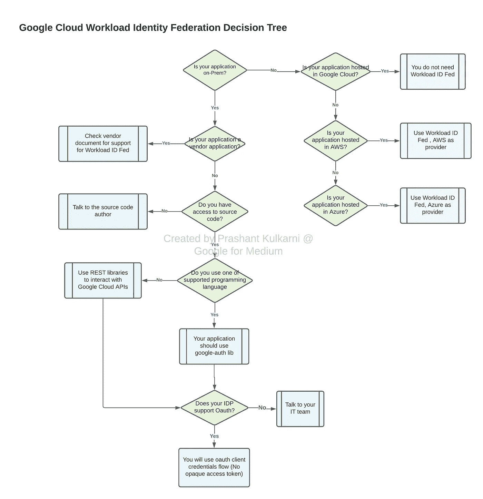
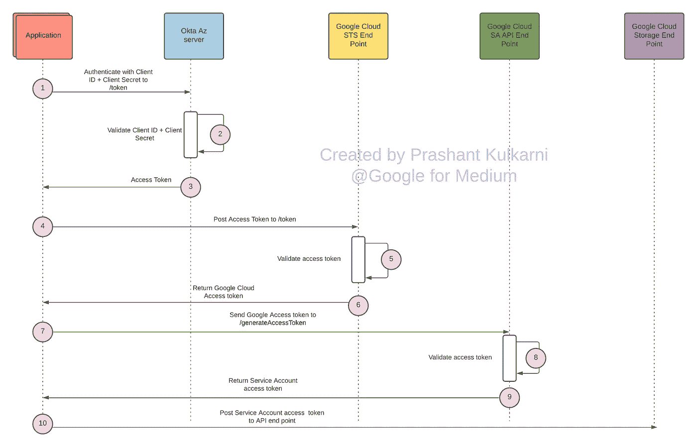
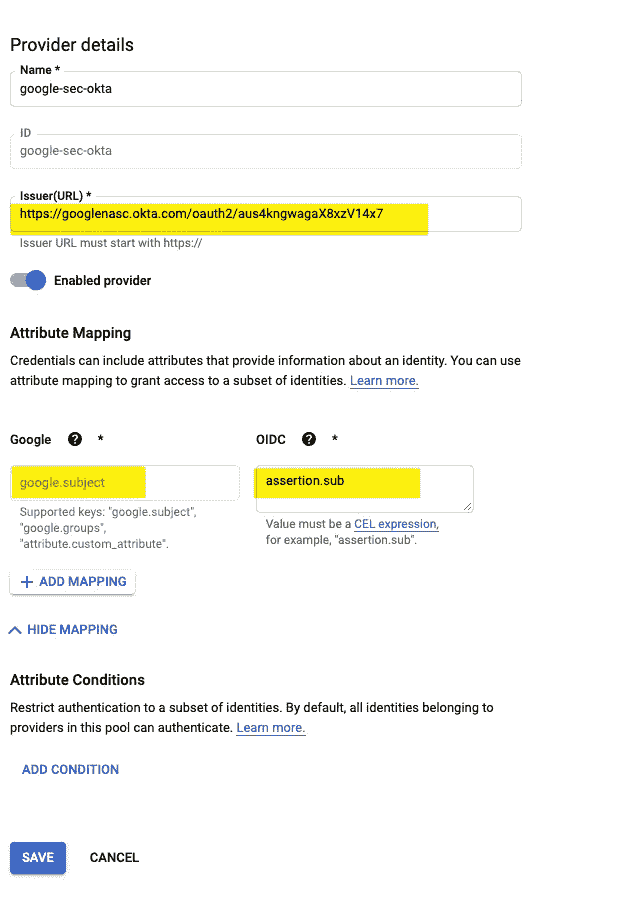

# 使用 Okta 的 Google 云工作负载身份联盟

> 原文：<https://medium.com/google-cloud/google-cloud-workload-identity-federation-with-okta-90c05b985b17?source=collection_archive---------0----------------------->

如果你是 Workload Identity Federation 的新手，可以看看 Scalesec 的[这篇](/google-cloud/keyless-api-authentication-launching-gcp-workloads-from-aws-b715b4e6c99a)中型文章和[这篇](https://blog.scalesec.com/access-gcp-from-aws-using-workload-identity-federation-829113ef0b69)博客。基本上，Workload Identity Federation 将允许您连接到 Google Cloud APIs，而无需使用来自 Google Cloud 外部的服务帐户密钥。这降低了密钥泄漏或误用的风险，并消除了混合云或多云集成中的最大障碍之一。

工作负载身份联合并不适合所有场景。下面是一个简单的流程图，描述了为您的应用程序选择工作负载身份联合的过程。



在本文中，我们将假设:

*   您有需要查询 Google Cloud APIs 的应用程序的源代码
*   你用 Okta 作为你的 OIDC 供应商
*   您正在使用一种受[支持的](https://cloud.google.com/iam/docs/using-workload-identity-federation#generate-automatic)编程语言用于 google-auth 库

# OAuth 流

我们将使用客户端凭证流(在 [OAuth 2.0 RFC 6749 第 4.4 节](https://tools.ietf.org/html/rfc6749#section-4.4)中定义)，其中您的应用程序将传递客户端 ID 和客户端密码来验证应用程序本身并获得令牌。为什么？对于在后端运行的机器对机器(M2M)应用程序，如 CLI、守护程序或服务，系统会对应用程序而不是用户进行身份验证和授权。对于这种情况，用户名+密码或社交登录等典型的身份验证方案没有意义。相反，M2M 应用程序使用 OAuth 客户端凭证流。

这是在这种情况下会发生的数据流



# 准备 Okta 以发布客户端凭据的步骤

Okta 有一个授权服务器的概念，需要它来发布客户机凭证。在我的测试实例中，我必须创建一个新的授权服务器，这样我就可以获得一个访问令牌。

1.  登录 Okta 管理控制台
2.  转到安全性->API
3.  授权服务器
4.  定义一个新的授权服务器，记下发行者 URL——您将需要它来配置 Google Cloud 中的 OIDC 提供者
5.  设置受众(可以是任何可以相互验证的东西，最好是唯一的)，记录受众——您将需要这些来配置 Google Cloud 中的 OIDC 提供商
6.  定义一个新范围，将此范围设置为默认范围
7.  定义新的索赔。根据您对 Google Cloud 中的[属性验证](https://cloud.google.com/iam/docs/configuring-workload-identity-federation#mappings-and-conditions)的需求定制此声明
8.  转到访问策略，确保它被分配到“所有客户端”

# Google 云设置

为 Okta 创建一个工作负载身份池和一个新的提供者。由于谷歌云 OIDC 提供商不允许设置 aud 值，您需要通过 gcloud 执行第 3 步。其他步骤可以使用控制台执行。

1.  g cloud iam workload-identity-pools create workload-id-pool 1-location = " global "--description = " Testing workload identity Federation with Okta "--display-name = " workload-id-pool 1 "
2.  g cloud iam workload-identity-pools providers create-oidc okta-provider-workload-identity-pool = " workload-id-pool 1 "-issuer-uri = "<okta-issuer-url>"-location = " global "-attribute-mapping = " Google . subject = assertion . sub "-allowed-accessories = "<enter client_id="">"</enter></okta-issuer-url>
3.  g cloud iam service-accounts add-iam-policy-binding oktagcpsvacct @ PS-test-project-259122 . iam . gserviceaccount . com-role = roles/iam . workloadidentityuser-member = " principal://iam . Google APIs . com/projects/731056981369/locations/global/workloadIdentityPools/workload-id-pool-1/subject/**<authz-server-sub>**
4.  g cloud beta iam workload-identity-pools providers update-oidc vz-SSO-oid C2-allowed-accessories = " API://24 WDS 23 "-workload-identity-pool = " workload-id-pool 1 "-location = " global "

使用此 gcloud 命令验证 aud 和 sub 设置是否正确

g cloud iam workload-identity-pools providers 描述 okta-provider-workload-identity-pool = " workload-id-pool 1 "-location = " global "



2.下载 JSON 配置文件并存储在应用程序存储库中。这个文件可以与应用程序一起存在，因为它没有像私钥这样的机密数据。

JSON 配置文件如下所示:

```
{
  "type": "external_account",
  "audience": "//iam.googleapis.com/projects/794301636481/locations/global/workloadIdentityPools/okta-pool-1/providers/google-sec-okta",
  "subject_token_type": "urn:ietf:params:oauth:token-type:jwt",
  "token_url": "[https://sts.googleapis.com/v1/token](https://sts.googleapis.com/v1/token)",
  "service_account_impersonation_url": "[https://iamcredentials.googleapis.com/v1/projects/-/serviceAccounts/oktagcpsvacct@ps-test-project-259122.iam.gserviceaccount.com:generateAccessToken](https://iamcredentials.googleapis.com/v1/projects/-/serviceAccounts/oktagcpsvacct@ps-test-project-259122.iam.gserviceaccount.com:generateAccessToken)",
  "credential_source": {
    "file": "/tmp/okta-token.json",
    "format": {
      "type": "json",
      "subject_token_field_name": "access_token"
    }
  }
}
```

正如您所看到的，这个新的 json 文件看起来与原始的密钥 JSON 文件非常不同。这个 json 文件指示 google-auth 库对 STS 和服务帐户使用什么端点，以及如何查找工作负载标识池。json 文件中的受众值不需要在 Okta 内匹配。只要受众在 Okta 授权服务器中配置了，提供者和 JWT 令牌匹配，我们就好了。

这个 json 文件还指示 google-auth 库在哪里可以找到 Okta access toke jsons，所以要确保“file”参数包括 json 文件的路径和文件名，如上所示。

下面是一个示例客户机代码，它查询 Okta 以获得一个访问令牌，存储在文件系统中，并在客户机程序运行完毕后删除它。