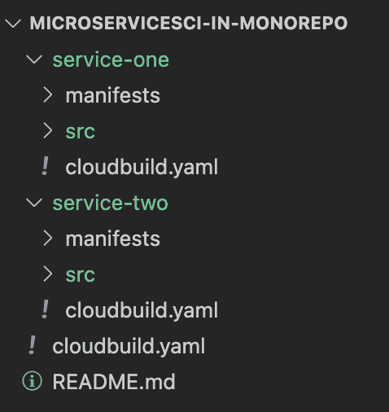

# Google CloudBuild:在 MonoRepo 中构建特定的微服务

> 原文：<https://medium.com/google-cloud/google-cloudbuild-build-specific-micro-services-in-a-monorepo-63a7f961ac63?source=collection_archive---------0----------------------->

# Google CloudBuild:在 MonoRepo 中构建特定的微服务

最近，我遇到了一个团队，他们试图从头开始构建一个基于微服务的应用程序(大约 25-30 个服务)。他们还打算利用 [**CloudBuild**](https://cloud.google.com/build) 的能力及其卓越的特性，并将其作为他们 DevOps 管道的事实。

出现的第一个问题是代码回购策略应该是什么？一开始应该是 [**单回购**](https://en.wikipedia.org/wiki/Monorepo) 还是**多回购**(每个微服务一个回购)。在讨论了两者的利弊之后，我们达成了使用 MonoRepos 的协议。我“个人”更喜欢 MonoRepo 作为任何新应用程序开发的默认代码源回购策略。

下一个任务是建立一个新的管道——第一步是建立一个云触发器，一旦特性分支中的代码发生变化，它就会提交一个构建。最直接的问题是——有没有什么流程可以让云构建只为那些代码已更改的服务进行构建？

答案是肯定的，你可以通过下面的方法来实现。

假设您的 MonoRepo 目录结构如上图所示。您有两个微服务 service-one 和 service-two，每个都有自己的 cloudbuild.yaml 文件、k8s 清单文件、src 文件夹等..

此外，在根目录中有一个 cloudBuild 文件(下面是 src ),它将由云构建管道触发。这个 cloudBuild 将识别在其中进行更改的微服务，并且只构建特定的服务。

这个云构建包含两个步骤。

**步骤 1:** 使用 git builder 并执行一个 diff，它将提供完成更改的目录。

因为 Cloud Build 执行 repo 的浅层克隆，这意味着在要构建的工作区中只签出启动构建的单个提交，而不签出任何其他分支或历史。因此，您需要运行一个 git fetch — depth=2 origin main

命令，然后运行 git Diff。git diff 的输出被写入本地工作区的一个文件中，以便可以传递给下一步。

**步骤 2:** 使用 gcloud builder 并逐行读取我们在步骤 1 中保存的文件的输出。由于特定的云构建文件存储在每个微服务文件夹下的根目录下，我们使用“${line}/cloudbuild.yaml”构建云构建配置路径，然后使用 gcloud submit 命令提交构建。

一旦微服务构建完成，特定的微服务构建被触发，并且流水线完成。

你可以在这里找到样品代码 [**。**](https://github.com/ajiteshk/MicroServicesCI-In-MonoRepo)