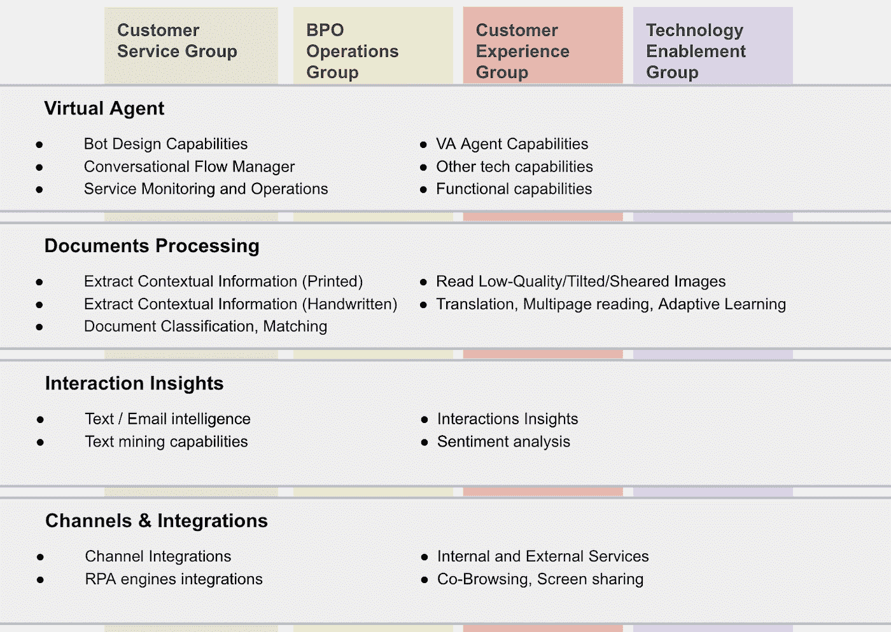
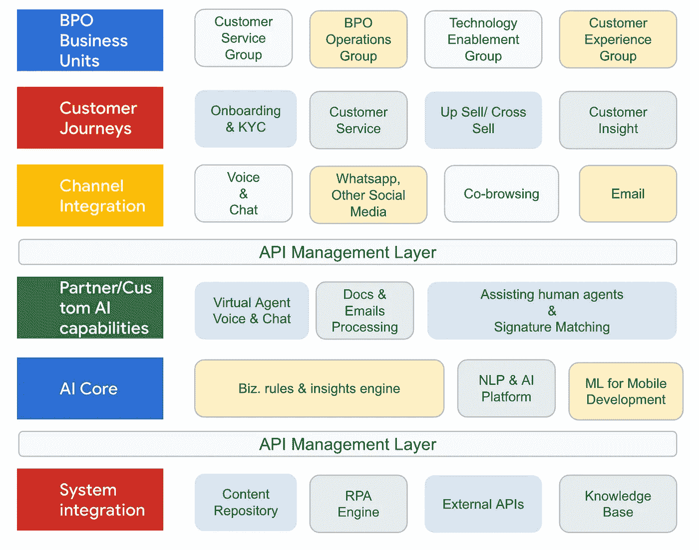

# Google Cloud 的 BPOs 流程自动化框架

> 原文：<https://medium.com/google-cloud/google-clouds-process-automation-framework-for-bpos-d4607a10bd2c?source=collection_archive---------0----------------------->

> 在印度 BPOs 面临的所有挑战中，邻居争夺外包蛋糕似乎是最大的挑战。曾几何时，印度是大多数全球企业 BPO 服务的主要目的地。然而，随着菲律宾、马来西亚、加拿大和中国等新进入者进入这一行业，这种情况发生了变化。在竞争激烈的市场中取胜的策略是大幅降低成本。顶级 BPO 的首席信息官们正在采用自动化来实现这一目标。**首席信息官们正在这两个方面进行转型**。

**手动流程的重新设计** —人工代理的电话呼叫/聊天处理、文档处理和签名匹配等手动流程非常耗时，并增加了人力成本。为了避免这种情况，BPO 正在采用机器人流程自动化(RPA)。利用 RPA，目标是开发虚拟客户助理、交互洞察、人工代理助理等等。

*   预期成果:减少劳动力和相关成本，提高员工生产率和准确性，增加周转时间(TAT)和运营效率

**全渠道的兴起** —如今，客户通过各种媒介与组织联系，并期望获得最佳体验。为了实现这一点，BPO 正在构建基于人工智能的自动化平台，以整合语音、基于网络的聊天、电子邮件、社交、移动和其他媒体。

*   预期成果:跨渠道的卓越客户体验，保持无缝信息流，提高客户忠诚度。

上述主题是相互关联的。要实现全渠道体验，RPA 是必须的，反之亦然。为了实现流程自动化并提供全渠道体验，各种 BPO 职能所需的关键**能力如下:**

展示来自 Google Cloud 的**流程自动化框架**来满足这些功能:

结构

*   **BPO 业务单元** —这些是从框架中需求能力的组。
*   **客户之旅** —该框架帮助 BPO 在其客户之旅中实现 KYC &入职自动化，通过追加销售和交叉销售增加收入，改善客户体验。它还帮助 BPO 从客户数据中获得深刻的洞察力。
*   **渠道整合** —该框架侧重于跨渠道整合，以了解客户需求并提供统一的响应。
*   **系统集成** —将与 AI 核心系统集成的现有系统是内容库、内部&外部 API 和 RPA 引擎。
*   **API 管理层** —框架中的 API 管理层提供了一个构建、部署、管理和监控 API 的平台。
*   **AI 核心&定制 AI 能力**——这是框架的核心。该层提供下述功能。

一个人工智能，它提供了一系列技术

*   **通过聊天/语音机器人和电话服务台解决您客户的需求。**联系中心使用人工智能的虚拟代理理解、互动并改善客户服务。这些代理可以在几分钟内建立起来，并提供 24x7 的全渠道体验。这些代理还可以处理补充问题，并可以在主题之间无缝切换。代理在很大程度上减少了人为干预，有助于降低成本。
*   **通过识别意图并提供实时、逐步的帮助，使人工代理在通话和聊天过程中获得持续支持。**当 AI 应用于现有资源时，它通过记录客户呼叫，从知识库中寻找答案来帮助人工代理，从而减少客户与人工代理交谈时的等待时间。
*   **利用自然语言处理识别呼叫驱动因素和情感**帮助联络中心经理了解客户互动，以改善呼叫结果。借助人工智能，合规团队可以调查有问题的对话，分析师的工作效率也得到了提高。
*   **为 IOT 系统和定制硬件提供支持**。文本到语音、语音到文本和 NLP APIs 可以很好地与信息亭和汽车导航系统集成。

利用谷歌的对话式人工智能， [**M & S**](https://cloud.google.com/customers/marks-and-spencer) 通过路由超过 700 万个电话将商店电话量**减少了 50%。使用谷歌云， [**汇丰银行**](https://cloud.google.com/customers/hsbc) 开发了一个自然语言处理解决方案来**审查粤语-英语联络中心的对话。****

一个人工智能，**大规模自动化数据捕获，以降低文档处理成本。**

*   RPA 可以**从非结构化数据**(图像)中提取结构化数据，并将其提供给业务应用程序和用户。
*   RPA 可以通过 AI 自动化和验证您的所有文档，从而**提高数据准确性。签名匹配等任务可以转移到 RPA。**
*   RPA 可以利用洞察力**提高 CSAT、客户终身价值(CLTV)和支出**。

利用谷歌的 Doc AI， **UnifiedPost** 将采购到支付处理成本的总拥有成本**降低了高达 60%** ，并将数据准确性**提高了 250%** 。

> 我看到了流程自动化框架如何改变 BPO 行业，并使 BPO 实现再造人工流程的目标和全渠道崛起的目标。流程自动化框架通过降低成本和增加收入来改变许多这样的 BPO，从而在这个高度竞争的世界中茁壮成长。我很高兴看到您利用这一框架解决了什么问题并实现了什么转变。