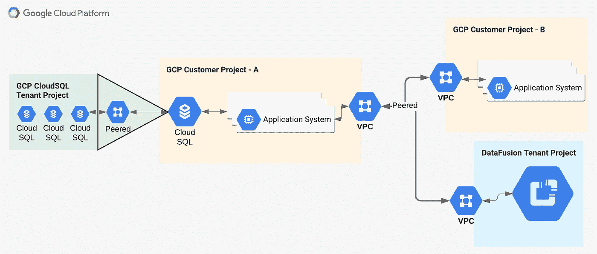
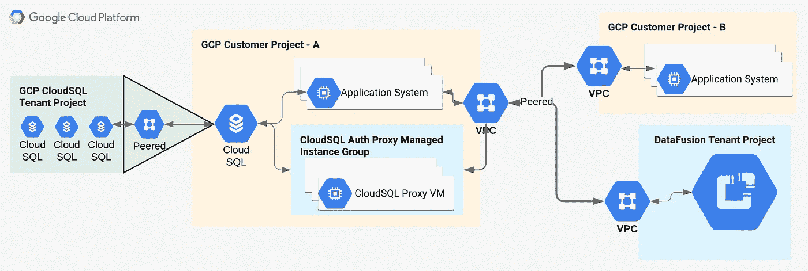
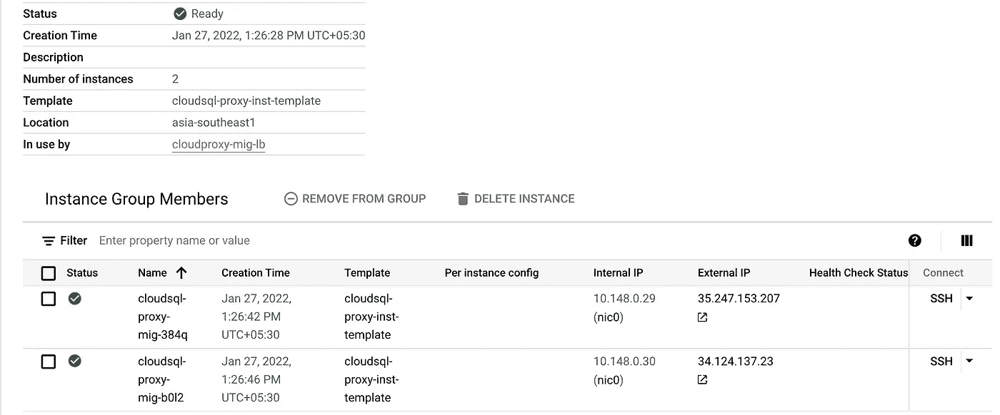
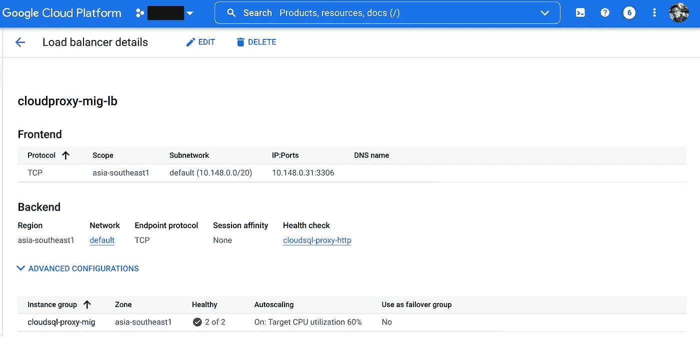

# Google CloudSQL 身份验证代理——一种弹性方法

> 原文：<https://medium.com/google-cloud/google-cloudsql-auth-proxy-a-resilient-approach-e61c3d150cd9?source=collection_archive---------0----------------------->

*让我们拨开围绕* ***CloudSQL Auth Proxy 的迷雾。***

**Google** [**云 SQL 授权代理**](https://cloud.google.com/sql/docs/mysql/sql-proxy) 是一个二进制文件，在连接到云 SQL 实例时提供基于 IAM 的授权和加密。应用程序使用数据库使用的标准数据库协议与云 SQL 身份验证代理进行通信，云 SQL 身份验证代理使用安全隧道与其在服务器上运行的伙伴进程进行通信。

> 围绕它有许多常见误解，这篇博客的主要目的是提供一个事实核查。

## 一些常见的误区:

1.  用户主要担心的一个问题是，CloudSQL 代理将成为单点故障，因此不符合他们的高可用性战略。
2.  如果需要连接到多个数据库实例，则需要多个 CloudSQL 代理实例。
3.  使用 CloudSQL 代理会导致网络出口费用，因为它将连接到公共 IP 上的 CloudSQL 实例，因此会增加安全风险，因为 CloudSQL 实例暴露于公共网络。

> 现在，这里没有给出直接的答案*(没有一个神话是真的😉)*让我们借助真实世界的用例来缓解这些误解。

U **se-Case:** 假设一个组织托管在 Google 云平台上，同时利用 CloudSQL MySQL&CloudSQL Postgres 引擎，该引擎附加到他们的项目 A。现在，托管在项目 B 中的其他业务部门的应用程序及其自己的 VPC 想要连接到项目 A 的 CloudSQL 实例，因此，项目 B VPC 与项目 A VPC 对等。此外，组织需要低代码数据分析平台，他们决定使用 Google Cloud DataFusion 来实现这一点。



根据设计，Google CloudSQL 托管在一个内部项目中，该项目通过私有服务连接到 Project-A，同样，DataFusion 也托管在一个单独的项目上，该项目需要作为设置的一部分与 Project-A 进行对等。现在，由于 VPC 网络对等不可传递，Project-B 实例无法与 CloudSQL 实例通信，DataFusion 实例也无法直接与 CloudSQL 实例通信。

这就是 CloudSQL Auth Proxy 的用武之地，为了消除上述误解，下图显示了部署的最佳实践。



用户可以将 CloudSQL Auth Proxy 配置为 CloudRUN 服务或托管实例组中的系统服务，托管实例组位于内部负载平衡器之后，并连接到多个 CloudSQL 实例。下面是实现这一目标的高级步骤:

*   供应一个微实例，安装 CloudSQL 代理，并将其配置为与多个 CloudSQL 实例连接。

```
**root@cloudsql-proxy-inst:/etc/systemd/system#** cat sql_proxy.service 
[Unit]
Description=CloudSQL Proxy Service[Service]
Type=simple
User=ravishgarg
Group=ravishgarg
WorkingDirectory=/home/ravishgarg
ExecStart=/home/ravishgarg/cloud_sql_proxy -instances=xxxxx:asia-southeast1:mysql-inst=tcp:0.0.0.0:3306,xxxxx:asia-southeast1:pgdb-inst=tcp:0.0.0.0:5432 -ip_address_types='PRIVATE' -use_http_health_check
Restart=always[Install]
WantedBy=multi-user.target**root@cloudsql-proxy-inst:/etc/systemd/system#** systemctl daemon-reload
**root@cloudsql-proxy-inst:/etc/systemd/system#** systemctl enable sql_proxy.service
**root@cloudsql-proxy-inst:/etc/systemd/system#** systemctl start sql_proxy.service
**root@cloudsql-proxy-inst:/etc/systemd/system#** systemctl status sql_proxy.service
● *sql_proxy.service - CloudSQL Proxy Service
     Loaded: loaded (/etc/systemd/system/sql_proxy.service; enabled; vendor preset: enabled)
     Active: active (running) since Sat 2022-01-29 09:48:37 UTC; 7s ago
   Main PID: 12378 (cloud_sql_proxy)
      Tasks: 7 (limit: 1159)
     Memory: 13.9M
     CGroup: /system.slice/sql_proxy.service
             └─12378 /home/ravishgarg/cloud_sql_proxy -instances=xxxxx:asia-southeast1:mysql-inst=tcp:0.0.0.0:3306,xxxxx>**Jan 29 09:48:37 cloudsql-proxy-inst systemd[1]: Started CloudSQL Proxy Service.
Jan 29 09:48:37 cloudsql-proxy-inst cloud_sql_proxy[12378]: 2022/01/29 09:48:37 Rlimits for file descriptors set to {Curren>
Jan 29 09:48:40 cloudsql-proxy-inst cloud_sql_proxy[12378]: 2022/01/29 09:48:40 Listening on 0.0.0.0:3306 for raves-ce:asia>
Jan 29 09:48:40 cloudsql-proxy-inst cloud_sql_proxy[12378]: 2022/01/29 09:48:40 Listening on 0.0.0.0:5432 for raves-ce:asia>
Jan 29 09:48:40 cloudsql-proxy-inst cloud_sql_proxy[12378]: 2022/01/29 09:48:40 Ready for new connections
Jan 29 09:48:40 cloudsql-proxy-inst cloud_sql_proxy[12378]: 2022/01/29 09:48:40 Generated RSA key in 250.630103ms*
```

让我们来理解这个命令:

*   ***-实例:*** 支持逗号分隔的实例列表，这些实例可以通过 TCP 端口或重命名默认的 Unix 域套接字来公开。
*   ***-ip 地址类型:*** 用于连接实例的首选 ip 类型的命令分隔。就像在我们的用例中，我们要求 CloudSQL Auth Proxy 仅使用私有 IP 连接到 CloudSQL 实例。
*   ***-use _ http _ health _ check:***除了探测 CloudSQL 代理监听的 TCP 端口，还可以为代理启用 HTTP 健康检查，包括启动、活动和就绪探测。默认健康检查端口为 8090，但也可以使用*-健康检查端口*标志进行配置。
*   根据需要为 CloudSQL Auth Proxy 实例的自动扩展和自动修复设置托管实例组。



**谷歌云托管实例组**

*   设置一个内部负载平衡器，通过它，来自其他对等项目的应用程序可以连接到各自的 CloudSQL 实例。



**谷歌云内部负载均衡器**

因此，这里我们有一个高度可用的云代理设置，通过私有 IP 地址连接到多个 CloudSQL 实例。

## 使用 CloudSQL Auth 代理的一些额外优势:

*   **安全连接:**云 SQL 身份验证代理使用 TLS 和 128 位 AES 密码自动加密进出数据库的流量。SSL 证书用于验证客户端和服务器的身份，并且独立于数据库协议；您不需要管理 SSL 证书。
*   **更简单的连接授权:**云 SQL 授权代理使用 IAM 权限来控制谁和什么可以连接到您的云 SQL 实例。因此，云 SQL 身份验证代理使用云 SQL 处理身份验证，无需提供静态 IP 地址。
*   **IAM 数据库认证**。或者，云 SQL Auth 代理支持 OAuth 2.0 访问令牌的自动刷新。有关此功能的信息，请参见[云 SQL IAM 数据库认证](https://cloud.google.com/sql/docs/mysql/authentication)。

## 参考资料:

[](https://cloud.google.com/sql/docs/mysql/sql-proxy) [## 关于云 SQL 身份验证代理 MySQL 的云 SQL | Google Cloud

### 此页面提供了云 SQL 身份验证代理的基本介绍，并描述了代理选项。对于循序渐进的…

cloud.google.com](https://cloud.google.com/sql/docs/mysql/sql-proxy) [](https://github.com/GoogleCloudPlatform/cloudsql-proxy) [## GitHub-Google Cloud platform/Cloud sql-proxy:云 SQL 代理客户端和 Go 库

### 云 SQL 身份验证代理是一个二进制文件，在连接到云时提供基于 IAM 的授权和加密…

github.com](https://github.com/GoogleCloudPlatform/cloudsql-proxy)