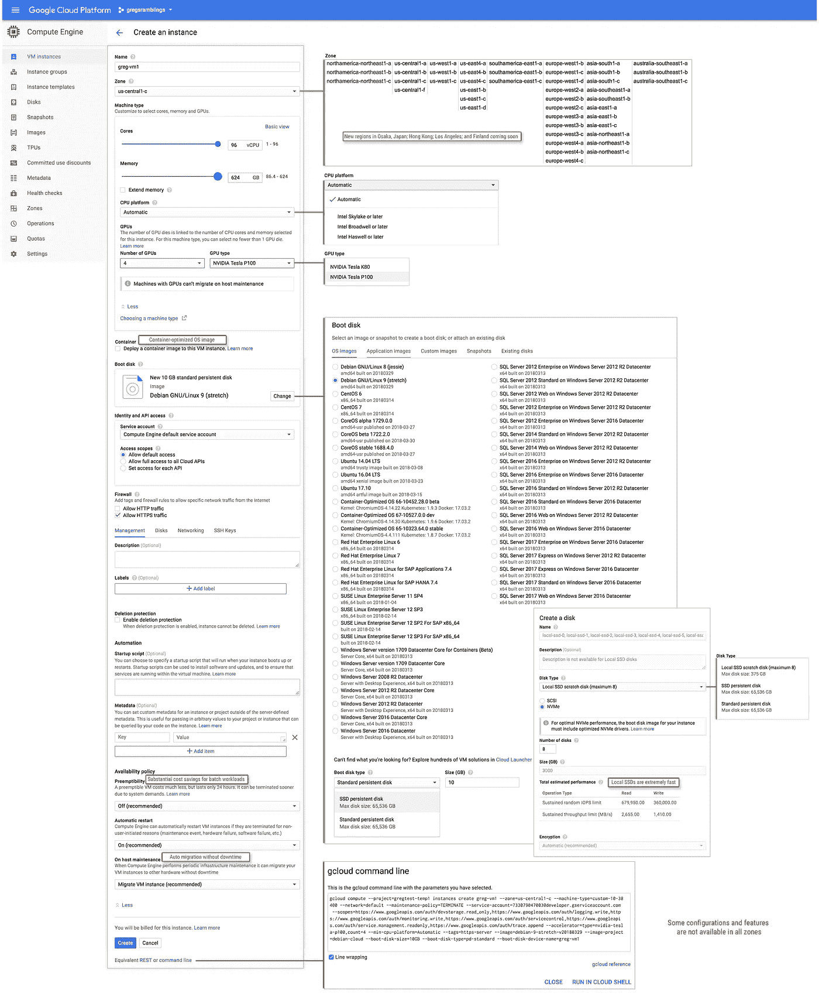

# Google 计算引擎——创建实例对话框的分解图

> 原文：<https://medium.com/google-cloud/google-compute-engine-exploded-view-of-the-create-instance-dialog-db26f4b14881?source=collection_archive---------0----------------------->

随着 Kubernetes engine、Cloud ML、BigQuery、Spanner 和其他 Google 云产品的出现，人们很容易忽略 Compute Engine 自 2012 年发布以来已经变得多么令人惊叹。

当我向朋友展示计算引擎时，我通常会带他们浏览“创建实例”对话框。我通常能让他们在几秒钟后说“哦，哇”。一个对话框胜过千言万语，所以我整理了下面这个创建实例对话框的分解图:

谷歌计算引擎创建实例对话框截至 2018 年 4 月 2 日

这些对话是在 2018 年 4 月 2 日捕获的，它们一直在发展。例如，我们最近宣布了 NVIDIA Tesla P100 GPU，添加了新的区域和分区，添加了 SQL Server 2017 的图像等。，所以如果已经过了几个星期，请检查真实的对话框以了解最新的功能。

另请注意，许多配置和功能并非在所有区域和所有组合中都可用(例如，如果您有本地连接的 SSD，则不能使用自动迁移)。

还有一些静态对话框截图无法显示的功能，比如超级快速的启动时间和 SSD 性能，所以请检查一下。

了解更多信息的链接:

*   [计算机引擎主页](https://cloud.google.com/compute/)
*   [计算引擎文档](https://cloud.google.com/compute/docs/instances/create-start-instance)
*   [谷歌云平台 YouTube 频道上的计算引擎视频](https://www.youtube.com/user/googlecloudplatform/search?query=compute+engine)