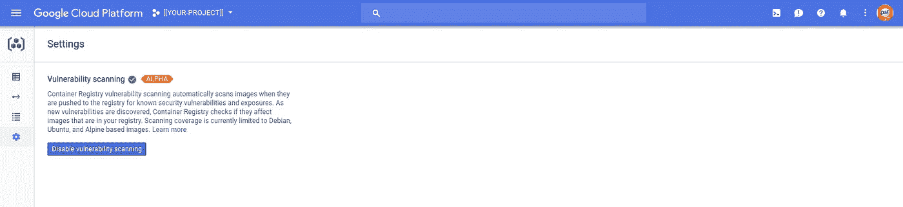
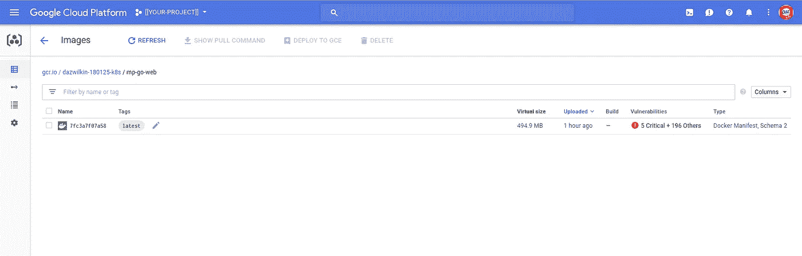
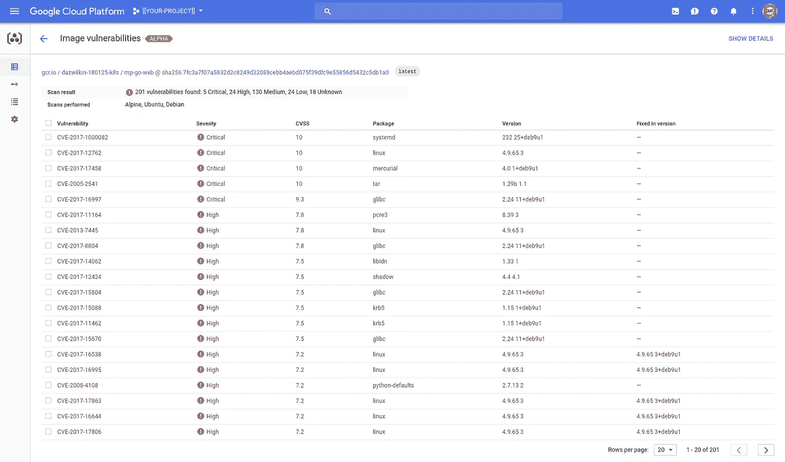

# 谷歌容器注册

> 原文：<https://medium.com/google-cloud/google-container-registry-4aca1fc6cf74?source=collection_archive---------0----------------------->

## 快速命中

[谷歌容器注册中心](http://cloud.google.com/container-registry) (GCR)是一个引人注目的私有(安全)容器注册中心(目前也包括免费的——如啤酒— [漏洞扫描](https://cloud.google.com/container-registry/docs/vulnerability-scanning#activating_vulnerability_scanning)

如果你在谷歌云平台计算( [App Engine Flex](https://cloud.google.com/appengine/docs/flexible/) 、 [Kubernetes Engine](https://cloud.google.com/kubernetes-engine/) )上运行容器化的工作负载，或者在[计算引擎](https://cloud.google.com/compute/docs/containers/)上运行你自己的容器，当你可以保持快速和本地时，为什么要离开谷歌的网络去推拉容器呢？

像所有 GCP 服务一样，GCR 是安全的。这意味着，当您使用它时，您需要对回购进行认证。所以，常见的[模式](https://cloud.google.com/container-registry/docs/pushing-and-pulling)是:

```
PROJECT=[[YOUR-PROJECT]]docker tag $(whoami)/my-image gcr.io/${PROJECT}/my-image
gcloud docker -- push gcr.io/${PROJECT}/my-image
```

gcloud 命令包装 docker CLI 来为 GCR 提供身份验证，以便您可以将映像推送到它那里。谷歌服务可以安全地与 GCR 对话，所以，例如，在 Kubernetes，你可以直接通过它的 GCR 名字来引用图片。

但是，如果您不能或不想使用 docker 的 gcloud wrappers，会发生什么呢？如果您使用的库假设 docker 将直接执行推/拉操作，那该怎么办？GCR 有多种方式让你实现这个目标。我将向你展示最简单的:

```
PASSWORD=$(gcloud auth application-default print-access-token)
docker login \
  --username=oauth2accesstoken \
  --password=${PASSWORD} \
  [https://gcr.io](https://gcr.io)
```

或者，为了避免安全“警告！”，您可能更喜欢:

```
echo $(gcloud auth application-default print-access-token) \
| docker login \
  --username=oauth2accesstoken \
  --password-stdin \
  [https://gcr.io](https://gcr.io)
```

现在，虽然您需要继续为 GCR 适当地标记图像，但是您可以直接对它们使用 docker push 和 pull:

```
docker tag $(whoami)/my-image gcr.io/${PROJECT}/my-image
docker push gcr.io/${PROJECT}/my-image
```

而且，如果您有工具或代码采用 Docker(而不是[Google Cloud SDK](https://cloud.google.com/sdk/)aka g Cloud)，只要您将“docker.io”注册表引用替换为“gcr.io/${PROJECT}”引用，它现在就会按预期运行。

> **注意** GCR 是 GCP 项目特定的，因此有${PROJECT}参考。一种常见的做法是将一个项目指定为您的团队、组织或公司的容器注册中心，然后这就成为一个确定的名称。谷歌就是这么做的。例如，Google Container Builder 在一个名为“云构建者”的项目中托管了 Google 提供的“步骤”,这样所有的图片都可以从"gcr.io/cloud-builders"获得。

## 容器注册表的 Docker Hub 镜像

这让我想到了 GCR 的第二个有用的见解。我今天了解到，谷歌为经常被请求的图片提供了 Docker Hub 的镜像。您可以配置 Docker 守护进程在回退到 Docker Hub 之前检查 GCR 的映像(节省时间)。

[https://cloud . Google . com/container-registry/docs/using-docker hub-mirroring](https://cloud.google.com/container-registry/docs/using-dockerhub-mirroring)

整洁！

## 集装箱脆弱性分析

最后，我提到了 GCR 提供了一个新的漏洞分析功能。文档在这里。这目前还处于 Alpha 阶段，因此您需要做一些准备工作来让它运行起来:

[https://cloud . Google . com/container-registry/docs/vulnerability-scanning # activating _ vulnerability _ scanning](https://cloud.google.com/container-registry/docs/vulnerability-scanning#activating_vulnerability_scanning)

```
PROJECT=[[YOUR-PROJECT]]gcloud services enable containeranalysis.googleapis.com \
--project=$PROJECT 
```

并且:



漏洞扫描

然后:



图像现在包括“漏洞”

此外，还可以深入细节:



有些工作要我做！