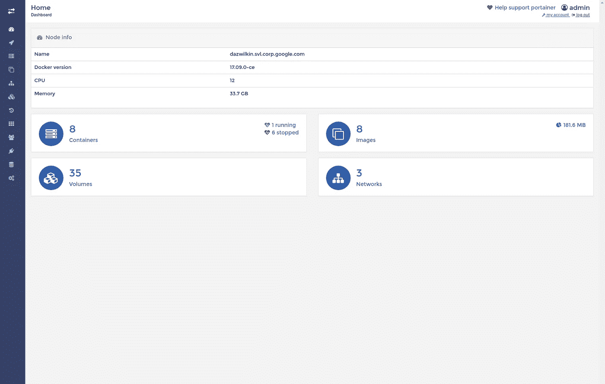
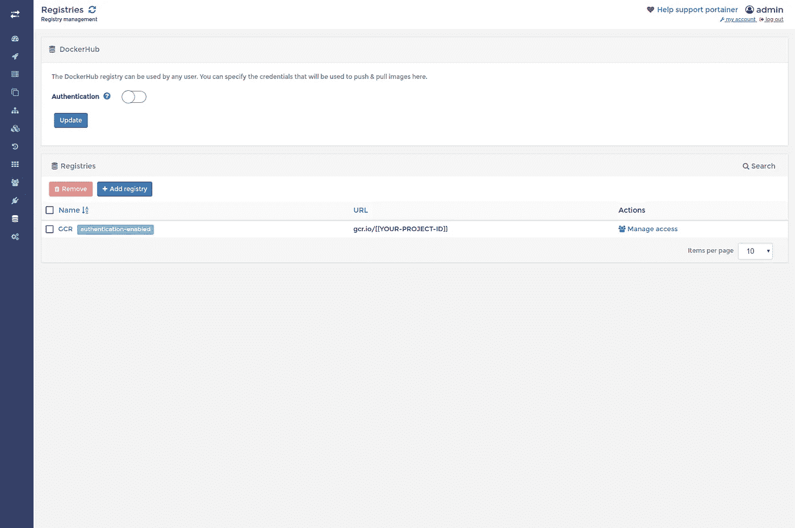
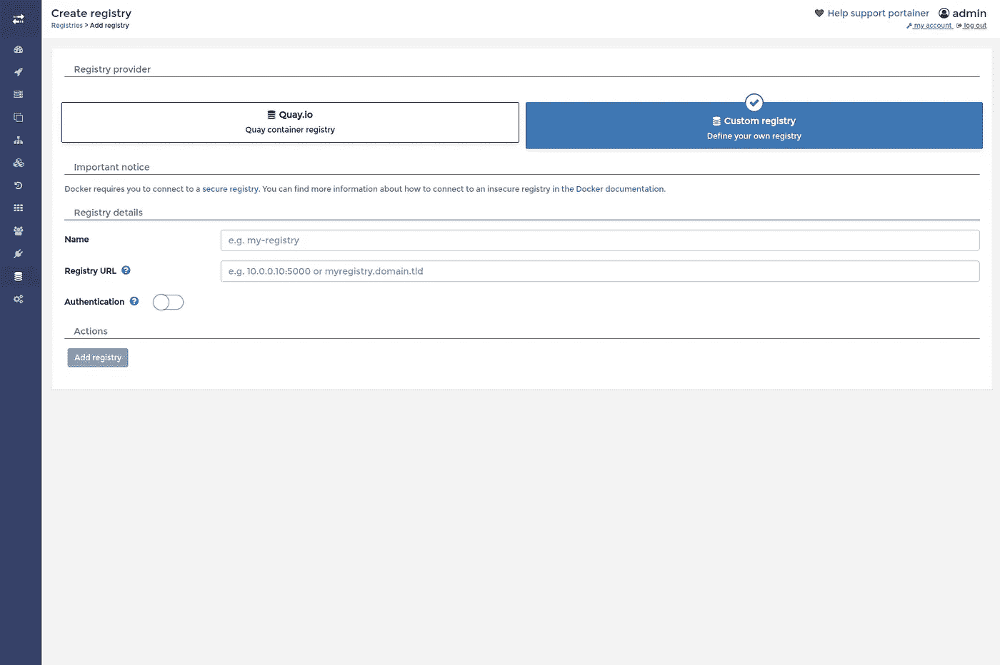
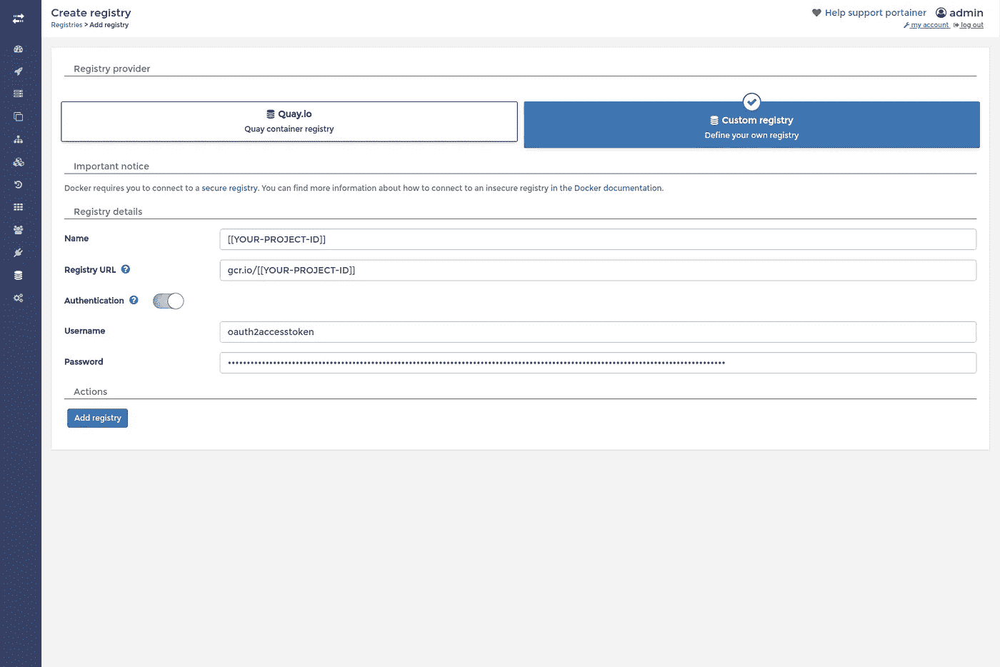
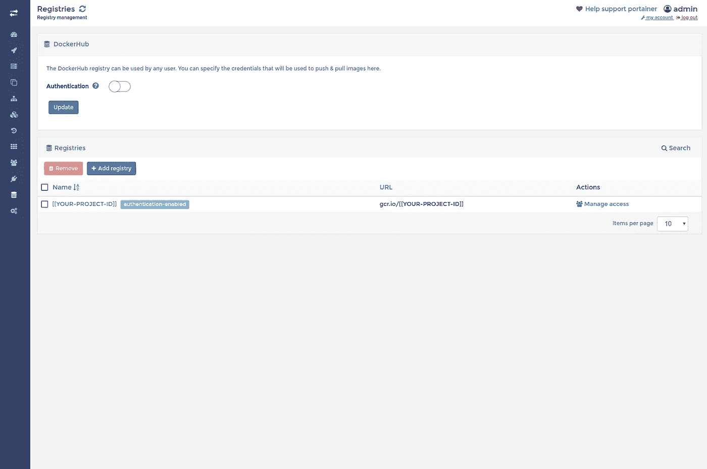
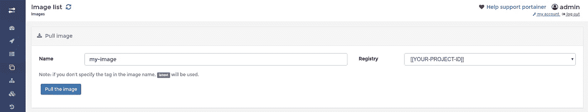
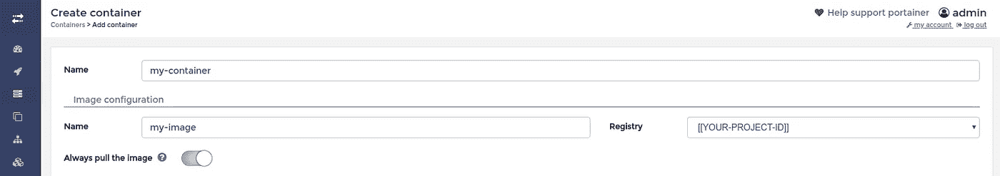
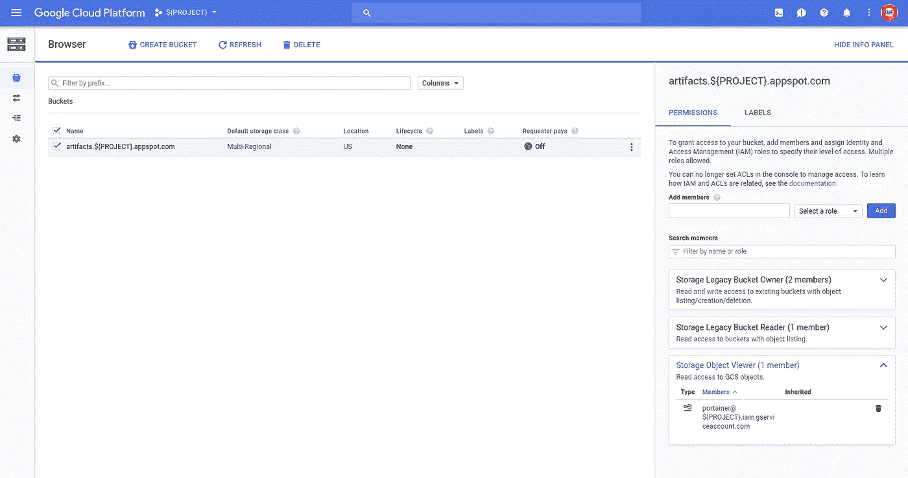
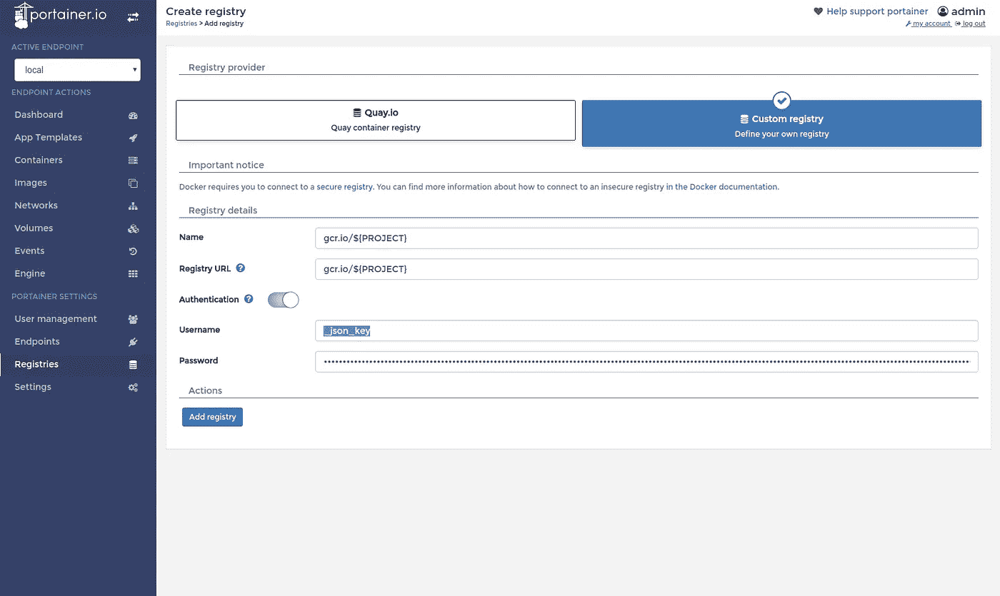

# 谷歌容器注册和门户网站

> 原文：<https://medium.com/google-cloud/google-container-registry-and-portainer-57198bdae070?source=collection_archive---------0----------------------->

*** * 2018–03–08 更新:**谷歌的一名工程师为这个问题提供了更好的解决方案。他建议使用更优雅的解决方案，即使用服务帐户的凭证，而不是使用我下面展示的短期令牌。这需要稍微多一点的工作，但是被 Google ( [link](https://cloud.google.com/container-registry/docs/advanced-authentication#using_a_json_key_file) )和 works 记录下来；我刚刚确认了。我建议您遵循这个路径(Service Account | JSON key ),而不是我下面描述的访问令牌。如果您想要完整的说明，请滚动到这篇文章的末尾，然后选择“**使用服务帐户**”。

我最近在[的博客](/google-cloud/google-container-registry-4aca1fc6cf74)上发表了关于[谷歌容器注册中心](https://cloud.google.com/container-registry/) (GCR)的文章，并解释了(来自谷歌的文档)一种可以轻松[配置](https://cloud.google.com/container-registry/docs/advanced-authentication#using_an_access_token) Docker 的 CLI 以访问 GCR (gcr.io)而不是 docker.io 的方法

嗯，我真的很喜欢用 Portainer 来管理我的本地 Docker 映像、容器、网络等。自己去看看吧:

```
docker run \
--detach \
--publish=9000:9000 \
--volume=/var/run/docker.sock:/var/run/docker.sock \
--volume=portainer_data:/data \
portainer/portainer
```

然后`http://localhost:9000`

这是一个非常好的工具:



便携式集装箱

我想，我应该可以通过 Portainer 访问 GCR。

并且，您可以:



配置为使用 GCR 的 Portainer

首先，为您当前认证的用户帐户获取一个`access-token`:

```
gcloud auth application-default print-access-token
```

结果将开始`ya29.`

然后，在 Poirtainer UI 中，创建一个新的自定义注册表:



Portainer:自定义注册表

命名注册中心，也许在你的 GCP 项目 ID 之后，注册中心 URL 将是形式`gcr.io/[[YOUR-PROJECT-ID]]`并且滑动认证滑块。对于用户名，您可以使用占位符`oauth2accesstoken`，对于密码，请输入`access-token`的值，包括`ya29.`

像这样:



集装箱:GCR 配置

然后点击“添加注册表”。

一切正常，GCR 注册表现在应该如下所示:



门户网站:包括 GCR 在内的注册管理机构

你可以根据需要添加任意数量。

现在，您可以使用 Portainer 直接从 GCR 存储库中提取图像:



从 GCR 回购拉图片

和/或直接从 GCR 存储库创建容器:



直接从 GCR 仓库创建集装箱

## 结论

Portainer 是一个有用的工具。Portainer 结合 Google 容器注册表就更有用了。

**使用服务账户**

一名 Google 工程师证实了一个更好的解决方案，使用服务帐户(JSON)密钥而不是短期访问令牌来解决这个问题。

假设有一个名为`${PROJECT}`的项目和一个名为`gcr.io/${PROJECT}`的 GCR 存储库:

1.  创建一个服务账户(名为`portainer`)，专门供 Portainer 用于本次回购:

```
ROBOT="portainer"gcloud iam service-accounts create ${ROBOT} \
--display-name=${ROBOT} \
--project=${PROJECT} 
```

2.为这个名为`portainer.key.json`的服务帐户生成一个 JSON 密钥:

```
gcloud iam service-accounts keys create ./${ROBOT}.key.json \
--iam-account=${ROBOT}@${PROJECT}.iam.gserviceaccount.com \
--project=${PROJECT}
```

3.授予服务帐户“objectViewer”(可以读取)对支持 GCR 存储库的 [Google 云存储](https://cloud.google.com/storage/) (GCS)存储桶的权限。此处记录了[。](https://cloud.google.com/container-registry/docs/access-control#granting_users_and_other_projects_access_to_a_registry)

```
gsutil iam ch serviceAccount:${ROBOT}@${PROJECT}.iam.gserviceaccount.com:objectViewer gs://artifacts.${PROJECT}.appspot.com
```

您可以使用 GCS 浏览器确认此更改(如果您愿意，也可以进行此更改):

https://console.cloud.google.com/storage/browser?project=${项目}



GCS 浏览器:“存储对象查看器”

> “存储对象查看器”成员是我们的服务帐户。

4.在 Portainer 中创建“自定义注册表”:

*   `Name: gcr.io/${PROJECT}`
*   `Registry URL: gcr.io/${PROJECT}`
*   `Username: _json_key`
*   `Password` -将`${ROBOT}.key.json`的内容复制粘贴到此处
*   点击`add registry`



Portainer“自定义注册表”

您可以随意使用注册表。