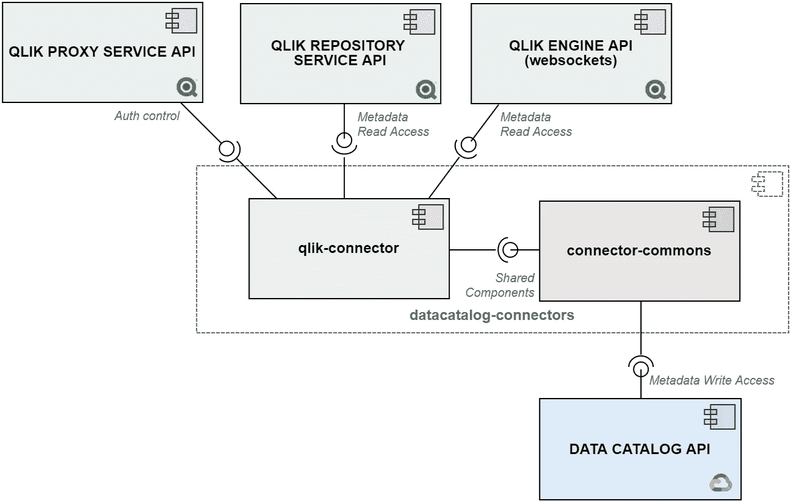

# Google 数据目录和 Qlik Sense 元数据集成

> 原文：<https://medium.com/google-cloud/google-data-catalog-and-qlik-sense-metadata-integration-23b67d88b8d2?source=collection_archive---------2----------------------->

## 利用数据目录发现和注释 Qlik 感知资产

背景照片由[劳伦·曼克](https://unsplash.com/@laurenmancke?utm_source=unsplash&utm_medium=referral&utm_content=creditCopyText)在 [Unsplash](https://unsplash.com/s/photos/computer?utm_source=unsplash&utm_medium=referral&utm_content=creditCopyText) 拍摄

在这篇博文中，我将分享推动为[谷歌数据目录](https://cloud.google.com/data-catalog)开发新样本连接器的想法和知识: [Qlik Sense 连接器](https://pypi.org/project/google-datacatalog-qlik-connector)。

这是第三个开源连接器，允许客户将 BI 系统中的元数据接收到数据目录中:用于 [Looker](/google-cloud/google-cloud-data-catalog-and-looker-integration-4ebefdef6a34) 和 [Tableau](/google-cloud/google-cloud-data-catalog-and-tableau-integration-204c1d17cc62) 的连接器已经有一段时间了。

> **免责声明:在本文撰写之时(2021 年 1 月)，谷歌和/或谷歌云不正式支持任何将数据目录连接到非 GCP 系统的工具。您将在这里发现的仅仅是我作为数据目录采纳者的经验的结果。**

# 概述

连接器由一个 Python 包组成，该包与命令行界面捆绑在一起。源代码可在 [GitHub](https://github.com/GoogleCloudPlatform/datacatalog-connectors-bi/tree/master/google-datacatalog-qlik-connector) 上获得。那里也有安装和运行它的说明。

长话短说，它:

1.  通过使用它们的 REST 和 Websocket APIs 从 Qlik Sense 抓取元数据。
2.  准备信息以适应目录实体模型。
3.  使用 API 将准备好的元数据吸收到数据目录中。

**图片 1** 。架构概述:Google 数据目录和 Qlik Sense 元数据集成

运行连接器的最低要求如下:

1.  **Qlik Sense** :对给定站点上的[Qlik Sense Repository Service(QRS)](https://help.qlik.com/en-US/sense-developer/September2020/Subsystems/RepositoryServiceAPI/Content/Sense_RepositoryServiceAPI/RepositoryServiceAPI-Introduction.htm)和[Qlik Engine JSON](https://help.qlik.com/en-US/sense-developer/September2020/Subsystems/EngineAPI/Content/Sense_EngineAPI/introducing-engine-API.htm)API 具有读取权限的登录/密码对。
2.  **数据目录**:允许创建条目组、条目、标记模板和标记的服务帐户([如果您不熟悉数据目录角色](https://cloud.google.com/iam/docs/understanding-roles#datacatalog)，请参考文档)。
3.  **连接器**:Python 3.6+或 Docker 环境。

# QLIK 资产类型

让我简单描述一下 Qlik 网站上通常提供的一些资源。正确理解它们的含义以及它们之间的关系将有助于您跟上后面的章节。

**图二**。Qlik 感知资产关系

*   *流*是顶级元素；它们是*应用程序的集合——*也称为文档*。*
*   应用程序是用来装载、处理和显示数据的组件的容器。示例组件包括连接数据源和将数据提取到文档中所执行的脚本，以及*工作表*。
*   *Streams* 和 *Apps* 都有标准属性，如 **Name** 、 **Id** 、 **Owner** 和 **Description** ，但是用户可以利用所谓的*自定义属性定义*来根据自己的需要扩展标准元数据集合。当管理*自定义属性定义*时，用户给它们一个可接受值列表的名称。
*   *自定义属性*是*自定义属性定义*、*流、*或*应用*之间的关联。它们具体化了用户扩展的元数据。
*   *工作表*是各种图表对象的容器。
*   用于填充*表单*的对象可以单独构建(因此在单个*表单*中使用)或来自*应用*中的库。属于这样一个库的那些被称为*主项目*，并被分成三种类型:*尺寸*、*尺寸*和*可视化*。

# 设计工作

当谈到系统集成时，最初的步骤之一是设计工作。我们需要理解每个系统中的概念和实体，以及它们如何适应另一端。Qlik 资产类型在上一节中进行了描述。我假设读者对谷歌数据目录有一个初步的了解，但是如果你没有的话，请看看[这篇博文](/google-cloud/data-catalog-hands-on-guide-a-mental-model-dae7f6dd49e)。

连接器在其初始版本中处理 7 种 Qlik 资产类型:

1.  自定义属性定义
2.  流
3.  应用程序(仅限已发布的应用程序)
4.  主项目:尺寸
5.  主项目:衡量标准
6.  主项目:可视化效果
7.  图纸(仅发布的图纸)

另一方面，数据目录使用三个主要的类来完成工作:

**图片 3** 。条目、标签模板和标签:主要的 Google 数据目录类

每个 Qlik 资产将有一个单独的目录*条目*。它将捕获描述资产的最相关的元数据，例如一个**显示名称**，**描述**，**创建和最后修改的日期**，用于管理它的**系统**(`entry.user_specified_system = 'qlik'`，以及它的**类型** : `entry.user_specified_type = 'sheet'`或`entry.user_specified_type = 'dimension'`。

*条目*的标准字段无法从各种 Qlik 资产中获取所有元数据。这里*标签*来帮助我们:它们是灵活的结构，我们可以用它们来注释目录条目，从而扩展标准的*条目*字段集。例如，*应用程序*有一个布尔字段，指示它们是否已发布，这不包含在任何*条目*字段中。然后，我们可以将带有`published`字段的*标签*附加到与 *App* 相关的*条目*上，以便保存这些元数据；集成 Qlik 和数据目录时避免丢失相关信息的简单方法。同样的推理适用于通过 Qlik APIs 可读的各种字段。

*标签*是从模板中创建的，模板可以被认为是它们的定义元素。*标签模板*用于指定将实际保存元数据的*标签*字段的名称和类型。下面的代码片段(简化以提高可读性)带来了一个*标签模板*，用于捕获*应用的*元数据:

**代码片段 1** 。在 Google Data Catalog 中制作一个标签模板来注释 Qlik 应用程序相关的条目

创建连接器当前使用的*标记模板*的代码可以在[这里](https://github.com/GoogleCloudPlatform/datacatalog-connectors-bi/blob/master/google-datacatalog-qlik-connector/src/google/datacatalog_connectors/qlik/prepare/datacatalog_tag_template_factory.py)找到。您会注意到每个 Qlik 资产类型都有一个模板。

为每个*自定义属性定义*的**选择值**创建附加模板，只要它们被分配给至少一个*流*或*应用*:

> 这一决定背后的基本原理包括允许连接器同步从每个自定义属性收集的所有元数据，同时它使 Qlik 资产能够通过它们的自定义属性轻松找到——使用查询字符串，如`tag:property_name:"<PROPERTY-NAME>"`和`tag:value:"<SOME-VALUE>"`。
> 
> [—连接器文档](https://github.com/GoogleCloudPlatform/datacatalog-connectors-bi/tree/master/google-datacatalog-qlik-connector#41-tag-templates-for-custom-property-choice-values)

最后，Qlik 资产之间存在关系—最明显的是:父子、关联和合成。虽然数据目录目前还不支持*实体*之间的关系，但是连接器通过*标签*对其中一些实体进行寻址。总而言之:

*   三个*标签*字段通常将资产链接到它们的父资产(即上游资产):父资产的 **Id** 、**名称**，以及一个 **URL** ，该 URL 允许用户使用数据目录 UI 导航到相关的*条目*。以上面的*标签模板*为例:一个*流*是 *App* 的父，由`stream_id`、`stream_name`和`stream_entry`字段标识。如果您查看源代码或运行连接器，您会注意到在其他模板中使用了相同的模式来模拟类似的父子关系。
*   *自定义属性*可以被视为它们的定义和它们帮助分类的*流*或*应用*之间的关联。这种关联由特定的*标签*表示。
*   连接器还没有处理组合，例如，哪些*尺寸*、*度量*和*可视化*用于构建给定的*表*。不过，这值得注意:我们在 Qlik 引擎 API 方面的经验让我们相信，在未来版本中添加这种支持是可行的。

# 样本连接器

现在是时候看看一些技术特征了。源代码应该足够清晰，以便任何人都能理解。然而，我们正在谈论软件，有些事情仍然值得澄清。在接下来的段落中，你会发现一些 Qlik 特有的怪癖；我将尝试添加尽可能多的上下文和有意义的链接，但人们可能仍然需要参考[Qlik Sense for Developers Help](https://help.qlik.com/en-US/sense-developer/September2020/Content/Sense_Helpsites/Home-developer.htm)进行更深入的阅读。

## 组件架构

六个主要组件用于解决方案，如下图所示。绿色方框代表 Qlik 资源；灰色框，连接器特定资源；蓝盒子，一个数据目录资源。

**图片 4** 。用于 Google 数据目录的 Qlik Sense 连接器的组件

1.  [Qlik Sense 代理服务](https://help.qlik.com/en-US/sense-developer/September2020/Subsystems/ProxyServiceAPI/Content/Sense_ProxyServiceAPI/ProxyServiceAPI-Introduction.htm)[(QPS)](https://help.qlik.com/en-US/sense-developer/September2020/Subsystems/ProxyServiceAPI/Content/Sense_ProxyServiceAPI/ProxyServiceAPI-Introduction.htm)[API](https://help.qlik.com/en-US/sense-developer/September2020/Subsystems/ProxyServiceAPI/Content/Sense_ProxyServiceAPI/ProxyServiceAPI-Introduction.htm):一个用于认证目的的 REST API。它发出可用作 HTTP cookies 或报头的票证，以验证对 QRS 和引擎 API 的后续请求。
2.  [Qlik Sense Repository Service(QRS)API](https://help.qlik.com/en-US/sense-developer/September2020/Subsystems/RepositoryServiceAPI/Content/Sense_RepositoryServiceAPI/RepositoryServiceAPI-Introduction.htm):连接器从这个 REST API 中读取*流*、*应用*、*自定义属性定义*和*自定义属性*元数据。
3.  [Qlik Engine JSON API](https://help.qlik.com/en-US/sense-developer/September2020/Subsystems/EngineAPI/Content/Sense_EngineAPI/introducing-engine-API.htm) :一个 WebSockets API，允许连接器读取与*工作表*和主项目相关的元数据— *尺寸*、*度量*和*可视化*。
4.  [Google-data catalog-qlik-connector](https://github.com/GoogleCloudPlatform/datacatalog-connectors-bi/tree/master/google-datacatalog-qlik-connector):作为本文开头提到的**scrape**→**prepare**→**ingest**工作流的协调者。它包含允许用户使用命令行界面启动连接器的代码。除此之外，还有处理身份验证、元数据读取(抓取阶段)和 Qlik 到数据目录实体转换(准备阶段)的代码。元数据接收(接收阶段)被委托给`google-datacatalog-connectors-commons`组件。
5.  [Google-Data Catalog-connectors-commons](https://github.com/GoogleCloudPlatform/datacatalog-connectors/tree/master/google-datacatalog-connectors-commons):所有数据目录开源连接器共享的代码，包括完整的元数据摄取支持和执行监控工具。
6.  [数据目录 API](https://cloud.google.com/data-catalog/docs/how-to/custom-entries) :允许用户创建和管理自定义数据资源类型的*条目*，以及*标签模板*和*标签*。

## 用户认证

连接器目前使用 NTLM 对 Qlik 用户进行身份验证，这是 Windows 上 Qlik Sense Enterprise 的默认身份验证模块[。NTLM 还允许用户从可信区域之外进行连接。因此，从 NTLM 开始是一个设计决定，以达到更高的观众，因为最初的版本。](https://help.qlik.com/en-US/sense-admin/September2020/Subsystems/DeployAdministerQSE/Content/Sense_DeployAdminister/QSEoW/Deploy_QSEoW/Server-Security-Authentication-MS-Windows-Environment.htm)

> 对于那些寻找实现细节的人来说:主要的认证逻辑由`Authenticator` [类](https://github.com/GoogleCloudPlatform/datacatalog-connectors-bi/blob/master/google-datacatalog-qlik-connector/src/google/datacatalog_connectors/qlik/scrape/authenticator.py)处理，包括`x-Qlik-Xrfkey`头设置。

不过，还有其他选择。在阅读了社区论坛中的许多内容后，我们注意到 Windows 上与 Qlik Sense Enterprise 的大多数编程交互似乎都是在[基于证书的身份验证](https://help.qlik.com/en-US/sense-developer/September2020/Subsystems/EngineAPI/Content/Sense_EngineAPI/GettingStarted/connecting-to-engine-api.htm)下进行的，而不是登录/通过。基于 JWT 的身份验证似乎也是可以实现的，但是这两种方法都需要进一步的研究和测试。

## REST 与 WebSocket APIs

上面列表中编号为 2 和 3 的组件清楚地表明，我们使用两个 API 在整个抓取阶段读取元数据。

我们试图从[Qlik Sense Repository Service(QRS)API](https://help.qlik.com/en-US/sense-developer/September2020/Subsystems/RepositoryServiceAPI/Content/Sense_RepositoryServiceAPI/RepositoryServiceAPI-Introduction.htm)中获取尽可能多的元数据。它实现了一个 REST 协议，这个协议被开发人员广为人知并且易于使用。

> 请参考`RepositoryServicesAPIHelper` [类](https://github.com/GoogleCloudPlatform/datacatalog-connectors-bi/blob/master/google-datacatalog-qlik-connector/src/google/datacatalog_connectors/qlik/scrape/repository_services_api_helper.py)来更好的理解我所说的“容易消费”是什么意思。

另一方面， [Qlik 引擎 JSON API](https://help.qlik.com/en-US/sense-developer/September2020/Subsystems/EngineAPI/Content/Sense_EngineAPI/introducing-engine-API.htm) 实现了 WebSockets 协议，需要异步编程。在早期，我们花了一段时间来加快速度，但后来我们找到了一个解决方案，这个方案显示出了很高的效率:`BaseEngineAPIHelper`是所有引擎 API 交互的[基类](https://github.com/GoogleCloudPlatform/datacatalog-connectors-bi/blob/master/google-datacatalog-qlik-connector/src/google/datacatalog_connectors/qlik/scrape/base_engine_api_helper.py)；它的方法促进代码重用，将处理特定内容的责任留给子类，正如你在`EngineAPISheetsHelper`、`EngineAPIDimensionsHelper`、`EngineAPIMeasuresHelper`和`EngineAPIVisualizationsHelper` [类](https://github.com/GoogleCloudPlatform/datacatalog-connectors-bi/tree/master/google-datacatalog-qlik-connector/src/google/datacatalog_connectors/qlik/scrape)中看到的。

# 结果

在下图中，您可以看到运行连接器后执行目录搜索的结果。在我们的测试环境中，我使用了`system=qlik type=stream`查询来查找 Qlik 站点中所有可用的*流*。

**图片 5** 。使用谷歌数据目录搜索所有 Qlik *流*

类似的查询可用于寻找其他资产类型:

*   `system=qlik type=app`
*   `system=qlik type=custom_property_definition`
*   `system=qlik type=sheet`
*   `type=dimension`
*   `type=measure`
*   `type=visualization`

点击其中一个*条目*将调出其元数据:

**图片 6** 。在 Google 数据目录中查看 Qlik *流元数据(一些字段被编辑以保护隐私)*

请注意，在 Qlik 意义上，示例*流*标有`GCPUser` *自定义属性*；因此，它的目录*条目*也在数据目录中标注了与`GCPUser`相关的*标签*(图 6 中折叠)。**我们甚至可以查找标有相同*自定义属性*的所有资产，这是用户仅使用 Qlik Sense 特性**无法实现的。让我将查询字符串改为`tag:property_name:GCPUser`来展示它是如何工作的:

**图 7** 。搜索所有标有给定自定义属性的 Qlik 资产

我也可以通过*自定义属性*值进行搜索，例如`tag:value:true`。顺便说一下，在数据目录中有各种各样的搜索可能性。详情请参考[搜索语法文档](https://cloud.google.com/data-catalog/docs/how-to/search-reference)。

在结束本部分之前，值得一提的是，用户可以使用自己的*标记模板*和*标记*来注释 Qlik 资产，例如，利用数据目录来加强公司数据治理策略。

# 包扎

我描述了我的团队在过去几个月中在开发集成 Qlik Sense 和 Google Data Catalog 的解决方案时面临的挑战和决策。我们开发了一个示例连接器，可用于从 Qlik Sense 读取元数据并将其存储在数据目录中，使 Qlik 资产在 Google Cloud 中完全可发现。

初始版本处理 7 种常规 Qlik 资产类型，但总有改进的空间。例如，我们研究了从脚本及其底层连接解析元数据的可能性；这可能导致基本的数据沿袭支持，连接器将有助于快速回答诸如“这个*应用*使用了哪些数据源？”之类的问题或者“如果我们删除这个数据库表，哪些 Qlik *应用程序*会崩溃？”。此外，我认为值得概括一下处理*主项目*和*表* : 之间的组合的可能性。所需的元数据似乎在 Qlik 引擎 API 中可用，但仍需要进一步研究。到目前为止，我们还没有时间研究这些话题…

顺便说一句，如果您有建议或在运行连接器时发现错误，请不要犹豫[提出功能请求或发出](https://github.com/GoogleCloudPlatform/datacatalog-connectors-bi/issues)。随时欢迎反馈！

最后，在这篇博文中，我并没有探索可能的部署解决方案，但是可以很容易地安排定期执行，因为连接器附带了命令行界面。

我希望你喜欢阅读。非常感谢！