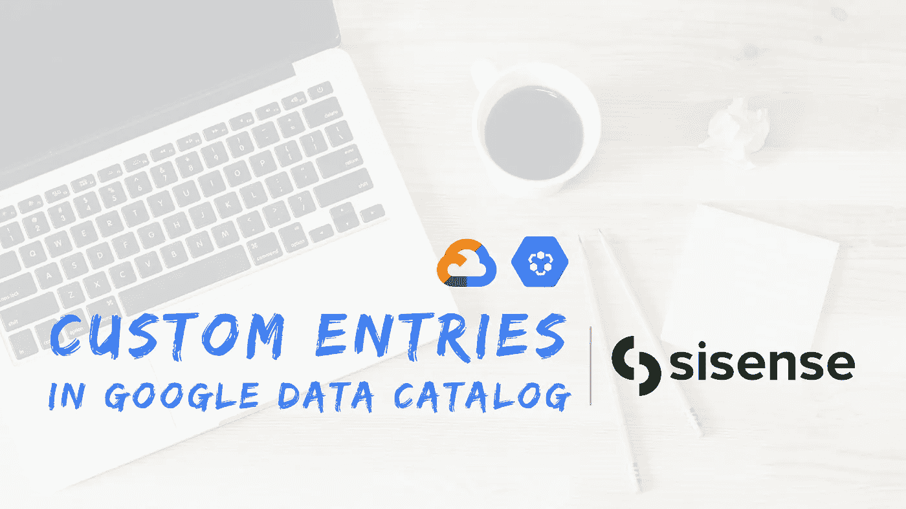
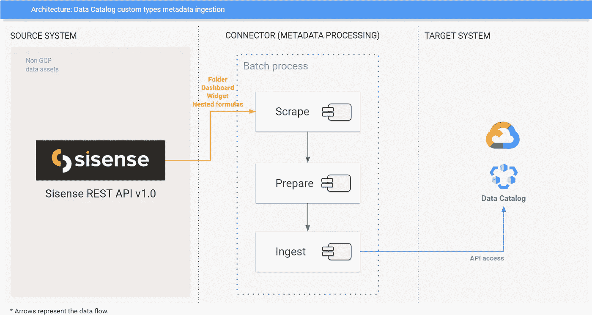
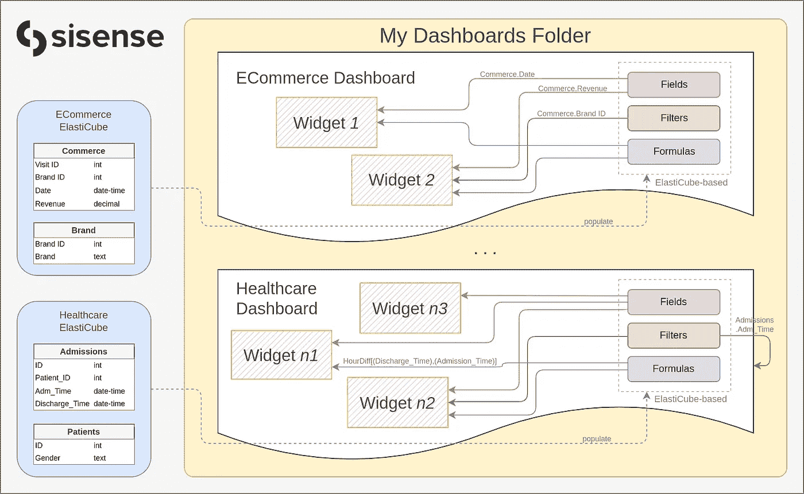
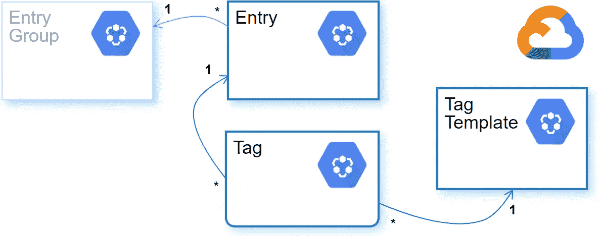
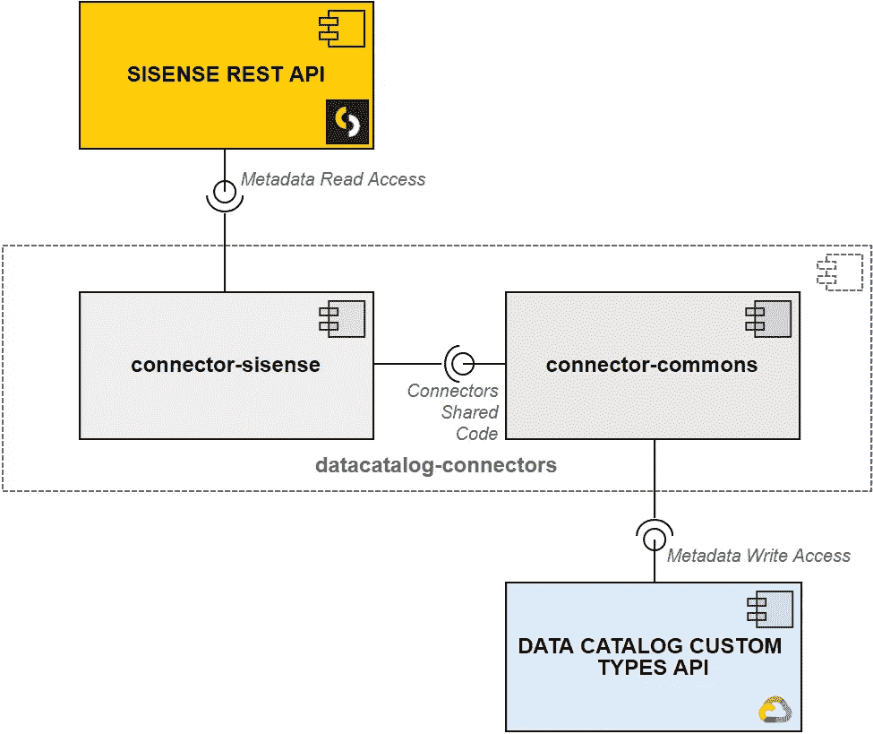
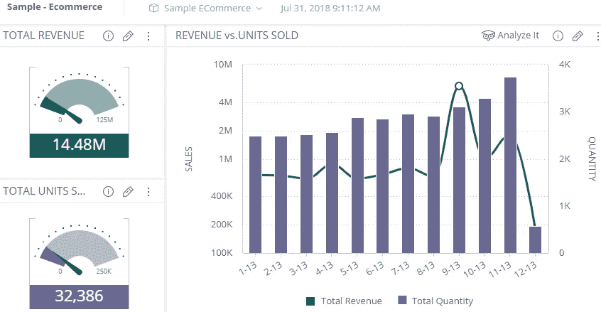
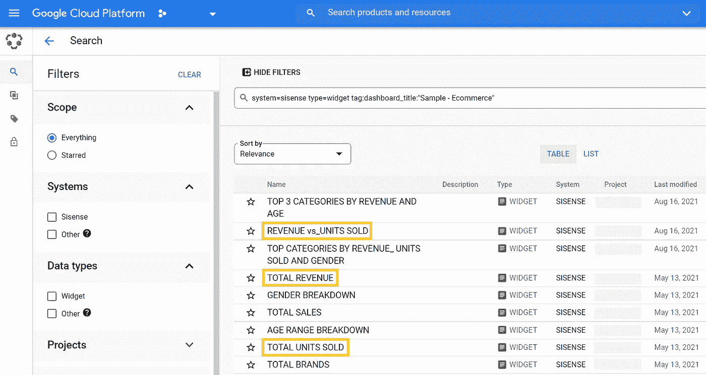
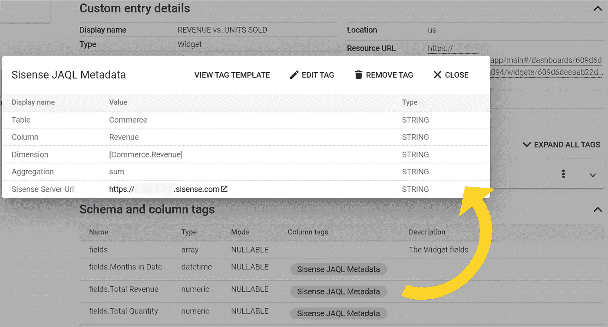
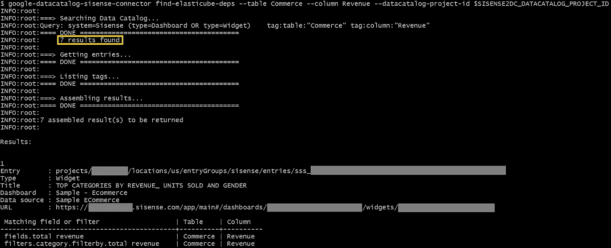
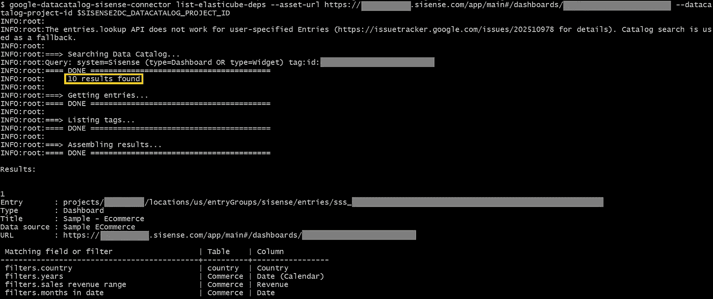

# Google 数据目录和 Sisense 元数据集成

> 原文：<https://medium.com/google-cloud/google-data-catalog-sisense-metadata-integration-c585cfd7d114?source=collection_archive---------0----------------------->

## 利用数据目录来发现、跟踪沿袭并注释 Sisense 资产

背景照片由[劳伦·曼克](https://unsplash.com/@laurenmancke?utm_source=unsplash&utm_medium=referral&utm_content=creditCopyText)在 [Unsplash](https://unsplash.com/s/photos/computer?utm_source=unsplash&utm_medium=referral&utm_content=creditCopyText) 拍摄

在下面的段落中，我分享了推动为 [Google 数据目录](https://cloud.google.com/data-catalog)开发另一个示例连接器的想法和知识:Sisense 连接器。

在这种情况下，亮点是一个**列级数据沿袭机制**，它允许 Sisense 用户轻松跟踪*elastic cube*表字段和使用它们的*小部件*或*仪表板*之间的依赖关系。

它是第四个开源连接器，允许客户将 BI 系统中的元数据接收到数据目录中:用于 [Looker](/google-cloud/google-cloud-data-catalog-and-looker-integration-4ebefdef6a34) 、 [Tableau](/google-cloud/google-cloud-data-catalog-and-tableau-integration-204c1d17cc62) 和 [Qlik Sense](/google-cloud/google-data-catalog-and-qlik-sense-metadata-integration-23b67d88b8d2) 的连接器已经提供了一段时间。

> **免责声明:在撰写这篇博文时(2022 年 1 月)，谷歌和/或谷歌云不正式支持任何将数据目录连接到非 GCP 系统的工具。您将在这里发现的仅仅是我作为一个数据目录经验丰富的用户的经验的结果。**

# 概述

连接器由一个 Python 包组成，该包与命令行界面捆绑在一起。源代码可在 [GitHub](https://github.com/GoogleCloudPlatform/datacatalog-connectors-bi/tree/master/google-datacatalog-sisense-connector) 上获得。那里也有安装和运行它的说明。

长话短说，它:

1.  通过使用 REST API 从给定的 Sisense 服务器中抓取元数据。
2.  准备信息以适应目录实体模型。
3.  通过 API 将准备好的元数据吸收到数据目录中。

**图片 1** 。架构概述:Google 数据目录和 Sisense 元数据集成(图片由作者提供)

运行连接器的最低要求如下:

1.  **Sisense** :对给定服务器上的 [Sisense REST API](https://sisense.dev/guides/rest/) 具有读取权限的登录/密码对。
2.  **数据目录**:允许创建条目组、条目、标签模板和标签的服务帐户([如果您不熟悉数据目录角色](https://cloud.google.com/iam/docs/understanding-roles#datacatalog)，请参考文档)。
3.  **连接器**:Python 3.6+或 Docker 环境。

# SISENSE 资产类型和关系

让我简单描述一下 Sisense 上的一些可用资源。正确理解它们的含义以及它们之间的关系将有助于您跟上后面的章节。

**图片 2** 。Sisense 资产类型和关系(图片由作者提供)

*   *文件夹*是包含*仪表板*和子文件夹*的分组结构。*
*   *仪表板*是数据的可视化表示，用来讲述一个故事。它们以易于理解的方式呈现复杂的数据，以便用户可以发现业务中正在发生的模式、趋势和异常情况。
*   *小部件，*仪表板的主要组件，是代表一个数据类别的单个单元。他们以图表、表格、地图、文本等形式呈现数据。
*   *elastic cubes*是 Sisense 独有的分析数据库。它们增强了对各种数据源的本地支持，为 BI 分析师提供了一个简化的查询界面，无论数据来自何处。

*字段*、*过滤器*、*公式*是*elastic cube*表格字段、 *Widgets* 和*仪表盘*之间的纽带:

*   *字段*将*小部件*绑定到它们的底层数据源(*elastic cube*列)。
*   *过滤器*允许用户在*仪表板*或*部件*级别选择数据。
*   *公式*允许现场即时计算。

*字段*、*过滤器*和*公式*在本工作范围内不作为一级资产处理。然而，它们的元数据是沿袭机制的基础构建块，沿袭机制跟踪*elastic cube*表字段及其相关的*仪表板*和*小部件之间的依赖关系。*

# 设计工作

当谈到系统集成时，最初的步骤之一是设计工作。我们需要理解每个系统中的概念和实体，以及它们如何适应另一端。上一节描述了 Sisense 资产类型及其关系。我假设读者对谷歌数据目录有一个初步的了解，但如果你没有，请看看[这篇博文](/google-cloud/data-catalog-hands-on-guide-a-mental-model-dae7f6dd49e)。

连接器在其初始版本中处理三种一级 Sisense 资产类型:

1.  *文件夹*
2.  *仪表盘*
3.  *Widgets*

> 我们将*elastic cubes*视为前一节提到的一级资产。尽管如此，由于时间限制，在当前版本(0.1.0)中，连接器不能完全处理它们的元数据。例如，elastic cubes 可以通过谷歌数据目录以某种方式搜索，但是没有关于它们上游连接的信息。然而，下游依赖关系以*仪表板*和*部件*元数据的格式映射。

无论 BI 系统资产类型如何，Data Catalog 都依靠下面突出显示的三个类来组织和存储其元数据:

**图片 3** 。条目、标签模板和标签:主要的 Google 数据目录类(图片由作者提供)

也就是说，每个一级资产都有一个单独的目录*条目*。它将捕获描述资产的最相关的元数据，例如，**显示名称**、**描述**、**创建和最后修改的日期**、用于管理它的**系统**(`entry.user_specified_system = 'sisense'`)及其**类型** : `entry.user_specified_type = 'dashboard'`或`entry.user_specified_type = 'widget'`。

*条目*的标准字段无法从各种 Sisense 资产中捕获所有元数据。这里*标签*来帮助我们:它们是灵活的结构，我们可以用它们来注释目录条目，从而扩展标准的*条目*字段集。例如，*仪表板*有一个字符串字段，指示它们所连接的*elastic cube*，它没有被任何*条目*字段覆盖。然后，我们可以将带有`datasource`字段的*标签*附加到与*仪表板*相关的*条目*上，以便持久保存这些元数据；集成 Sisense 和数据目录时避免丢失相关信息的简单方法。同样的推理适用于通过 Sisense 的 REST API 可读的各种字段。

*标签*是从模板中创建的，模板可以被认为是它们的定义元素。*标签模板*用于指定*标签*字段的名称和类型，这些字段将实际保存元数据。以下代码片段(为提高可读性而简化)带来了一个用于表示*仪表板的*元数据的*标记模板*:

**代码片段 1** 。在 Google Data Catalog 中创建一个标签模板来注释 Sisense 仪表板相关条目

创建连接器使用的*标签模板*的代码可以在[这里](https://github.com/GoogleCloudPlatform/datacatalog-connectors-bi/blob/master/google-datacatalog-sisense-connector/src/google/datacatalog_connectors/sisense/prepare/datacatalog_tag_template_factory.py)找到。您会注意到每个一级资产类型都有一个模板。

您还会注意到用于 [JAQL](https://en.wikipedia.org/wiki/Jaql) 元数据的*标签模板*。小部件通常使用 JAQL 查询来对*elastic cubes*执行查询，因此我们决定将它们作为数据沿袭机制的初始支持——值得注意的是，我们认为解析 SQL 查询作为未来的改进还有空间。来自 JAQL *标签模板*的*标签*被应用到*字段*、*过滤器*和*公式*，它们被映射为*仪表板*和*小部件*相关目录*条目中的模式列。*

> 请参考连接器的[文档](https://github.com/GoogleCloudPlatform/datacatalog-connectors-bi/tree/master/google-datacatalog-sisense-connector#5-templates-tags-and-data-lineage)获取所有*标签模板*及其字段的列表。

最后，Sisense 资产之间存在关系，最明显的是父子关系。尽管 Data Catalog 到目前为止还不支持*实体*之间的关系，但是连接器通过*标签来处理其中的一些关系。*三个*标签*字段通常将资产链接到它们的父资产(即上游资产):父资产的 **Id** 、**名称**以及一个 **URL** ，该 URL 允许用户使用数据目录的 UI 导航到相关的*条目*。以上面的*标签模板*为例:一个*文件夹*是*仪表板*的父文件夹，由`folder_id`、`folder_name`和`folder_entry`字段标识。如果您查看源代码或运行连接器，您会注意到在其他模板中使用了相同的模式来模拟类似的父子关系。

# 样本连接器

现在是时候看看一些技术细节了。鉴于这是一个示例连接器，源代码和参考文档应该足够清晰，以便任何人都可以理解。但是，当我们谈论软件时，有些事情仍然值得澄清。

## 解决方案架构

四个主要组件用于解决方案，如下图所示。黄色方框代表 Sisense REST API 灰色方框代表特定于连接器的资源；蓝框是数据目录 API。

**图片 4** 。用于 Google 数据目录的 Sisense 连接器的组件(图片由作者提供)

1.  [Sisense REST API](https://sisense.dev/guides/rest/) :一个远程组件，允许连接器从所有 Sisense 资产中读取元数据。
2.  [Google-data catalog-si sense-connector](https://github.com/GoogleCloudPlatform/datacatalog-connectors-bi/tree/master/google-datacatalog-sisense-connector):作为本文开头提到的**scrape**→**prepare**→**ingest**工作流的协调者。它包含允许用户通过命令行界面启动连接器的代码。除此之外，还有处理身份验证、元数据读取(抓取阶段)和 Sisense 到数据目录实体转换(准备阶段)的代码。元数据接收(接收阶段)被委托给`google-datacatalog-connectors-commons`组件。
3.  [Google-datacatalog-connectors-commons](https://github.com/GoogleCloudPlatform/datacatalog-connectors/tree/master/google-datacatalog-connectors-commons):所有 Data Catalog 开源连接器共享的代码，包括元数据摄取支持和执行监控工具。
4.  [数据目录 API](https://cloud.google.com/data-catalog/docs/how-to/custom-entries) :远程组件，允许连接器管理用户指定资源类型的*条目*、*标签模板、*和*标签*。

## CLI 操作

除了其他数据目录连接器中提供的*同步*操作之外，Sisense 连接器还提供了两个额外的命令行选项。简而言之:

1.  将 Google 数据目录与给定的 Sisense 服务器同步。
2.  `find-elasticube-deps`查找依赖于给定*elastic cube*表或字段的*小部件*字段或过滤器或*仪表板*过滤器。然后，在控制台中打印结果。
3.  `list-elasticube-deps`搜索数据目录以理解基于 JAQL 查询和表字段的*小部件*或*仪表板*数据定义。它还在控制台中打印结果。

第一个操作代表了对这种连接器的最低要求——在两个系统之间同步元数据——并且是所有预先存在的连接器所提供的完全相同的特性。

第二个和第三个操作是 Sisense 连接器的独特功能，由于 Sisense 提供的 JAQL 查询元数据在*字段*、*过滤器*和*公式*级别支持的列级沿袭机制，这两个操作成为可能。

> 您将在连接器参考[文档](https://github.com/GoogleCloudPlatform/datacatalog-connectors-bi/tree/master/google-datacatalog-sisense-connector#3-running-the-connector)中找到有关如何使用 CLI 的更多详细信息。

## 权衡

`sync-catalog`操作为依赖于 JAQL 查询的大多数*仪表板*和*小部件*属性创建 JAQL 元数据*标签*，即*字段*、*过滤器*和*公式*，以启用列级沿袭跟踪。上述每个属性至少需要这些*标签*中的一个。与类似的连接器相比，创建此类*标记*的 API 调用数量有所增加。另一方面，*标签*非常小:每个标签大约 4 个字段。鉴于 API 调用和元数据存储是 Data Catalog 定价模型的关键组成部分，我们强烈建议参考[产品文档](https://cloud.google.com/data-catalog/pricing)，根据您的环境特征和使用需求评估成本。

# 结果

在本节中，您将看到连接执行结果的预览。要开始，请看看下面的截图。它带来了部分示例**电子商务** *仪表板*(为了保持图像简洁，一些*小部件*被隐藏)。

**图片 5** 。来自 Sisense *仪表板*的示例部件(图片由作者提供)

接下来，您可以看到运行`sync-catalog`操作后执行目录搜索的结果。我已经使用了`system=sisense type=widget tag:dashboard_title:"Sample - Ecommerce"`查询来查找属于**示例电子商务**仪表板的所有*小部件*。上面截图中的*小部件*在结果中高亮显示。

**图片 6** 。使用谷歌数据目录搜索 Sisense 部件(图片由作者提供)

类似的查询可以用于寻找其他资产类型，例如`system=sisense type=folder`或`system=sisense type=dashboard`。参考数据目录[搜索语法文档](https://cloud.google.com/data-catalog/docs/how-to/search-reference)找到更多选项。

点击其中一个*条目*将调出其元数据。请注意*条目*有一个模式。它代表**收入与销售单位** *小部件字段*，而不是数据库列。相同的设计用于将*过滤器*和*公式*元数据摄取到 Google 数据目录中。

**图片 7** 。Google 数据目录的 Sisense 连接器中实现的列级沿袭(图片由作者提供)

我猜你也注意到了每个字段都用从 **Sisense JAQL 元数据** *模板*创建的*标签*进行了注释。点击**总收入**的*标签*可以让我们找到它的数据来自于:`Commerce`表，`Revenue`字段。当我说连接器提供数据沿袭支持时，这是一个基本特性。

## 其他数据沿袭功能

通过 CLI 还可以使用另外两个与沿袭相关的功能。为了演示第一个，假设有人想知道所有依赖于`Commerce.Revenue`表字段的*字段*、*过滤器*或*公式*。她可以通过 UI 执行目录搜索，但是结果将在*条目*级别显示，她需要手动检查所有的*条目*才能得到答案。

`find-elasticube-deps`操作旨在简化这样的搜索，如下图所示。

**图片 8** 。“find-elastic cube-deps”操作的样本结果(图片由作者提供)

请注意:

1.  提供了`--table Commerce`和`--column Revenue`参数，操作接受可选的`--datasource`参数。必须提供数据源、表或列参数。
2.  找到了七个结果，这意味着表字段被一堆*小部件*或*仪表板*使用。
3.  只有匹配的*字段*或*过滤器*包含在结果列表中，与使用 UI 相比，节省了用户时间(从 2 到 7 的结果被隐藏以提高可读性)。

现在，假设你想知道什么样的*elastic cube*资源被用来填充*仪表板*，如图**图 5** 所示。有人可能需要少量的搜索和点击来通过数据目录 UI 完成工作。第二个附加特性`list-elasticube-deps`，带来了一个毫不费力就能得到答案的选项，如下所示。

**图片 9** 。“list-elastic cube-deps”操作的样本结果(图片由作者提供)

请注意:

1.  `--asset-url https://__REDACTED__.sisense.com/app/main#/dashboards/__REDACTED__`参数(从浏览器复制的 URL)，这是必需的。
2.  找到了十个结果，这意味着一个*条目*对应于*仪表板*，九个对应于*小部件*。
3.  结果中列出了所有依赖于*elastic cube*资源的*字段*和*过滤器*。与前一个特性类似，与使用 UI 相比，这个特性节省了用户的时间(从 2 到 10 的结果被隐藏以提高可读性)。

# 最后

对于大多数大数据和分析团队来说，发现数据并了解数据在当今复杂环境中如何流动的能力是必备的。Google Data Catalog 提供强大的搜索功能，并依靠丰富的生态系统，允许用户发现和注释在 Google 云和外部系统上管理的数据资产(通过 [15+开源连接器](https://github.com/GoogleCloudPlatform/datacatalog-connectors))。

然而，自动跟踪数据血统仍然是一个挑战。经验表明，结果取决于团队使用的堆栈。例如，由于 Sisense 将数据绑定到可视组件并通过其 API 提供元数据的方式，Sisense 连接器中实现的列级沿袭才是可能的。

一个集成了 Sisense 和 Data Catalog 的工具允许两个系统的用户在几秒钟内检查数据源模式的变化如何影响生产仪表板，这只是一个直接的好处。对于利用实验文化和短业务洞察交付周期的团队来说，以接近实时的方式获得这些信息可能会改变游戏规则。

我希望你喜欢它！

## 参考

*   **谷歌云数据目录动手指南，心智模型**:[medium . com/Google-Cloud/Data-Catalog-hands-on-guide-a-mental-model-dae7f 6 DD 49 e](/google-cloud/data-catalog-hands-on-guide-a-mental-model-dae7f6dd49e)
*   **使用 si sense REST API**:[sisense.dev/guides/rest/using-rest-api.html](https://sisense.dev/guides/rest/using-rest-api.html)
*   **查询 Sisense 数据模型**:[sisense.dev/guides/query/](https://sisense.dev/guides/query/)