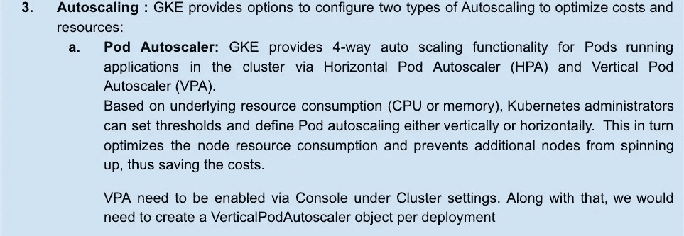

# Google Cloud DevOps 系列:成本优化的敏捷性

> 原文：<https://medium.com/google-cloud/google-devops-agility-with-cost-optimization-930ad77ccc63?source=collection_archive---------0----------------------->

## Google Cloud DevOps 系列:第 6 部分

欢迎来到 Google Cloud DevOps 系列的第 6 部分..你可以从[这里](/google-cloud/google-cloud-devops-part-1-introduction-to-google-native-devops-process-bfb55be9e3f3)开始阅读该系列的其他部分。


**GKE 环境下的成本优化**

在 Google Cloud，我们始终认为成本优化应该是每个组织的 IT 或业务战略的关键支柱之一，我们确保降低成本不会以牺牲用户体验或客户业务风险为代价。

对于在云环境中采用创新技术(如 Google Kubernetes 引擎)进行应用程序开发和托管的客户来说，实施成本优化的最佳实践以防止他们的努力影响其应用程序的性能、稳定性和服务业务的能力也是非常重要和具有挑战性的。

GKE 提供了几个先进的成本优化特性和内置功能。对于需要平衡应用程序性能需求和优化成本的客户来说，这是一个绝佳的选择。

**GKE 环境中成本优化的最佳实践**

成本优化是 ***成本控制*** 和 ***成本可见性*** 的结合，在谷歌云平台中，我们有众多服务来满足这两种需求，以实现预期的结果。


基于对应用的硬件需求的正确分析，可以为集群节点选择正确的机器类型，并且相应地可以设计应用分组和名称空间。

请注意，在为任何应用选择正确的节点类型时，使用**可抢占节点**可以进一步降低成本，但这些节点仅适用于对可抢占虚拟机的短暂、无保障特性不太敏感的容错作业。

***注:*** *GKE 默认使用 E2 机型。有关可用的不同机器类型的详细信息，请参考此* [*链接*](https://cloud.google.com/compute/docs/machine-types)



首先从集群设置中启用垂直窗格自动缩放，如下所示:


然后，我们需要为所需的部署创建一个垂直窗格自动缩放对象。通过该对象，当创建单元时，垂直单元自动缩放器分析容器的 CPU 和内存需求，并在其*状态*字段中记录这些建议。根据分析，VPA 自动调整集装箱所需的 CPU 或内存。请执行以下步骤，观看 VPA 的实际操作:

1.  将以下`Deployment`清单另存为名为`vpa-demo-deployment.yaml`的文件:

```
apiVersion: apps/v1
kind: Deployment
metadata:
  name: vpa-demo-deployment
spec:
  replicas: 2
  selector:
    matchLabels:
      app: vpa-demo-deployment
  template:
    metadata:
      labels:
        app: vpa-demo-deployment
    spec:
      containers:
      - name: vpa-demo-container
        image: k8s.gcr.io/ubuntu-slim:0.1
        resources:
          requests:
            cpu: 100m
            memory: 50Mi
        command: ["/bin/sh"]
        args: ["-c", "while true; do timeout 0.5s yes >/dev/null; sleep 0.5s; done"]
```

2.将部署创建为:

```
kubectl create -f vpa-demo-deployment.yaml
```

您应该会看到如下输出:


3.检查跑步记录:

```
kubectl get pods
```


4.现在，创建一个 VPA 对象来分析作为 vpa-demo-deployment 的一部分运行的 pod 的 CPU 和内存需求。将下面的`VerticalPodAutoscaler`保存为一个名为`vpa-object.yaml`的文件:

```
apiVersion: autoscaling.k8s.io/v1
kind: VerticalPodAutoscaler
metadata:
  name: vpa-object
spec:
  targetRef:
    apiVersion: "apps/v1"
    kind:       Deployment
    name:       vpa-demo-deployment
  updatePolicy:
    updateMode: "Auto"
```

然后创建 VPA 对象，如下所示:

```
kubectl create -f vpa-object.yaml
```

您应该会收到类似如下的输出:


5.检查从 vpa-demo-deployment 部署的一个 Pod 的资源要求，如下所示:

```
kubectl get pod vpa-demo-deployment-d67d96884-tgcxs --output yaml
```


在输出中，您可以看到垂直窗格自动缩放器增加了内存和 CPU 请求。您还可以看到记录更新的注释:


6.检查 VPA 对象状态以查看更新的建议，如下所示:


`target`建议说，如果容器请求 590 毫 CPU 和 2097152 千字节的内存，它将最佳地运行，这不同于我们作为部署(vpa-demo-deployment)的一部分提供的内存。

**注意:**垂直 Pod 自动缩放器使用`lowerBound`和`upperBound`建议来决定是否删除一个 Pod 并用新的 Pod 替换它。如果某个单元的请求小于下限或大于上限，垂直单元自动缩放器会删除该单元，并用符合目标建议的单元替换它


简而言之，GKE 的成本优化可以归纳为以下五大类:


除了上面提到的成本优化手段，Google Cloud 还提供了一些额外的服务:


**注:**此免费等级仅适用于每小时每组 0.10 美元的集装箱管理费(以 1 秒为增量收取)。GKE 自由层提供每个计费账户每月 74.40 美元的信用，适用于区域和自动驾驶集群。有关定价的更多详细信息，请参见此处的链接[中的部分- *“集群管理费和免费层”*](https://cloud.google.com/kubernetes-engine/pricing)


在这个博客系列中，我们讨论了古汉和拉姆之间的对话如何为 Samajik 提供了一个清晰的路线图，使其能够以一种简单的方式采用带有 Google Kubernetes 引擎的 DevOps 流程，从而实现他们所有的战略目标。

除了我们在本系列中讨论的内容，您还可以点击此处的链接了解更多关于使用 Kubernetes 和谷歌 Kubernetes 引擎(GKE)的各种技巧和最佳实践。

供稿人:[普什卡·科塔瓦德](https://medium.com/u/c79cc28e2999?source=post_page-----930ad77ccc63--------------------------------) [施吉莫尔·阿·K](https://medium.com/u/41b475b881ff?source=post_page-----930ad77ccc63--------------------------------)[安其特·尼尚特](https://medium.com/u/2d47f7f3f8e2?source=post_page-----930ad77ccc63--------------------------------) [丹杜斯](https://medium.com/u/71d9487165c6?source=post_page-----930ad77ccc63--------------------------------)

请关注 [Google Cloud Community](https://medium.com/google-cloud) 了解更多此类见解深刻的博客。