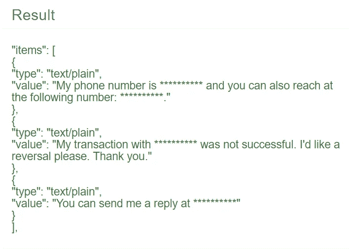
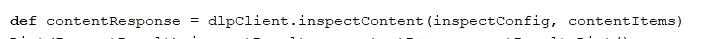

# Google DLP API —示例 Groovy (Java)集成客户端代码

> 原文：<https://medium.com/google-cloud/google-dlp-api-sample-groovy-java-integration-client-code-98e7a309fa0?source=collection_archive---------0----------------------->

这是我的第一篇中帖。我在[http://www.hafiz.com.ng](http://www.hafiz.com.ng)有一个博客，所以它回避了为什么我也开始在媒体上写作的问题。简单。我现在的意图是继续在我当前的博客上发布个人的和非专业的东西，而我的媒体帖子将只包含技术和职业相关的内容。也就是说，让我们直接进入这篇文章的主题。

本周在工作中，我不得不将一个 Groovy 客户端集成到[谷歌新生的 DLP(数据丢失预防)API](https://cloud.google.com/dlp/demo/) 。我不得不承认这是我最近不得不做的最困难的事情之一。有趣的是，尽管解决集成的主要挑战非常困难，但解决方案却非常简单。



通过 Google 的数据丢失防护(DLP) API 编辑的带有敏感信息的文本

我写这篇文章，不是因为 API 难搞。不。我是因为在寻找整合挑战的解决方案的时候，老实说，这在当时是相当令人生畏的，我承诺如果我能够克服它们，我会发一个帖子。所以让我们开始吧。

# 挑战 1

我花了相当长的时间才找到正确的客户端库来促进与 API 的通信。似乎有太多的 Google 仓库名称中带有 DLP，所以我浪费了相当多的时间来摆弄错误的库，直到我在 GitHub 上找到这个 [**DLP API 示例**](https://github.com/GoogleCloudPlatform/java-docs-samples/blob/master/dlp) 。

在我找到这个样本之前，我花了几个小时试图找出这个 DLP 客户端库，这是我在 Google 上找到的第一个结果。不幸的是，我在网上找不到任何使用过它的样本。因此，我艰难地在 JAVADOCs 中寻找[并编写试错法代码，看看我是否能找出集合在一起形成完整解决方案的类和方法；一切都无济于事。](https://developers.google.com/resources/api-libraries/documentation/dlp/v2beta1/java/latest/overview-summary.html)

**解决方案 1**

解决方案是找到[这个 GitHub repo](https://github.com/GoogleCloudPlatform/java-docs-samples/blob/master/dlp) ，它包含使用 Google DLP API 的样本代码。一旦我找到它，我所要做的就是理解代码并使它适应我的用例。

步骤很简单:

*   按照 GitHub 自述文件中的说明，将[开源 DLP 客户端库](https://github.com/GoogleCloudPlatform/google-cloud-java/tree/master/google-cloud-dlp)作为依赖项添加到您的项目中

```
compile **'com.google.cloud:google-cloud-dlp:0.21.1-alpha'**
```

*   前面引用的示例使用这个客户端库进行数据检查和编辑。请随意将代码复制并粘贴到您的项目中，并根据您的环境进行调整。你可以在这个 GitHub repo 文件夹中找到[示例代码文件。](https://github.com/GoogleCloudPlatform/java-docs-samples/tree/master/dlp/src/main/java/com/example/dlp)

# 挑战 2

一旦我成功地将 DLP 客户端库包含在我的项目中，就该对它进行测试了，看看它是否真的适合我。在这个示例的帮助下，我很快地整理了一些代码，满足了 DLP inspect 方法的所有输入要求，并在调试模式下运行了我的项目。这是关键时刻。

令我沮丧的是，在向 DLP API 发送 HTTP 请求时，客户端库代码中抛出了一个神秘的“NoSuchMethod”异常。

**方案二**

当然，我又一次点击了搜索引擎，这次是以无与伦比的劲头。幸运的是，有成千上万的其他开发人员在我之前发起了这场战争，并且都活了下来。我花了不到 30 分钟就摆脱了这个困境。

我发现这个异常是由于我的 Grails 项目中包含的 Guava 库版本的一些问题造成的(在 StackOverflow 页面)。我所要做的就是在我的项目中再包含一个依赖项，它指定了一个比我的 scrap 项目中默认包含的更高版本的 Guava 库(20.0)。***)

```
compile **'com.google.guava:guava:20.0'**
```

此时，我能够在我的机器上成功地测试样本代码。找到了。当我的调试器在尝试与 DLP API 通信时，没有抛出另一个神秘的异常，而是向我展示了美丽的 JSON 响应，它的到来标志着我作为一名程序员毕生奋斗的这一集的结束时，我感觉自己像是美国总统。



一行来统治他们所有人

在这个集成过程中，我面临了另一个挑战，它与 Google DLP API 或客户端库没有直接关系。

# 挑战 3

在将 DLP API 客户端库依赖引用从我的 scrap 项目复制到主项目的 gradle 构建脚本之后，我无法再构建我的项目了([参见 StackOverflow 链接，了解我所面临的确切问题](https://stackoverflow.com/questions/10519558/createprocess-error-206-the-filename-or-extension-is-too-long-when-running-main))。

**方案三**

原来，这个问题是由于 Windows 操作系统对要在该操作系统上执行的任何应用程序的路径长度的限制。解决方案是…我不会浪费时间来谈论它，因为我对它如何解决问题只有一个基本的了解。链接到[解决我问题的方法就在这里](https://github.com/grails/grails-core/issues/9300)。我所做的只是将下一个代码片段(逐字)粘贴到我的 build.gradle 文件的根级别。对于根级别，我的意思是代码片段的任何部分都不存在于任何其他代码块中。

嘿，在编写代码之前，我认为值得一提的是，这个问题的许多其他答案都建议在构建脚本中添加一个“pathingJar”任务(而不是这个解决方案中的“launcherJar”任务)。我从我的编译器那里得到的错误非常清楚地表明，任务不能被创建，因为“任务‘pathing jar’已经存在”。

我花了相当多的时间试图找到一种方法来编辑或覆盖默认的 pathingJar 任务，但都没有成功。在此期间，我学会了如何列出我的 gradle 项目中的所有构建任务和依赖项。我显然有一些关于 Gradle build 工具的资料要读:@

```
task launcherJar(type: Jar) {
    def gradleUserHome = new File(gradle.getGradleUserHomeDir(), "caches")

    def relativeClasspathEntries = configurations.runtime.files.collect {
        new File(gradleUserHome.getAbsolutePath()).toURI().
                relativize(new File(it.getAbsolutePath()).toURI()).getPath()
    }
    appendix = "launcher"
    destinationDir = gradleUserHome
    doFirst {
        manifest {
            attributes "Class-Path": relativeClasspathEntries.join(" ")
        }
    }
}

compileGroovy{
  dependsOn launcherJar
    FileCollection collection = files(launcherJar.archivePath);
    def finCollection = collection
    doLast {
        classpath = finCollection
    }
}

bootRun{
    doFirst{
        //The main build directories aren't collected so they are added manually
        FileCollection collection = files("${project.rootDir}/build/classes/main") + files("${project.rootDir}/build/resources/main") + files(launcherJar.archivePath)
        println collection.files
        classpath = collection
    }
}
```