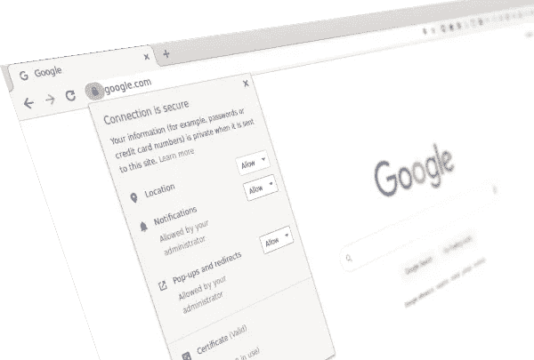
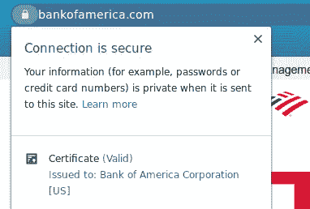
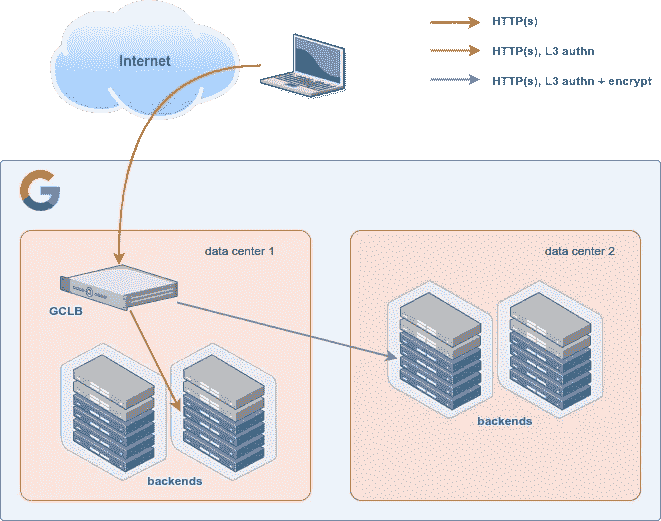

# 谷歌的 GCLB 不符合 RFC

> 原文：<https://medium.com/google-cloud/google-doesnt-comply-with-rfcs-bc239b014b05?source=collection_archive---------1----------------------->

当你在 GCP 谷歌云负载均衡器(GCLB)后面部署一个后端系统时，你可以使用 TLS 来保护它们之间的通信。定义 HTTP over TLS 如何工作的 RFC 是 [RFC 2818](https://tools.ietf.org/html/rfc2818) 。这个机制包括从服务器(在这个例子中是后端)向客户端(GCLB)发送一个证书进行验证。结果是我们没有验证那个证书。

# 矛盾的情况

GCLB 是我们的 HTTP(s)负载平衡器。它是一个反向代理，因此外部用户连接在它上面终止，然后创建一个从 GCLB 到后端的新连接。您可以选择在此通信路径上启用 TLS 加密(HTTPs)。

在 TLS 交换中，数字证书及其对应的公钥用于生成会话密钥以保护连接。你可以在 [RFC 5246](https://tools.ietf.org/html/rfc5246) 和其他相关 RFC 中找到所有细节。在继续之前，这个证书需要由客户端验证，但是正如我们在我们的公共[文档](https://cloud.google.com/load-balancing/docs/ssl-certificates/encryption-to-the-backends#secure_backend_protocol_considerations)中声明的:

> 当 GFE 连接到谷歌云中的后端时，GFE 接受您的后端提供的任何证书。gfe 不执行证书验证。例如，即使在以下情况下，证书也被视为有效:
> -证书是自签名的。
> -证书由未知的证书颁发机构(CA)签署。
> -证书已过期或尚未生效。
> -`CN`和`subjectAlternativeName`属性与`Host`头或 DNS PTR 记录不匹配。
> 
> 注意:GFE 代表谷歌前端，实现 GCLB 的系统

什么？怎么会这样 Google 的安全性是一流的，您的安全是我们的头等大事。然而，这似乎是矛盾的。它违背了 RFC，它不检查服务器身份，并为中间人攻击敞开了大门！

我确信这可能会让一些人感到紧张，尤其是负责公司安全的安全团队。不要慌，我说过这是一个悖论，让我解释一下。

# 狂野的网

TLS 上的 HTTP 和数字证书主要用于保护 Internet 和 WWW 中的通信。当然，在内部网络中也有广泛的应用，但是 WWW 代表了一个更通用的(更广泛的)框架。

例如，当用户访问他们的在线银行账户时，他们希望确保他们到达正确的服务器，并且他们的通信不能被解密，他们的数据不能被窃取。这不是一个容易实现的任务，因为有许多威胁存在:恶意软件，DNS 欺骗，BGP 劫持…

为了帮助完成这项任务，我们都使用了基于证书和 TLS 协议的安全框架。这为我们提供了很好的保护:

我们还没有完全安全，复杂的攻击可能会发生，但这大大提高了安全性。

# 一个新的场景

在 GCP 运行后端服务器是一个与 WWW 完全不同的场景。您将看到改变威胁模型的显著差异。

首先，客户端(GCLB)和服务器(后端)运行在同一个网络中，这个网络由谷歌管理和保护。我们控制系统通信并正确路由流量。这意味着之前提到的一些威胁，尤其是那些与拦截流量相关的威胁，在我们的场景中并不适用。为了更好地理解 GCP VPC 网络如何路由流量，你可以阅读我的关于 dmz 的文章。

在网络层，我们的虚拟网络验证 GCP 境内的所有流量。这种身份验证是通过安全令牌实现的，可以保护受损主机免受网络上的欺骗数据包的攻击。数据包直接从虚拟机发送到虚拟机，安全令牌包含发送方和接收方的身份验证信息。发送端的控制平面设置令牌，接收主机验证令牌。如果主机收到来自恶意发送方的数据包，或者不是发往该主机的数据包，该数据包就会被丢弃。

如果您关心多租户架构中受损系统的相关主题，您可能想阅读我关于[机密计算](/google-cloud/confidential-computing-is-cool-1d715cf47683)的文章。

当流量超出 Google 物理控制的设施时，我们会在网络层以类似于 IPsec 的方式进行加密，从而保护通过我们数据中心的客户流量。你可以在这个[文档](https://cloud.google.com/security/encryption-in-transit)中找到更多关于谷歌云中传输加密的细节。我建议您阅读它，以了解我们在保护基础架构和客户数据方面付出了多少努力。

请记住，您控制着注册到 GCLB 的后端。无论是在集群中运行的虚拟机还是 pod，这都是客户 GCP 配置的一部分。谷歌和 GCP 的其他客户都不能修改这个组件。

# 结论

正如您所看到的，我们有一个安全的平台和几个替代机制来确保只有真正的后端可以与 GCLB 进行对话，这使得没有必要像通常要求的那样验证证书及其携带的身份。这也简化了客户的设计、实施和管理。

实际上，这符合 RFC 2818，[第 3.1 节](https://tools.ietf.org/html/rfc2818#section-3.1):

> 如果客户端具有关于服务器的预期身份的外部信息，则可以省略主机名检查。

安全不仅仅是检查一份安全清单。这可以帮助您进行组织，但是云已经改变了一些游戏规则，您需要分析和理解这种新的环境。我希望这篇文章能对你有所帮助！