# Google Forms to Datastudio

> 原文：<https://medium.com/google-cloud/google-forms-to-datastudio-74bfdb6ddd71?source=collection_archive---------0----------------------->

> ..或者如何通过“unpivoting”将平行列中的同构数据放到 Datastudio 上的单个 DataSource 中。
> **【链接】下的**代码；如果你懒得滚动: [Datastudio](https://datastudio.google.com/u/0/reporting/9efbbc78-be8e-4d08-b7e0-7a105114d088/page/j1qNB) 和 [GitHub](https://github.com/palladius/unpivoting)

# 介绍

让我们假设你有一个[谷歌表单](https://docs.google.com/forms/d/e/1FAIpQLSc8Z4fFe9AtjilgJF179Kr6rOo-7uV3vTuLtTCuFiFvfkkwSg/viewform?usp=sf_link)，有 N 个问题，在回答空间中是不同种类的。

1.  你觉得冰淇淋怎么样？[1–5]
2.  你觉得比萨饼怎么样？[1–5]
3.  你觉得谷歌的产品怎么样？[1–5]
4.  你支持唐老鸭吗？{是/否/弃权}
5.  你喜欢冰淇淋吗？{是/否/弃权}
6.  你支持博尔佐纳罗吗？{是/否/弃权}

这 6 个问题是“异质”的，但是如果你把它们分成两组，每组三个，它们就是同质的。这意味着，虽然问题 1 和 5 *感觉*相同，但是[1/2/3]和[4/5/6]的问题输出是相似的。这意味着我们可以放入同一个图 1，2，3，然后在另一个图中我们可以比较 4/5/6，但我们不能放入同一个图[1，5]，除非我们做出一些语义妥协(在 1 到 5 的范围内，白色表示是，什么是不是？3 是弃权吗？不同的人可能有不同的想法)。

# 问题陈述

虽然 Google Forms 提供了许多列(每个答案一个)，但 Google Datastudio 想要的更少(每个组一个)。我有一种感觉，你可能有两种不同的工具和我一样的问题；如果有，继续读下去。

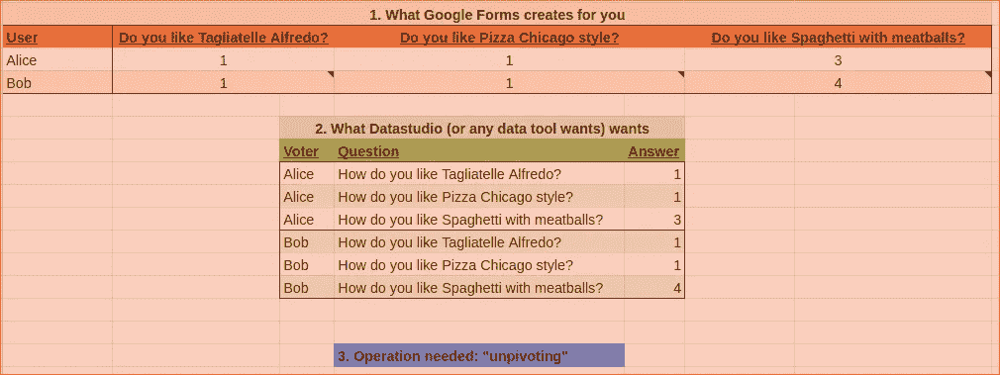

本教程将向您展示如何使用 Google **表单**，Google **电子表格**， [**AppsScript**](https://developers.google.com/apps-script) 和 **Datastudio** 将汇总的数据比较成漂亮的图表，首先通过一些*反透视*对数据进行按摩。

# 关于作者

我是一个生活在国外的**意大利人**，表格中的问题强烈带有我的国籍偏见。美国人，你可能不同意我对披萨、意大利面和意大利面上的肉丸的一些看法(尽管大约 6000 万意大利人可能不会同意)。没什么大不了的。

我也喜欢骑自行车，弹钢琴，和我的两个孩子一起玩。[更多关于自己的](http://www.palladius.it)。

# 先决条件

请**开始投票** [**这里**](https://docs.google.com/forms/d/e/1FAIpQLSc8Z4fFe9AtjilgJF179Kr6rOo-7uV3vTuLtTCuFiFvfkkwSg/viewform?usp=sf_link) 。如果你先把数据填好，你就会明白了。如果你不想和我分享你的邮件，请不要投票。

拥有一个谷歌账户。所有实验都是免费的(感谢谷歌！我可能有偏见)并且我已经尝试打开我创建的工件以确保你能跟随。在这个练习中，我们将使用[谷歌表单](https://docs.google.com/forms/u/0/?tgif=d)、[谷歌电子表格](https://docs.google.com/spreadsheets/u/0/)(及其*神奇的*脚本功能)和[数据工作室](https://datastudio.google.com/)。

# 创建您的表单

让我们拿一个 [Google 表单](https://docs.google.com/forms/d/1_FOwUao7juUbXc_cskhLBcjkjyQkXirJSqrJTm2326c/edit) ( [视图](https://docs.google.com/forms/d/e/1FAIpQLSc8Z4fFe9AtjilgJF179Kr6rOo-7uV3vTuLtTCuFiFvfkkwSg/viewform))并开始填充几个多选网格:

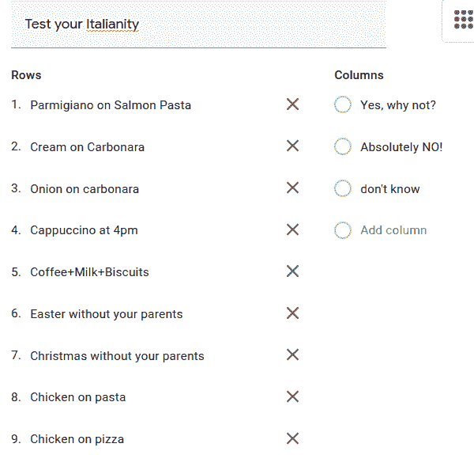

…变成(在*视图*格式中):

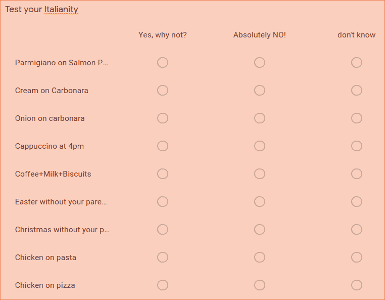

[**下面是**](https://docs.google.com/spreadsheets/d/1KR0UBQr5MkCfDNylDpo8cnj5NoPuZbY1gIIGKIIrcaU/edit#gid=468422675) 电子表格如何对数据进行编码。

注意:您可以随意编辑表单，但是如果您这样做，电子表格将会改变，公式将会中断。

未来的自我提醒:创建一个足够智能的公式来跟上变化，并从标题中自动推断公式。

# 将您的投票导入 Datastudio

如您所见，电子表格中每一票占一行，每一个决定都在一列中(足够合理):

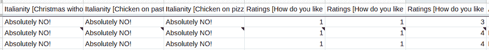

*(注:黑三角来自谷歌:他们说第二个人(我)改变主意了，revoted。酷！)*

问题:虽然三个决策有三列，每个投票者一行对 Google Forms 有意义，但对 Datastudio 或任何数据可视化工具没有意义，它们宁愿有两列和更多行:

在[数据工作室](https://datastudio.google.com/u/0/)上，导入该选项卡如下所示:

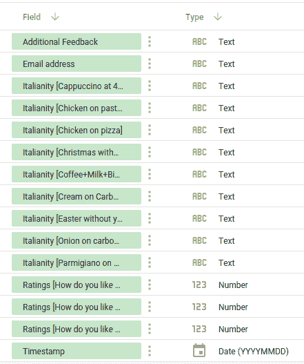

如果你想有一个图表来比较所有的“意大利式”问题，你需要“反透视表格”，这意味着将它们从每人 1 行 N 列变成 N 行 3 列(为什么是 3 行？键、值和某种 voter_id，如他们的电子邮件)。

# 问题！

现在，向 Datastudio 添加图表来比较所有意大利语问题并不容易。你可以为每个意大利语问题制作一个手工图表(或者做一个，然后剪切和粘贴其他的)，但是当你添加一个问题时，添加另一个图表或者将事情合并在一起是很昂贵的。

没有办法正常地在那些字段上添加统计数据。

# 解除救援！

里克骑着自行车穿过苏黎士，同时经历了 *anagnorisis* : *“尤里卡！必须是***！”**

*[我在苏黎世山区骑自行车](https://www.strava.com/activities/3340930677)(幸运在 covid 时代！)思考:一定有解决的办法，而且一定在 Stackoverflow 上。唯一的问题是:*我如何谷歌它？我基本上有一个数据透视表，但这一次我不需要它了！我需要它的反面。*找到了！我会谷歌一下“取消表格透视”，看看会发生什么。得了吧，一定有人发布了一些解决方案，并称之为 unpivot。注意:我 100%确定一个解决方案存在并且被记录在案，我只是需要一个人为它想出同样吸引人的名字，否则谷歌搜索不会帮助我。我等了 60 分钟才知道谷歌 unpivot 是否会给我带来一些有用的文章。***

*洗完澡后，我谷歌了一下，马上发现了这个: [Stackoverflow 文章](https://stackoverflow.com/questions/24954722/how-do-you-create-a-reverse-pivot-in-google-sheets)Viktor 编写了一个漂亮的通用代码来 *unpivot* 一个通用表格。他还继续演示了一个[双开](https://docs.google.com/spreadsheets/d/12TBoX2UI_Yu2MA2ZN3p9f-cZsySE4et1slwpgjZbSzw/edit#gid=422214765)(！)*

# *在答案电子表格中应用取消透视*

1.  *将原来的选项卡从“表单响应 1”重命名为“**响应 1** ”。我讨厌空格，表单填充不会中断，如果这个电子表格将包含其他表单结果，您需要“1”；-)*
2.  *因此，让我们将代码复制到 AppScripts 中:“工具>脚本编辑器”*
3.  *剪切并粘贴[代码](https://github.com/palladius/unpivoting)到其中，并添加学分到 Victor 并保存。*

*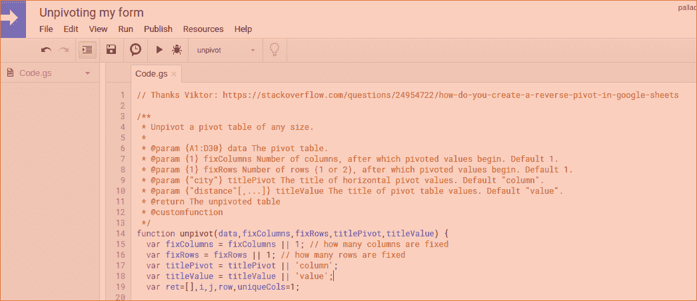*

1.  *在我们继续之前，我们需要对我的床单进行 x 光检查，因为我们以后会用到它。*
2.  ***A** :时间戳*
3.  ***B** :电子邮件地址*
4.  ***CDEFGHIK** : Italianity[..]“轴心”(答案:是否也许)*
5.  ***LMN** :评级[…]支点(答案:1-5)*
6.  ***O** :附加反馈*
7.  *让我们回到电子表格，添加一个新的选项卡，并调用“ **Unpivot1** ”来对 *CDEFGHIK* 中的数据进行 unpivot——我们稍后将为 LMN 创建一个 unpivot2。*
8.  *移到下一章来填充逆透视。*

# *填充取消透视*

*现在我们有了一天中创造性的和稍微复杂的部分。我们有两个支点(使这个练习更复杂一点)。因此，我们需要某种“键”来映射 unicity，以便将数据链接在一起(稍后您会看到)。为了做到这一点，我选择强迫人们给出他们的电子邮件作为一个好的唯一性密钥。如果你想让你的表单匿名，要么你找到另一个唯一的 id，要么你编码一个(当然，就像原始的行号！)，或者使用 timestamp(但是您可能会有冲突的风险，因为两个人可能会在同一秒内投票—表单粒度是秒)。*

*如果我们有一个单一的枢纽，这将是超级容易的，但我想让这个练习不太琐碎，并向你展示我在谷歌电子表格上了解到的矩阵魔术:)*

*看一下表单模式，我们有 A-B-O，它们是“普通字段”,我想保留它们作为维度；然后是 C-K，表示另一个维度"*Italian yes 和 no 的*"，最后是 L-N，表示 1-5 票。希望这个例子足够通用，可以帮助您解决自己的问题。*

## *第一部分。取消第一次多项选择投票(意大利语)。*

*我们想先取消所有“固定”维度的透视，然后取消“意大利式”透视，再取消“收视率”透视。在列方面，我们将有:*

*   ***A'** :时间戳(是 A)*
*   ***B’**:电子邮件地址(was B)*
*   ***C’**:附加反馈(was O)*
*   ***D'** :意大利式钥匙(在 C1:K1)*
*   ***E'** :意大利文值(在 C2 是:K)*
*   ***F’**:ratings key(同上，但在 L:N 中)*
*   ***G'** : RatingsValue(" ")*

*在一些尝试错误之后，这是放入 A1 的公式:*

## *=unpivot(Responses1！A1:K，2，1，" ItalianityKey "，" ItalianityValue ")*

*其中“2”代表固定列的数量。*

*结果[这里](https://docs.google.com/spreadsheets/d/1OmzVIVJjQ0Ou1ZsMdNDx4Hp_Qhp3zGSnll6oqWhM3I4/edit#gid=1518562286):*

*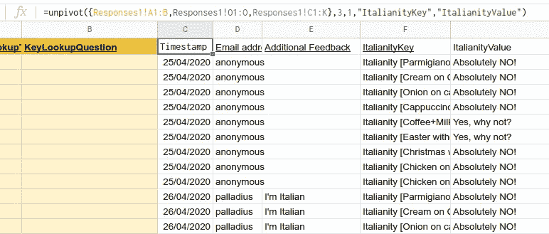*

*等等！忘了 O 的附加反馈！*

*我花了一个多小时才想出一个解决方案，但我学到了更多关于细胞魔法的知识，所以让我与你分享。我们有两个选择:*

1.  *更改 unpivot 的代码，以允许来自其他列的更多数据(更像是一个弗兰肯斯坦式的不可重用函数)*
2.  *向 unpivot()提供一个数据重组，将内容放入函数期望的位置(N 个固定列+ M 个透视列)*

*在正常情况下，我会选择(1)证明我也能编码；但是我有一个小宝宝，时间不是我的强项。所以我选择(2)。如果有一种方法可以在 B 和 C 之间插入 O 列(例如，整理列 A-B，O，C-K，..).经过大量的谷歌搜索，我找到了它！*

***提示:**你可以用“{}”来合并列和行，用“，”联合列和“；”合并行。尝试这样做:*

> *={A1:b3，o1:o3，c1:k3} #简单*
> 
> *={{ "自定义标题"；A2:b3}，o1:o3，c1:k3} #更难*

***注意**:当然你可以去掉上面的数字 3(A1:B)，但是你需要确保这两列的长度相等，否则你会收到一个错误！*

*新的复杂公式是这样的:*

> *=unpivot({Responses1！A1:B，Responses1！O1:O，Responses1！C1:K}，3，1，“ItalianityKey”，“ItalianityValue”)*

*这是它看起来的样子:*

*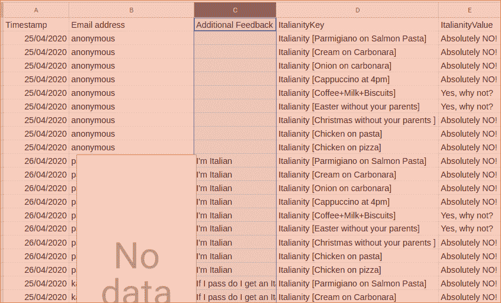*

*如您所见，我们的所有数据都在正确的位置。*

*我无法告诉你我有多自豪，当我得到这个工作！你呢？*

## *第二部分。取消第二个“支点”(评级)。*

****Wait — wOt？为什么我们需要第二个表*** *？很棒的问题！有些答案是肯定/否定的，有些答案是 1，2，3，4，5。不同的输出，不同的表格。**

*现在，我们已经拥有了第二张表的所有要素，只有一点需要注意。*

*这一次复制所有的关键点是没有意义的，我们只需要枢轴。*

*不幸的是，unpivot 不允许我们有零个键，所以我们将再次使用电子邮件。*

*因此，我们想使用:*

*   *b(用于电子邮件)*
*   *LMN(用于枢轴 2)*

*如果您遵循了第 1 部分，这是微不足道的:*

> *=unpivot({Responses1！B1:B，Responses1！L1:N}，1，1，“RatingsKey”，“RatingsValue”)*

*并将其附加到 Unpivot1 (F1)中的第一个空闲单元格:*

*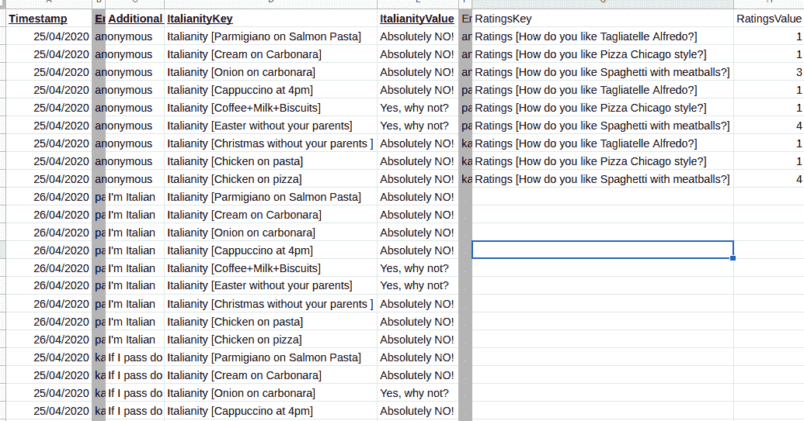*

*现在，如你所见，两个维度(斜体和评级)的基数是不同的。只有两种方法可以从概念上解决这个问题:*

1.  ***优雅的**。将透视迁移到数组中，以便 anonymous 拥有一个 ItalianityKey/values 和 RatingsKey/values 数组。使用 protobufs 进行模式定义(它们支持重复字段)和 BigQuery 或 Cloud Spanner 作为数据库，这很容易实现。*
2.  ***脚踏实地**。分成 2 或 3 张桌子。我们可以应用关系完整性规则，并有 3 个带有单个主键(电子邮件)的表交叉表:*
3.  *T1:固定值(**电子邮件**，时间戳，反馈)*
4.  *T2:带主键的意大利投票( **Email** ，ItalianityKey，ItalianityValue)*
5.  *T3:用主键( **Email** ，RatingsKey，RatingsValue)进行评分投票*

*请注意，在您的情况下，主键可能是其他东西，在 Google Forms 中，它可能是一封电子邮件，但是您可以很容易地匿名化并使用 row_id(函数 row())。*

*我将以**懒惰**的方式应用选项 2(附加 T1 和 T2，因为我们已经有了它)。*

*所以让我们做这些简单的事情:*

*   *将 Unpivot1 重命名为“Unpivot1Italianity”*
*   *创建“取消透视 1 评级”并粘贴它:*

*=unpivot({Responses1！A1:B，Responses1！O1:O，Responses1！L1:N}，
3，1，“RatingsKey”，“RatingsValue”)*

*搞定了。现在我们可以把所有东西都放在 Datastudio 上。*

# *Datastudio！*

# *连接数据*

*让我们创建一个关于[数据工作室](https://datastudio.google.com/)的新报告(新文件..).我的 datastudio 网址是[这个](https://datastudio.google.com/u/0/reporting/9efbbc78-be8e-4d08-b7e0-7a105114d088/page/j1qNB)。*

*然后，让我们开始为报告创建两个数据:*

*   *点击“添加数据”图标*
*   *选择 Google 工作表*

**

*   *选择您的电子表格，然后更正 tab(“unpivot 1 italianity”)并单击**添加**。*
*   *对“Unpivot1Ratings”进行同样的操作。*
*   *过一会儿，您会看到一个提议的模式。*
*   *接受改变。*

# *添加图表*

*我们需要一个图表，显示所有的意大利投票比较，我们需要适当的颜色。我们还需要一个计数器，显示已经投了多少票。*

*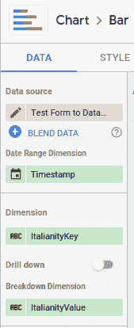*

*   *创建图表栏*
*   *连接到“Unpivot1Italianity”数据源。*
*   *用作尺寸“ItalianityKey”和分解尺寸“ItalianityValue”*
*   *它应该如右图所示。*

*该图应该如下所示:*

*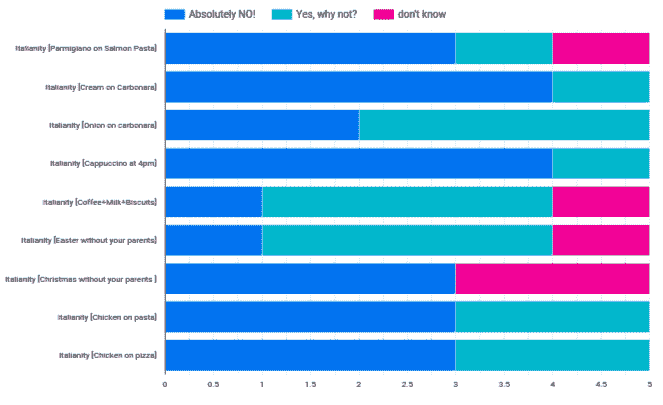*

*好消息:我们已经完成了文章的主要部分:我们在一个图表中收集了人们对第一个多选(“意大利语”)的所有主题的投票，并且我们可以毫不费力地对第二个多选进行同样的处理。*

*坏消息:从图形上看很糟糕！*

# *一些视觉增强*

***第一，颜色完全随机**。幸运的是，Datastudio 允许我们智能地给值分配颜色(全局地读:*)。酷！**

**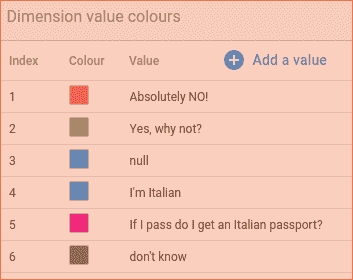**

**跟随我的领导:**

*   **选择图表**
*   **在右边，移动到“风格”标签。**
*   **向下滚动到“颜色依据”->“尺寸值”。**
*   **答对了。现在自定义尺寸值。例如，我会制作:**
*   ****是**:绿色**
*   ****否**:红色**
*   ****也许**:灰色。**
*   **你做你想做的。请注意，所有值都在一起，跨越不同的维度。就我而言，既有对意大利的回答(1，2，6)，也有我和我妻子的随机回答，他们显然想要一本意大利护照:)**

**第二，字段不可读。你怎么能责怪他们呢？Google forms 产生了这样的值:**

1.  **意大利[帕尔玛意大利三文鱼意大利面]**
2.  **意大利风味[奶油烤饼]**
3.  **意大利风味[碳烤洋葱]**
4.  **意大利风情[下午 4 点的卡布奇诺]**
5.  **意大利语[咖啡+牛奶+饼干]**
6.  **意大利式[没有父母的复活节]**
7.  **没有父母的圣诞节**
8.  **意大利面[鸡肉意大利面]**
9.  **意大利语[比萨饼上的鸡肉]**

**..和..**

1.  **评分【你觉得阿尔弗雷多意大利面怎么样？]**
2.  **评分【你觉得芝加哥披萨怎么样？]**
3.  **评分【你觉得肉丸意面怎么样？]**

**你看到这里有重复的地方吗？我几乎看不到一些；-)**

**我们可以在 Datastudio 或电子表格中解决这个问题。**

**作为一名 **Ruby on Rails** 开发者(什么？我刚刚被解雇了吗？)，我非常相信 [MVC](https://en.wikipedia.org/wiki/Model%E2%80%93view%E2%80%93controller) 模式，并且相信这里的问题在于模型，而不是视图。所以我们来修复代码吧！我看到两个解决方案(如果你看到第三个更好的方案，请告诉我):**

1.  **使用谷歌电子表格清理标题 C1-K1。也许可以使用第二个表来完成。这是最简单的解决方案，但它不会干。没有。**
2.  **修补 unpivot 代码，将“Foo [Bar]”模式识别为单个一次性模式。**
3.  **修补 unpivot 代码，以一种非常特殊的方式识别“Foo [Bar]”模式，使功能更好，让 Victor 为我们感到骄傲。**
4.  **使用 Google 电子表格创建一个“清理”临时表，并将长名称映射到短名称。然后在逆透视表中使用查找列。**

**我认为 3 非常酷:我想以这样一种方式编码它，如果调用函数的名称是“FooKey”，第一个单元格是“Foo [whatever]”，它将内容更改为“whatever”(删除“Foo [”和“]”部分)，这是我们的用例。在花了 40 分钟后，我离开了它，因为 AppsScript 不是解决代码问题的最佳地方(或者可能我的 JS foo 不如我的 Ruby 强大)。**

**然后我选择了#4，它简单明了，允许逐步调试(唉，它引入了一个我们并不真正需要的临时表)。**

**让我们创建一个名为“headers magic”的选项卡，在 A:E:**

*   **圆柱**
*   **列名**
*   **包含方括号**
*   **关键名称**
*   **键值**

**A2:E2 中的这些值:**

1.  **=row()-1**
2.  **=转置({Responses1！A1:Z1})**
3.  **=iferror(IF(find("["，B2)>0，TRUE，""，FALSE)**
4.  **=split(B2，"[]")**
5.  **让这个空着**

**..然后复制并粘贴列 C/D。**

**您应该获得类似以下的内容:**

**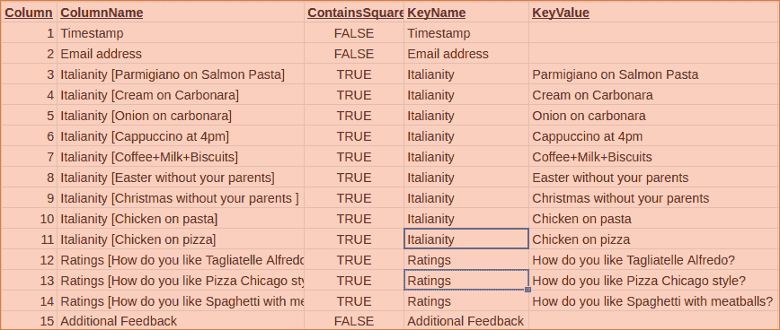**

**现在我们回到正题。我们需要向 Unpivot 表中添加几列。**

1.  **让我们从“Unpivot1Italianity”开始**
2.  **将 A1 的内容复制到 C1 中(现在我们有一个空的 A/B)。在 C1，您应该有=unpivot({Responses1！A1:B，Responses1！O1:O，Responses1！C1:K}，3，1，“ItalianityKey”，“ItalianityValue”)**
3.  **分别调用 A1/B1:[**key lookup title**， **KeyLookupQuestion** 。**
4.  **给 A2 加上这个公式:= array formula(if error(VLOOKUP(F2:F，HeadersMagic！B2:E，{3，4}，0)，""))**
5.  **将相同的概念重复到“Unpivot2Ratings”中。**

**让我们简单解释一下第 4 步:在你的 F 列的行中查找 at，从 F2 开始；你觉得“意大利式(帕尔玛干酪配三文鱼意大利面)”怎么样？很好。现在在 HeadersMagic 中搜索 B、C、D、E 单元格(不是我们不用 C)。你在 B 列的某个地方找到字符串了吗？是的，你有！在 B4！很好，现在从数组 B4 中:E4 取出元素 3rd 和 4rd，它们是“Italianity”和“Parmigiano on Salmon Pasta ”,并把它们放在“KeyLookupTitle”和“KeyLookupQuestion”下。如果没有找到任何内容，则添加一个空字符串(" ")。最后，ARRAYFORMULA 说:对找到的所有单元格继续这样做(在本例中是数组 F2:F，表示 F 有值的所有单元格)。**

**这是两个数据透视表现在的样子。我把这两种新颜色涂成了黄色，为了隐私，我把邮件藏了起来。**

**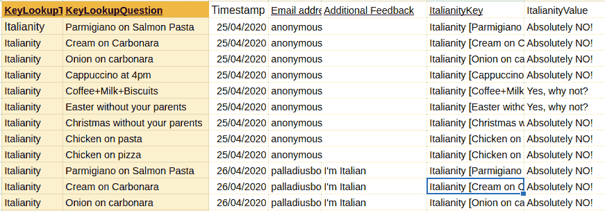****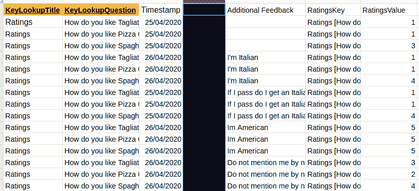**

**现在我们只需要返回到 **Datastudio** ，并“重新解析”数据结构。**

*   **打开数据工作室**
*   **资源>管理数据源**
*   **打开“取消透视 1 评级”**
*   **刷新字段**

**之前:**

**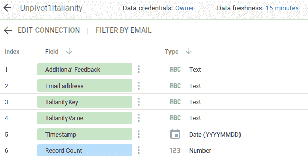**

**之后:**

**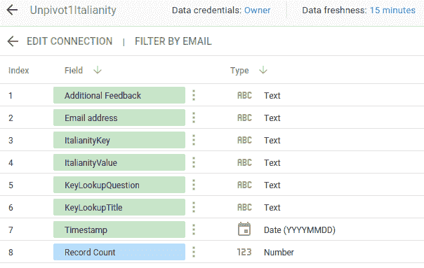**

**现在在图表中，将“ItalianKey”改为“KeyLookupQuestion ”,结果如下:**

**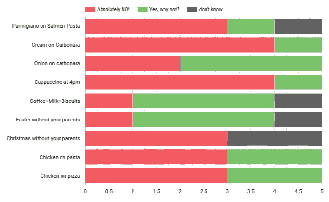**

**哇，这么小的细微差别花了比预期更长的时间！现在，让我们添加评分图表。由于它是整数，我们可以用平均值(RatingsValue)来作图:**

**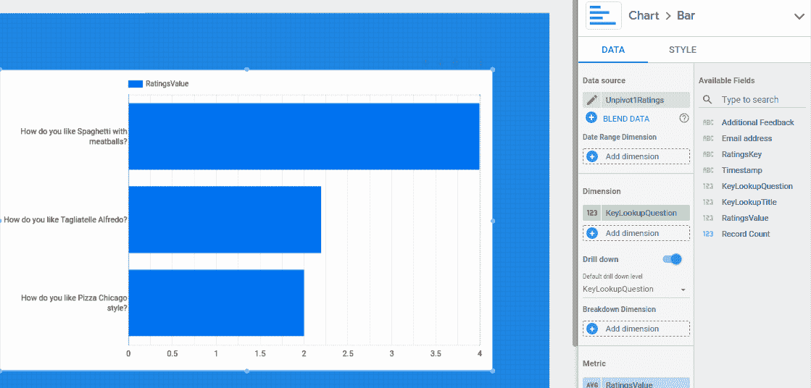**

# **变更管理**

**哇，这看起来像一个愚蠢的表单可视化的大量工作，对不对？**

**那么，这个演示有什么酷的呢？我们还没看过。**

**假设您想在表单中添加一个问题，比如说:**

*   **对意大利人的另外两个问题(没有太阳的太阳镜，比萨饼，西红柿，马苏里拉金枪鱼)**
*   **还有三个评分问题**

**[awesome_part]现在，您只需更改表单，只需更改 unpivot1a 和 unpivot1b 的两个公式(让它再解析几列)。Datastudio 甚至不会注意到这种差异，因为它从具有固定列数的 unpivot 表中解析数据(我们只会有更多的数据)。[/awesome_part]**

# **链接**

*   **谷歌表单( [**视图**](https://docs.google.com/forms/d/e/1FAIpQLSc8Z4fFe9AtjilgJF179Kr6rOo-7uV3vTuLtTCuFiFvfkkwSg/viewform) )**
*   **表单响应([匿名表单复制](https://docs.google.com/spreadsheets/d/1OmzVIVJjQ0Ou1ZsMdNDx4Hp_Qhp3zGSnll6oqWhM3I4/edit#gid=468422675) ) — [宏代码](https://script.google.com/macros/d/1HWJXIFv4bsfFzg0xWf_WsFWf1CuWhcrSR2YSxB4YLC5GBrx9tVfx7cXp/edit?mid=ACjPJvGX9F5n4DxoBJxd6Qa5PnpCF13YCHVl2HUmhBYOEg6LIHY2lyFTycs58kAg0MI3lsmfTdm9liBI6TITe9lWMUAND1WZeUWf8G15EnsbHrNaWKZsa1H4H3YE57enwsLNOiQh2f6WJr8&uiv=2)**
*   **[数据工作室报告](https://datastudio.google.com/reporting/9efbbc78-be8e-4d08-b7e0-7a105114d088/page/j1qNB)(公开)**
*   **github 上的代码(以防我忘记了什么，我会贴在那里):[https://github.com/palladius/unpivoting](https://github.com/palladius/unpivoting)**

# **信用**

*   **维克多·塔博瑞为[解算公式](https://stackoverflow.com/questions/24954722/how-do-you-create-a-reverse-pivot-in-google-sheets)。非常感谢！**