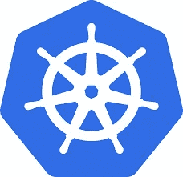

# Google Kubernetes 引擎(GKE)安全最佳实践

> 原文：<https://medium.com/google-cloud/google-kubernetes-engine-gke-security-best-practices-d11a230f8e49?source=collection_archive---------0----------------------->

在云提供商争夺最佳管理的 Kubernetes 服务的战斗中，谷歌 Kubernetes 引擎(GKE)作为他们最喜欢的选择领先于许多人。Kubernetes 在不断发展，GKE 也在快速创新。毕竟，Kubernetes 在被云计算原生计算基金会(CNCF)采用之前就诞生于谷歌。

随着 Kubernetes 的发展，它的安全环境也在变化。例如，最近发布的 Kubernetes 1.21 带来了对 PodSecurityPolicies (PSP)的[反对。鉴于这种不断变化的性质，这篇博文旨在回答**当今 GKE 的最佳安全实践是什么？**](https://kubernetes.io/blog/2021/04/06/podsecuritypolicy-deprecation-past-present-and-future/)

# GKE 安全概述

安全是个复杂的问题，没有十全十美的东西，也没有放之四海而皆准的办法。GKE 和谷歌云平台提供了许多功能和服务来增强堆栈每一层的安全性。您应该始终应用最小特权原则，并在与应用程序功能共存的地方应用安全性最佳实践。

默认情况下，GKE 上的许多配置是安全的，但重要的是要知道什么是不安全的，以及在配置 GKE 时有哪些选项。Kubernetes 安全注意事项的完整列表超出了这篇博客的范围，但是将讨论一些 GKE 安全注意事项的高级概述。

# 自动化 CIS 基准测试

互联网安全中心(CIS)为 Kubernetes 提供安全配置基准。理解 GKE 的共享安全模型很重要，因为一些 kubernetes 配置，例如控制平面的大部分配置，是由 GKE 管理的。因此，最好使用特定的 CIS GKE 基准。

有许多工具可以自动执行 Kubernetes CIS 基准审计。GKE 文档引用了使用开源`kube-bench`工具。Kube-bench 扫描可以构建到您的基础设施即代码管道中。

在 Google 云平台上，可以启用安全健康分析来监控 GKE CIS 的一些基准并发出警报。失败的检查将通过云安全指挥中心通知。

 [## CIS 基准测试| Kubernetes 引擎文档|谷歌云

### 本文档解释了什么是 CIS Kubernetes 和 Google Kubernetes 引擎(GKE)基准，如何审计您的…

cloud.google.com](https://cloud.google.com/kubernetes-engine/docs/concepts/cis-benchmarks) 

# 认证和授权

使用 [**谷歌群搜索**](https://cloud.google.com/kubernetes-engine/docs/how-to/role-based-access-control#google-groups-for-gke) 。这个相对较新的特性允许在 google workspace 级别进行细粒度的许可。

使用**最低权限**服务账户。默认情况下，GKE 工作节点将使用默认的计算引擎服务帐户。默认情况下，默认计算引擎服务帐户拥有编辑者级别的权限。应配置对必要的日志记录角色(monitoring.viewer、monitoring.metricWriter、logging.logWriter 和 stack driver . resource metadata . write)具有受限访问权限的自定义服务帐户。此外，工作负载应该配置为使用**工作负载标识**，而不是直接使用工作节点的服务帐户。

 [## 使用工作负载标识| Kubernetes 引擎文档

### 本页解释了推荐您的 Google Kubernetes 引擎(GKE)应用程序使用服务的方式…

cloud.google.com](https://cloud.google.com/kubernetes-engine/docs/how-to/workload-identity) 

# 控制平面安全

虽然 GKE 控制平面由 Google 管理，但有一些配置设置需要由客户决定。kubernetes API 服务器应该配置为只允许 [**私人访问**](https://cloud.google.com/kubernetes-engine/docs/concepts/private-cluster-concept) 。对 kubernetes api 的认证应该通过 **Google Cloud IAM** ，同时确保禁用基本认证和客户端证书认证。

# 节点安全性

确保 GKE 工作节点使用谷歌的 [**容器优化操作系统**](https://cloud.google.com/container-optimized-os/docs/concepts/features-and-benefits) 。Google 专门为运行容器开发和维护这个操作系统，并将安全性放在设计的最前面。它拥有:最小的操作系统占用空间、不可变的根文件系统和经验证的引导、无状态配置、安全加固的内核、自动更新等等。安全特性的完整列表可以在[这里](https://cloud.google.com/container-optimized-os/docs/concepts/security)找到。

启用 [**屏蔽 GKE 节点**](https://cloud.google.com/kubernetes-engine/docs/how-to/shielded-gke-nodes) 。这可以防止攻击者试图模拟您的 GKE 工作节点之一。它通过加密验证几种配置来实现这一点。

# 网络安全性

重申一下控制平面安全部分提到的一点，对您的 kubernetes 资源的访问应该仅限于**私有网络访问**。专用 GKE 集群将只有内部 IP 地址，这意味着默认情况下它们与互联网隔离。

 [## 私有集群| Kubernetes 引擎文档|谷歌云

### 本页解释了私有集群如何在 Google Kubernetes 引擎(GKE)中工作。你还可以学习如何创造和…

cloud.google.com](https://cloud.google.com/kubernetes-engine/docs/concepts/private-cluster-concept) 

为了访问您的私有 GKE 集群，您应该有一个**堡垒主机**。关于如何配置现代云堡垒主机的信息，请查看我在[之前的博文](https://eng.sigmacomputing.com/modern-bastion-hosts-abed8c7c7c63)。

使用 [**网络策略执行**](https://cloud.google.com/kubernetes-engine/docs/how-to/network-policy) 。Kubernetes 网络策略支持控制集群中的 pod 和实体的流量。您的生产服务 pod 后端应该能够与一个刚刚意外启动的 hello-world pod 通信吗？大概不会。用网络策略锁定它。

# 保护您的工作负载

用 [**GKE 沙盒**](https://cloud.google.com/kubernetes-engine/docs/concepts/sandbox-pods) 强化工作负载隔离。GKE 沙盒防止不受信任的代码恶意影响主机内核。此外，沙盒豆荚被禁止访问其他谷歌云服务或集群元数据。

[**工作负载标识**](https://cloud.google.com/kubernetes-engine/docs/how-to/workload-identity) 应用于容器工作负载认证。这使得 Kubernetes 服务帐户能够作为 Google 服务帐户进行身份验证。这允许您为各个工作负载创建细粒度的身份和授权，同时消除对静态服务帐户凭证的需求。

# 审核日志记录

默认情况下，**云日志**和**云监控**处于启用状态。这包括写入 STDOUT/STDERR 的群集审核日志、工作节点日志和应用程序日志。这些日志默认存储 30 天。我建议将这些日志发送到云数据仓库，比如 Snowflake，以便经济高效地长期存储和高效查询。
最近的一篇 [Lacework 博客文章](https://www.lacework.com/blog/hiding-in-plaintext-sight-abusing-the-lack-of-kubernetes-auditing-policies/)强调了不启用 Kubernetes 审计日志记录的一些有趣的危险。

 [## 寻找你的 GKE 日志|谷歌云博客

### 如果未启用 GKE 集成，您可以通过在…中编辑集群来启用集群的日志收集

cloud.google.com](https://cloud.google.com/blog/products/management-tools/finding-your-gke-logs) 

# 供应链安全

启用并执行 [**二进制授权**](https://cloud.google.com/binary-authorization) 。这可以确保只能够部署受信任的容器映像。考虑到运行受损的容器映像是最常见的攻击媒介，签名和验证您的映像是确保安全性的重要步骤。

 [## 二进制授权|谷歌云

### 只为容器和无服务器部署可信工作负载。查看该产品的文档。二进制授权…

cloud.google.com](https://cloud.google.com/binary-authorization) 

扫描容器图像中的已知漏洞和恶意软件。如果你正在使用谷歌的容器注册表，你可以启用**漏洞扫描**。这不仅会在上传期间扫描图像，还会持续监控图像的元数据以发现新的漏洞。

 [## 容器扫描|容器分析文档|谷歌云

### 软件漏洞是一种弱点，可能会导致意外的系统故障，也可能是故意的…

cloud.google.com](https://cloud.google.com/container-analysis/docs/container-scanning-overview) 

# GKE 自动驾驶仪

如果上述所有内容开始听起来像是一项艰巨的任务，不要担心，GKE 自动驾驶仪可以扭转局面。这个新的 Google 托管服务负责 Kubernetes 工作节点的管理。当然，默认情况下，它是以安全的方式做到这一点的。

> 在自动驾驶模式下创建的集群已经处于强化配置中。

自动驾驶实现了 [GKE 强化准则](https://cloud.google.com/kubernetes-engine/docs/how-to/hardening-your-cluster)和如上所述的安全最佳实践。

 [## 自动驾驶概述| Kubernetes 引擎文档|谷歌云

### 自动驾驶是谷歌 Kubernetes 引擎(GKE)的一种新的操作模式，旨在降低运营成本…

cloud.google.com](https://cloud.google.com/kubernetes-engine/docs/concepts/autopilot-overview) 

# 结论

希望现在已经很清楚 Google Kubernetes 引擎是安全领域的行业领导者。由于默认情况下内置了许多安全特性，以及大量额外的可配置选项，确保您的 Kubernetes 集群的安全在 GKE 上变得更加容易。