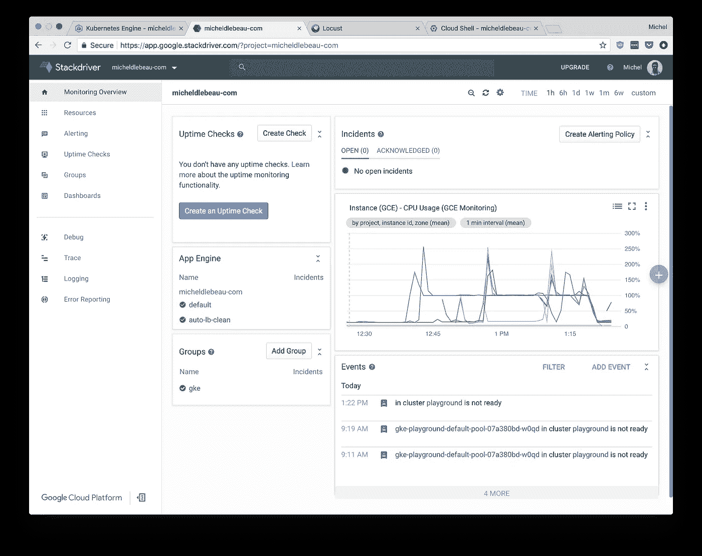
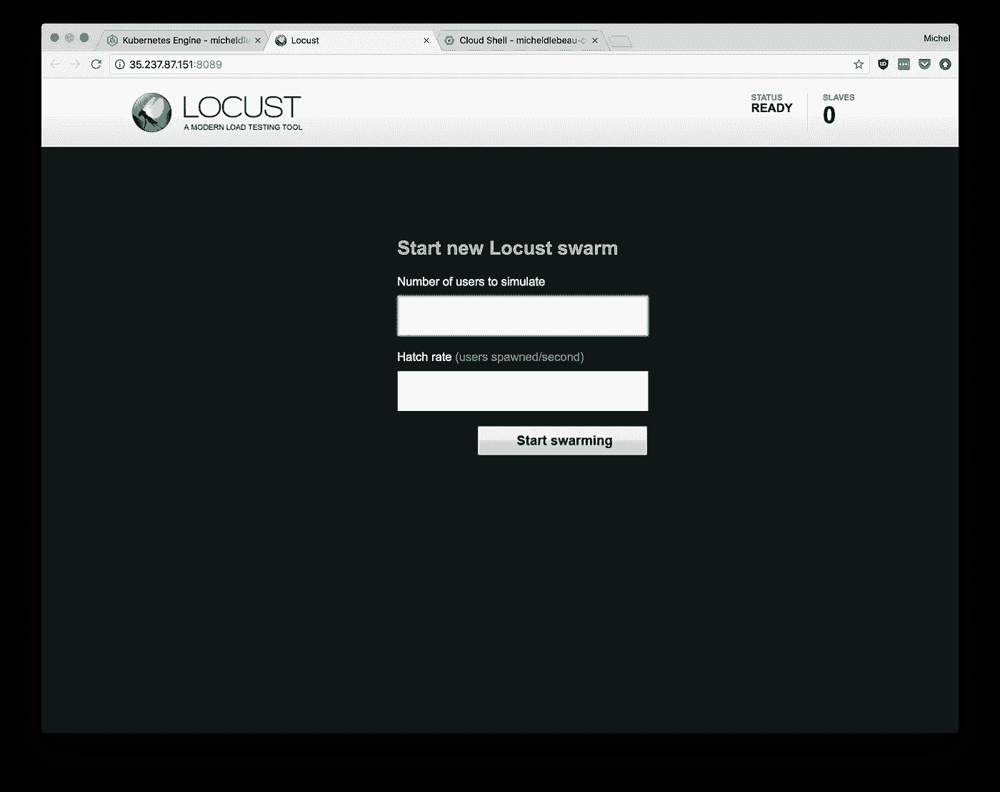
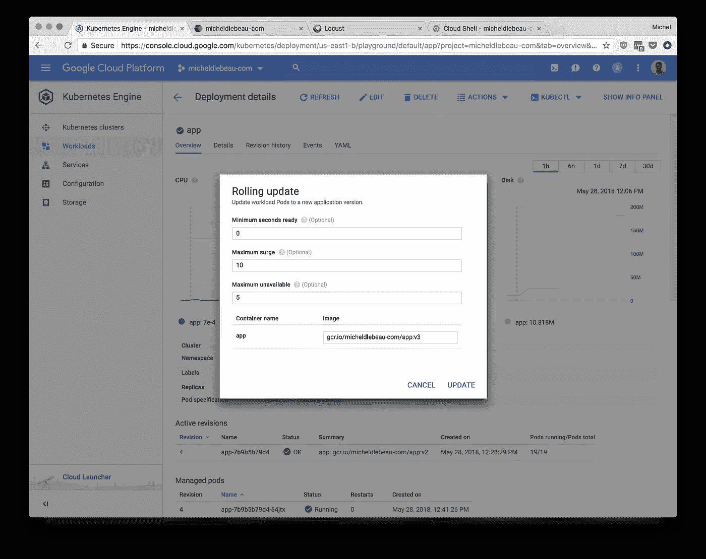

# 谷歌 Kubernetes 引擎，负载测试和自动缩放与蝗虫

> 原文：<https://medium.com/google-cloud/google-kubernetes-engine-load-testing-and-auto-scaling-with-locust-ceefc088c5b3?source=collection_archive---------0----------------------->

这是我之前聚会的博客版本，在爱丁堡的 DevOps 游乐场展示。找到我们在[伦敦](https://www.meetup.com/DevOpsPlayground/)和[爱丁堡](https://www.meetup.com/DevOps-Playground-Edinburgh/)的下一次聚会！
您也可以关注 [ECS Digital](https://medium.com/u/964e556b3496?source=post_page-----ceefc088c5b3--------------------------------) 了解我们接下来的计划。



# 概观

在这个 meetup 中，我们将在 Google 云平台上创建一个 Kubernetes 集群，使用 Google Kubernetes 引擎和可抢占的实例。我们将创建一个应用程序，构建一个 Docker 映像，并将该映像推送到 Google 容器注册表，然后在集群上运行该映像，然后对其进行负载测试。我们将降低应用程序的性能以看到集群向上扩展，然后提高性能以看到集群向下扩展。我们将使用滚动更新对应用程序进行更改。

## 关于可抢占实例的一个注记

可抢占实例是比 GCP 上的普通实例便宜 80%的实例，但谷歌会在 24 小时内要求它们返回，当它们的平台需要更多计算时。只要基础设施上运行的应用程序支持，这是一个省钱的好方法。

# GCP 入门

## 注册

[https://console.cloud.google.com/](https://console.cloud.google.com/)

## 开始免费试用

开始免费试用


然后，您需要填写您的详细信息。一旦一切完成，你将被带到这个屏幕。


## 选择您的项目

在顶部选择你的项目，你会看到一个类似的屏幕。


# 谷歌 Kubernetes 引擎

使用左侧的汉堡菜单导航到 Kubernetes 引擎。


# 启动谷歌云外壳

Google Cloud Shell 是一个面向 Google 云平台的交互式 Shell 环境。它使您可以轻松管理您的项目和资源，而不必在您的系统上安装 Google Cloud SDK 和其他工具。有了 Cloud Shell，Cloud SDK gcloud 命令行工具和其他你需要的实用工具在你需要的时候随时可用。

云壳提供以下功能:

*   临时计算引擎虚拟机实例
*   从 web 浏览器对实例的命令行访问
*   内置代码编辑器测试版
*   5 GB 的永久磁盘存储
*   预装谷歌云 SDK 等工具
*   语言支持 Java，Go，Python，Node.js，PHP，Ruby 和。网
*   Web 预览功能
*   访问 GCP 控制台项目和资源的内置授权


# 创建您的 GKE 集群

如果您刚刚创建了新帐户，可能需要 5-10 分钟才能创建新的群集。

## 命令

运行以下命令，这将设置稍后将使用的 PROJECT_IT 变量，创建集群，并获取集群的凭据。

```
gcloud config set container/use_v1_api false
export PROJECT_ID="$(gcloud config get-value project -q)"gcloud beta container --project ${PROJECT_ID} clusters create "playground" --region "us-east1-b" --username "admin" --cluster-version "1.8.8-gke.0" --machine-type "f1-micro" --image-type "COS" --disk-size "10" --scopes "https://www.googleapis.com/auth/compute","https://www.googleapis.com/auth/devstorage.read_only","https://www.googleapis.com/auth/logging.write","https://www.googleapis.com/auth/monitoring","https://www.googleapis.com/auth/servicecontrol","https://www.googleapis.com/auth/service.management.readonly","https://www.googleapis.com/auth/trace.append" --preemptible --num-nodes "3" --network "default" --no-enable-cloud-logging --enable-cloud-monitoring --subnetwork "default" --enable-autoscaling --min-nodes "3" --max-nodes "7" --addons HorizontalPodAutoscaling,HttpLoadBalancing --enable-autorepairgcloud container clusters get-credentials playground --zone us-east1-b --project ${PROJECT_ID}
```

完成此命令大约需要 5 分钟。

记住，如果你打开一个新的云 Shell，你将需要再次运行`export PROJECT_ID="$(gcloud config get-value project -q)"`命令。


与此同时，在菜单中，打开 Stackdriver 下的 Monitoring，并为您的帐户启用它(如果尚未启用)。这将允许它在后台监控您的集群。

## 细节

*   `gcloud beta container`:我们使用一些测试版功能
*   `--project ${PROJECT_ID}`:我们指定创建集群的项目
*   `clusters create "playground"`:我们指定要创建一个名为“playground”的新集群
*   `--region "us-east1-b"`:将创建集群的区域
*   `--username "admin"` : Root 用户名
*   `--cluster-version "1.8.8-gke.0"` : Kubernetes 版本
*   `--machine-type "f1-micro"`:底层虚拟机实例的大小
*   `--image-type "COS"`:虚拟机上运行的映像，容器优化的操作系统
*   `--scopes ...`:授予虚拟机的 API 访问类型和级别
*   `--preemptible`:用户可抢占的虚拟机，如果需要更多计算，谷歌可以终止这些虚拟机。[查看更多...](https://cloud.google.com/preemptible-vms/)
*   `--num-nodes "3"`:集群需要 3 个虚拟机
*   `--network "default" --subnetwork "default"`:使用默认网络和子网
*   `--no-enable-cloud-logging --enable-cloud-monitoring`:禁用日志记录，但启用对 Stackdriver 的监控
*   `--enable-autoscaling`:使集群能够根据 pod 所需的资源进行伸缩
*   `--min-nodes "3" --max-nodes "7"`:集群可以在 3 到 7 个节点之间扩展
*   `--addons HorizontalPodAutoscaling,HttpLoadBalancing`:允许集群扩展 pod 并使用 Google Cloud 负载平衡所必需的。
*   `--enable-autorepair`:让 GKE 修复不健康的节点

# 构建您的应用程序映像

## 打开 cloudshell 编辑器


## 创建操场文件夹


## 创建应用程序文件

你的申请是用 Golang 写的，会写到文件`main.go`里。首先创建 main.go 文件


将此作为文件内容粘贴:

```
package main
import (
        "fmt"
        "log"
        "net/http"
        "os"
        "time"
)func main() {
        port := "8080" server := http.NewServeMux()
        server.HandleFunc("/", app) log.Printf("Server listening on the port %s", port) err := http.ListenAndServe(":"+port, server)
        log.Fatal(err)
}func app(w http.ResponseWriter, r *http.Request) {
        log.Printf("Serving request: %s", r.URL.Path)
        host, _ := os.Hostname() fmt.Fprintf(w, "Hello, Edinburgh!\n")
        fmt.Fprintf(w, "Pod Name: %s\n", host) time.Sleep(time.Second)
}
```

## 创建您的 docker 文件

创建另一个名为`Dockerfile`的文件，并粘贴以下内容。该文件将用于创建您的应用程序的映像，该映像将在集群上运行。

```
FROM golang:1.8-alpine
ADD . /go/src/app
RUN go install appFROM alpine:latest
COPY --from=0 /go/bin/app .
ENV PORT 8080
CMD ["./app"]
```


## 创建你的码头形象

我们现在要构建图像。

```
cd playground
docker build -t gcr.io/${PROJECT_ID}/app:v1 .
```


## 在本地测试映像

尝试在本地端口 8080 上运行您的映像。`docker run --rm -p 8080:8080 gcr.io/${PROJECT_ID}/app:v1`然后在 8080 端口预览 app。Cloud Shell 有一个方便的快捷方式。


关闭标签并运行`ctrl+C`来停止网页预览

## 将图像推送到 Google 容器注册表

当你的图像工作时，是时候把它推送到谷歌容器注册处了`gcloud docker -- push gcr.io/${PROJECT_ID}/app:v1`


# 在集群中运行映像，并公开部署

## 创建部署

既然映像已经在注册表中，我们可以简单地在我们的集群`kubectl run app --image=gcr.io/${PROJECT_ID}/app:v1 --port 8080 --requests="cpu=100m"`上运行它


## 公开部署

应用程序正在运行，但是我们还不能从外部访问它，我们需要公开它。

通过端口 80 上的负载平衡器公开应用部署。`kubectl expose deployment app --type=LoadBalancer --port 80 --target-port 8080`返回 GKE 选项卡，进入服务页面


50 秒后，您的公共 IP 将可用，如果您按下刷新按钮，您可以简单地点击链接。


或者运行`kubectl get svc app`，复制外部 IP，在另一个选项卡中访问。


Tada，你的应用程序起作用了！


## 为应用部署启用自动缩放

我们将让 GKE 知道，我们希望我们的 pod 保持在 80%左右的负载，因此如果负载超过此阈值，它可以创建更多的 pod，最多可达 30 个，如果负载低于 80%，则它可以删除一些 pod。

`kubectl autoscale deployment app --cpu-percent=80 --min=1 --max=30`

在“工作负载”页面上，查看应用程序部署，注意当前负载，以及当前运行应用程序的单元数量。


# 负载测试

## 创建负载测试群集

现在应用程序正在运行，让我们看看它对负载的反应。我们将首先创建一个单独的集群，负责处理负载测试。我们将集群分开，这样负载测试就不会耗尽资源。

```
gcloud beta container --project ${PROJECT_ID} clusters create "loadtesting" --zone "us-east1-b" --username "admin" --cluster-version "1.8.8-gke.0" --machine-type "custom-8-8192" --image-type "COS" --disk-size "10" --scopes "https://www.googleapis.com/auth/compute","https://www.googleapis.com/auth/devstorage.read_only","https://www.googleapis.com/auth/logging.write","https://www.googleapis.com/auth/monitoring","https://www.googleapis.com/auth/servicecontrol","https://www.googleapis.com/auth/service.management.readonly","https://www.googleapis.com/auth/trace.append" --preemptible --num-nodes "1" --network "default" --no-enable-cloud-logging --enable-cloud-monitoring --subnetwork "default" --addons HorizontalPodAutoscaling,HttpLoadBalancing --enable-autorepair
gcloud container clusters get-credentials loadtesting --zone us-east1-b --project ${PROJECT_ID}
```

这将需要 5 分钟才能完成。

## 创建负载测试复制控制器和服务

我们现在将创建一个名为`loadtest-deployment.yaml`的文件，它包含我们的负载测试将需要的三个元素。

```
kind: ReplicationController
apiVersion: v1
metadata:
  name: locust-master
  labels:
    name: locust
    role: master
spec:
  replicas: 1
  selector:
    name: locust
    role: master
  template:
    metadata:
      labels:
        name: locust
        role: master
    spec:
      containers:
        - name: locust
          image: gcr.io/cloud-solutions-images/locust-tasks:latest
          env:
            - name: LOCUST_MODE
              value: master
            - name: TARGET_HOST
              value: http://app.ip.address
          ports:
            - name: loc-master-web
              containerPort: 8089
              protocol: TCP
            - name: loc-master-p1
              containerPort: 5557
              protocol: TCP
            - name: loc-master-p2
              containerPort: 5558
              protocol: TCP
---
kind: ReplicationController
apiVersion: v1
metadata:
  name: locust-worker
  labels:
    name: locust
    role: worker
spec:
  replicas: 30
  selector:
    name: locust
    role: worker
  template:
    metadata:
      labels:
        name: locust
        role: worker
    spec:
      containers:
        - name: locust
          image: gcr.io/cloud-solutions-images/locust-tasks:latest
          env:
            - name: LOCUST_MODE
              value: worker
            - name: LOCUST_MASTER
              value: locust-master
            - name: TARGET_HOST
              value: http://app.ip.address
---
kind: Service
apiVersion: v1
metadata:
  name: locust-master
  labels:
    name: locust
    role: master
spec:
  ports:
    - port: 8089
      targetPort: loc-master-web
      protocol: TCP
      name: loc-master-web
    - port: 5557
      targetPort: loc-master-p1
      protocol: TCP
      name: loc-master-p1
    - port: 5558
      targetPort: loc-master-p2
      protocol: TCP
      name: loc-master-p2
  selector:
    name: locust
    role: master
  type: LoadBalancer
```

将`app.ip.address`替换为您的应用部署的 IP 地址。

现在继续使用下面的命令`kubectl create -f loadtest-deployment.yaml`创建这些元素。


现在回到服务页面，或者运行`kubectl get svc locust-master`，然后转到端口 8089 上的外部 IP。

欢迎来到蝗虫



用 10 个用户和 10 的孵化率运行一个测试。


它似乎没有给应用程序或集群带来太大的压力，所以用 1000 个用户和 100 个孵化率再试一次。


该应用程序非常简单，运行速度非常快，可以很容易地并发运行，所以我们需要放慢一点。(如果你在 prod 里也有同样的问题，就不要按照接下来的步骤去做了，直接开一瓶啤酒，放松一下！)

# 减慢我们的应用程序

## 更改代码

在 main.go 中，用以下内容替换 app 函数的结尾。这将导致 pod 在 2 秒钟内使用 100%的 CPU。

```
done := make(chan int) 
  for i := 0; i < 2; i++ { 
    go func() { 
      for { 
        select { 
          case <-done: return 
          default: 
        } 
      } 
    }()
  }
  time.Sleep(time.Second)
}
```


## 建立形象

构建新版本的图像。`docker build -t gcr.io/${PROJECT_ID}/app:v2 .`

## 将新版本推送到 Google 容器注册表

把它推到谷歌容器注册处`gcloud docker -- push gcr.io/${PROJECT_ID}/app:v2`

您可以运行以下命令来获取现有的窗格并观察更改，这将有助于显示窗格是何时创建或删除的:`kubectl get pods -w`

## 执行滚动更新

现在更改您的部署使用的映像版本。GKE 允许你一次更新一个 pod 使用的图像版本，或者按 X 组更新，由你设置 X 应该是什么。


## 执行另一个负载测试

用 10 个用户再次测试


让负载在后台运行。

# 按比例放大

几分钟后，你可以看到豆荚的数量在增加


再等一会儿，您会看到作为集群的一部分运行的实例数量增加了


查看 Stackdriver 可以从另一个角度了解集群的负载。


现在，应用程序实际上表现很差，所以让我们稍微提高一下它的性能。

## 将应用程序的性能提高一倍

更改我们添加到`i < 1;`的代码片段中的`i < 2;`，这将使应用程序的性能翻倍。

然后构建您的映像的新版本。`docker build -t gcr.io/${PROJECT_ID}/app:v3 .`

将其推送到 Google 容器注册表`gcloud docker -- push gcr.io/${PROJECT_ID}/app:v3`


然后再做一次滚动更新，允许一次更新 5 个 pod



现在这样更好了。但是让我们回到我们的原始版本，它工作得更快，因此需要更少的 pod 来响应相同数量的请求。保持 locust 运行，以查看负载测试如何受到实时升级的影响。

# 分频

使用应用程序的 v1 进行另一次滚动更新。

如果你关注蝗虫，你会看到 RPS 变慢，因为 pod 被终止，然后上升，因为它们被运行更高性能应用的 pod 取代。

如果您让它运行一段时间，您会看到部署减少了它使用的单元数量，集群减少了它使用的节点数量。

# 清理

删除操场集群`gcloud beta container --project ${PROJECT_ID} clusters delete "playground" --region "us-east1-b" --async`

删除负载测试集群`gcloud beta container --project ${PROJECT_ID} clusters delete loadtesting --zone us-east1-b --async`

删除你的图片`gcloud container images delete gcr.io/${PROJECT_ID}/app:v1 --force-delete-tags`

请注意，可能仍然存在一些转发规则，随着时间的推移，这些规则会花费您一些钱，所以请查看并删除任何仍然存在的规则网络服务>负载平衡>高级菜单>转发规则