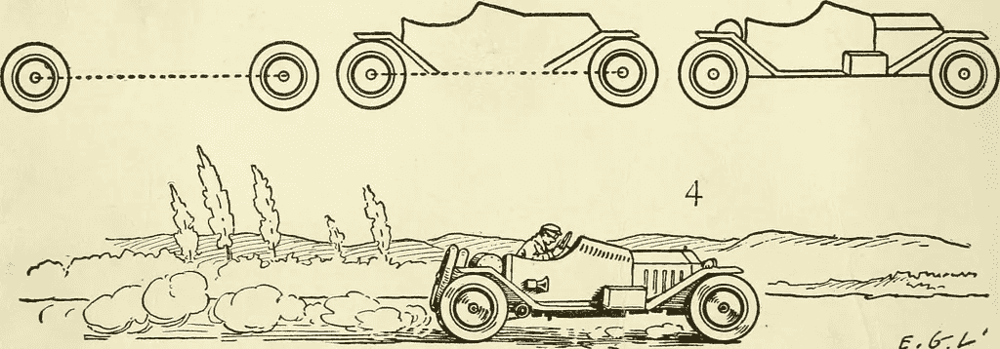

# 谷歌的 Kubernetes 引擎:停止与 Kubernetes 打交道，直接使用它

> 原文：<https://medium.com/google-cloud/google-kubernetes-engine-stop-dealing-with-kubernetes-and-just-use-it-f2b8d73931f1?source=collection_archive---------1----------------------->

继续按这个按钮。你知道你想。

如今，成为一名技术专业人员是一种两分法的存在。我们希望事情变得更容易、更快、更好。然而，我们衡量一项技术或工具是否足够强大以用于“生产”的标准通常与它给我们的生活带来的困难程度或者为了维护它我们的技术水平有多高有关。真奇怪。这就好像我们已经习惯了，为了在现实世界中供应和使用技术，我们必须通过采购的挑战，一直到第二天以上的运营和管理，这是一个预料中的痛苦过程。

另一方面，成功的组织通常认为自己已经脱离了这一点，并选择采用符合他们想要的做事方式的技术。谷歌已经经历了很长一段时间。因此，我们不得不创造一些最具创新性和最多产的技术来完成任务。在这个过程中，我们开发了一个叫做 Kubernetes 的东西，我们像我们的许多技术一样开源。我将跳过“Kubernetes 越来越受欢迎”这一段，因为我厌倦了每个 Kubernetes 博客都有这个看似必不可少的部分。你在这里是因为你已经知道它是什么，你已经明白这是事情的发展方向。在其社区驱动的设计和开发中，谷歌和社区通常没有“易用性”的想法。不仅如此，易于安装和最重要的易于管理一直是相对的二等公民。这更多的是事后的想法(安全人员可以联系起来)，今天仍然如此。这主要是因为 Kubernetes 的固有性质。它的设计原则是运行时功能与易用性的对比。

说到易用性，安全性是最近的一个焦点。社区里到处都是，每个人都在解决这个问题。每个人都在谈论他们如何知道如何保护 Kubernetes，这很好，因为每个人*都应该*知道如何保护 Kubernetes。理想的情况是，安全实现*应该*成为任何和所有 Kubernetes 发行版中一个通用的基本的开箱即用的命题。因此，除了在可用性和集成(我认为这是组织采用的安全性的最重要的方面)的上下文中解决它之外，我不会在这里详细讨论它。

由于安装、易用性和“第二天”运营管理仍然是几乎每个 Kubernetes 发行版(包括，尤其是 DIY)的一个问题，谷歌一直在提供其 Kubernetes 引擎(GKE ),作为一种服务，面向任何希望避免这些领域中与低级管道相关的大部分麻烦的人。但这是对 GKE 影响的过分简化。

什么是低级水暖？我认为任何任务都是普遍的最佳实践(如安全操作方法、易用性、资源调配和基础架构自动化)，这对组织来说最终是一个令人望而却步的开销，因为即使是解决这些领域的最微小需求也需要人员和流程的适应。这总是很贵的。

> 如果我想采用一种转换技术，我应该能够采用它的转换方面，而不是开销。

我需要或想要配置这些低级领域的哪些方面？当然，我应该有能力这样做。但这是一个成熟度模型的问题。Kubernetes 目前所处的位置是技术和采用技术的组织的大规模采用和成熟。我们来看几个**禁止性开销**的例子。

1.  ***控制平面/主组件配置和管理:***API 服务器、主节点、etcd、调度器、控制器以及运行在控制平面中的所有其他东西都是您可以配置或定制的，但是，就日常交付操作而言，随着时间的推移，您必须维护它们的程度应该最小化到不存在。
2.  ***安装和一般供应:*** 由于使用了 Terraform/Ansible、kubeadm、kops 和其他工具，Kubernetes 的供应和安装已经在很大程度上实现了自动化。然而，其中的每一个仍然需要一定形式的开销和维护。修补、升级和一般集群管理仍然是一个很大的差距，只是略微得到了解决。
3.  ***基础设施弹性:*** 管理情况绝对会发生，例如节点故障或节点由于某种原因不健康。有一些工具可以让你做到这一点，但是管理自动化方面(基本上是脚本)的开销仍然存在。除此之外，还要确保自动化与部署环境的其他部分一样可移植。
4.  ***安全*** *:* 这是大的(眼下)。如果你在谷歌上搜索“Kubernetes security ”,你会看到(并被淹没)每一个供应商、咨询公司和独立的无所不知的人都在谈论你应该如何保护你的 Kubernetes 集群。当您浏览它们时，您会注意到它们基本上都以大致相同的方式处理相同的组件:etcd 加密、TLS 无处不在、元数据保护、kubelet 保护、RBAC、禁用仪表板、使用网络策略、PodSecurityPolicies、日志记录和监控，以及使用机密是您在当前大多数文献中看到的一些最常见的组件。这种共性意味着，无论如何配置，它都应该是任何 Kubernetes 集群的默认组成部分。一部分是配置时的默认配置，另一部分是日志记录和监控等功能的程序性采用。将这些安全组件集成到文化中的影响是非常重要的，我将在以后的文章中讨论这个问题。

如我所说，持续生产交付的 4 个简单步骤！

还有其他问题，但这些是我认为的大问题，因为它们都影响组织采用技术进行改进的能力。组织有足够多的事情要处理，他们看到了 Kubernetes 等东西的内在价值，但就采用而言，不得不在他们的盘子上添加更多东西对许多人来说是不可行的，同时这也可能是令人生畏的。尽管自动化程度很高，但管理某些东西和底层管道的压力可能会让已经陷入当前指令的组织陷入瘫痪。现代化和文化改善项目往往会失败，因为提供难以置信的能力的技术往往难以站立起来并向前发展。

你可能会告诉我，我所说的很多问题都可以通过自动化来缓解。但是自动化的存在并不是为了让你忘记一些事情。它的存在是为了在重复和可重复的基础上使事情更容易处理。然而，就像一个成年的孩子一样，它仍然是你内心深处的一种责任或负担。

这是简单按钮的另一面

所以。让我们来谈谈谷歌 Kubernetes 引擎(GKE)。对于某些上下文(好像前面的 1000 个单词还不够)，我的大部分经历是关于自我管理的 Kubernetes (DIY、distros 等)。他们中的几个实际上非常好，至少在一个案例中是例外的，在我看来，他们仍然领导着行业，因为他们有很好的选择，很好的时机，满足了需求。然而。在这一点上，我注意到，随着越来越多的组织希望在采用 Kubernetes 方面走向成熟，而不是仅仅踢踢轮胎，这与技术的采用和改善组织成长和成熟的愿望有着直接的联系和期望的相关性。这正是谷歌在原则上和实践中的运作方式。

> 正是这个可继承的原则导致了谷歌提供 GKE

> `gcloud container clusters create org-prod-cluster`

那是你的按钮。不要担心，有足够的旗帜和选项给你所有你需要的温暖模糊。在我的下一篇文章中会有更多的介绍。

诚然，很难相信像这样的一个命令可以给我:

1.  安全的生产级、SLA 支持的 Kubernetes 集群只需几分钟
2.  位于世界上最先进的云基础架构之上，并且
3.  由业内最优秀、最聪明的 SRE 团队提供支持

但是，尽管这是反高潮，这就是你在这里得到的。这就是全部要点:让企业 Kubernetes 变得如此简单，以至于令人厌烦。无聊到你可以带着它运行，目的是通过使用工具将你的人和过程集中在改进上，而不是弄清楚如何在第一年引入管理它的开销。这就是像谷歌一样运行的含义。我们花了数年时间来开发技术，这些技术将改善我们的工作方式，这正是 Kubernetes 通过 GKE 带给你的遗产。

在我的下一篇文章中(我猜是本文的第 2 部分)，我将讲述我们如何通过允许组织直接使用 Kubernetes 获得有趣的东西来为他们提供专注于重要事情的能力，以及采用 Kubernetes 如何能够对组织产生积极的影响。作为引子，我想引用马特·斯汀的一段话作为引子:

> “糟糕的流程总是会打败最好的技术”