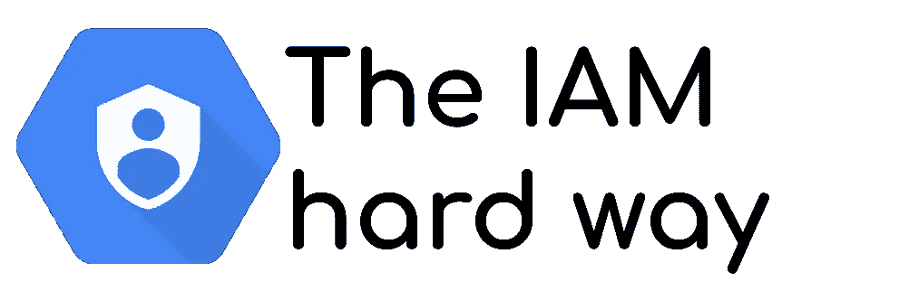
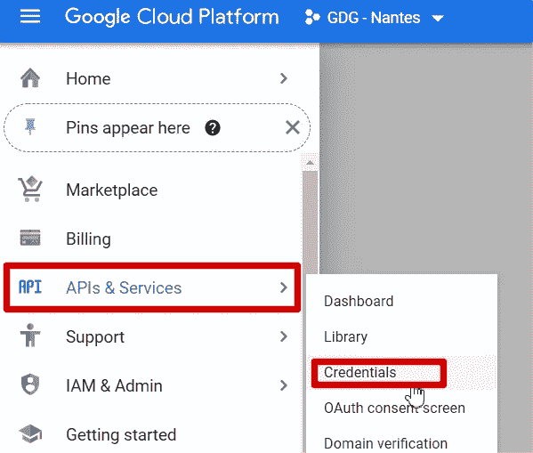
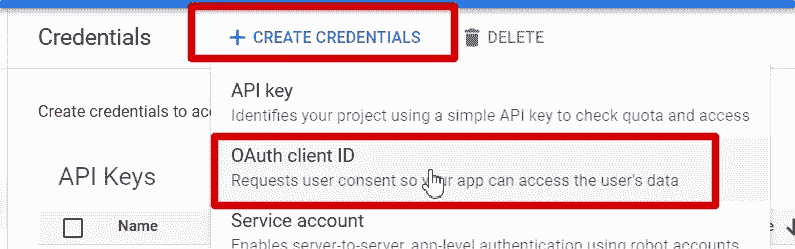
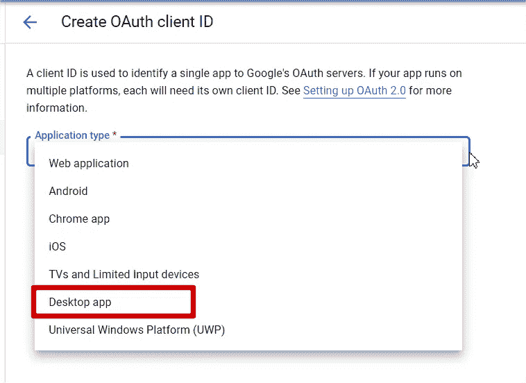
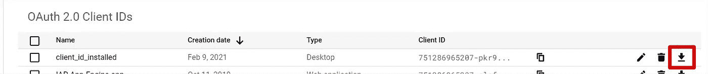

# 谷歌 OAuth 认证:深入，艰难的方式

> 原文：<https://medium.com/google-cloud/google-oauth-credential-going-deeper-the-hard-way-f403cf3edf9d?source=collection_archive---------1----------------------->



谷歌云的安全性至关重要，但奇怪的是，这却是一个不受欢迎的话题。其实，**安全往往是个无聊的话题**！为了填补这个空白，我写了一些关于 IAM 服务的两个限制的文章，以及关于服务帐户凭证 API 提供的变通方法和新的[用例的文章。在这两种情况下，我主要关心的仍然是相同的:**避免用户下载服务帐户密钥文件**以提高安全性。](/google-cloud/service-account-credentials-api-a-solution-to-different-issues-dc7434037115)

然而，最新的[关于访问](https://cloud.google.com/blog/topics/developers-practitioners/dont-fear-authentication-google-drive-edition) [Gabe Weiss](https://medium.com/u/87b2115d4438?source=post_page-----f403cf3edf9d--------------------------------) **的 Drive API 的博文使用了服务账户密钥文件**。这就是我联系他的原因，讨论非常有趣。

# Gabe 用例

在他的博客文章中，Gabe 展示了如何访问 Google Drive 文件夹。**这个文件夹可能是机密的**或者，至少，你不希望任何开发者访问它。
事实上，如果您**授予文件夹**上的用户帐户，API 和**也可以通过浏览器**进行访问，这是一个问题，也是您不想要的。

因此，解决方案是**将访问授权授予第三方**，不是用户帐户，而是服务帐户。因此，要使用这个账户，**你需要有你这边的凭证**并使用它们

> *服务账户密钥文件！*

**是的，用例是有效的**，并且可以为任何 Google Workspace 产品复制:访问 Google 文档、工作表、幻灯片、..

好吧，但是在我的理想世界里，你有一个 Google 驱动文件夹用于开发/测试，还有一个，机密的，用于生产。这有两个原因

1.  如果**用户是一个坏演员**并且**想要读取文件夹内的文件**，他们可以通过 API 访问它们。最后，问题是一样的:用户可以访问文件夹内容，**只是下载内容不太容易！**
2.  **更糟糕的是，**如果用户使用服务帐户访问文件夹文件，您**只能在日志**中看到服务帐户电子邮件，而看不到用户凭证。设计隐藏的**坏演员**！

这就是为什么，我想告诉你如何实现同样的**访问谷歌驱动文件夹，但使用用户凭证**。
***而这种方式绝对不容易！！***

# 代码示例更新

在深入之前，我想更新 Gabe 提出的代码**，使其更加“可移植”**，我的意思是依靠 [ADC(应用程序默认凭证)](https://cloud.google.com/docs/authentication/production)。这个解决方案让 Google Auth library **挑选运行时环境**上可用的凭证，因此，您不必根据环境更新您的代码。

凭据恢复按以下顺序执行

1.  检查`**GOOGLE_APPLICATION_CREDENTIALS**` **环境变量**是否存在。如果是这样，请使用它(并且应该引用一个凭据文件，如服务帐户密钥文件)。
    *这个模式是为了覆盖其他 2 个，对于没有 GCP 的环境*
    如果没有，转到下一个。
2.  检查 [**元数据服务器**](https://cloud.google.com/compute/docs/storing-retrieving-metadata) **是否存在于**环境中。此功能允许使用 Google Cloud 产品中加载的服务帐户。
    *此模式是为 GCP 运行时环境做的*
    如果不是，转到下一步
3.  在“已知位置”中查找在本地环境上创建的**用户凭证文件。这个文件是用命令`gcloud auth application-default login`
    *生成的。这个模式是为您的本地开发环境*而做的**

我将代码样本分为两步

1.  首先，**用`GOOGLE_APPLICATION_CREDENTIALS`环境变量设置环境**

```
export GOOGLE_APPLICATION_CREDENTIALS=</path/to/>drive_icons_sa.json
```

2.然后是代码，以同样的方式在你的工作站和谷歌云产品的服务账户**上运行。**

```
from googleapiclient.discovery import build
drive_service = build('drive', 'v3')
```

**是的，只有 2 行！！让图书馆为你工作！**
*您可以添加 Gabe 文章中提供的子示例，然后打印结果来验证脚本的正确工作。*

```
*children = drive_service.files().list(q=f"mimeType = 'application/vnd.google-apps.folder' and '{marketing_icon_folder_id}' in parents", fields='files(name, id)').execute()
print(children)*
```

**测试并验证**是否按预期工作。

# 使用用户凭证的漫长旅程

如前所述，首先要做的事情，是**取消设置环境变量**T3。

```
unset GOOGLE_APPLICATION_CREDENTIALS
```

并且**在“众所周知的位置”创建用户凭证文件**

```
gcloud auth application-default login
```

完成流程并测试 python 脚本。
**您得到一个错误**，因为您的用户凭证**没有正确的范围**。

```
Insufficient Permission: Request had insufficient authentication scopes.
```

我将节省您的时间，不要尝试他在凭证上明确设置范围的 Gabe 代码:它对用户凭证不起作用。

这里的技巧**是在生成**凭证令牌时限定用户凭证的范围。

```
gcloud auth application-default login \
  --scopes='[https://www.googleapis.com/auth/drive'](https://www.googleapis.com/auth/drive')
```

*如果您使用此凭证访问 google cloud 资源，请添加 Google Cloud 作用域，就像这样*

```
scopes='[https://www.googleapis.com/auth/drive','https://www.googleapis.com/auth/cloud-platform'](https://www.googleapis.com/auth/drive','https://www.googleapis.com/auth/cloud-platform')
```

*你可以添加所有你需要的范围:工作表、文档等等*

所以，现在，再试一次 python 代码。
和**再次失败**，出现一个奇怪的错误:

```
Access Not Configured. Drive API has not been used in project 764086051850 before or it is disabled. Enable it ....
```

> 漫长的路从这里开始…

# 深入了解认证

这个项目编号`764086051850`是什么？当你点击提供的链接时，这是被禁止的！你可以检查你所有的项目，你不会发现它！

> 你使用了一个不属于你的项目，你需要在一个不可及的项目上激活驱动 API。他妈的怎么回事？？？

如果你在“众所周知的地点”仔细查看你的用户凭证

```
#Linux
cat ~/.config/gcloud/application_default_credentials.json#Windows powershell
cat $env:APPDATA/gcloud/application_default_credentials.json
```

你可以看到这个`client_id`

```
764086051850-6qr4p6gpi6hn506pt8ejuq83di341hur.apps.googleusercontent.com
```

因此，如果您知道 **OAuth2 认证流程**，那么需要在授权服务器上提供一个`client_id`和一个`client_secret`。在那里，平台对请求授权的客户端(这里是 gcloud SDK)进行身份验证，并继续这个过程。您选择您的帐户，验证授权，然后获得授权令牌。
客户端应用(这里是 gcloud SDK)获取授权令牌并对其进行验证。作为回答，它接收一个`access_token`和一个`refresh_token`。

*`client_id`*、* `client_secret` *和* `refresh_token` *保存在您的“知名位置”文件*中*

*问题是:因为它是来自谷歌云内部项目的 **a** `**client_id**` **，请求中引用的就是这个项目。
*当然，你没有访问它来启用驱动 API****

> *那么现在，如何在你的项目中使用一个`client_id`？*

*gcloud CLI 允许您使用参数`--cliend-id-file`来完成此操作*

> *但是如何生成客户端 ID 文件呢？*

*为此，您可以进入控制台中的`APIs & Services`，点击`Credentials`*

**

*然后是`OAuth client ID`类型的`Create Credential`*

**

*到这里，就很明显了。**接下来要小得多。***

*您必须**选择一个应用类型**。*好运，挑一个！！如果你没有选择正确的，你会有这样的问题**

```
*Only client IDs of type 'installed' are allowed, but encountered type '...'*
```

> *列表中的**申请类型** `**installed**` **是什么？***

*所以，选择`Desktop app`！*

**

*命名您的密钥并创建它。*

*最后，您可以通过点击右侧的下载图标来下载您的密钥。*

**

*保存文件。*现在你已经下载了一个秘密！！！但是它只能用于验证用户，而不能作为服务帐户密钥文件访问资源。**

***你拥有所有的棋子！是时候为您的项目生成正确范围的凭证了！***

```
*gcloud auth application-default login \
  --scopes='[https://www.googleapis.com/auth/drive'](https://www.googleapis.com/auth/drive')
  --client-id-file=/path/to/client-id-file.json*
```

**你会得到安全警告，因为* `*client*` *被授权服务器正式重新确认。继续，并验证所有步骤。**

*并再次测试 python 脚本。
*别忘了和你当前的用户邮箱共享目标文件夹！**

*嘣，那就行了！！*

# *选择正确的流程*

*现在你有了！！但是我的感觉减轻了。*

*   *一方面，您有一个带有服务帐户密钥文件的**快速简单路径**。虽然没有我想象的那么干净，但是这个警告很容易向开发者解释，因为他们会保守这个秘密。*
*   *另一方面，你有一个**更安全的机制，没有秘密**共享和参与，但是**完全不可能由开发者单独**实现。*

*安全性是最重要的，但是如果**完成简单的任务成为一个挑战，它将被用户绕过**以满足他们的最后期限和期望。*

*权衡并不简单，一个**更好的技术安全解决方案并不总是带来更好的整体安全性**。明智选择！*