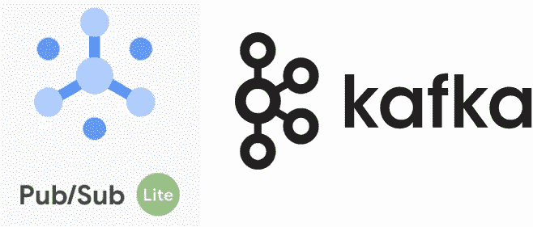

# 面向 Kafka 用户的 Google 发布/订阅建兴

> 原文：<https://medium.com/google-cloud/google-pub-sub-lite-for-kafka-users-dec8a7cfc5e5?source=collection_archive---------0----------------------->



本指南已被添加到我们的服务文档中- [请在那里阅读](https://cloud.google.com/pubsub/lite/docs/kafka-migration)以获得包含有线协议支持等新功能的最新版本。

Pub/Sub Lite 是 Cloud Pub/Sub 团队的一项新服务，旨在提供一种替代的、以成本为中心的 Pub/Sub 系统。特别是，它为出于价格原因考虑运行自己的单区域 Apache Kafka 集群的用户提供了托管服务。这篇文章比较了 Pub/Sub Lite、Pub/Sub 和自我管理的 Kafka 配置，并演示了如何在 Pub/Sub Lite 上测试您当前的 Kafka 工作负载。

Pub/Sub Lite 与 Kafka 共享比 Cloud Pub/Sub 更多的高级概念，是一个通过前进偏移跟踪进度的分区日志。正因为如此，它拥有与 Kafka 更相似的 API，用户可以使用 [Kafka 客户端 API](https://github.com/googleapis/java-pubsublite-kafka)发布和消费消息。

# **Pub/Sub Lite 与卡夫卡的显著区别**

虽然 Pub/Sub Lite 在概念上类似于 Apache Kafka，但它是一个不同的系统，其 API 更侧重于数据摄取。虽然这些差异对于流的接收和处理来说是无关紧要的，但是在许多特定的用例中它们是非常重要的。

**作为数据库的卡夫卡**

Pub/Sub Lite 不支持事务发布或日志压缩，这些是 Kafka 的特性，当您将 Kafka 用作数据库而不是消息传递系统时，这些特性通常更有用。如果这描述了您的用例，您应该考虑运行自己的 Kafka 集群或使用托管 Kafka 解决方案，如 [Confluent Cloud](http://confluent.io/cloud) 。如果这两个都不是一个选项，您还可以考虑使用像 [Cloud Spanner](https://cloud.google.com/spanner) 这样的水平可伸缩数据库，并使用行键将表按提交时间戳排序以进行重复数据删除。

**与 Kafka 流的兼容性**

Kafka streams 是一个建立在 Kafka 之上的数据处理系统。虽然它允许注入消费者客户端，但是它需要访问所有管理操作，并使用 Kafka 的事务数据库属性来存储内部元数据。 [Apache Beam](https://beam.apache.org) 是一个类似的流数据处理系统，集成了 Kafka、Pub/Sub 和 Pub/Sub Lite，以及其他数据源和汇点。波束管道也可以通过[数据流](https://cloud.google.com/dataflow)以完全管理的方式运行。

**监控**

Kafka 客户端能够读取服务器端指标。在发布/订阅 Lite 中，与发布者和订阅者行为相关的指标通过[云监控](https://cloud.google.com/monitoring/api/metrics_gcp#gcp-pubsublite)公开，无需额外配置。

# **管理和配置**

**产能管理**

Kafka 主题的容量通常由集群的容量决定。复制、键压缩和批处理设置将决定为 Kafka 集群上的任何给定主题提供服务所需的容量，但是对主题本身没有直接的吞吐量限制。相比之下，发布/订阅 Lite 主题的存储和吞吐量必须明确定义。Pub/Sub Lite 主题容量由分区数量和每个分区的可调读写存储[容量决定。](https://cloud.google.com/pubsub/lite/docs/topics#creating_lite_topics)

**认证和安全**

Apache Kafka 支持几种开放的身份验证和加密机制。使用发布/订阅建兴，认证是基于 GCP 的 IAM 系统。通过[静态加密](https://cloud.google.com/security/encryption-at-rest)和[传输](https://cloud.google.com/security/encryption-in-transit)来确保安全性。

**配置选项**

Kafka 有大量控制主题结构、限制和代理属性的配置选项。下面列出了一些对数据摄取有用的常见方法，以及它们在发布/订阅 Lite 中的对等用法。注意，作为一个受管系统，用户不需要关心许多代理属性。

*auto . create . topics . enable*

没有对等物可用。应该使用管理 API 预先创建主题。类似地，在与管理 API 一起使用之前，必须创建订阅(大致相当于使用者组)。

*retention.bytes*

在 Pub/Sub Lite 中等价的是每个分区的[存储](https://cloud.google.com/pubsub/lite/docs/topics#creating_lite_topics)，这是每个主题的属性。

*retention.ms*

在 Pub/Sub Lite 中的等效项是[消息保持期](https://cloud.google.com/pubsub/lite/docs/topics#creating_lite_topics)，这是一个基于主题的属性。

*flush.ms，ack*

这些是不可配置的，但是在保证发布被持久保存到复制存储之前，发布不会被确认。

*最大消息字节数*

这是不可配置的，3.5 MiB 是可以发送到发布/订阅建兴的最大消息大小。以可重复的方式[计算消息大小](https://cloud.google.com/pubsub/lite/quotas#resource_quotas)。

*key.serializer，value.serializer，key.deserializer，value.deserializer*

Pub/Sub Lite 具体实现了`Producer<byte[], byte[]>`和`Consumer<byte[], byte[]>`。任何序列化(可能会失败)都应该由用户代码执行。

*重试次数*

Pub/Sub Lite 使用流式传输协议，并将无限期重试短暂的发布错误，如不可用。任何到达最终用户代码的故障都是永久性的。

*批量*

批处理设置可在[客户端创建时](https://cloud.google.com/pubsub/lite/docs/publishing#batching_messages)进行配置。

*消息.时间戳.类型*

当使用消费者实现时，将选择事件时间戳(如果存在)，否则使用发布时间戳。使用数据流时，发布和事件时间戳都可用。

*max.partition.fetch.bytes，max.poll.records*

[流量控制设置](https://cloud.google.com/pubsub/lite/docs/subscribing#using_flow_control)可在客户端创建时配置。

*enable.auto.commit*

自动提交可在客户端创建时配置。

*使能幂等*

目前不支持此功能。

*自动补偿复位*

目前不支持此功能。

# **发布/订阅精简版入门**

Pub/Sub Lite 工具使得测试当前在 Pub/Sub Lite 上运行的 Kafka 工作负载变得很容易。如果您在一个消费者组中有多个任务在阅读一个多生产者 Kafka 主题，那么修改您的代码以使用 Pub/Sub Lite 运行只需要很少的更改。这些概述如下。

## 创建发布/订阅资源

要使用 Pub/Sub Lite 接收和处理数据，您需要分别创建一个[主题](https://cloud.google.com/pubsub/lite/docs/topics#console)和[订阅](https://cloud.google.com/pubsub/lite/docs/subscriptions)。在创建主题时，您应该确保它有足够的水平并行度(分区)来处理您的峰值发布负载。如果您的峰值发布吞吐量是 X MiB/s，那么您应该为您的主题提供 X/4 个分区，每个分区有 4 MiB/s 的容量(默认)。

## 从卡夫卡复制数据

Pub/Sub Lite 的 Kafka Connect [连接器由 Pub/Sub 团队维护，是将数据复制到 Pub/Sub Lite 的最简单方法。为了进行实验，您可以专门运行`copy_tool`](https://github.com/GoogleCloudPlatform/pubsub/tree/master/kafka-connector) [脚本](https://github.com/GoogleCloudPlatform/pubsub/blob/master/kafka-connector/copy_tool.py)，它将在单机配置中下载并在本地运行 Kafka Connect。开始前，确保您按照[预运行步骤](https://github.com/GoogleCloudPlatform/pubsub/tree/master/kafka-connector#pre-running-steps)正确配置认证。一个示例`properties`文件如下所示:

```
name=PubSubLiteSourceConnectorconnector.class=com.google.pubsublite.kafka.source.PubSubLiteSourceConnectorpubsublite.project=my-projectpubsublite.location=europe-south7-qpubsublite.subscription=my-subscriptionkafka.topic=my-kafka-topic
```

这将在运行时将发布到 kafka 主题的所有数据镜像到 Pub/Sub Lite。 [Kafka Connect 文档](http://kafka.apache.org/documentation.html#connect_running)提供了有关如何为集群运行 Kafka Connect 作业的更多信息。

一旦您开始复制数据，您应该能够看到 Pub/Sub Lite 主题的[topic/publish _ message _ count metrics](https://cloud.google.com/monitoring/api/metrics_gcp#gcp-pubsublite)在 [metrics explorer 控制台](https://console.cloud.google.com/monitoring/metrics-explorer)中增长，因为您的 Kafka 主题的积压被复制。

## 从发布/订阅建兴读取数据

Pub/Sub 团队维护了一个 [Kafka 消费者 API 实现](https://github.com/googleapis/java-pubsublite-kafka#instructions-for-pubsub-lite-kafka-usage)，它允许您从 Pub/Sub Lite 中读取数据，只需对现有代码进行最小的修改。

为此，您将使用同一接口的特定于 Pub/Sub Lite 的实现替换`KafkaConsumer<byte[],byte[]>`的所有实例。首先，您必须确保没有客户端代码引用具体的`KafkaConsumer`实现——相反，您应该用`Consumer<byte[],byte[]>`接口替换它们。接下来，您应该按照上面链接中的详细描述来构造您的[发布/订阅 Lite 消费者](https://cloud.google.com/pubsub/lite/docs/samples/pubsublite-kafka-consumer)实现，并将其传递到您的代码中。

当您调用`poll()`时，您现在将从 Pub/Sub Lite 而不是 Kafka 检索消息。请注意，Pub/Sub Lite `Consumer`不会自动为您创建订阅:您必须[使用 UI 或 gcloud 提前创建订阅](https://cloud.google.com/pubsub/lite/docs/subscriptions)。

当您接收消息并提交偏移量时，您可以通过查看 metrics explorer 控制台中的[subscription/backlog _ message _ count](https://cloud.google.com/monitoring/api/metrics_gcp#gcp-pubsublite)度量来监控您的`Consumers`在 backlog 中的进度。

## 将数据写入发布/订阅 Lite

一旦所有的`Consumers`都迁移到从发布/订阅建兴读取数据，您就可以开始将`Producers`迁移到发布/订阅建兴。类似于`Consumer`的情况，您可以用`Producer<byte[],byte[]>`替换`KafkaProducer<byte[], byte[]>`的所有用户，这是一个无操作的更改。然后，按照[指令](https://github.com/googleapis/java-pubsublite-kafka#instructions-for-pubsub-lite-kafka-usage)，你可以构建一个[发布/订阅建兴生产者](https://cloud.google.com/pubsub/lite/docs/samples/pubsublite-kafka-producer)实现，并将其传递给你的代码。当您调用`send()`时，数据将被发送到 Pub/Sub Lite。当您更新您的生产者作业时，您的从 Pub/Sub Lite 读取的消费者将会对数据是通过 Kafka 发送(并通过 Kafka Connect 复制到 Pub/Sub Lite)还是直接发送到 Pub/Sub Lite 感到矛盾。让 Kafka 和 Pub/Sub Lite 制作人同时运行不是问题。