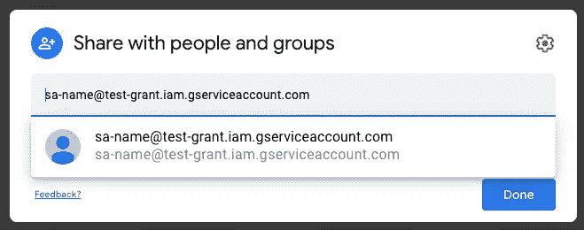
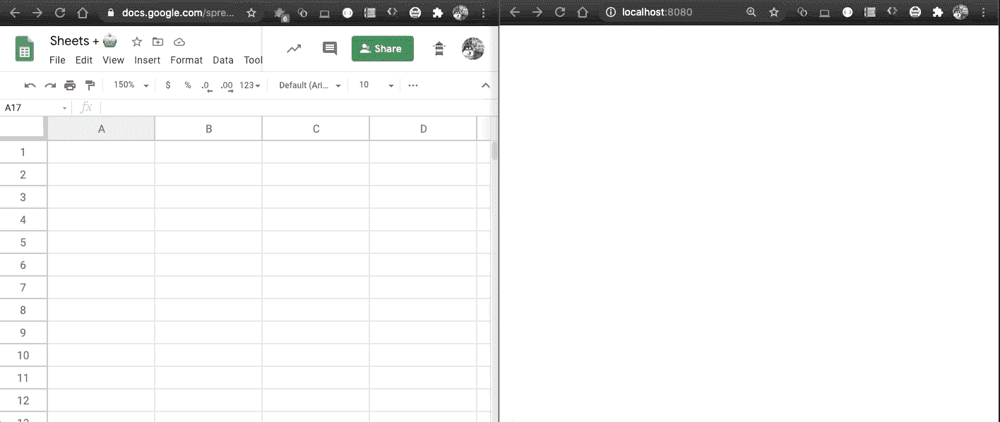

# Google Sheets +云运行

> 原文：<https://medium.com/google-cloud/google-sheets-cloud-run-ffc1875d2a1?source=collection_archive---------0----------------------->


Google Sheets +云运行

在 5 分钟内，我们将快速安全地将 **Google Sheets** **API** 集成到您的**云运行**应用中。只需复制&粘贴下面的文档脚本。

## TL；速度三角形定位法(dead reckoning)

1.  **下载*服务账号*凭证**
2.  **与服务帐户电子邮件共享**谷歌表单
3.  **启用**谷歌工作表 API
4.  写一些**节点**
5.  部署到**云运行**

# 步骤 1:下载凭据🤖

创建一个*服务帐户*，并在一个名为`creds.json`的新文件中下载一个密钥。

创建服务帐户，下载服务帐户密钥，并复制服务帐户的电子邮件。或者使用 [UI](https://console.cloud.google.com/apis/credentials) 。

该凭证具有唯一的 id: `sa-name@$PROJECT.iam.gserviceaccount.com`

# 2.与服务帐户共享 Google 表单🔗

创建一个新的谷歌工作表，如果你还没有的话

**以**服务账户邮箱**(如上)作为 **e *ditor*** 分享**Google Sheet:


单击工作表右上角“共享”按钮。(如果您尚未命名工作表，请命名)。



对于有效的服务帐户，服务帐户电子邮件应自动完成。

> 如果您需要以编程方式完成这项工作，您可以使用 Drive API 并通过`[*drive.v3.files.permissions.create*](https://developers.google.com/drive/api/v3/reference/permissions/create)`与服务帐户共享。

# 3.启用 Google Sheets API📃

通过`gcloud` CLI(或 [UI](http://console.developers.google.com/apis/api/sheets.googleapis.com) )为您的项目启用 Sheets API:

```
gcloud services enable sheets.googleapis.com
```

# 4.写一些节点⬢

用这个`package.json`创建一个简单的节点应用程序:

一个基本的 package.json，在这个例子中，使用了[函数框架](https://github.com/GoogleCloudPlatform/functions-framework-nodejs)。

和一个在`index.js`用我们的服务账号授权的节点程序:

一个节点程序，使用我们的 creds.json 进行授权，并在工作表中添加一行。

**在** `index.js` **中，用您创建的工作表的 ID 替换您的** `**SPREADSHEET_ID**` **。**否则你会得到错误:“错误:没有找到请求的实体。”

现在，您可以使用以下命令在本地运行该程序:

```
npm i && npm start
```

然后转到`localhost:8080`(或`curl [http://localhost:8080](http://localhost:8080)/`)测试并通过编程创建一个新行。预热需要一点时间，但从我的测试来看很快(< 1 秒)。



发出一个 localhost HTTP 请求会在我们的 Google 工作表中添加一行！

# 5.部署到云运行💨👟

要部署生产服务器，您需要添加一个`Dockerfile`:

Dockerfile 文件

然后在 Google Cloud 上构建并运行您的容器:

```
GCP_PROJECT=$(gcloud config list --format 'value(core.project)' 2>/dev/null)gcloud builds submit \
--tag gcr.io/$GCP_PROJECT/sheets-on-rungcloud run deploy sheets-on-run \
--image gcr.io/$GCP_PROJECT/sheets-on-run \
--platform managed \
--allow-unauthenticated
```

对于这个示例，每当我们通过 URL 访问我们的云运行服务时，我们将向 Google Sheet 添加一个新行。

太好了！现在你的床单已经“连接”运行了，你的思想就是你用这种力量所能做的极限。创建一些很酷的应用程序。:)

# 后续步骤

感谢阅读！我喜欢使用 Google Sheets 作为显示数据的简单用户界面。它速度快，功能强大，而且免费！

您可能会对这些相关资源感兴趣:

*   [节点的流行社区库包装器](https://github.com/theoephraim/node-google-spreadsheet)
*   [Google Sheets API V4 使用限制](https://developers.google.com/sheets/api/limits)