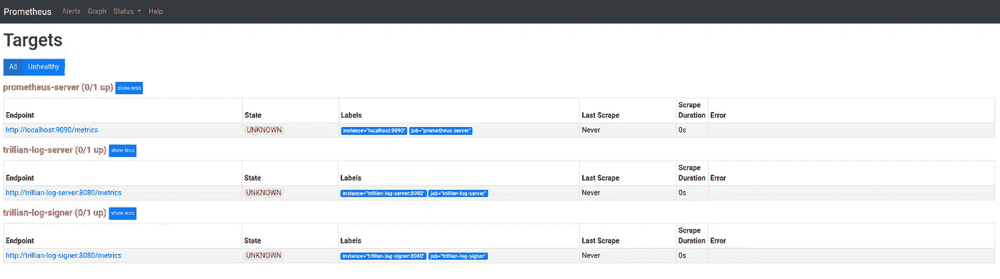
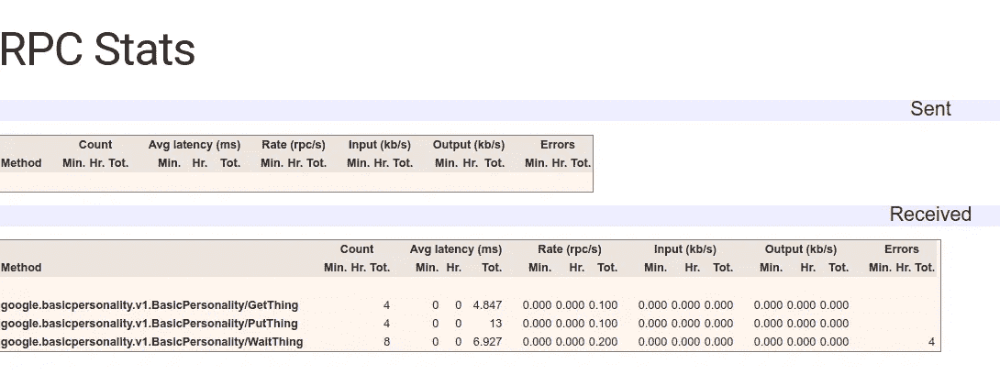
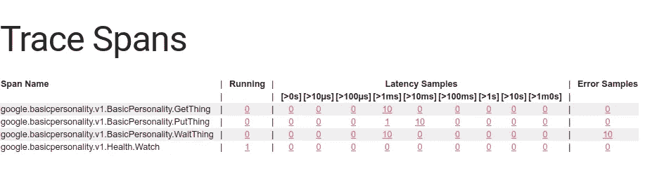

# Google Trillian for Noobs(10 亿美元)

> 原文：<https://medium.com/google-cloud/google-trillian-for-noobs-1b-16097474ee3d?source=collection_archive---------0----------------------->

## 失踪的手册系列

上周，我记录了我希望是最简单的崔莉恩人格。昨天我[记录了](/google-cloud/google-trillian-for-noobs-1a-c87a78e5e585)添加包含证明。今天我们将把`main.go`分成一个客户端和一个服务器，并使用 gRPC 重新连接它们。这是 gRPC 而不是 Trillian 的作品，但它有助于发展个性。

## 设置

您将需要我在之前的帖子中描述的数据库和 Trillian 服务器。

## 基于 gRPC 的个性服务器

这一次，要么克隆`gRPC`:

```
git clone \
--single-branch \
--branch=gRPC \
[git@github.com](mailto:git@github.com):DazWilkin/simple-trillian-log-1.git
```

或者您可以运行 Docker 合成文件:

```
docker-compose --file=./deployment/docker-compose.yml up
```

> 无论哪种情况，你都需要创建数据库。

Docker Compose 将创建 7 个服务:

```
Name                       State  Ports
--------------------------------------------------------------------
adminer                    Up     0.0.0.0:7777->8080/tcp
basic-personality-client   Up     0.0.0.0:9997->9999/tcp
basic-personality-server   Up     50051/tcp
                                  0.0.0.0:8080->8080/tcp
                                  0.0.0.0:9998->9999/tcp
db                         Up     3306/tcp
prometheus                 Up     0.0.0.0:9090->9090/tcp
trillian-log-server        Up     0.0.0.0:54051->50051/tcp, 8080/tcp
trillian-log-signer        Up     50051/tcp, 8080/tcp
```

我不会进一步描述`adminer`和`db`。可以说，`db`服务在(！idspnonenote)中公开了端口`3306`。)Docker 创建的网络组成了 Trillian 日志服务器和日志签名者。

`basic-personality-client`在`basic-personality-client:9999`上内部公开一个 zPages 端点，该端点将在`:9997`上在您的主机上公开。您可以使用`localhost:9997/debug/rpcz`或`localhost:9997/debug/tracez`浏览该端点。

`basic-personality-server`在内部公开`:50051`(仅),由`basic-personality-client`使用 gRPC 访问。该服务还在内部公开了`:8080` (http)和`basic-personality-server:9999`上的一个 zPages 端点，该端点将在`:9998`上在您的主机上公开。您可以使用`localhost:9998/debug/rpcz`或`localhost:9998/debug/tracez`浏览该端点。

`prometheus`服务在`:9090`上公开其端点(见下文)。

`trillian-log-server`在`:54051`的主机上暴露其 gRPC 端点。这是为了提供一个主机可访问的端点来使用`createtree`二进制文件创建新的日志。

## 普罗米修斯

目前只有 Trillian 服务被检测。您可以通过以下网址访问 Prometheus 服务器:

```
[http://localhost:9090](http://localhost:9090/targets)
[http://localhost:9090](http://localhost:9090)/graph
http://localhost:9090/status
http://localhost:9090/targets
http://localhost:9090/-/healthy
```



> **注意**因为 Prometheus 是 Docker Compose 网络的一部分，所以该服务能够使用 Trillian 服务的网络名称(`trillian-log-server`和`trillian-log-signer`)来引用它们。如果您希望直接访问这些服务的`/metrics`端点，您将需要创建`port`绑定来在主机上公开这些服务的`:8080`端口。

## zPages

OpenCensus 的 zPages 包增加了一个小功能，提供了 gRPC 调用的细节，包括跟踪。谷歌的惯例是多元化(多元化？)这些带'-z '的。因此，您可以浏览:

```
[http://localhost:9998/debug/rpcz](http://localhost:9998/rpcz)
http://localhost:9998/debug/tracez
```

对于`basic-personality-server`(在`:9998`曝光)，您应该看到:



/调试/rpcz

并且:



/debug/tracez

> **NB** 对于 tracez 来说，第一列是进行中的|正在运行的跟踪，所以你必须在适当的时候刷新。延迟直方图提供了更多深入分析的机会。

## 频道 z

基本个性 gRPC 服务器在其 gRPC 端点(`:50051`)上公开了一个[通道](https://grpc.io/blog/a_short_introduction_to_channelz/)端点。如果您希望探索 channelz 的功能，请参见 [gdebug](https://github.com/grpc/grpc-experiments/tree/master/gdebug) 。最简单的解决方案是修改 Docker Compose 文件，将这个端口暴露给主机，这样您就可以在主机上运行 gdebug，并且 gdebug 可以访问基本的个性化服务。

## 原蟾蜍

回购的这一分支中的变化的本质是为我们的原始客户端(`main.go`)发送到 Trillian 日志服务器和从 Trillian 日志服务器接收的消息添加了 protobuf 定义。我们重构了这段代码，使它看起来像是在与一个`server`交互，而实际上这纯粹是一个命名|包的想法。你会记得我们有三个函数有相似的签名。的形式:

```
server.**put**(&Request{
  thing: *thing,
  extra: *extra,
 }
```

在创建了这些函数和消息的 protobuf 定义之后。那么现在使用 gRPC `client`代理的新客户端代码看起来类似:

```
client.PutThing(ctx, &pb.ThingRequest{
   Thing: &pb.Thing{...},
   Extra: &pb.Extra{...},
})
```

gRPC 服务器代理只是:

```
func (s *server) PutThing(ctx context.Context, r *pb.ThingRequest) (*pb.ThingResponse, error) { return s.**put**(r) }
```

我不想用 gRPC 教程来烦你，但是为了完整起见，`pb.ThingRequest`和`pb.ThingResponse`类型在 protobuf 定义中描述了，还有我们重命名的——但在其他方面类似的——函数`PutThing`、`GetThing`和`WaitThing`。

```
syntax = "proto3";package google.basicpersonality.v1;option go_package = "github.com/DazWilkin/basic-personality/protos";
option java_package = "com.google.dazwilkin.basicpersonality";service BasicPersonality {
  rpc PutThing(ThingRequest) returns (ThingResponse) {};
  rpc GetThing(ThingRequest) returns (ThingResponse) {};
  rpc WaitThing(ThingRequest) returns (ThingResponse) {};message **ThingRequest** {
  Thing thing = 1;
  Extra extra = 2;
}
message **ThingResponse** {
  string status = 1;
}
message Thing {
  string name = 1;
}
message Extra {
  string name = 1;
}
```

我们所需要做的就是向 protobuf 编译器(`protoc`)提供上面的定义，配置它来为我们生成 Golang 绑定，我们就快完成了。

然后，我们需要将原来的`main.go`解耦成一个客户端和一个服务器，每个客户端和服务器都使用机器生成的 gRPC 绑定来绑定`BasicPersonality`，并让 gRPC 运行时负责在它们之间传递消息。

## Docker 撰写

如前所述，Docker Compose 文件被扩展为与数据库、Trillian 日志服务器和日志签名者以及 Prometheus 一起运行`basic-personality-client`和`basic-personality-server`。我们用 gRPC 端口(`:50051`)来配置它们，以便将它们绑定在一起。

客户端被配置为永远运行，尽管有 15 秒钟的暂停。当你编写 Docker 文件时，小心不要让它运行，因为你最终会破坏数据库。

## 结论

我们现在有一个非常基本的 Trillian personality，称为“基本 personality ”,它被实现为 Golang gRPC 服务器，该服务器本身使用 gRPC 与 Trillian 服务进行通信。为了简单起见，我们生成了一个 Golang gRPC 客户端，它与我们的基本个性服务器集成在一起。

因为 Basic Personality 有一个 protobuf 服务定义，并使用该定义公开了一个 gRPC 端点，所以您可以使用 protobuf 并以任何 gRPC 语言生成一个客户机来与服务进行对话。

在接下来的步骤中，我想我会(a)使用 OpenCensus 来规范这些服务；(b)生成一个非 Golang gRPC 客户端。我在谷歌上搜索了 Rust gRPC，对于一个 Rust 初学者来说，这似乎不是一件小事。如果有人读了这篇文章，想展示这是如何做到的，我会很感兴趣。