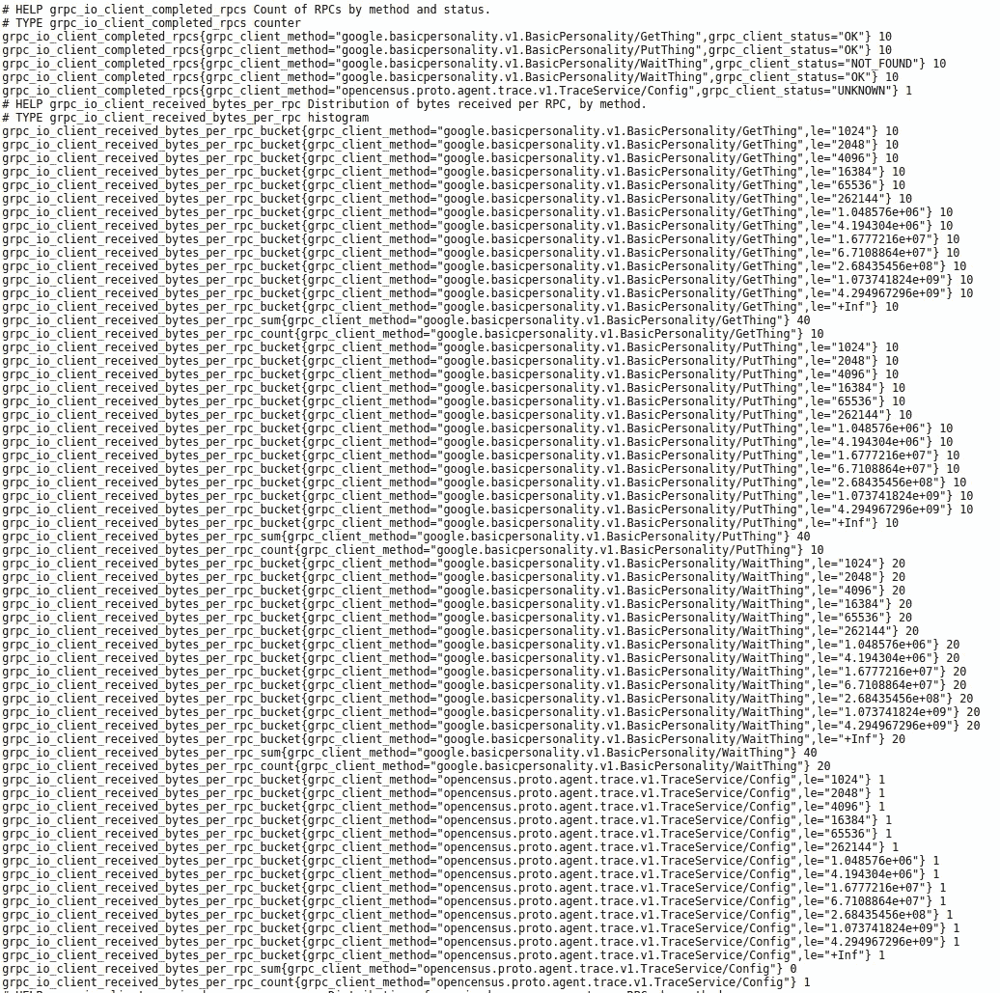
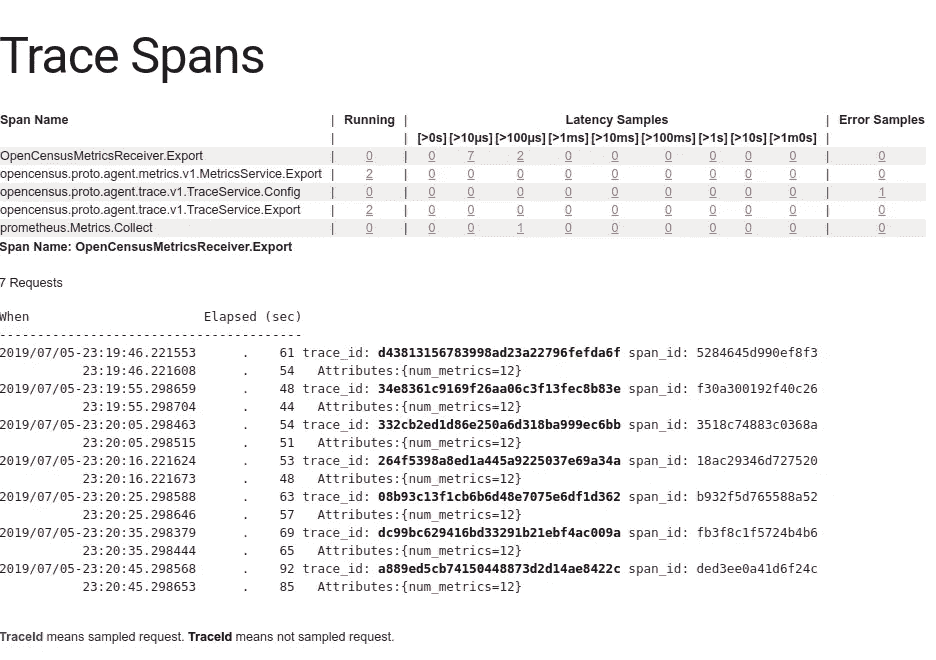
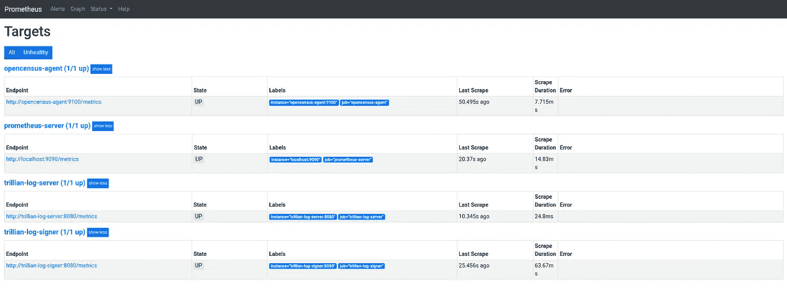
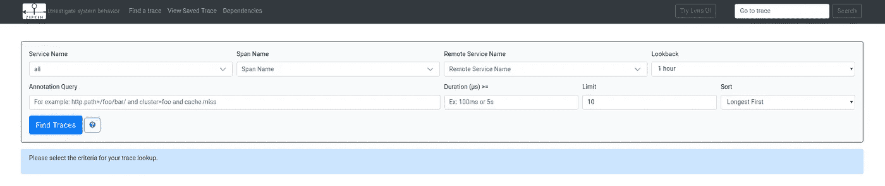
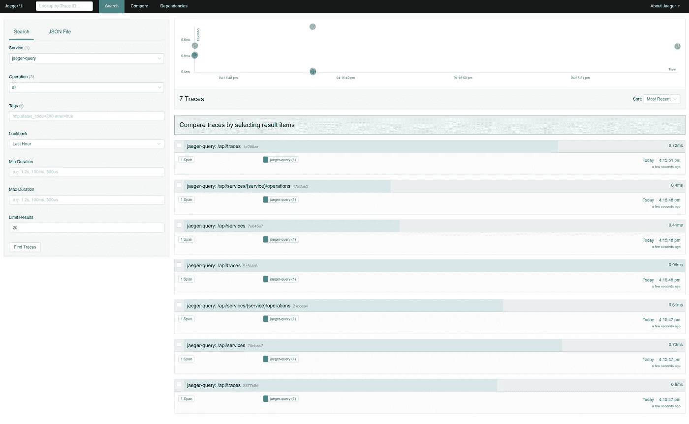

# Google Trillian for Noobs (1c)

> 原文：<https://medium.com/google-cloud/google-trillian-for-noobs-1c-dddb66ddd09f?source=collection_archive---------1----------------------->

## 失踪手册系列

上周，我记录了我所希望的最简单的崔莉恩人格。昨天，我[记录了](/google-cloud/google-trillian-for-noobs-1a-c87a78e5e585)添加包含证明。今天早些时候，我[记录了](/google-cloud/google-trillian-for-noobs-1b-16097474ee3d)为个性构建一个基于 gRPC 的客户端和服务器。这里有一个小的添加，增加了度量(统计)和跟踪。

## OpenCensus 导出器

通过使用 OpenCensus 代理为 OpenCensus 导出器添加一个简单的配置，我们能够配置代理将传入的 stats|traces 转换为各种第三方服务。

下面是基本的个性化服务器配置:

```
oc, err := ocagent.NewExporter(
 ocagent.WithAddress(*ocagEndpoint),
 ocagent.WithInsecure(),
 ocagent.WithReconnectionPeriod(10*time.Second),
 ocagent.WithServiceName(serviceName),
)
if err != nil {
 log.Fatal(err)
}
defer oc.Stop()
```

下面是代理的配置，用于在`:55678`上接收传入的 stats|traces，并将 stats 导出到 Prometheus(在`:9100`上)，并将 traces 路由到端口`:9411`上的`zipkin`服务:

```
receivers:
  opencensus:
    address: ":55678"exporters:
  jaeger:
    collector_endpoint: "**jaeger**:14268/api/traces"
  prometheus:
    address: ":9100"
  zipkin:
    endpoint: "**zipkin**:9411/api/v2/spans"zpages:
    port: 9999
```

> 潜在的混乱来源。这些 DNS 名称由 Docker Compose 提供给它创建的网络上运行的服务。解决方案中的其他服务可以访问这些名称。在这种情况下，OpenCensus 代理(本身称为`opencensus-agent`)能够通过服务名(`jaefer`、`zipkin`)引用这些其他服务，但只能在解决方案中引用。在外部，我们需要将这些服务映射到`localhost`上的一个可用端口上。

## OpenCensus 代理

OpenCensus 代理在主机`:9100`上导出为 Prometheus 导出器，因此您可以查询`[http://localhost:9100/metrics](http://localhost:9100/metrics)`并希望看到:



我们可以通过检查 OpenCensus 代理的日志来确认它:

```
docker-compose \
--file=deployment/docker-compose.yml \
logs **opencensus-agent**Attaching to deployment_opencensus-agent_1
opencensus-agent_1          | {"level":"info","ts":1562357412.0980296,"caller":"config/config.go:490","msg":"Trace Exporter enabled","exporter":"zipkin"}
opencensus-agent_1          | {"level":"info","ts":1562357412.0983222,"caller":"config/config.go:497","msg":"Metrics Exporter enabled","exporter":"prometheus"}
opencensus-agent_1          | 2019/07/05 20:10:13 Running OpenCensus Trace and Metrics receivers as a gRPC service at ":55678"
opencensus-agent_1          | 2019/07/05 20:10:13 Running zPages on port 9999
```

OpenCensus 代理被配置为(`:9999`)显示 zPages，因此我们可以询问该端点:



/debug/tracez

> **注意**我本希望看到代理反映的上游 gRPC 跟踪，但它们没有。所以这是一个问题。

## 普罗米修斯

OpenCensus 代理现在是 Prometheus 服务器的一个抓取目标(通过上面的导出程序)。因此，基本的个性客户端和服务器 gRPC 指标被导出到 OpenCensus 代理，该代理将其作为 Prometheus 导出器导出，然后由该服务器捕获:



## 齐普金



出于某种原因——有待探究——Zipkin 要么没有接收到要么无法处理通过 OpenCensus 代理路由的由自动`ocgrpc`处理程序生成的跟踪。

您也可以确认 Zipkin 服务日志，尽管这些日志很详细，这里不包括:

```
docker-compose \
--file=deployment/docker-compose.yml \
logs zipkin
```

## 贼鸥

当 Zipkin 没有显示痕迹时，我添加了 [Jaeger](https://www.jaegertracing.io) (另一个痕迹监控工具)来查看它是否是 Zipkin，上游 OpenCensus 代理，或者其他什么东西。杰格报告了它自己的踪迹但没有其他人。因此，在我的配置或 OpenCensus 代理中有一些东西不起作用:



## 结论

一个整合统计和追踪到基本个性的“娱乐套餐”。如果能完美运行就更牛逼了；-)