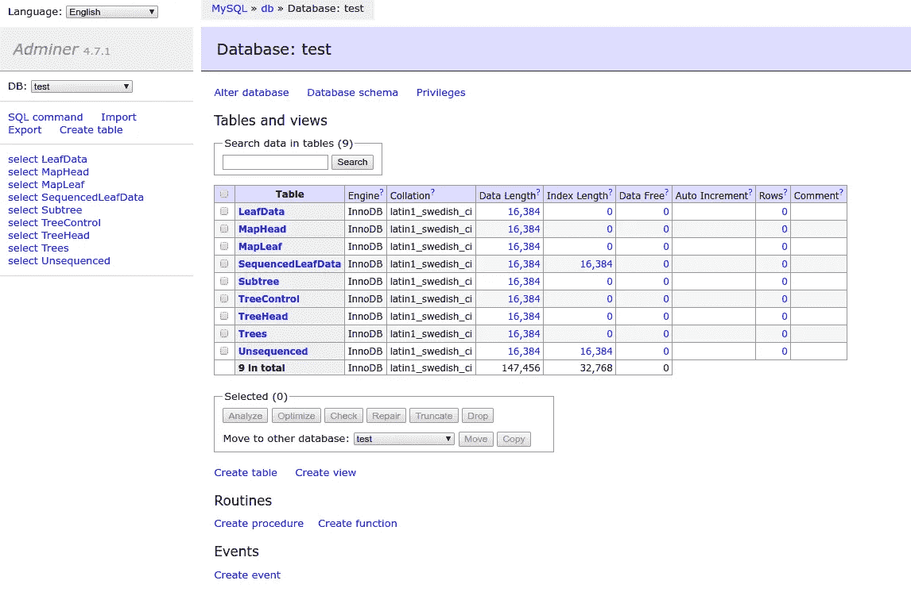

# Google Trillian for Noobs (1)

> 原文：<https://medium.com/google-cloud/google-trillian-for-noobs-9b81547e9c4a?source=collection_archive---------1----------------------->

## 失踪手册系列

谷歌 [Trillian](http://github.com/google/trillian) 提供了一个防篡改的仅附加日志(以及即将推出的日志支持地图)。它是一个开源项目，是[证书透明](https://www.certificate-transparency.org/)、[密钥透明](https://github.com/google/keytransparency)、Go 团队的 [Go 模块镜像](https://proxy.golang.org) ( [提案](https://go.googlesource.com/proposal/+/master/design/25530-sumdb.md))以及一些尚未公开的应用的基础。

(谷歌的)工程师们非常擅长构建精彩的技术，但在向我们这些凡人解释如何使用这些技术时，他们往往表现不佳！在一系列简短的帖子中，我将记录我在构建 Trillian 应用程序原型时的经历(Trillianeers 称这些为“个性”)，原因有三:

*   通过解释澄清我的理解
*   帮助他人了解崔莉恩
*   征求 Trillian 团队的反馈，以增进我的理解

> 我是一名谷歌员工，但不是 Trillian 团队的成员。我正努力扮演外部开发人员的角色，帮助 Trillian 团队了解这种体验，并改进其文档、样本等。我试图让我与 Trillian 团队的大部分沟通保持公开:在团队的公共 Google Group 上和使用 GitHub 问题上。作为团队的潜在客户，我希望你能比我得到更多的关注；-)

## 概述

1.  在这篇文章中，我们将启动 Trillian 并向日志中添加数据
2.  在下一篇文章中，我们将构建一个基本的 gRPC 客户机-服务器个性
3.  也许是对样本进行四舍五入；信任客户；让我想想…

## 入门指南

`[https://github.com/google/trillian](https://github.com/google/trillian)`

Trillian 团队从回购的自述文件开始提供文档。如果这些内容是你需要开始的水平，我建议你停止阅读这篇文章，继续下去。

如果——像我一样——你的脑袋爆炸了，请继续阅读…

我们将使用 4 个不同的组件:

1.  保存日志的数据库(MySQL|MariaDB)
2.  我们与之互动的万亿级日志服务器
3.  崔莉恩日志签名者
4.  我们的 Trillian 示例应用程序又名“personality”

## 数据库ˌ资料库

让我们创建一个 Docker 卷来保存数据库:

```
docker volume create **trillian-data**
```

运行您首选的 MySQL 数据库:

```
docker run \
--name=database \
--env=MYSQL_ALLOW_EMPTY_PASSWORD=yes \
--mount=source=**trillian-data**,target=/var/lib/mysql \
--publish=3306:3306 mariadb:10.4
```

在第二个 shell 中，连接到数据库引擎，使用用户`test`和密码`zaphod`创建数据库`test`。

> 崔莉恩是以《银河系漫游指南》中的一个角色命名的。`zaphod`是另一个角色的名字。

```
docker run \
--interactive --tty \
**--net=host** \
mariadb:10.4 \
  sh -c 'exec mysql --host=127.0.0.1 --port=3306'
```

然后:

```
drop database if exists test;
create database test;
create user if not exists test@'%' identified by 'zaphod';
grant all on test.* to test@'%';
```

然后:

```
docker run \
--interactive --tty \
--net=host \
--volume=${PWD}/trillian.sql:/trillian.sql \
  mariadb:10.4 sh -c 'exec mysql --host=127.0.0.1 --port=3306 --user=test --password=zaphod test < /trillian.sql'
```

下面是 trillian.sql:

要确认一切恢复正常，请重新进入 MySQL 客户端并:

```
MariaDB [(none)]> **show databases**;
+--------------------+
| Database           |
+--------------------+
| information_schema |
| mysql              |
| performance_schema |
| **test **              |
+--------------------+
4 rows in set (0.001 sec)MariaDB [(none)]> **use test;**
Reading table information for completion of table and column names
You can turn off this feature to get a quicker startup with -ADatabase changed
MariaDB [test]> **show tables**;
+-------------------+
| Tables_in_test    |
+-------------------+
| LeafData          |
| MapHead           |
| MapLeaf           |
| SequencedLeafData |
| Subtree           |
| TreeControl       |
| TreeHead          |
| Trees             |
| Unsequenced       |
+-------------------+
**9 rows** in set (0.001 sec)
```

## 万亿服务器

我们将使用 Docker Compose 作为可能最简单的方式来运行我们将需要的容器群组:数据库、Trillian 日志服务器和 Trillian 日志签名器。下面的`docker-compose.yml`将为我们配置这 3 项服务:

```
docker-compose --file=docker-compose.yml up
```

> **NB** `adminer`包含在内纯粹是为了确认数据库建立正确。如果您在启动服务后浏览`localhost:8080`，您应该能够列出`test`数据库表:



> **NB**Docker 组合服务运行后，您可以使用`docker-compose ps`检查所有服务的状态，并使用`docker-compose logs...`和`trillian-log-server`检查单个服务的日志。

Trillian 服务公开了普罗米修斯度量端点。日志服务器的 http 端点是`:8091`，日志签名者的端点在`:8092`。所以，例如:

`[http://localhost:8091/metrics](http://localhost:8091/metrics)`

> 日志服务器和日志签名者连接到数据库服务。它们相互之间没有联系。

## 基本人格

Trillian 服务支持 gRPC。我们将使用 Trillian 的基本 SDK，它是从服务的 protobufs 自动生成的，用来连接到日志服务器并在其中创建树叶。是的，我们在原木上创造树叶。我这么假设是因为我们实际上是在一棵 Merkle 树上创造树叶。

这里有一个简单的(st？)Trillian 日志服务器客户端:

> **NB** 客户端里还有更多文件，就这个`main.go`。请整体克隆回购:[https://github.com/DazWilkin/simple-trillian-log-1](https://github.com/DazWilkin/simple-trillian-log-1)

配置和运行步骤见下文。

这些代码所做的就是连接到我们之前启动的 Trillian 日志服务器。它连接到您将在下一步中创建的特定日志。然后，我们创建一个任意的`Thing`类型，它将形成叶值(在日志的 Merkle 树中),并使用第二个任意类型`Extra`将(元数据)与每个叶值相关联，这将形成额外的数据。

因为每个叶是唯一的散列，所以每个叶的值必须是唯一的。为了实现这些，我们简单地用当前日期时间作为`Thing`字符串值`"Thing"`的前缀。嗯，每秒钟都是独一无二的，所以不要尝试运行得太快:-)

我们将这个叶值元组和额外数据添加到日志中。

然后，我们通过计算叶值的散列并查询日志来检索它。

在运行示例之前，我们需要在 Trillian 日志服务器中创建一个日志:

```
go get -u github.com/google/trillian/cmd/createtreeRPCS=8090
LOGID=$(\
  go run github.com/google/trillian/cmd/createtree \
  --admin_server=:${RPCS} \
) && echo ${LOGID}
```

那么…请击鼓:

```
GO111MODULES=on \
go get github.com/DazWilkin/simple-trillian-log-1GO111MODULES=on \
go run github.com/DazWilkin/simple-trillian-log-1 \
--tlog_endpoint=:8090 \
--tlog_id=${LOGID}
```

您应该会看到:

```
[main] Establishing connection w/ Trillian Log Server [:8090]
[main] Creating new Trillian Log Client
[main] Creating Server using LogID [2709711571613439438]
[server] Creating
[main] Creating a 'Thing' and something 'Extra'
[thing:new] Creating: [2019-06-28T11:56:13-07:00] Thing
[extra] Creating
[main] Submitting it for inclusion in the Trillian Log
[server:put] Entered
[thing:marshal] Marshaling: [2019-06-28T11:56:13-07:00] Thing
[extra:marshal] Entered
[server:put] ok
[main:put] ok
[main] Retrieving it from the Trillian Log
[server:get] Entered
[thing:marshal] Marshaling: [2019-06-28T11:56:13-07:00] Thing
[server:get] hash: 02a1829d...
[server:get] 0: [2019-06-28T11:56:13-07:00] Thing
[main:get] ok
```

## 拆卸

客户端放置-获取，然后终止。

您可以通过按住 CTRL 键来终止 Docker 合成服务。或者，您可以从您创建`docker-compose.yml`文件的目录中`docker-compose down`和`docker-compose rm`。

如果您希望删除包含万亿日志数据库的 Docker 卷，您可以`docker volume delete trillian-data`。

## 结论

我希望这个故事能帮助其他人克服在使用谷歌 Trillian 形成的“我从哪里开始？”。正如我上面提到的，目的是帮助你开始，并帮助我确认我对 Trillian 的理解。

在后续的故事中，我计划通过将客户机包装在 gRPC 服务器中并使用更复杂的`Thing`作为叶值来增强这个最简单的起点。