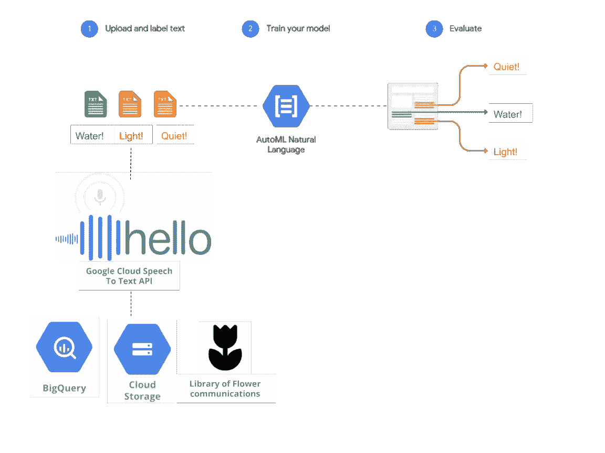
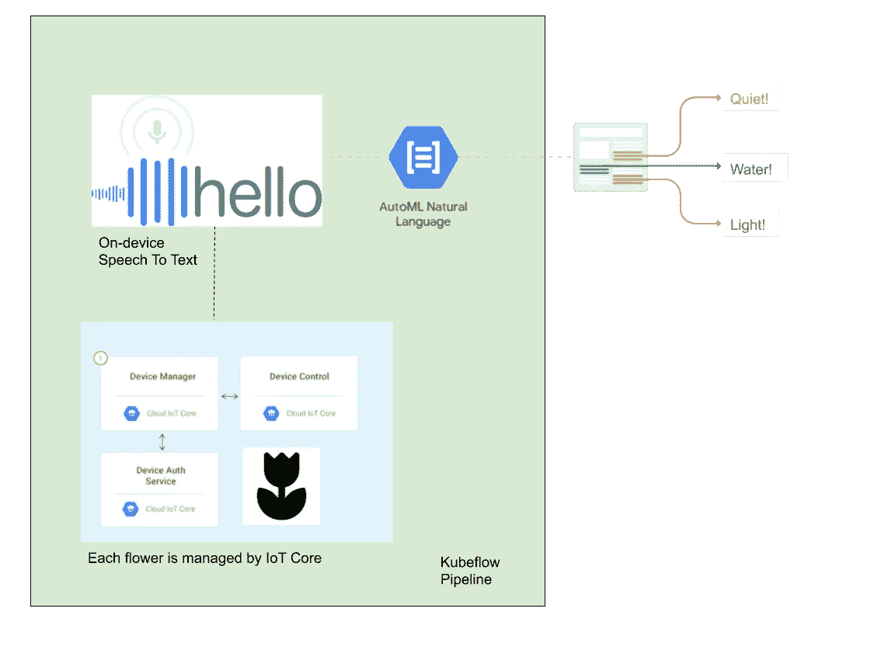
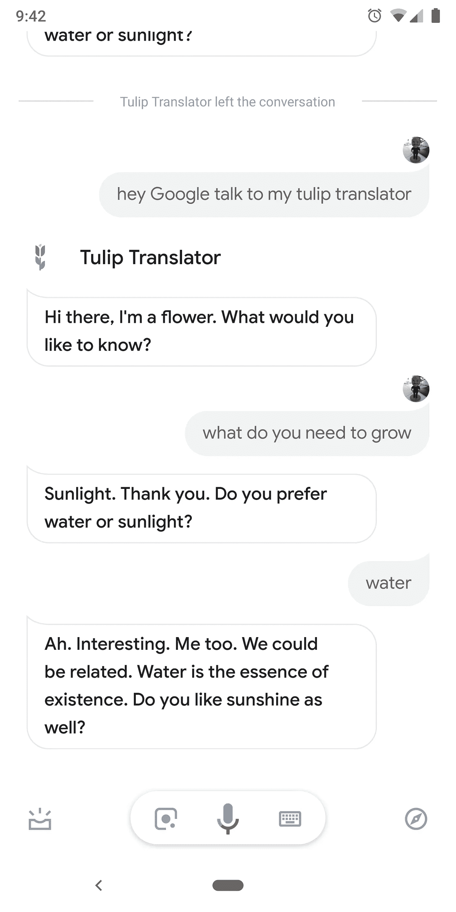
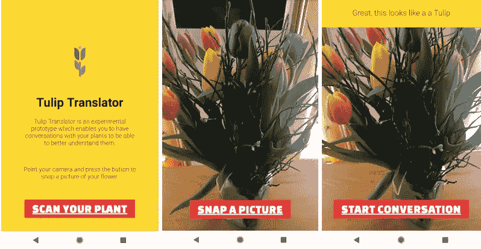

# 谷歌郁金香:技术细节

> 原文：<https://medium.com/google-cloud/google-tulip-the-technical-details-719c317bf2df?source=collection_archive---------0----------------------->

## 我们如何使用机器学习来改善花卉的福祉

*与谷歌郁金香全栈工厂工程师 Lee Boonstra*

我们很高兴宣布谷歌郁金香，我们的机器学习技术，以提高荷兰农业的盈利能力和荷兰经济作物的福祉。

介绍谷歌郁金香

## 我们是如何做到的

荷兰每年生产将近[125 亿朵鲜花](https://www.royalfloraholland.com/en/about-floraholland/who-we-are-what-we-do/facts-and-figures)。荷兰郁金香是世界上最高的花之一，并在田地里建立了强大的社区。研究人员已经证明，郁金香通过它们的根系相互交流，并且能够共享资源。众所周知，由于遍布荷兰的树根网络完善了早期预警系统，一朵小小的红色郁金香成功堵住了保护荷兰的海堤的漏洞。

许多人将郁金香物化，只是想把它们放在花瓶里，以一种与给他们的生活带来如此多意义的根部脱节的方式来展示。在谷歌，我们相信组织世界的信息，根网络中固有的信息对我们很有吸引力。由于与[瓦赫宁根大学&研究所](https://www.wur.eu/plant-language)和过去音频文件图书馆的合作，我们已经数字化了几个世纪以来的花卉交流，并建立了一个机器学习系统来识别郁金香在交流什么。通过这样做，我们已经能够改善郁金香的生活(至少在它们被切割和运输之前)。

## 系统结构

培训架构非常简单。我们能够使用谷歌云语音转文本和自动 ML 自然语言来训练机器学习模型，而无需编写任何代码。

Google Tulip 的训练架构利用了一些预先构建的模型和 Auto ML 自然语言，后者采用了神经机器翻译和神经架构搜索。

进行实时预测更具挑战性，尤其是因为将 100 多万株郁金香绑在一起的连接问题。我们使用云物联网核心来收集单个郁金香的音频数据，并在 Kubeflow 管道上“现场”进行预测。郁金香们的请求随后被人类监督者执行，如视频中的[所示..](https://www.youtube.com/watch?v=nsPQvZm_rgM&feature=youtu.be)

预测的实时服务架构

## 部署

当花朵需要更多的阳光时，我们只需调用谷歌风 API 就能实现。这是我们在两年前的今天宣布的技术，利用机器学习来预测风并确保荷兰的晴空万里，API 很容易集成。

除了对荷兰农业的好处之外，谷歌郁金香的一个意想不到的副作用是为在荷兰拍摄的经典宝莱坞舞蹈序列添加了花卉郁金香的闭路字幕。观看今年宝莱坞电影中的假唱郁金香！

## 谷歌主页上的郁金香翻译器

在 Google Home 或 Google Assistant 上与你的郁金香翻译者交谈。4 月 1 日上市。

而在 2019 年 4 月 1 日，只需:在你的 Google Home 设备上寻找，只需简单地说一句“嘿 Google，跟郁金香翻译器说话”。问问那朵花需要什么才能长得更快。

## 自己动手版

如果你想在你的花园里自己的花上尝试这种技术，你可以使用我们采用谷歌云工具的 DIY 工具包。前往我们的 [GitHub repo](https://github.com/GoogleCloudPlatform/tulip) 查看示例代码和教程，构建一个 DIY 版本:

在我们的 GitHub repo 中，您将找到从您的手机摄像头开始构建自己动手版本的示例代码。

DIY 版本最适合种植少于 100 万朵花的用户:甚至一朵花也可以。为了方便起见，DIY 版本使用照片识别而不是根系，并利用云视觉 AutoML 来理解花朵。

## 后续步骤:

*   观看[视频](https://www.youtube.com/watch?v=nsPQvZm_rgM)。
*   对你的 Google Home 或者 Google Assistant(比如你的 Pixel 手机)说:**“嘿 Google，跟我的郁金香翻译器聊聊吧”**
*   查看 [GitHub](https://github.com/GoogleCloudPlatform/tulip) 上的 DIY 代码。
*   分享这篇文章！