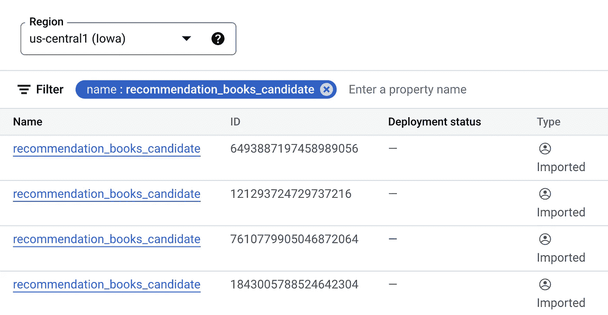

# 谷歌顶点人工智能模型注册和版本控制

> 原文：<https://medium.com/google-cloud/google-vertex-ai-model-versioning-72696bccd0d2?source=collection_archive---------1----------------------->

谷歌在今年早些时候发布了对版本控制模型的支持。但是，关于如何使用它的官方文档仍然非常有限。这篇文章将帮助你了解 Vertex AI SDK 以及如何使用它来版本化你的模型。

直到最近，我们中的大多数人都面临着过于混乱的模型列表。

