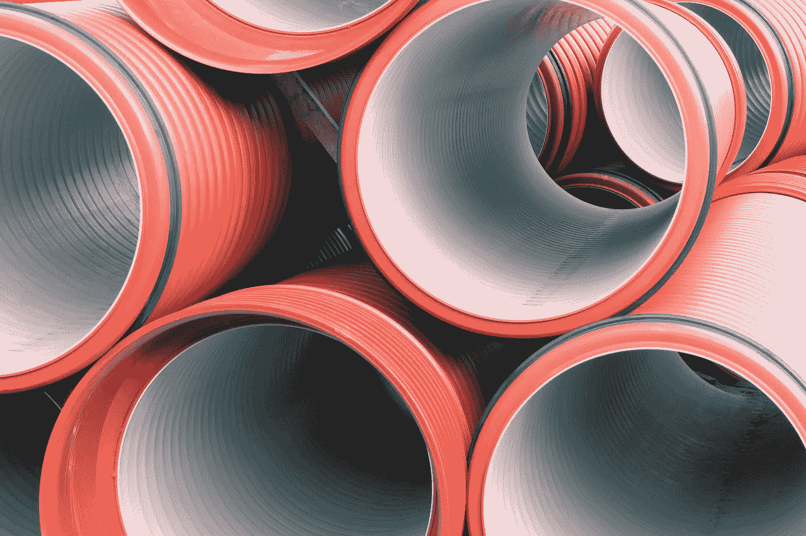

# Google Vertex AI:运行 ML 管道的最简单方法

> 原文：<https://medium.com/google-cloud/google-vertex-ai-the-easiest-way-to-run-ml-pipelines-3a41c5ed153?source=collection_archive---------0----------------------->

## 如今，机器学习团队并不真正需要 Kubernetes

不熟悉 ML 管道？在维护和管理 Kubernetes 上的 Kubeflow 实例时遇到了困难？也许你的 ML 团队很小，你在实现 ML 管道上浪费了太多的时间。或者您希望专注于您的 ML 解决方案，而不是基础设施任务。

