# 使用谷歌云物联网核心、Firestore 和 MongooseOS 进行 GPS/蜂窝资产跟踪

> 原文：<https://medium.com/google-cloud/gps-cellular-asset-tracking-using-google-cloud-iot-core-firestore-and-mongooseos-4dd74921f582?source=collection_archive---------0----------------------->

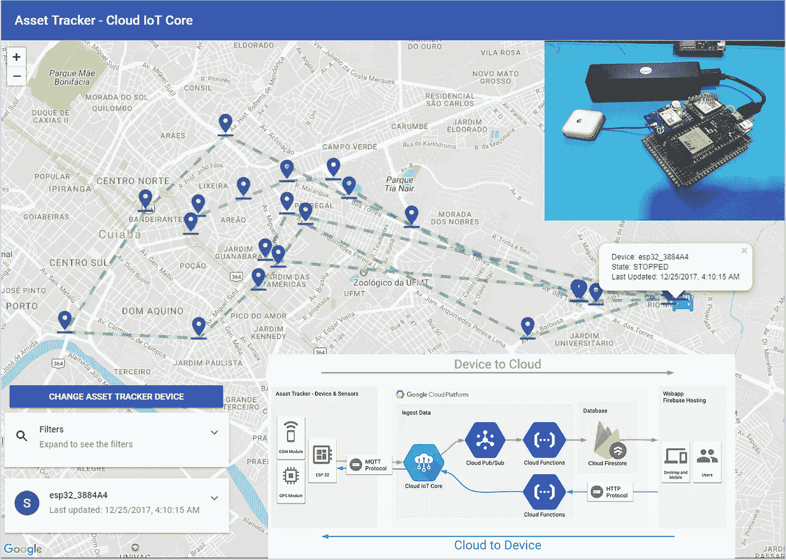

## 使用 GPS 跟踪器随时随地跟踪您的货物，通过移动网络将位置数据发送到令人敬畏的云和无服务器架构。

当今物流行业面临的最大问题之一是资产和车辆的跟踪。我们有很多方法来解决这个问题，GPS 和蜂窝技术已经存在很长时间了，在大多数情况下足以几乎实时地跟踪车辆。我们的项目将使用这两种技术来实现这一目标。在本教程结束时，请查看我们的应用程序的外观:

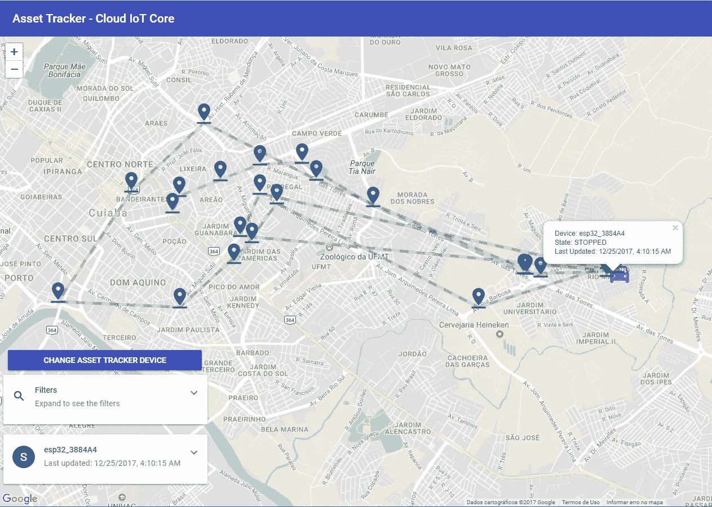

我们出色的网络应用程序来跟踪我们的资产。

> 您可以在[https://asset-tracker-iot.firebaseapp.com/](https://asset-tracker-iot.firebaseapp.com/)访问网络应用

在本教程中，我们将使用运行 **MongooseOS** 的 **ESP32** 微控制器构建一个资产跟踪器，它使用 MQTT 协议通过移动网络通过**云物联网核心**安全地发送数据，使用 **Firebase 云函数**以基于事件的方式处理数据，在 **Firestore 中保存数据和当前设备状态。**然后可以通过托管在 **Firebase Hosting** 上的**渐进式网络应用**访问数据，甚至可以远程配置设备，展示云物联网核心双向通信。

如果你对许多术语感到困惑，我建议你阅读我写的另一篇关于在物联网项目中使用谷歌云的文章。在这篇文章中，我将更详细地解释这些产品。在这里，我将更简洁地介绍一下 Google 上的项目配置。

[](/google-cloud/build-a-weather-station-using-google-cloud-iot-core-and-mongooseos-7a78b69822c5) [## 使用谷歌云物联网核心和 MongooseOS 构建气象站

### 利用托管的无服务器架构收集大量数据，这样您就不会在…

medium.com](/google-cloud/build-a-weather-station-using-google-cloud-iot-core-and-mongooseos-7a78b69822c5) 

在这里，我们将专注于建立一个端到端的架构，以安全的方式处理来自传感器的位置数据，存储数据，在地图上实时显示我们的车队。我们的架构将会是这样的:

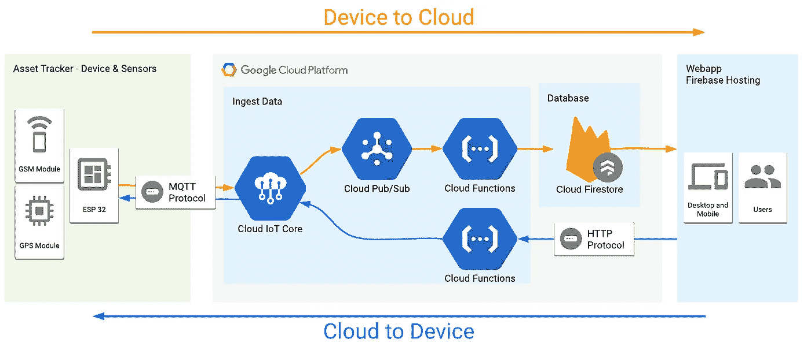

我们的项目架构

# 我们将学到什么

做一个依赖移动网络并考虑到安全性的项目并不容易。我将展示使用 **MongooseOS** 及其出色的 **PPPoS** 库来实现这一点是多么容易，该库通过 GPRS/蜂窝串行模块抽象网络，使我们更容易构建依赖于这种通信的产品。

使用 MQTT 发送数据的安全通道将由云物联网核心处理。所有收到的数据都将存储在 Firestore 数据库中。以下是我们将要学习的内容的总结:

*   快速回顾如何创建一个**谷歌云物联网**项目。
*   使用带有串行 GPRS 模块的 **MongooseOS** 。
*   谷歌最新的 **Firestore** 是什么？
*   将数据从设备发送到云端，并使用 **Firestore** 进行存储。
*   使用云物联网核心 API 将数据从云发送到设备。

## 创建项目和服务

要使用`gcloud`命令行工具，[按照这里的说明下载并安装它](https://cloud.google.com/sdk/downloads)。

 [## 安装 Cloud SDK | Cloud SDK 文档| Google 云平台

### 编辑描述

cloud.google.com](https://cloud.google.com/sdk/downloads) 

安装 SDK 后，您应该安装测试版工具来访问云物联网核心命令。此外，在此之后，您应该验证并创建一个在本教程中使用的项目，将您的 _PROJECT_NAME 替换为您希望用于此项目的名称:

```
# Install beta components:
**gcloud components install beta** # Authenticate with Google Cloud:
**gcloud auth login** # Create cloud project — choose your unique project name:
**gcloud projects create YOUR_PROJECT_NAME** # Set current project **gcloud config set project YOUR_PROJECT_NAME**
```

创建云物联网注册表，设备将在其中注册以发送数据。

```
# Add permissions for IoT Core **gcloud projects add-iam-policy-binding YOUR_PROJECT_NAME --member=serviceAccount:cloud-iot@system.gserviceaccount.com --role=roles/pubsub.publisher** # Create PubSub topic for device data:
**gcloud beta pubsub topics create telemetry-topic** # Create PubSub subscription for device data:
**gcloud beta pubsub subscriptions create --topic telemetry-topic telemetry-subscription** # Create device registry:
**gcloud beta iot registries create asset-tracker-registry --region us-central1 --event-pubsub-topic=telemetry-topic**
```

如果您访问谷歌云控制台，您可以验证一切都已创建和配置。

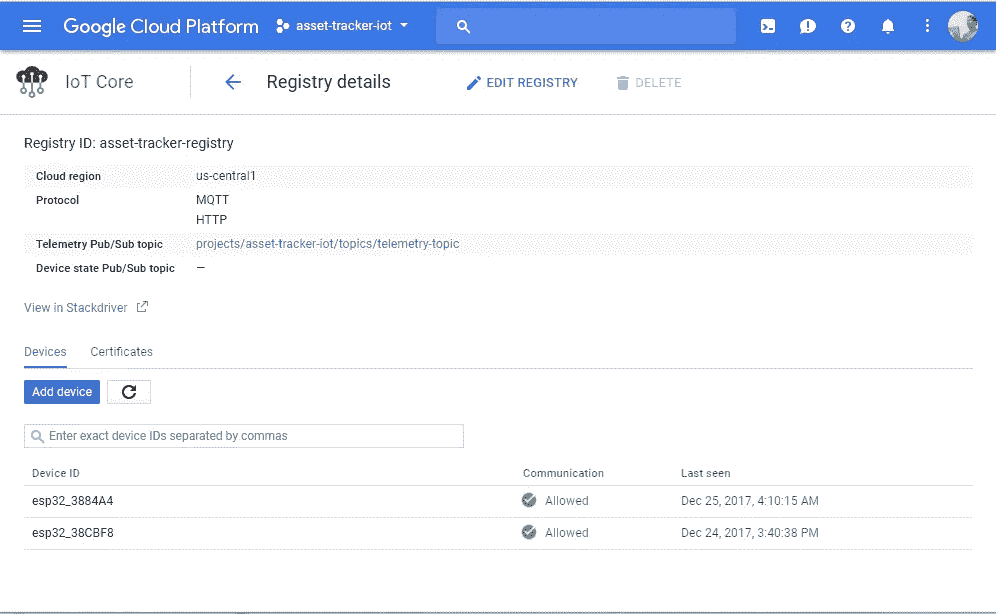

已创建并与发布订阅主题相关联的注册表

# 安装硬件

在这一节中，我将展示如何设置资产追踪器、所需的所有模块以及如何用我们的代码对电路板进行编程。

## 成分

我们项目的核心将是一个 ESP32 WiFi 微控制器，它有许多风格，据我所知，任何模型都可以工作。

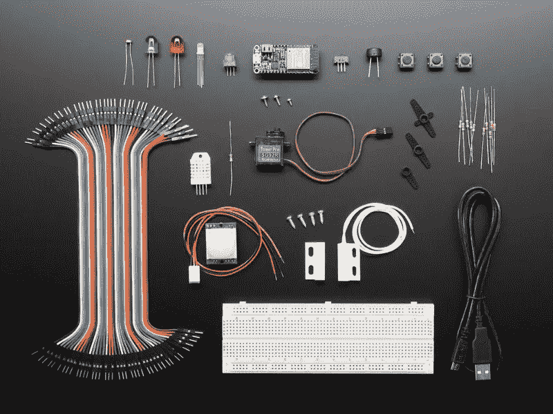

猫鼬操作系统和谷歌物联网核心包，带 Adafruit Feather huzzah 32—[https://www.adafruit.com/product/3606](https://www.adafruit.com/product/3606)

以下是项目组件列表:

*   任何 ESP32 板(我用的是 Lolin32)。
*   NEO 6M uBlox GPS 模块。
*   Sim800L GSM 模块。
*   发光二极管的 220 欧姆电阻。
*   蓝色和绿色 LED 显示设备状态。
*   用于 MOSFET 触发器的 1k 和 10k 欧姆电阻。
*   IRF540N MOSFET(不要尝试使用 TIP120 等廉价 MOSFET，因为它无法满足 GSM 模块的电流需求)
*   1n4007 降压二极管，用于为 GSM 模块供电。
*   针织套衫
*   原型的性能板(可选)

我们的示意图如下:

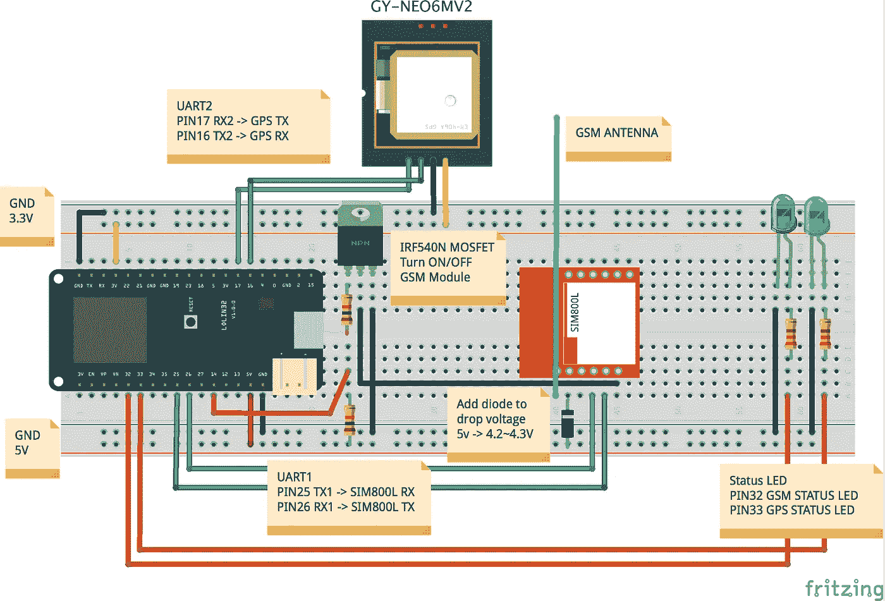

项目示意图

总的来说，原理图非常简单。也许唯一奇怪的部分是 GSM 模块连接。我放了一个 MOSFET 来开关模块，因为它消耗很多能量。这样，我就可以使用更少的能源，并且在不发送数据时让设备进入睡眠状态。另一个细节是使用二极管来降低用 4.2v 给 GSM 模块供电的电压，因为用 3.3v 或 5v 给它供电被模块分别认为是欠压和过压。

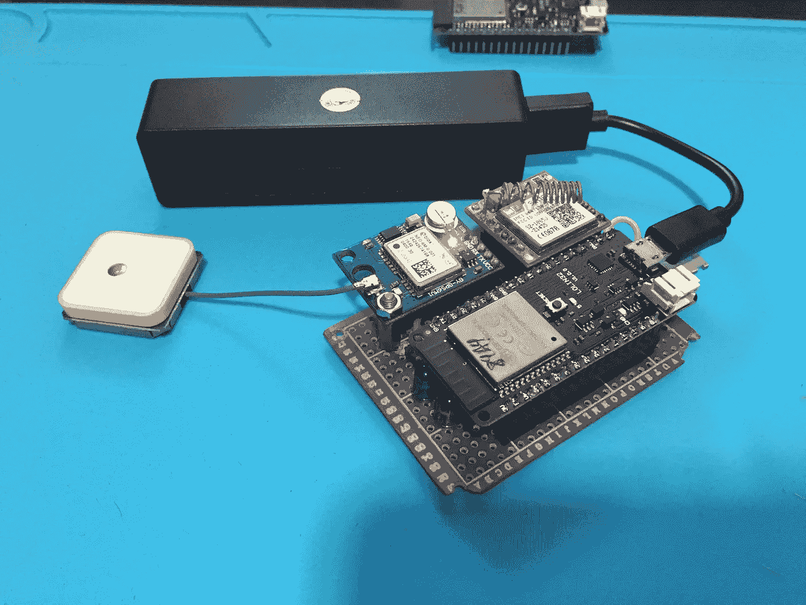

这是在 perfboard 上组装的项目。

## 对硬件进行编程并与我们的项目相关联

为了给电路板编程，我们将使用 MongooseOS。它有一个名为 *mos* 的工具，可以在支持的主板上轻松编程、配置和配置。要使用它，我们需要从官方网站下载并安装它。遵循[https://mongoose-os.com/docs/quickstart/setup.html](https://mongoose-os.com/docs/quickstart/setup.html)上的安装说明。

[](https://mongoose-os.com/docs/quickstart/setup.html) [## Mongoose 操作系统文档

### Mongoose 操作系统文档和用户指南

mongoose-os.com](https://mongoose-os.com/docs/quickstart/setup.html) 

安装好工具后，在这里链接的 [Github 仓库上下载项目代码](https://github.com/alvarowolfx/asset-tracker-gcp-mongoose-os)，这样您就可以在设备上构建和部署它了。

[](https://github.com/alvarowolfx/asset-tracker-gcp-mongoose-os) [## alvarowolfx/资产跟踪系统-GCP-mongose-OS

### 资产追踪-GCP-mongose-OS-🚧[WIP]使用运行 MongooseOS + GPS 和 GPRS 模块的 ESP32 制作的资产追踪器…

github.com](https://github.com/alvarowolfx/asset-tracker-gcp-mongoose-os) 

存储库由 **3 个子项目**组成:

*   **固件**:运行在微控制器上的 MongooseOS 项目，它收集位置数据，并使用蜂窝网络通过云物联网核心发送。
*   **功能**:将部署到 **Firebase** 上的云功能。这里我们有一个函数对 PubSub 上的新数据做出反应，并将其保存在 **Firestore** 上。还有一个功能，它基本上是一个 HTTP 端点，用于将数据从云发送到设备，并配置更新间隔。它将由我们的 WebApp 使用，因此用户可以配置我们设备的更新间隔。
*   **public** :用 React 构建的 WebApp，将部署在 Firebase 主机上，它参考我们的数据库，在地图上显示我们的设备，并与它们进行交互。该项目是使用`create-react-app`创建的。

我将在接下来的章节中详细介绍每个项目。

## 固件项目

以下是对**固件**项目的一些描述:

*   **fs/init.js** :这里是我们的 Javascript 代码，它包含了在可配置的时间间隔内收集数据并通过 MQTT 发送的所有逻辑。
*   **mos.yml** :我们的项目配置，在这里我们声明我们的项目依赖项，这里是 GCP、PPPoS、GPS 和 mJS 库，最后一个增加了对 Javascript embedded 的支持。这里我们声明了一个名为 **app.update_interval，**的配置变量，这样我们就可以通过改变这个配置来改变更新间隔，这个配置也可以通过 *mos* 工具或代码来改变。我还通过 **wifi.sta.enable** 配置关闭了 WiFi 以减少微控制器上的功耗。

*   在 **mos.yml** 文件中，我们可以看到 PPoS 和 GPS 的配置。您必须将其更改为您的 SIM 卡网络 APN 配置才能使其工作。根据您的 ESP32 型号，您还可以更改项目使用的 UART 端口。

现在看一下设备代码，它的大部分功能都有一点注释。基本上，设备流程如下:

*   尝试连接到 MQTT 服务器并打开/关闭 GSM Led。
*   尝试获取一些 GPS 数据，然后打开/关闭 GPS Led。
*   如果一切正常，它会通过 MQTT 发布数据。
*   发布后，设备会在一段时间后关闭 GSM 模块(以便有时间发布消息)，然后进入深度睡眠模式。
*   从深度睡眠中醒来后，设备会自动复位并重新开始。
*   如果设备发布数据的时间太长，它也会进入深度睡眠模式以节省电池。

要对硬件进行编程，请进入**固件**文件夹并运行以下指令来刷新固件、配置 WiFi 并在云物联网核心上配置设备:

*   根据选择的硬件运行`mos build --arch esp32`。这个命令构建我们硬件的固件。
*   在通过 USB 连接硬件的情况下运行`mos flash`来刷新固件。
*   运行以下命令在云 IoT 代码上注册此设备。该命令生成用于通信的公钥和私钥，将私钥放在设备上，将公钥发送到云物联网核心并注册设备，从 ESP 获取设备 Id。谢谢蒙古人❤.

```
mos gcp-iot-setup --gcp-project **YOUR_PROJECT_NAME** --gcp-region us-central1 --gcp-registry **YOUR_REGISTRY**
```

就是这样，你的设备将开始收集位置数据，连接到蜂窝网络，并将数据发送到云物联网核心。你可以使用`mos console`工具看到设备上发生了什么。你会看到它试图连接到蜂窝网络和 mqtt.googleapis.com。下面是来自`mos console`的一些输出，我省略了一些垃圾消息:

```
$ mos console
Using port /dev/cu.SLAB_USBtoUART
[Jan 17 11:18:00.762] mgos_net_on_change_c PPP: connecting
[Jan 17 11:18:00.772] == Net event: 1 CONNECTING 
[Jan 17 11:18:00.811] mgos_pppos_uart_disp Starting PPP, user 'tim'
[Jan 17 11:18:00.818] mgos_net_on_change_c PPP: connected
[Jan 17 11:18:00.827] == Net event: 2 CONNECTED 
[Jan 17 11:18:00.833] mongoose_poll        New heap free LWM: 218968
[Jan 17 11:18:01.559] mgos_net_on_change_c PPP: ready, IP 179.11.108.69, GW 192.168.254.254, DNS 189.40.198.80
[Jan 17 11:18:01.572] == Net event: 3 GOT_IP 
[Jan 17 11:18:01.579] mgos_mqtt_global_con MQTT connecting to mqtt.googleapis.com:8883
[Jan 17 11:18:01.827] $GGA: fix quality: 0
[Jan 17 11:18:01.832] $GSV: sattelites in view: 3
[Jan 17 11:18:02.498] mgos_sntp_query      SNTP query to pool.ntp.org
[Jan 17 11:18:09.730] mongoose_poll        New heap free LWM: 206328
[Jan 17 11:18:09.810] mgos_mqtt_ev         MQTT TCP connect ok (0)
[Jan 17 11:18:10.834] mgos_sntp_ev         SNTP reply from 200.160.7.186: time 1516198687.979016, local 27.250466, delta 1516198660.728550
[Jan 17 11:18:24.767] mgos_mqtt_ev         MQTT CONNACK 0
[Jan 17 11:18:24.774] MQTT CONNECTED 
[Jan 17 11:18:24.782] do_subscribe         Subscribing to '/devices/esp32_3884A4/config'
[Jan 17 11:18:26.182] Got config update: {"update_interval":120}
[Jan 17 11:18:26.291] save_cfg             Saved to conf9.json
[Jan 17 11:18:26.312] Setting timer with  120  seconds interval 
[Jan 17 11:18:29.304] Published 
[Jan 17 11:18:29.307] Sleeping 
[Jan 17 11:18:37.316] Turning off all devices
```

我建议带着设备去散步，以生成数据，有时我在家里连接 GPS 和 GPRS 时也会遇到问题。要查看 PubSub 上的数据，您可以使用`gcloud`命令来查询我们创建的订阅:

```
$ gcloud beta pubsub subscriptions pull --auto-ack telemetry-subscription
┌──────────────────────────────────────────────────────────────────────────────────────────────────────────────────────────────────┬────────────────┬─────────────────────────────────────────┐
│                                                               DATA                                                               │   MESSAGE_ID   │                ATTRIBUTES               │
├──────────────────────────────────────────────────────────────────────────────────────────────────────────────────────────────────┼────────────────┼─────────────────────────────────────────┤
│ {"latlon":{"sp":"0.197133","lon":"-56.082420","lat":"-15.581032"},"temp":53.333333,"free_ram":214.191406,"total_ram":287.621094} │ 22138603640541 │ deviceId=esp32_3884A4                   │
│                                                                                                                                  │                │ deviceNumId=2569363294223005            │
│                                                                                                                                  │                │ deviceRegistryId=asset-tracker-registry │
│                                                                                                                                  │                │ deviceRegistryLocation=us-central1      │
│                                                                                                                                  │                │ projectId=asset-tracker-iot             │
│                                                                                                                                  │                │ subFolder=                              │
└──────────────────────────────────────────────────────────────────────────────────────────────────────────────────────────────────┴────────────────┴─────────────────────────────────────────┘
```

如果你看到控制台上的数据，你可以开始庆祝，我们走在正确的道路上🎉🏆。

## 具有 Firebase 云功能的云 Firestore 数据库和后端

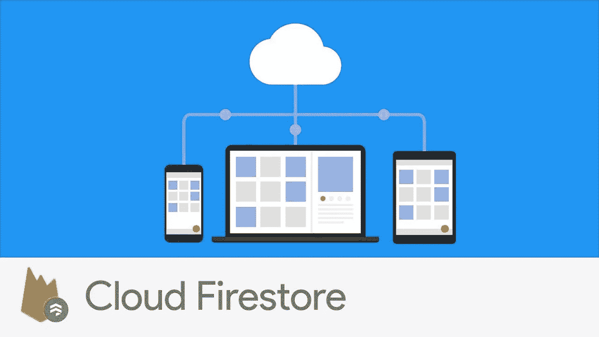

**云 Firestore** 就像是 **Google Datastore** 和 **Firebase 实时数据库**的合并，具有一些功能，如文档和集合定义、实时数据同步、数据复制和多种语言的 SDK。对我来说，最令人兴奋的消息之一是，所有 Firebase 产品都同样易于使用，与 Firebase 数据库相比，我们现在对高级查询和数据建模的支持更好了。

对于这个项目，我选择 Firestore 是因为它有以下特点:

*   在名为`devices`的**集合**中维护设备状态，在名为`location_logs`的**子集合**中维护每个设备发送的所有位置数据。每个集合可以包含大量具有灵活模式的文档，这样 Firestore 使我们能够更好地组织我们的数据和更强大的查询功能，从而更好地扩展。
*   我们可以让客户端上的**实时更新**，这样我们就可以在数据到达的那一刻看到最新的数据。
*   我们不需要维护或扩展我们的数据库:Cloud Firestore 可以根据您的数据进行扩展，并且拥有开始开发我们的应用程序所需的所有 SDK。**牛逼的无服务器开发**。

这个项目使用 Firebase Cloud 函数来处理我们的应用程序需要的所有自定义规则和后端服务。代码如下所示，但有些设置可以在项目中更改:

*   **REGION** 和 **REGISTRY** :您需要使用这些变量更改您的项目区域和您的云物联网核心注册表的名称。
*   控制我们是否认为新的位置数据是设备的相当大的移动，如果我认为我的设备在相同的地方。我的默认设置是考虑 50 米。

下面是在云上运行的响应我们的事件的每个函数的一些细节:

*   **exports . updatedeviceconfig:**我们的 webapp 用来更改设备配置的 HTTP 端点。该函数接收一个 deviceId 和一个 updateInterval，然后调用云物联网核心的方法 modifyCloudToDeviceConfig 方法更新设备配置。我们直接使用了 Google APIs，直到今天我们还没有一个官方的云物联网核心库(见 **getCloudIoTClient** 函数)。此外，当向设备发送新的更新配置时，数据必须是 Base64 格式，但是设备接收的数据已经以 JSON 格式解析。
*   **exports . receive telemetry:**这个函数对到达云物联网核心配置的 PubSub 主题的每个数据做出反应。该函数完成大部分繁重的工作，它维护 Firestore 上的设备最新数据，并查看是否有显著的移动来将新数据插入 location_logs 子集合。
*   这个函数是一个特殊的函数，在这里我维护了一个索引，记录了每台设备每天存储了多少位置点，这样我们就可以知道在 UI 上显示哪些日期，而不必对位置日志进行大量的查询。当我们使用 NoSQL 数据库时，有时我们会有这些**的折衷**来获得更好的性能。

为了部署我们的功能，我们需要 *Firebase 命令行工具，*它需要 Node。js 和 npm [、](https://www.npmjs.org/)可以按照[https://Nodejs.org/.](https://nodejs.org/)安装 node 上的说明安装，JS 也会安装 npm。安装节点和 NPM 后，运行以下命令安装 Firebase CLI。

```
npm install -g firebase-tools
```

现在，要用我们的项目配置 firebase 并部署功能，在项目根文件夹中，遵循上面的说明:

*   运行`firebase login`向 Google 认证并设置命令行工具
*   运行`firebase init`将本地项目与您的 Firebase 项目关联起来。
*   用`cd function && npm install.`命令安装云函数依赖项
*   最后运行`firebase deploy --only functions`只部署我们的功能，因为我们的 webapp 首先需要构建，然后才能部署。

使用已部署的功能，您可以存储我们接收到的由设备发送的位置数据，并执行我们关于如何存储它的自定义规则。您可以在 Firebase 控制台上查看和监控所有部署的资源。

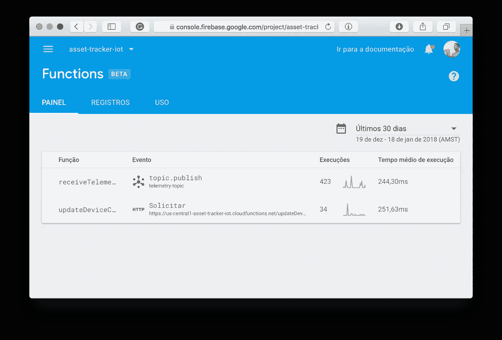

您可以看到在 Firebase 上运行的函数的执行和日志。

现在是时候部署我们的 WebApp 了。

## 用 React 制作的 WebApp 项目

对于项目的这一部分，我不会进入太多的细节，因为这不是这篇文章的主题，但我会强调一些访问云 Firestore 的方法。


我们出色的网络应用程序来跟踪我们的资产。

以下是 WebApp 的一些最重要的功能，它访问 Firestore 上的数据，并调用我们的端点来更新设备配置:

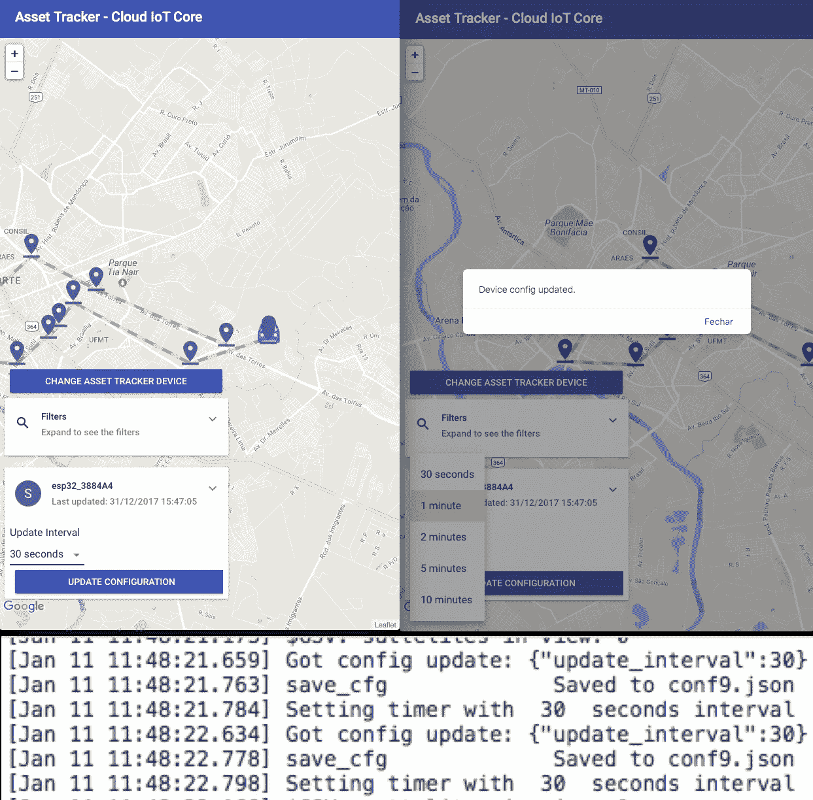

更新设备配置。

对于这个应用程序，我使用了一个名为 create-react-app 的非常棒的工具，它配置了一个非常好的项目结构和工具来使用现代 Javascript，在这种情况下使用 react。不知道的，推荐去他们的[官方博客](https://reactjs.org/blog/2016/07/22/create-apps-with-no-configuration.html)看看。

[](https://reactjs.org/blog/2016/07/22/create-apps-with-no-configuration.html) [## 无需配置即可创建应用- React 博客

### Create React App 是官方支持的创建单页 React 应用程序的新方法。它提供了一个现代建筑…

reactjs.org](https://reactjs.org/blog/2016/07/22/create-apps-with-no-configuration.html) 

在上一节中，我们已经安装了 NPM，所以现在我们只需安装所有项目依赖项并将其构建到生产环境中。下面是一些用`create-react-app`配置的命令:

*   在项目主文件夹上运行`npm install`，所有的依赖项都将被安装。
*   要运行本地服务器，您可以运行`npm start`命令。这将启动一个实时重新加载服务器，并在我们的代码中显示一些 lint 错误。真牛逼。
*   要构建我们的项目，您可以运行`npm run build`命令。这将为生产准备我们的代码和资产，并将它们全部放在`build`文件夹中。

在构建了我们的项目之后，我们现在可以运行`firebase deploy`并在 Firebase 基础设施上部署我们的所有项目。

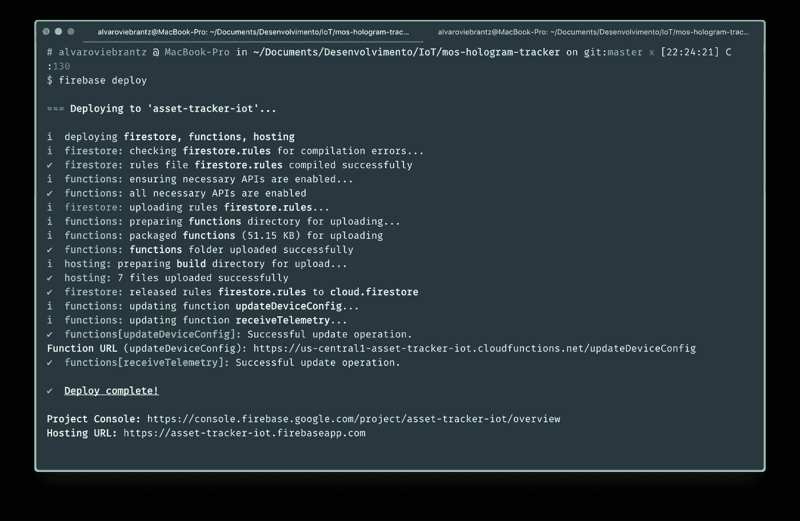

全部部署完毕并开始运行。

如果一切都设置正确，那么我们就有了另一个端到端的解决方案，它是使用许多令人敬畏的工具甚至更好的工具创建的:不需要接触一个高级的、令人厌烦的服务器设置。

## 进一步阅读

这就是这个项目，我们有一个非常酷的资产跟踪器原型，它使用了谷歌云和一些物联网工具的许多新功能。希望你们喜欢这个项目，我将继续使用这些工具探索更多的项目。

这个项目的代码可以在我的 Github 上找到，一些有趣的链接在下面的部分，稍后阅读:

[](https://github.com/alvarowolfx/asset-tracker-gcp-mongoose-os) [## alvarowolfx/资产跟踪系统-GCP-mongose-OS

### 资产追踪-GCP-mongose-OS-🚧使用运行 MongooseOS + GPS 和 GPRS 模块的 ESP32 制作的资产追踪器…

github.com](https://github.com/alvarowolfx/asset-tracker-gcp-mongoose-os) 

*   [https://github.com/mongoose-os-libs/pppos](https://github.com/mongoose-os-libs/pppos)
*   [https://Cloud platform . Google blog . com/2017/09/announcing-Cloud-IoT-Core-public-beta . html](https://cloudplatform.googleblog.com/2017/09/announcing-Cloud-IoT-Core-public-beta.html)
*   [http://mongoose-os.com/gcp](http://mongoose-os.com/gcp)
*   [https://cloud.google.com/iot/docs/quickstart](https://cloud.google.com/iot/docs/quickstart)
*   [https://mongose-OS . com/docs/libraries/cloud _ integrations/GCP . html](https://mongoose-os.com/docs/libraries/cloud_integrations/gcp.html)
*   [https://github . com/alvarowolfx/asset-tracker-GCP-mongose-OS](http://github.com/alvarowolfx/asset-tracker-gcp-mongoose-os)

> 你喜欢这个帖子吗？所以不要忘了让你的拍手继续👏下面，推荐一下，分享给你的朋友。
> 
> 你用这个教程做了什么好事吗？显示在下面的评论部分。
> 
> 如果你有任何问题，请在评论中留言，我会尽力帮助你。