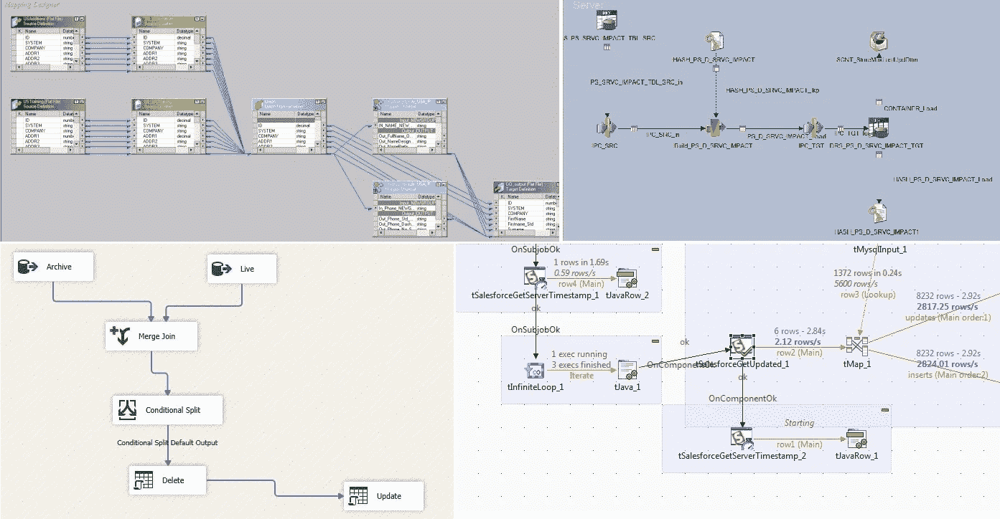

# 从 ETL 开发人员毕业成为数据工程师

> 原文：<https://medium.com/google-cloud/graduating-from-etl-developer-to-data-engineer-7663dfbdfd2d?source=collection_archive---------0----------------------->

抛弃你基于图形用户界面的舒适，把性感带回你的职业生涯。

你的日常生活是这样的吗？

啊，基于 GUI 的 ETL 工具，总是得不到尊重。

如果有，欢迎我的 ETL 开发者朋友们。这也是我大部分开发生涯的地方。和你一样，我总是听到那些“噢，如此聪明的计算机专业工程万事通”的窃窃私语，有时甚至是直接的嘲笑。

*   “那只是可视化 SQL”
*   “这不是真正的发展”
*   “那太低级了”
*   "你什么时候才能成为一名真正的程序员？"

这很糟糕，因为在你内心深处，你知道这些评论有一个真理的*暗示*:你可能去学校学习 it 工作，并发现自己在一个非常容易掌握和学习的工具中从这里向那里移动数据。

当然，我认为这种看法通常是一派胡言。我职业生涯中一些技术上最先进和最有价值的工作是在 Informatica PowerCenter 中完成的，这是几十年来 ETL 工具的王者(不要@我 Datastage/SSIS/Talend/从头开始的粉丝)。虽然我绝对可以教我 10 岁的孩子如何创建一个简单的作业，使用 PowerCenter 拾取 CSV 文件并将其加载到数据库中，但你也可以在这些工具中完成*难以置信的*高级工程。容易掌握并不意味着容易掌握，严格的工程原则在区分初学者和高级开发人员方面大有帮助。此外，我真的不明白为什么“简单易学”是这些工具的第一步。

所以这篇文章并不是要抛弃遗留的 ETL 工具，有很多[的](https://www.freecodecamp.org/news/the-rise-of-the-data-engineer-91be18f1e603/#.3fr9oh2j8)的[其他博客](https://tombreur.wordpress.com/2017/02/19/etl-is-dying/)和[在线讨论](https://noti.st/stewartbryson/yAfPmT)都做得很好。不，这篇文章将探讨*为什么*你需要做出改变以成为一名数据工程师，以及*如何*从一名 ETL 开发人员的背景中实现这一飞跃。

# 为什么要做出改变？

照片由 [Jp Valery](https://unsplash.com/@jpvalery?utm_source=medium&utm_medium=referral) 在 [Unsplash](https://unsplash.com?utm_source=medium&utm_medium=referral) 上拍摄

如果您目前是一名基于 GUI 的 ETL 开发人员，正在考虑向基于代码的数据工程迈进，那么您可能属于以下三个阵营之一:

*   我已经*是*一名数据工程师(你的头衔甚至可能反映了这一点)。
*   ETL 工具让我的工作变得更容易，为什么我需要改变？
*   我意识到我需要成为一名程序员，但是我不知道从哪里开始。

如果你在第三个阵营，很好:你在一个好地方，将在下面的“如何”部分获得一些好的信息。但我首先想谈谈前两组。

首先，至少在我看来，ETL 开发人员*是*数据工程师，不要让任何势利小人告诉你不是这样。你毕竟是*基于业务需求设计*数据管道。但如果我们从维基百科中寻找真相(它永远不会错，对吗？)，对[数据工程师](https://en.wikipedia.org/wiki/Information_engineering)的定义是:

> “数据工程师是创建大数据 ETL 管道的人，他使获取大量数据并将其转化为洞察力成为可能。”

好的，到目前为止还不错。但它仍在继续。

> “他们专注于数据的生产就绪性以及格式、弹性、可扩展性和安全性等方面。”

准备就绪，格式确定。缩放有点困难，但我们有一些弹性…..

> “数据工程师通常来自软件工程背景，精通 Java、Python 和 Scala *等编程语言。*”

哦。开膛破肚。

你需要“毕业”成为一名“真正的”数据工程师的一个主要原因是市场，不管是对是错，期望它。用阿撒·富兰克林的话说，尤其是在 2022 年，市场不尊重纯粹基于 GUI 的 ETL 开发人员。你可以在类似于[这篇文章](https://www.cio.com/article/222004/what-is-a-data-engineer.html)的文章中看到这一点，这些文章显示，与纯 ETL 相比，报酬与 Scala 和 Spark 等技能的相关性要高得多(分别增加了+17%和+16%)(+7%，请记住，该数字并不区分基于 GUI 的 ETL 和基于代码的 ETL，因此对于纯 GUI 的 ETL，它可能更低)。你可以在一个网站上搜索基于技能的职位数量，在撰写本文时，美国有 191，648 个职位需要技能“Python”，8，474 个职位需要技能“Informatica”你可以看看[谷歌趋势数据](https://trends.google.com/trends/explore?date=2011-04-01%202022-01-07&geo=US&q=datastage,informatica,ssis)中的顶级 ETL 工具，发现随着时间的推移，人们对它们的兴趣在下降。

有趣的是，当我还是一名纯粹的 ETL 开发人员时，我不记得曾经在 LinkedIn 上被招聘过。但是自从成为[谷歌云认证专业数据工程师](https://cloud.google.com/certification/data-engineer)后，我每周都能从全国各地的知名公司获得 4-5 次招聘机会。没有人关心我在 PowerCenter 的经历。

但是跳到代码优先的数据工程不仅仅是自私或市场的原因。在过去的几年中，代码优先的数据工程已经成为 ETL 的主要形式，这是有合理的、非势利的原因的，也是行业朝着这个方向发展的原因。

1.  **减少供应商锁定** —当一家公司做出基于 GUI 的 ETL 决策时，他们会将自己与该公司捆绑很长时间(几十年，大多数金融服务公司都是如此)。这不仅在财务上很糟糕(客户失去了他们的影响力，因为这些公司知道改变有多困难)，而且你还会受到该公司任何新功能的支配。当你适应不断变化的技术时，他们会在任何新的连接器上一分一毫地找你，新的功能似乎总是与你当前的位置相差很远。更不用说，升级这些工具通常是一项巨大的工作。转向可移植的代码消除了这些问题。
2.  **抽象——正如 Maxime Beauchemin 在他著名的[数据工程师的崛起](https://www.freecodecamp.org/news/the-rise-of-the-data-engineer-91be18f1e603/#.3fr9oh2j8)帖子中所说的那样:*“复杂的软件不使用拖放工具开发有很多原因:最终* ***代码*** *是软件的最佳抽象。”*现在，ETL 工具是专门为使日常任务变得更容易而创建的，不是“复杂的软件”，而是在开发过程中的某个地方，复杂性被嵌入到许多(大多数？)ETL 工作。我很少在 ETL 中做简单的事情，任何简单的事情通常都是交给离岸或初级资源。但这就是问题所在:在任何其他领域，你都不能用拖放工具来构建复杂的软件。虽然像 Wordpress 或 Squarespace 这样的网站对于初学者来说是构建简单网站的好网站，但是你经常使用的任何复杂的公司网站都是使用代码构建的。因为他们为所有的站点(而不仅仅是复杂的站点)建立了抽象，他们可以对整个事情应用标准和实践(例如，考虑影响银行站点的外观和感觉的 CSS 变化)。**
3.  **持续集成/持续交付(CI/CD)** —你可能在日常工作中听说过甚至实践过某种形式的 CI/CD。但是，如果您正在使用基于 GUI 的 ETL 工具，您不会看到其他工程学科所享有的全部好处。在 Git 中用 XML 或 JSON 签入 GUI 流的表示与分支代码并允许变更成为持续集成管道的一部分不是一回事。基于 GUI 的 ETL 总是因难以协作而臭名昭著，并且版本控制充其量也是参差不齐的。
4.  **可伸缩性** —当你需要一个基于 GUI 的 ETL 工具的更大马力时，你通常需要更多的计算。这些工具大多按核心收费，这意味着添加计算需要您扩展许可。即使你有一个非常灵活的承包团队(这是我合作过的每个大公司都面临的一个挑战)，它仍然会影响你的运营支出，并与你的运营团队不断争夺容量。有了代码，就不会随着规模的增加而增加开销。此外，如果您针对云进行了优化，并且只需要在高峰时间运行管道(如月末处理)，那么您可以在非高峰时间缩减并节省这些成本。像这样的灵活定价在传统的基于 GUI 的系统中更加困难/不存在。

还有其他的，但是这些是驱使我放弃基于 GUI 的 ETL 工具的首选方法。

# 如何做出改变

照片由[克里斯托佛罗拉](https://unsplash.com/@krisroller?utm_source=medium&utm_medium=referral)在 [Unsplash](https://unsplash.com?utm_source=medium&utm_medium=referral) 上拍摄

那么，如何实现这一飞跃呢？有很多关于数据工程的文章和 Github 库，但是我发现对于一个主要来自基于 GUI 的 ETL 背景的人来说，它们太多了。在这个背景下，我将在这里提供一个循序渐进的指导。

## 第一步:适应云计算

如果你还没有利用云，这是推进你的职业发展和学习新技能的最佳方式。当我说“云”时，我指的是熟悉主要的云服务提供商(CSP: Google Cloud Platform，Amazon Web Services，Microsoft Azure)，而不仅仅是在 ETL 中使用基于云的数据仓库。了解如何启动虚拟机，启动托管数据库，熟悉命令行。这些 CSP 中的每一个都有免费的层，您可以使用这些层来建立小型项目，并通过集成的工具来增强您的技能，这些工具将帮助您学习新的数据范式。

如果你以前没有使用过云，我强烈推荐你从 Qwiklabs 开始。有了这个平台，你可以搜索你感兴趣的主题，它会为你建立一个临时的谷歌云环境，并给你一步一步的指导，让你在一定的时间内完成动手任务。你可以从免费的[任务](https://www.qwiklabs.com/quests/23)开始，感受一下这个平台和一些基础知识。

在像 [Pluralsight](http://pluralsight.com) 这样的网站上也有大量的培训，包括视频和实践范例。

最后，获得认证是目前为止你能为自己成为一名数据工程师所做的最好的事情。另外，在撰写本文时，谷歌云数据工程师认证是报酬最高的 IT 认证。你的公司可能会支付你的培训和认证考试费用，好好利用吧。你不需要获得认证就可以开始第二步，但你至少应该先尝试一下。

## 第二步:从分析工程产品开始

对于在基于 GUI 的 ETL 方面经验丰富的人来说，向代码优先产品飞跃的最佳方式是从从事 ETL 工作的人都熟悉的语言开始:SQL。像 [dbt](https://www.getdbt.com/) (拥有庞大且有用的社区的明显的行业领导者)或 [Dataform](https://dataform.co/) (最近被 Google 收购，将被集成到 BigQuery 中)这样的工具比从 Scala 或 Python 这样的东西开始更容易过渡到基于 GUI 的 ETL 背景。

特别是对于 dbt，您的所有代码都“编译”成 SQL，这对于做过 ETL 的人来说是很熟悉的。

dbt 将自己描述为 ETL 的“T”部分，因此知道不能用它来提取和加载很重要:可以用它将数据仓库中的原始数据转换成可操作的资产。因此，尽管这个技能组合对于一个端到端的数据工程师来说是有限的，但是你可以非常轻松地掌握现代工程原理(源代码控制、CI/CD、自动化测试等等)。)而不必纠结于新语言的语法。

要开始，你可以在这里跟随 dbt 设置教程[。您会注意到它利用了慷慨的 GCP 免费层，这就是它有助于适应云的原因。](https://docs.getdbt.com/tutorial/setting-up)

## 第三步:抵制你感觉到的冒名顶替综合症

此时，您已经准备好执行第一个非 SQL 数据工程任务。你开始谷歌 Python，不可避免地会碰到一堵墙。

嘿，他们怎么找到我的照片的？

你看到不确定其目的的导入语句，GUI 中简单任务的复杂代码，以及总的感觉是其他人都比你聪明。这里有一个小秘密:即使不是 Python 或 Scala 专家，你也可以成为一名称职的数据工程师。我是一名认证的数据工程师，我的工作是帮助谷歌云客户开发他们的数据工程架构，但如果你给我一个空白的 IDE，没有谷歌，我将无法从一个纸袋中设计出自己。

不要误解我的意思，你需要掌握一门语言，并开始理解其中的一些细节。但这是一场马拉松，而不是短跑，利用你在网上找到的代码，并将其修改为你试图做的事情，几乎每个人都这样做。不要因为你不认为自己是一个住在地下室的黑客而感到自卑。

## 第四步:创建一个示例端到端数据管道

学习数据工程的最好方法是从头到尾建立一个端到端的数据管道。即使有假数据，这也是理解后 GUI ETL 时代数据工程师生活的最佳方式。它可以从小事开始，比如从 [Kaggle](https://www.kaggle.com/datasets) 比赛中获取一个样本数据集，并将其加载到数据仓库中。建立一个[托管的数据库](https://cloud.google.com/sql)，将修改写入 [PubSub](https://cloud.google.com/pubsub) 系统，学习流数据原理。对于有 ETL 背景的人来说，使用 [managed Airflow](https://cloud.google.com/composer) 实例来编排数据管道是学习 Python 的好方法。了解所有这些组件如何协同工作来构建端到端的管道。

在后续的帖子中，我和我的同事 Sathish Sadagopan 将向您展示一个端到端的演示，您可以部署和修改它，以便熟悉这些概念。我们将把这个演示面向来自基于 GUI 的 ETL 世界的观众，这些观众的概念您应该很熟悉，但是我们将使您具备“毕业”成为一名成熟的数据工程师的技能。