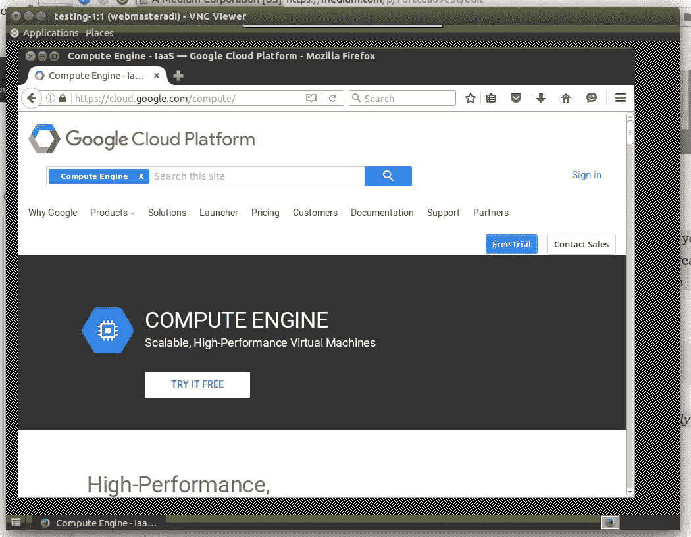

# Google 计算引擎实例的图形用户界面(GUI)

> 原文：<https://medium.com/google-cloud/graphical-user-interface-gui-for-google-compute-engine-instance-78fccda09e5c?source=collection_archive---------0----------------------->

想在 Google 计算引擎实例上安装 GUI 或者在上面使用互联网浏览器吗？以下是在装有 Firefox 的 **Ubuntu 14.04 LTS** VM(虚拟机)上安装最低要求 UI 的步骤。那我们开始吧。

> **注意:**我假设您已经用 Ubuntu 14.04-LTS 映像创建了一个 VM 实例，并成功运行了它。