# 谷歌云上的 Gremlin 混沌工程

> 原文：<https://medium.com/google-cloud/gremlin-chaos-engineering-on-google-cloud-2568f9fc70c9?source=collection_archive---------0----------------------->


本文基于如何在 Google Cloud 上使用 Gremlin 实现**混沌工程实验。**

## 先决条件

1.  谷歌云平台账户
2.  Gremlin 应用程序帐户
3.  GKE 集群

## 什么是混沌工程？

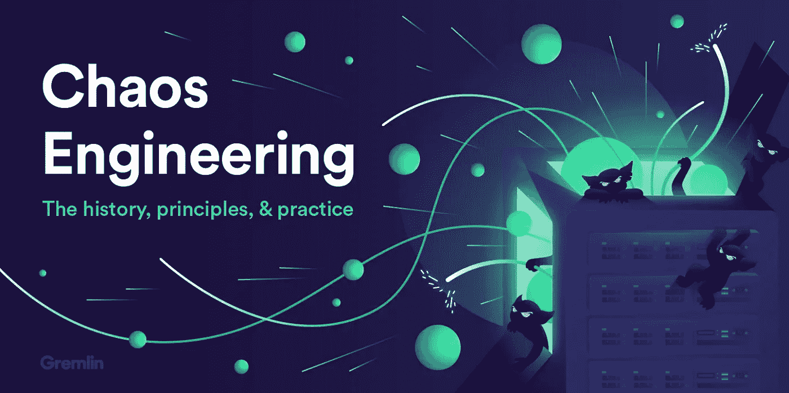

**混沌工程**是一种测试分布式软件的方法，它故意引入失败和故障场景，以验证其在面对随机中断时的弹性。

> **混沌工程让你将你认为会发生的事情与你的系统中实际发生的事情进行比较。你实际上是“故意破坏东西”来学习如何建立更有弹性的系统。**

## Gremlin 是什么？

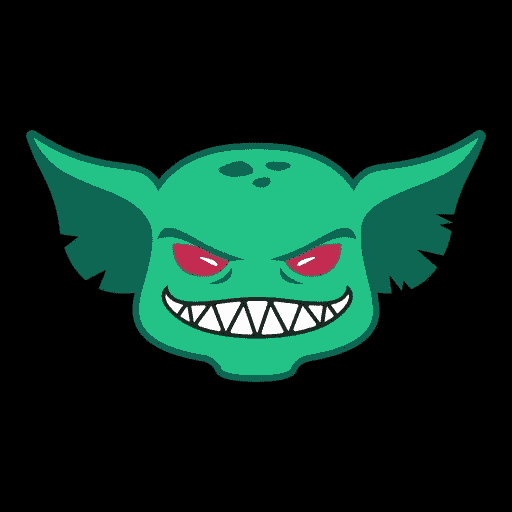

Gremlin 是一种简单、安全、可靠的方法，通过使用混沌工程来识别和修复故障模式，从而提高系统的弹性。

Gremlin 是一个可以在任何环境下运行的云原生平台。Gremlin 支持所有公共云环境——AWS、Azure 和 GCP——并在 Linux、Windows 和容器化环境(如 Kubernetes 和 bare metal)上运行。

2010 年，**网飞**推出了一项随机关闭生产软件实例的技术——就像在服务器机房放一只猴子出来——来测试云如何处理它的服务。于是，工具[混沌猴](https://netflixtechblog.com/5-lessons-weve-learned-using-aws-1f2a28588e4c)诞生了。

**混沌工程在网飞等组织中日趋成熟，并催生了**[**Gremlin(2016)**](https://www.gremlin.com/community/tutorials/chaos-engineering-the-history-principles-and-practice/)**等技术，变得更具针对性和知识性。**

**现在让我们在谷歌云 上开始 ***Gremlin 混沌工程实验如下:*****

1.  ****对 GKE 吊舱的 Gremlin 关机攻击，以验证应用程序的高可用性****
2.  ****Gremlin CPU 攻击 GKE Pod 以验证 GKE 水平 Pod 自动缩放****
3.  ****Gremlin 黑洞攻击 GKE 负载均衡器，以验证 GKE 上 web 应用程序的高可用性****

**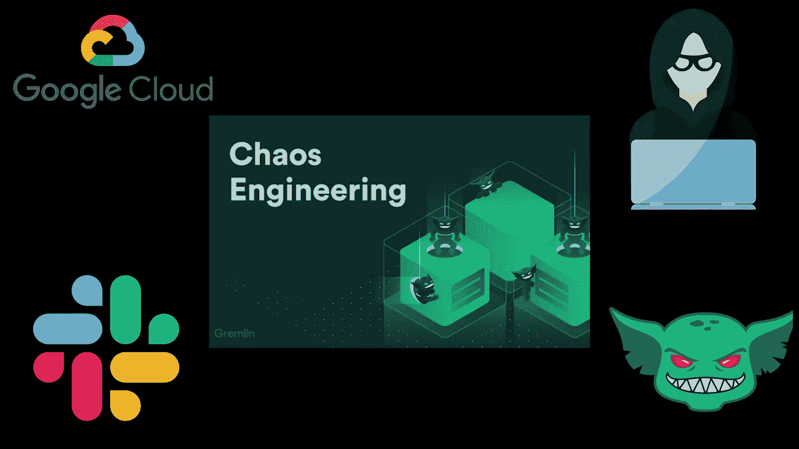**

**作为先决条件的一部分，我们已经注册了 Gremlin Web App 帐户。**

**注册一个 Gremlin 网络应用账户→[https://app.gremlin.com/signup](https://app.gremlin.com/signup)**

**为了在 GKE 上执行各种混沌实验，我们需要在 GKE 安装 Gremlin Kubernetes 客户端，以便我们可以从 Gremlin web 应用程序创建对 GKE 的各种攻击。**

## **在 GKE 集群上安装 Gremlin 客户端代理**

**要安装 Gremlin Kubernetes 客户端，您需要您的 **Gremlin 团队 ID 和密钥**。如果您不知道您的团队 ID 和密钥是什么，您可以从 Gremlin web 应用程序中获取它们。**

**访问 Gremlin 中的[团队页面](https://app.gremlin.com/settings/teams)，然后在列表中点击您的团队名称。**

**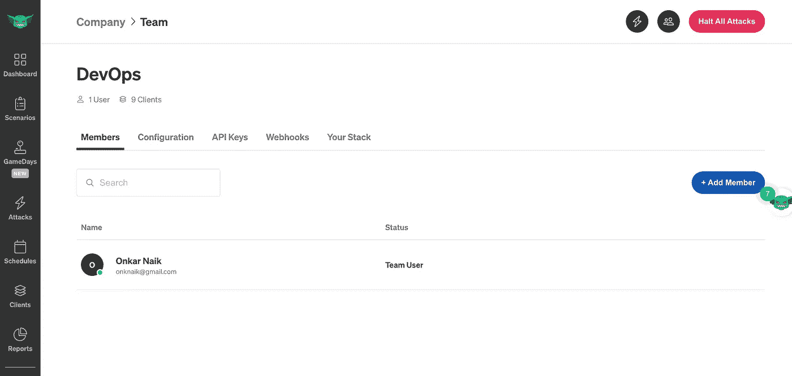**

**在团队屏幕上点击配置。**

**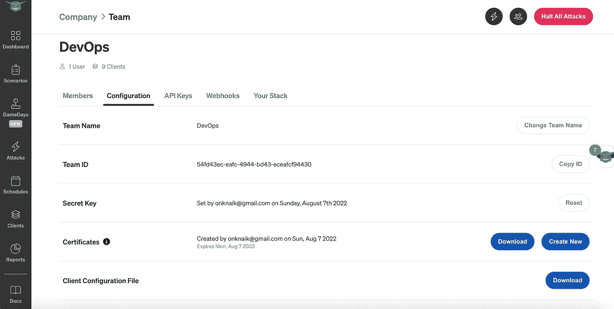**

**如果您不知道您的密钥，您将需要重置它。单击重置按钮。您将看到一个弹出窗口，提醒您使用当前密钥的任何正在运行的客户端都需要配置新密钥。点击继续。**

**接下来，您将看到一个弹出屏幕，显示新的密钥。把它记下来。**

**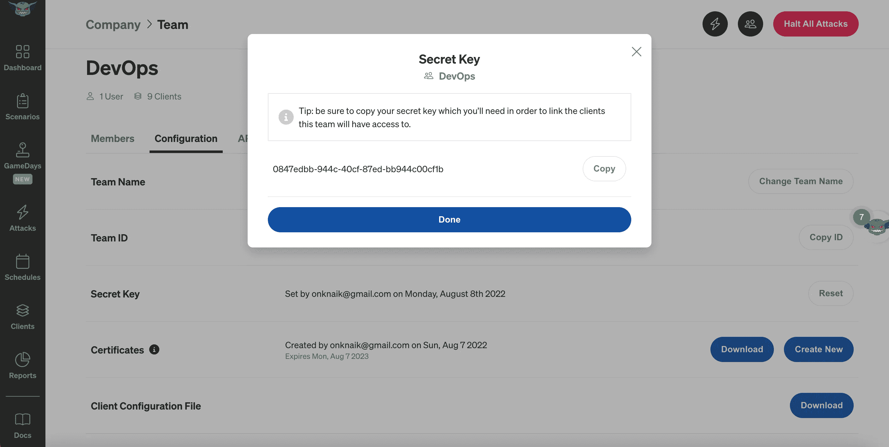**

## **用 Helm 安装 Gremlin 客户端**

**[](https://www.gremlin.com/docs/getting-started/install-kubernetes-helm/) [## 使用 Helm | Gremlin Docs 在 Kubernetes 上安装 Gremlin

### 除了在主机上安装 Gremlin 客户端之外，您还可以安装 Gremlin Kubernetes 客户端——两者都是…

www.gremlin.com](https://www.gremlin.com/docs/getting-started/install-kubernetes-helm/) 

添加 Gremlin 头盔图:

```
helm repo add gremlin [https://helm.gremlin.com](https://helm.gremlin.com)
```

为 Gremlin Kubernetes 客户端创建一个名称空间:

```
kubectl create namespace gremlin
```

接下来，您将运行`helm`命令来安装 Gremlin 客户端。在这个命令中，有三个占位符变量需要用真实数据替换。用你的团队 ID 替换`$GREMLIN_TEAM_ID`，用你的密钥替换`$GREMLIN_TEAM_SECRET`。将`$GREMLIN_CLUSTER_ID`替换为 GKE 集群的名称。

```
helm install gremlin gremlin/gremlin 
--namespace gremlin \
--set gremlin.hostPID=true \
--set gremlin.secret.managed=true \
--set gremlin.container.driver=docker-runc \
--set gremlin.secret.type=secret \
--set gremlin.secret.teamID=$GREMLIN_TEAM_ID \ 
--set gremlin.secret.clusterID=$GREMLIN_CLUSTER_ID \
--set gremlin.secret.teamSecret=$GREMLIN_TEAM_SECRET
```

**注意:**这里在上面的舵上安装小精灵。集装箱。驱动程序值可能因您的集群节点容器运行时而异。在我的例子中，我使用了 Ubuntu-docker 图像类型的 GKE 节点。

要验证安装是否成功，请运行以下命令:

```
kubectl get pods -n gremlin
```

输出应该显示集群中每个节点的一个`chao` pod 和一个`gremlin` pod。这些都应该处于`Running`状态:

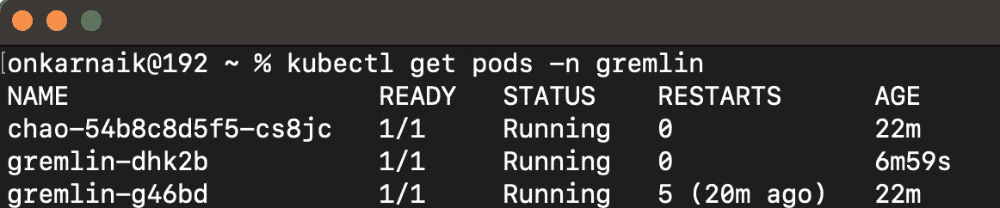

您也可以从 Gremlin Web 应用程序检查客户端的状态

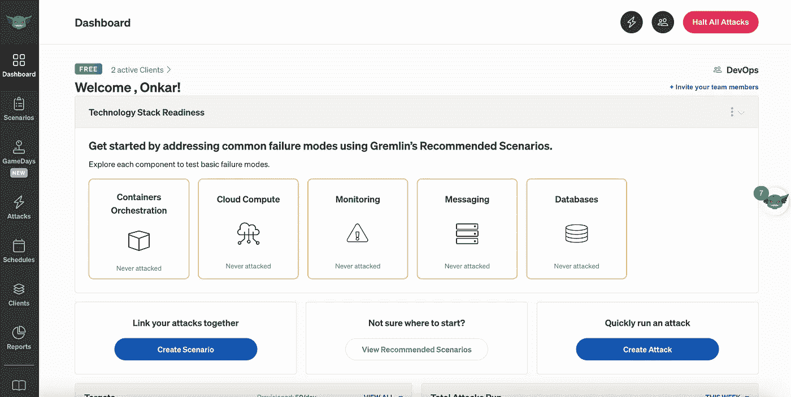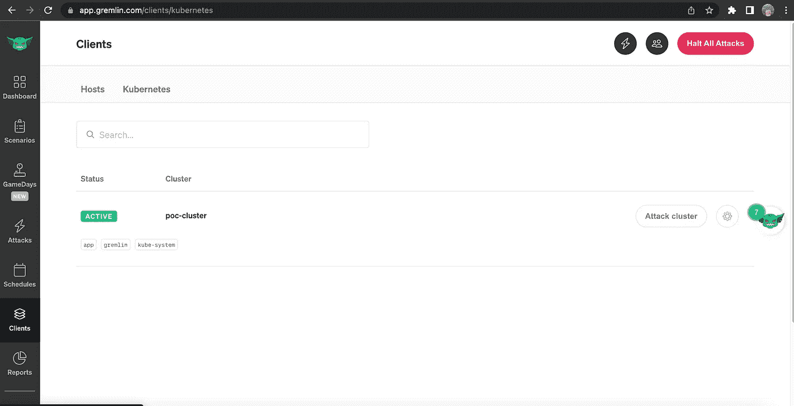

## 设置与 Gremlin Web App 的 Slack 集成

我们还可以将我们的 slack 应用程序与 Gremlin 集成，以便在 Slack 通道上获得攻击报告和通知。

为了设置与 Gremlin 的 slack 集成，我们必须在 Gremlin 集成中添加我们为获取 Gremlin 攻击通知而创建的 Slack 通道。

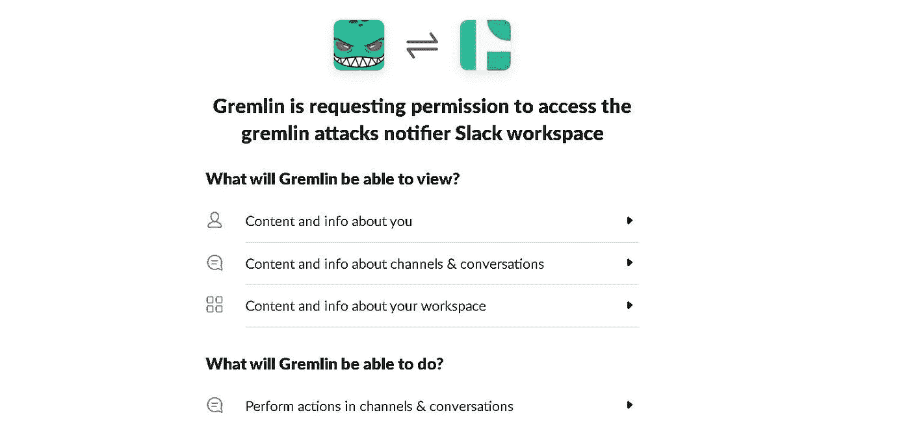

现在只需选择您希望接收 Gremlin 通知的空闲频道，然后单击 Allow。

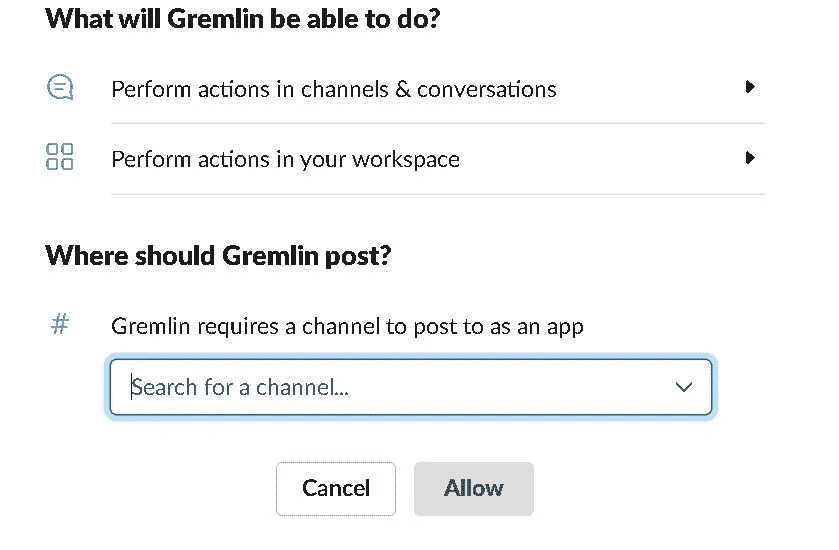

这就是你与 Gremlin 的所有 **Slack 集成现在准备好了。**🎉🎉

现在，我们已经在 GKE 集群上安装了 Gremlin 代理，并启用了 slack 应用程序通知。

让我们在 GKE 集群上部署一个示例 Nginx web 应用程序。

## 使用 HPA 在 GKE 集群上部署 Nginx 应用

1.  为 Nginx 部署创建一个单独的名称空间。

```
kubectl create ns app
```

2.在应用程序命名空间中部署 Nginx 部署。

```
kubectl apply -f nginx.yaml
```

3.使用 GKE 负载平衡器公开 Nginx 部署。

```
kubectl expose deployment myapp --type=LoadBalancer --port=80
```

4.为 Nginx 部署部署水平 Pod 自动缩放器。

```
kubectl apply -f hpa.yaml
```

5.使用以下命令检查是否正确部署了所有资源。

```
kubectl get all -n app
```

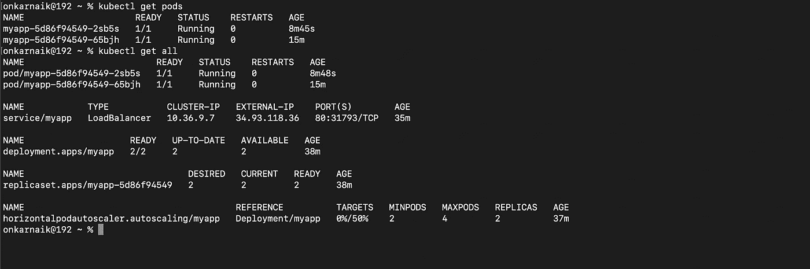

我们现在可以开始在 Nginx 样本部署上执行各种混乱实验或攻击，以验证各种事情，如监控、警报、伸缩和可用性等是否工作。

## 小鬼袭击


攻击是一种以简单、安全和可靠的方式将故障注入系统的方法。 Gremlin 提供了一系列针对您的基础设施的攻击。这包括影响系统资源、延迟或丢弃网络流量、关闭主机等等。除了运行一次性攻击，您还可以安排定期或重复攻击，创建攻击模板，以及查看攻击报告。

Gremlin 提供了三类攻击:

*   **资源攻击:**测试对计算资源消耗的突然变化
*   **网络攻击:**测试不可靠的网络条件
*   **状态攻击:**测试环境中的意外变化，比如断电、节点故障、时钟漂移或应用程序崩溃

我们将从 Nginx 部署上的这些攻击类型中选择一种进行攻击，以验证我们系统的各个方面。

## 利用 Gremlin 关机攻击验证高可用性

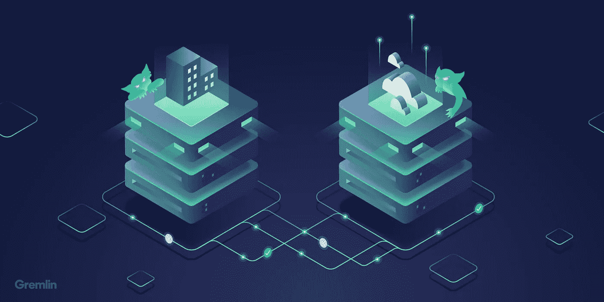

**关机攻击**让团队通过测试他们的应用程序和系统在实例不再运行时的表现来建立对主机故障的恢复能力。

## 为 Nginx 部署配置 Gremlin 攻击

转到 Gremlin Web 应用程序控制台中的攻击菜单→选择 Kubernetes →选择集群和命名空间(目标应用程序所在的位置)

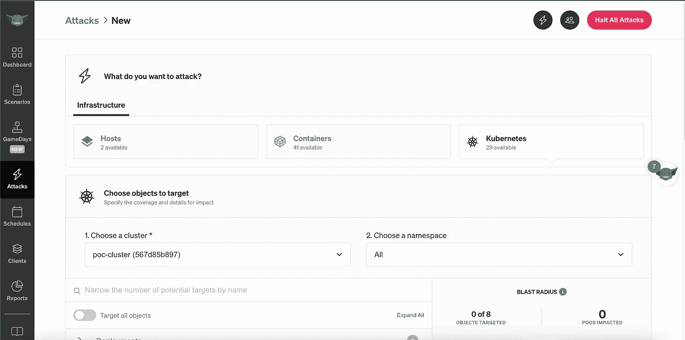

选择 Gremlin 执行攻击的目标部署，并定义攻击的爆炸半径。

**爆炸半径:攻击中包含的主机数量或目标部分数量**

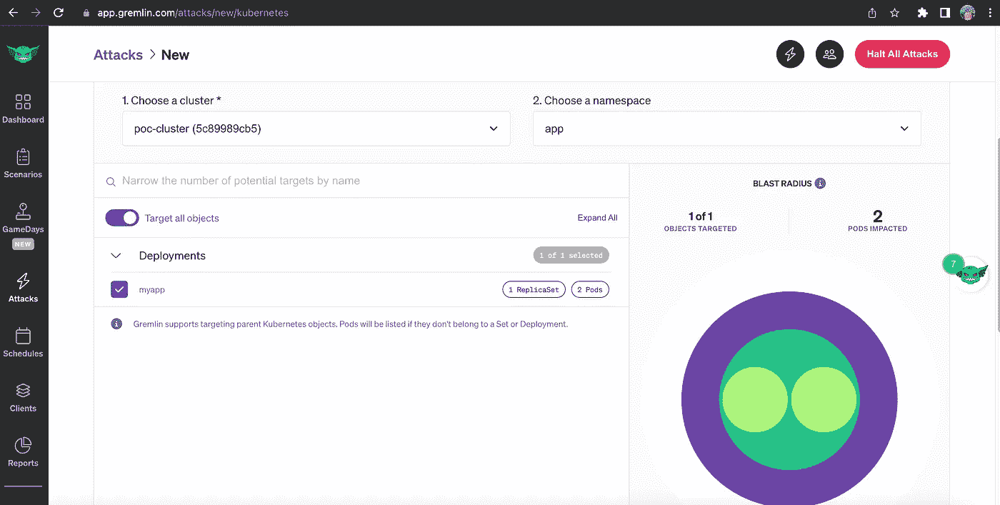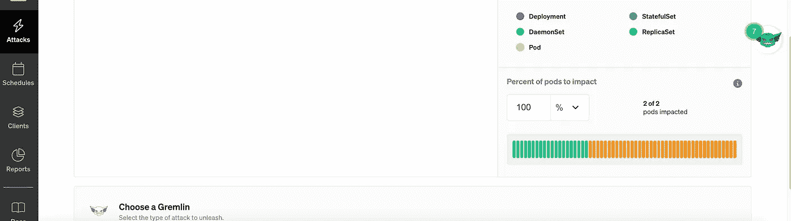

对于关机，攻击从状态攻击中选择攻击类型为关机攻击。

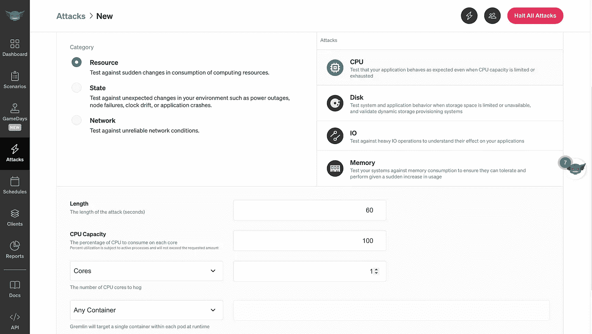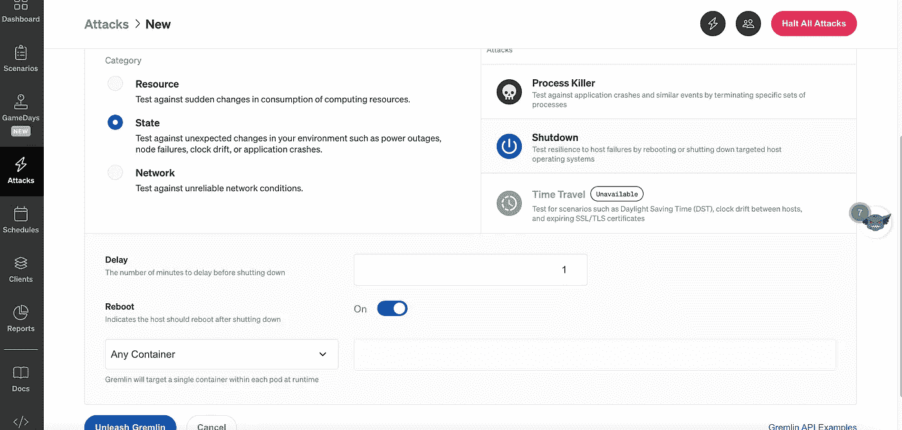

点击释放小妖精运行特定的攻击。

**运行 Gremlin 关机攻击**

单击 attack details 查看 Gremlin 在 Nginx Deployment Pods 上运行的攻击的详细信息和输出。

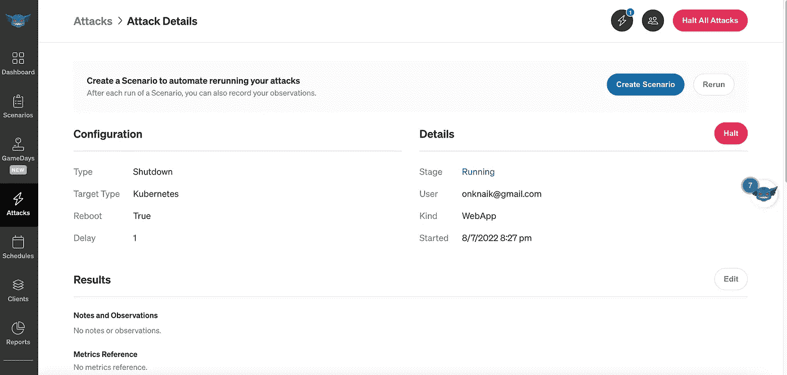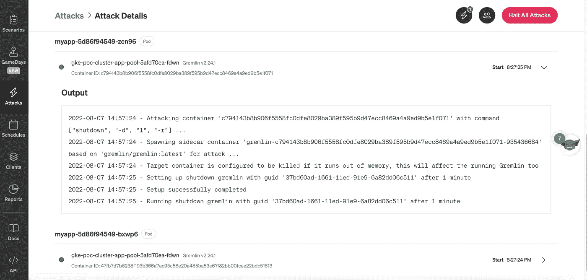

我们可以看到，由于更多的副本，即使在运行关闭攻击时，Nginx 部署也是高度可用的。

```
kubectl get pods -n app -w
```

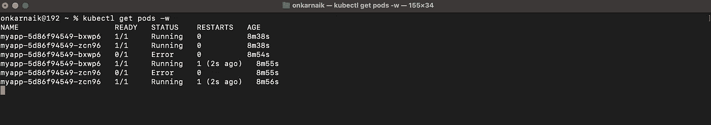

**关机攻击可以回答如下问题:**

*   实例重新启动需要多长时间？当实例重新联机时，我的应用程序是否成功重启？
*   我的负载平衡器会自动将请求从失败的实例中重新路由出去吗？我有其他实例来处理这些请求吗？
*   如果用户在一个失败的实例上有一个活动会话，该会话会在另一个实例上正常继续吗？
*   有没有数据丢失？正在进行的处理作业是否重新启动？

## 使用 Gremlin 验证 GKE 水平 Pod 自动缩放

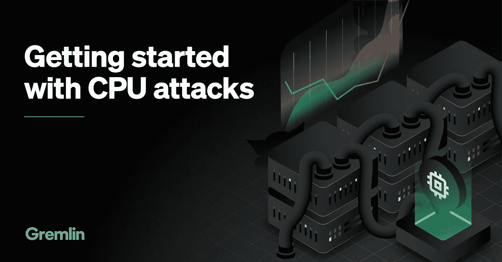

CPU 攻击有助于确保即使在 CPU 容量有限或耗尽的情况下，您的应用程序也能按预期运行。CPU 攻击还有助于测试和验证自动修复过程，如自动扩展和负载平衡。

对于 CPU 攻击，从资源攻击中选择攻击类型作为 CPU 攻击，并为攻击配置更多详细信息，如攻击持续时间、将受影响的目标 CPU 容量等。


**运行 Gremlin CPU 攻击**

单击 attack details 查看 Gremlin 在 Nginx Deployment Pods 上运行的攻击的详细信息和输出。

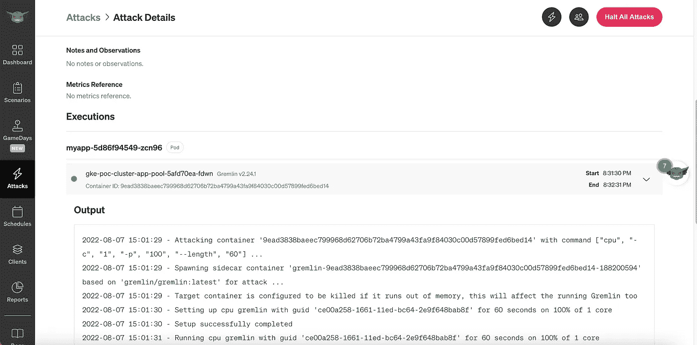

我们可以验证 Nginx Pods 为 CPU 利用率定义的水平 Pod 自动扩展在攻击期间是否工作。

```
kubectl get pods -n app -w
```

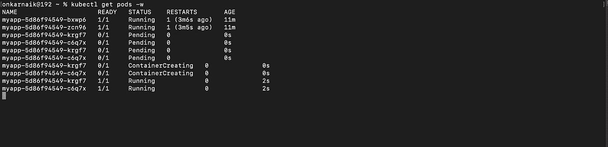

我们可以看到，GKE HPA 将 Nginx Pods 按比例增加到 4，因为我们定义的最大计数是 4。

```
kubectl get hpa
```

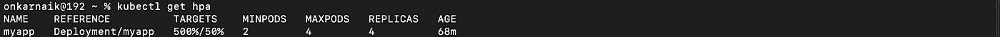

这样，通过运行 CPU 或内存攻击，我们可以验证为应用程序定义的 HPA。

**CPU 攻击可以回答如下问题:**

*   当 CPU 资源耗尽时，用户体验会受到怎样的影响？
*   我是否有适当的监控和警报来检测 CPU 峰值？
*   我是否配置了配额来按应用程序、进程或容器限制 CPU？
*   我有清理脚本来清除损坏的线程吗？

## 利用 GKE 负载均衡器上的 Gremlin 黑洞攻击验证 Nginx Web App 的高可用性

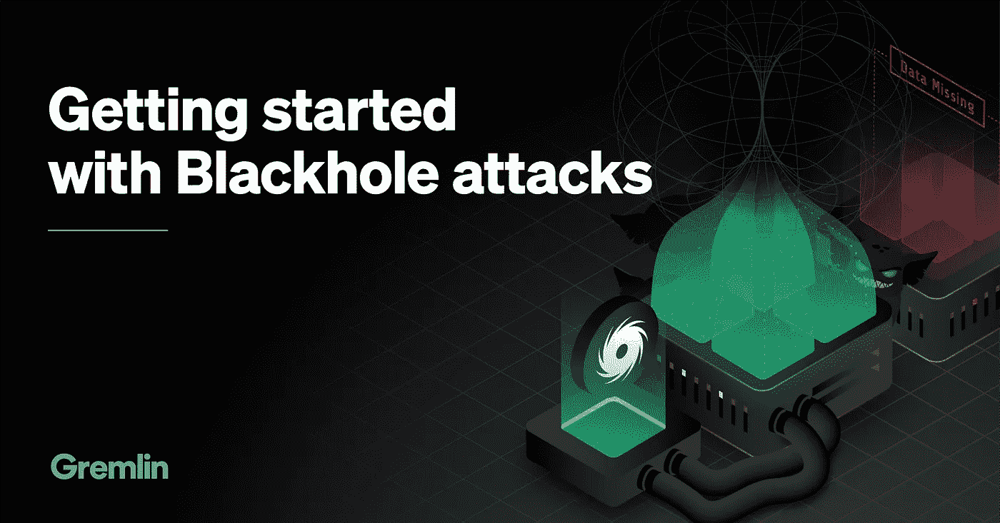

黑洞攻击允许您通过丢弃服务之间的网络流量来模拟这些中断。这使您能够发现硬依赖、测试回退和故障转移机制，并为应用程序应对不可靠的网络做好准备。

对于黑洞攻击，从网络攻击中选择攻击类型作为黑洞攻击，并为攻击配置更多细节，如端口细节等。

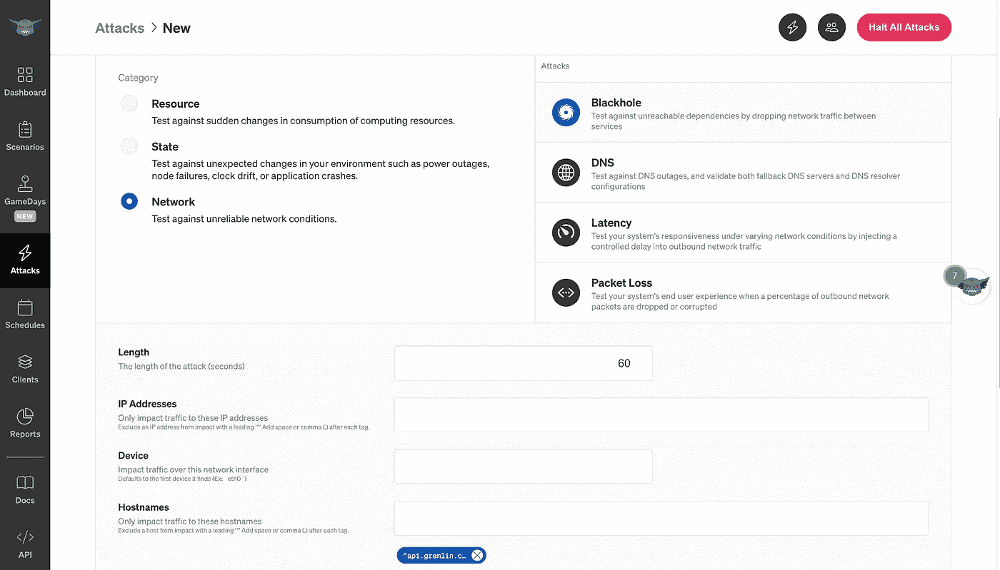

在我们的例子中，我们在端口 80 上运行 Nginx 部署。

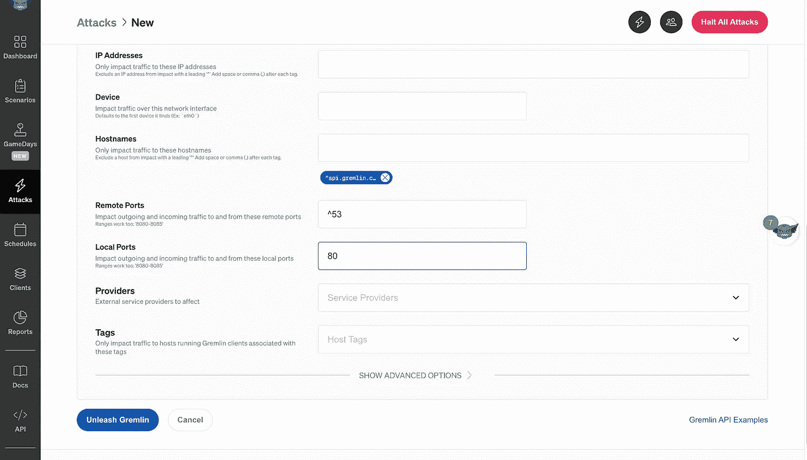

**运行小妖精黑洞攻击**

单击 attack details 查看 Gremlin 在 Nginx Deployment Pods 上运行的攻击的详细信息和输出。

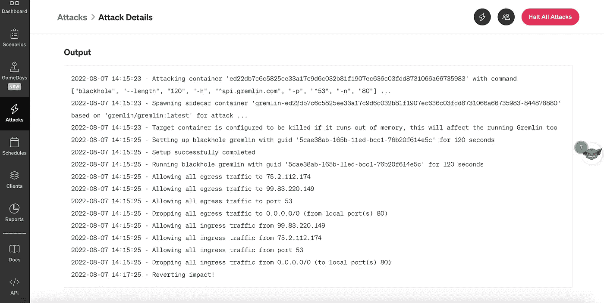

我们可以从 GCP 负载平衡器外部 IP 检查 Nginx 网页状态。由于多个后端单元之间的高可用性和 GCP 负载平衡，在 web 体验方面没有延迟或阻塞。

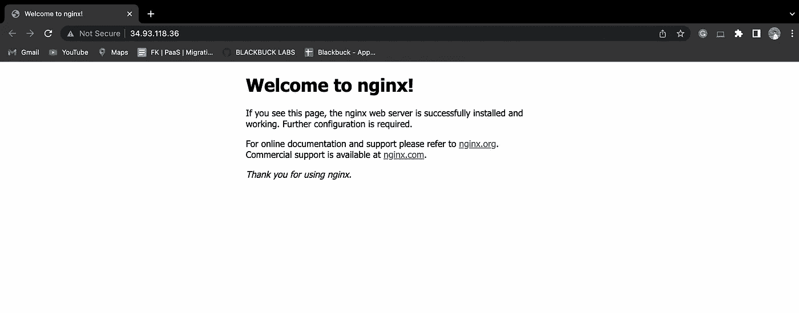

**黑洞攻击可以回答如下问题:**

*   在我们的系统中，依赖关系存在于哪里？
*   我们是否有适当的监控来提醒每个服务的不可用性？
*   如果依赖项不可用，我们的应用程序会正常降级吗？
*   当下游依赖项不可用时，用户体验会受到负面影响吗？
*   我们是否有一些我们认为不重要的依赖关系，但实际上可能会导致整个应用程序崩溃？

对于**通知**部分，我们已经配置了**与 Gremlin web 应用**的 slack 集成，通过它我们可以获得 slack 通道中关于我们对 GKE 执行的每个 Gremlin 攻击状态的所有通知。

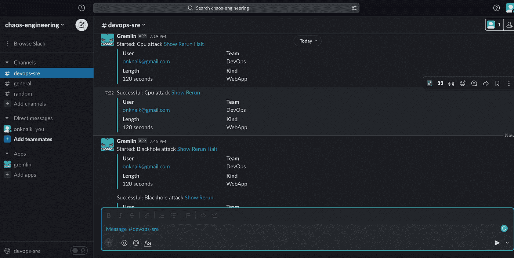

## 结论


混沌工程的首要目标是通过测试我们的应用程序和系统如何处理故障来提高它们的可靠性。要做到这一点，我们需要采取一种结构化的、组织良好的方法，具有明确定义的目标和关键绩效指标(KPI)。

在没有任何指导或监督的情况下运行随机实验不会产生可操作的结果，并且会将我们的系统置于不必要的风险中。

为了达到提高可靠性的高层次目标，我们需要使用更细粒度的目标来指导我们的混沌工程采用过程。

# 有问题吗？

如果你有任何问题，我很乐意在评论中阅读。在[媒体](/@onkar17)或 [LinkedIn](https://www.linkedin.com/in/onkar17/) 上关注我。**