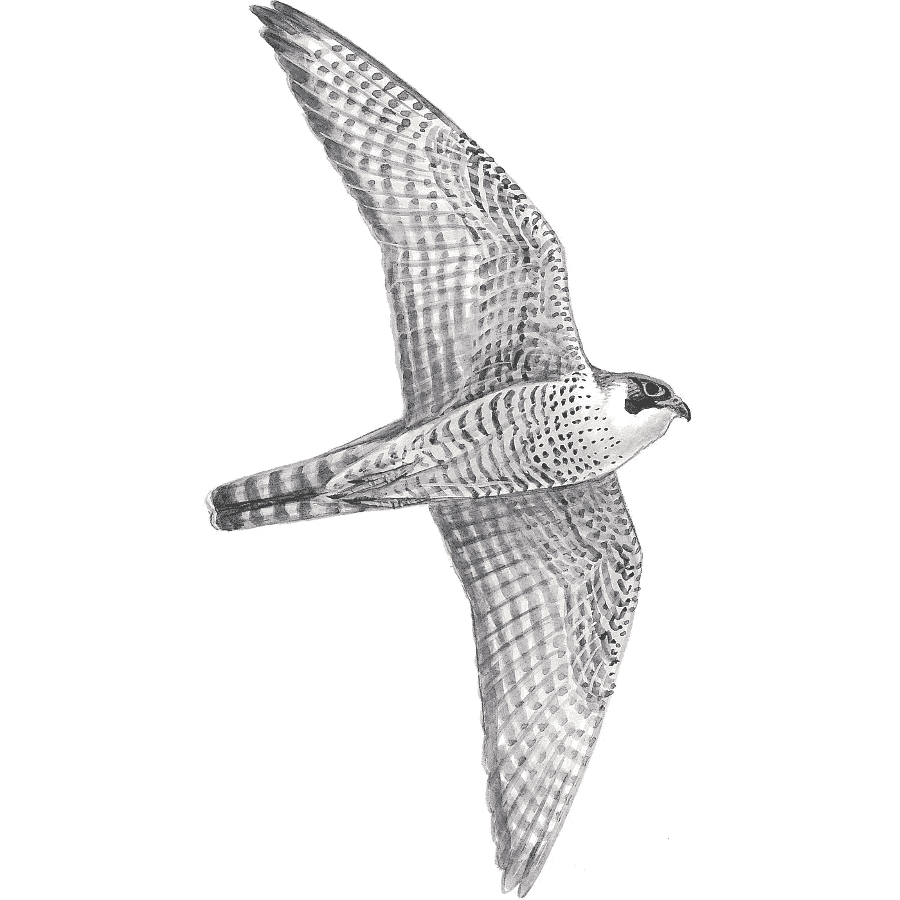
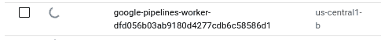
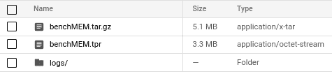
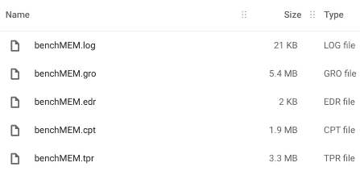

# 谷歌云上的 GROMACS

> 原文：<https://medium.com/google-cloud/gromacs-on-google-cloud-ba0eca5f107c?source=collection_archive---------0----------------------->



格罗马科斯

# 语境

上次在 Google Cloud 上将 AlphaFold 作为一个容器运行时，我发表了一篇文章。[谷歌云生命科学](https://cloud.google.com/life-sciences)是一个高度灵活、廉价和快速的工具，用于处理大量数据和要求高的计算能力。

使用与上一篇文章相同的方法，这次我将向您展示如何在 Google Cloud 上运行 [GROMACS](http://www.gromacs.org/) 。

GROMACS 是[分子动力学](https://en.wikipedia.org/wiki/Molecular_dynamics) (MD)的开源软件。这是一个非常受欢迎的工具，可以模拟研究机构和药物发现中原子和分子的物理运动。

运行 GROMACS 的配置丰富的服务器成本很高。如果您只创建一次 GROMACS 容器映像，那么您可以在需要时立即运行它，从而加快繁重的 MD 处理并减少浪费的成本。

# 步伐

有两个工作步骤:

1.  创建 GROMACS 容器映像
2.  运行 GROMACS

让我们按顺序来看一下这些步骤。
请注意，一些步骤已经被省略，因为我不打算将本文变成一个完整的程序性文档。

# 创建 GROMACS 容器映像

## 启用 API

[启用](https://cloud.google.com/endpoints/docs/openapi/enable-api)以下 API。

*   基因组 API
*   谷歌云生命科学应用编程接口
*   Google 容器注册 API
*   计算引擎 API

您需要有 GROMACS 配置文件，如 TPR 文件。这次你可以从 [GROMACS 基准测试网站](https://www.mpibpc.mpg.de/grubmueller/bench)下载 benchMEM.tpr。

## 为临时工作创建一个虚拟机

[创建一个具有 64GB 内存的虚拟机](https://cloud.google.com/compute/docs/instances/create-start-instance)(E2-standard-16)。然后 [SSH 登录到虚拟机](https://cloud.google.com/compute/docs/instances/connecting-to-instance)并安装 docker。

```
sudo apt-get updatesudo apt-get install \
     apt-transport-https \
     ca-certificates \
     curl \
     gnupg \
     lsb-releasecurl -fsSL [https://download.docker.com/linux/debian/gpg](https://download.docker.com/linux/debian/gpg) | sudo gpg --dearmor -o /usr/share/keyrings/docker-archive-keyring.gpgecho \
“deb [arch=amd64 signed-by=/usr/share/keyrings/docker-archive-keyring.gpg] [https://download.docker.com/linux/debian](https://download.docker.com/linux/debian) \
$(lsb_release -cs) stable” | sudo tee \
/etc/apt/sources.list.d/docker.list > /dev/nullsudo apt-get updatesudo apt-get install docker-ce docker-ce-cli containerd.io
```

使自己能够以非超级用户权限使用 docker 命令。

```
sudo gpasswd -a $(whoami) docker
```

然后，重新登录虚拟机。

## 创建 Dockerfile 文件

用以下内容创建一个“Dockerfile”。请注意[截止到 2021 年 10 月 20 日，GROMACS](https://manual.gromacs.org/documentation/) 的最新版本是 2021.3。

```
FROM ubuntu: 18.04
# Copy the contents of the current directory into the container.
ADD ..
# Install Gromacs and its dependencies.
RUN apt -y update \
&& apt install -y wget g++ libxml2-dev openmpi-bin openmpi-doc libopenmpi-dev \
&& wget https://cmake.org/files/v3.21/cmake-3.21.2-linux-x86_64.sh \
&& sh cmake-3.21.2-linux-x86_64.sh --skip-license --prefix=/usr \
&& wget ftp://ftp.gromacs.org/pub/gromacs/gromacs-2021.3.tar.gz \
&& tar xvf gromacs-2021.3.tar.gz \
&& rm gromacs-2021.3.tar.gz \
&& mkdir gromacs-2021.3/build \
&& cd gromacs-2021.3/build \
&& cmake .. -DGMX_BUILD_OWN_FFTW=ON -DCMAKE_CXX_COMPILER=/usr/bin/g++ -DGMX_THREAD_MPI=on \
&& make -j \
&& make install
```

## 构建容器映像

```
docker build -t gromacs_2021.3 .
```

确认已创建容器映像。

```
docker imagesREPOSITORY TAG IMAGE ID CREATED SIZE
gromacs_2021.3 latest 8a882c6ccdda 50 seconds ago 951MB
ubuntu 18.04 39a8cfeef173 4 weeks ago 63.1MB
```

在本地运行 docker 容器，并验证 GROMACS 工作正常。
要检查 GROMACS 版本，执行如下“gmx -version”命令。

```
docker run -it gromacs_2021.3 bashroot @ 1234567890:/# gromacs-2021.3/build/bin/gmx -version
 :-) GROMACS — gmx, 2021.3 (-:
 GROMACS is written by:
 Andrey Alekseenko Emile Apol Rossen Apostolov 
 Paul Bauer 
 Herman JC Berendsen Par Bjelkmar Christian Blau Viacheslav 

 A. Lemkul Viveca Lindahl Magnus Lundborg Erik Marklund 

 Erik Lindahl, and David van der Spoel
Copyright © 1991–2000, University of Groningen, The Netherlands.
Copyright © 2001–2 019, The GROMACS development team at
Uppsala University, Stockholm University and
the Royal Institute of Technology, Sweden.
Check out http://www.gromacs.org for more information.
GROMACS is free software; you can redistribute it and / or modify it
under the terms of the GNU Lesser General Public License
as published by the Free Software Foundation; either version 2.1
of the License, or (at your option) any later version.
GROMACS: gmx, version 2021.3
```

## 标记容器图像并将其推送到容器注册表

```
docker tag gromacs_2021.3 gcr.io/<PROJECT_ID>/gromacs_2021.3:v1gcloud docker --push gcr.io/<PROJECT_ID>/gromacs_2021.3:v1
```

至此，不再需要该虚拟机，您可以将其删除。您可以在这里使用云壳。

## 安装 dsub

如果你不熟悉 dsub，请看这里的。

```
pip install dsub
```

## 创建一个桶

你可以创建一桶谷歌云存储(GCS)。GROMACS 执行日志和输入/输出数据通过这个桶传递。

```
gsutil mb gs://<PROJECT_ID>-gromacs
```

## 运行 Hello world(可选)

让我们输出“Hello World”来确认 dsub 命令有效。这是一个可选步骤。

```
dsub \
 --project <PROJECT_ID> \
 —-zones “us-central1-*” \
 --logging gs://<PROJECT_ID>-gromacs/logs \
 --command =’echo “Hello World” > “${OUTPUT}”’\
 --output OUTPUT=gs://<PROJECT_ID>-gromacs/hello_world.txt \
 --subnetwork default \
 --wait
```

您可以确认“hello_world.txt”和 logs 文件夹是在 bucket 下创建的。

# 运行 GROMACS

您需要将“benchMEM.tpr”文件复制到您创建的 GCS bucket 下。你可以使用云控制台来[上传](https://cloud.google.com/storage/docs/uploading-objects)的 tpr 文件。
现在您已经准备好运行 GROMACS 了。执行以下命令。从命令(- command 选项)中可以看出，它运行 cd 和 cp，后跟“gmx mdrun”。执行结果用 tar 命令存档。

```
dsub --project <PROJECT_ID> \
 --zones “us-central1-*” \
 --logging gs://<PROJECT_ID>-gromacs/logs \
 --image=gcr.io/<PROJECT_ID>/gromacs_2021.3:v1 \
 --command=’cd /; cp ${INPUT}/benchMEM.tpr; /gromacs-2021.3/build/bin/gmx mdrun -nsteps 50000 -deffnm /benchMEM; tar cvzf $OUTPUT benchMEM.*’ \
 --input INPUT=gs://<PROJECRT_ID>-gromacs/benchMEM.tpr \
 --output OUTPUT=gs://<PROJECT_ID>-gromacs/benchMEM.tar.gz \
 --subnetwork default \
 --preemptible \
 --min-cores=8
```

该命令立即完成，显示作业 ID，作业在后台运行。这项工作大约需要 15 分钟才能完成。
要检查作业状态，执行以下命令。

```
dstat --provider google-v2 \
 --project <PROJECT_ID> \
 --jobs ‘<JOB_ID>’ \
 --status ‘*’ \
 --format json
```

在此期间，作业的状态会发生如下变化。

```
VM starting (awaiting worker checkin)
   ↓
Pulling ”gcr.io/google.com/cloudsdktool/cloud-sdk:294.0.0-slim”
   ↓
Started running ”user-command”
   ↓
Success
```

在作业过程中会临时创建一个虚拟机，但在 GROMACS 过程完成后会自动删除。



GCE 虚拟机正在启动

作业完成后，将在 bucket 下创建以下文件。



谷歌云存储

您可以在日志文件夹下看到日志文件。

```
gs://<PROJECT_ID>-gromacs/logs/<JOB_ID>-stderr.log
gs://<PROJECT_ID>-gromacs/logs/<JOB_ID>-stdout.log
gs://<PROJECT_ID>-gromacs/logs/<JOB_ID>.log
```

如果您解压缩 benchMEM.tar.gz，您会看到它包含以下文件。



benchMEM.tar.gz 的档案

# 结论

和之前的 [AlphaFold 文章](/google-cloud/running-alphafold-with-google-cloud-life-sciences-7219db6ca99e)一样，我使用 dsub 运行 MD 工具 GROMACS。步骤和上次差不多，应该很容易进行。一旦创建了容器映像，您所要做的就是将数据放在 GCS bucket 下，并使用 dsub 运行 [gmx mdrun 命令](https://manual.gromacs.org/documentation/5.1/onlinehelp/gmx-mdrun.html)。
有了 Google Cloud，你可以高速运行大量的生命科学数据和大量的计算，快速获得新的见解，请试一试。