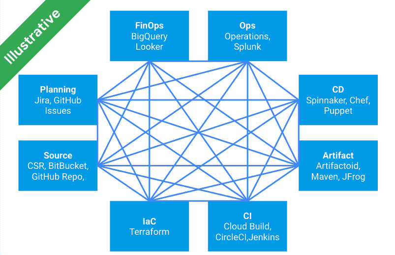

# 用数据扩大你的谷歌云登陆区

> 原文：<https://medium.com/google-cloud/growing-your-google-cloud-landing-zone-with-data-f59950d33389?source=collection_archive---------1----------------------->

在本文中，我们评估数据如何丰富着陆区，并为您提供一个现代化、可扩展、经得起未来考验且以用户为中心的解决方案。

*免责声明:我在谷歌的云团队工作。观点是我自己的，而不是我现在雇主的观点。*

当组织开始使用谷歌云时，建立一个[着陆区](https://cloud.google.com/architecture/landing-zones)是一个最佳实践。这样的着陆区组织并控制如何以安全的方式部署、使用和扩展服务。它包括多个元素，如身份、资源管理、安全性和网络。它为实施工作负载的不同团队提供了基础，并将随着时间的推移随着需求的变化而发展。

通常，组织会成立一个专门的团队来管理着陆区，并支持不同的工作负载团队。该团队帮助进行工作量评估、项目设置和团队支持。它成为在 Google Cloud 上指导组织的单一联系点。

因此，重要的是着陆区以模块化方式设计，重点是自动化。这允许嵌入和标准化许多原则，包括可重用性、可重复性、可追溯性、可伸缩性等等。在许多场合，基础设施作为代码的概念会被强调。虽然它有它的价值，但它需要在一个更大、更复杂的解决方案中得到体现。

# 数据在着陆区会增加什么价值？

在云之旅开始时，着陆区已经设置好。它的[元素](https://cloud.google.com/architecture/landing-zones#elements)通常被很好地描述和实现:

*   组织和项目结构是如何定义的？
*   使用什么身份解决方案对用户进行身份验证？
*   适用哪些安全策略？
*   如何设置计费和成本控制？
*   …等等

然而，人们关注的主要是技术特性和设置，而对运营模式和服务关注较少。然而，当着陆区开始运行时，整个组织的不同利益相关者将开始使用它，并将在已定义的不同主题之间产生不同的交互。这些交互生成数据，并要求用户与云团队进行交互。从这个角度来看，集成解决方案可以发挥宝贵的作用，提供

*   具有自助服务能力的云用户
*   云团队是管理和实施的高效基础
*   控制和管理着陆区的中央解决方案
*   向整个组织的利益相关者提供相关的最新信息

简而言之，这归结为通过集中编排自动化服务并将必要的数据存储在着陆区元数据平台中来组织自动化服务。每个服务将存储其输出，以便它可以被其他服务用作输入。这使得以与处理组织数据和见解的数据和集成平台相同的方式管理着陆区成为可能。

让我们来看看下面这个问题:你能提供一份你所有云项目的清单吗？对此你会如何回应？有时我会得到一个答案，但我经常会得到这样的回应:让我再联系你；我需要运行一个命令/脚本；我在某个地方有一个电子表格，里面有这些信息；…这是一个相当简单的问题。如果您想知道企业所有者是谁，项目的用途是什么，已经设置了哪些预算警报，以及它们与过去 3 个月的实际消耗相比如何，该怎么办？这就是登陆区元数据平台的用武之地。让数据随时可用，为需要它的服务、用户和利益相关者做好准备，这难道不好吗？

因此，该解决方案可以在支持在组织中创建[云计算文化和思维模式方面发挥重要作用。它将提供必要的工具，向所有利益攸关方提供透明、准确和可操作的数据。通过这种方式，技术、财务和业务可以相互理解并协同工作，以优化成本并加速业务价值的实现。](https://cloud.google.com/learn/what-is-finops)

# 为什么要使用集成方法？

基本原理很简单，集成和维护需要大量的工作。此外，从一开始就考虑所有的功能和服务是不可能的。云功能和管理工具正在快速发展，每种工具都有其特定的侧重点和优缺点。总会有一个平衡。

*   不同类型的**用户有不同的需求** —例如:分析财务数据需要深度分析能力，这与需要将安全策略嵌入到解决方案中的开发团队不同
*   **新技术和服务**将会出现——随着技术变得越来越复杂，您希望利用云平台选项提供的灵活性和强大功能
*   组织结构和**流程可以改变** —您还希望相同的云平台选项对所有用户都简单直观，充当推动者，而不是处理您如何在内部优化或转型
*   **工具将会发展**随着新特性的出现，新工具将会出现——您如何快速且不受限制地利用它们

因此，必须避免在不同工具之间创建点对点连接，这将导致不可维护的状态，从而降低可见性和透明度。

不同工具之间的点对点连接

相反，充当聚合器和处理器的模块化平台克服了这些不便，即管理和控制交互的不同工具。

集中管理和控制不同的工具

# 如何搭建登陆区元数据平台？

“平台”这个词用得很好。您的云解决方案的核心；它永远不会结束，会随着时间的推移而成长和演变。它需要被视为一种产品，而不是一个项目，其专用所有权嵌入到您组织的中央云团队治理结构中。

从小处着手，逐步发展。经验表明，最好从小处着手，进行试验，建立信心，然后扩大规模。系统设计的[核心原则](https://cloud.google.com/architecture/framework/system-design/principles)描述了如何实现一个健壮的解决方案并自动引入变更，最小化潜在风险，并提高运营效率。通过关注用例，关键功能得到逐步实施，使愿景和战略成为现实，同时获得不同 IT 和业务利益相关方的认可。中央云团队将帮助推动变革，使新的工作方式成为规范。

如前所述，模块化是这种平台需要具备的一个重要特征。应根据关键标准评估选择，这些标准包括易用性、执行、集成和可扩展性:

关键架构标准

将这些作为设计和实施的核心将确保:

*   可以很容易地添加新技术
*   更换技术时迁移成本降低
*   洞察和自动化为用户和系统提供了帮助
*   新的想法和可能性可以很快实现

当归结到利用不同产品的功能时，解耦使您能够在每个产品的创新可用时使用它们，数据一致化确保使用相同的语言。话虽如此，但每个产品都有其独特的特点——需要特定的条件来触发行动。在这种情况下，最好让执行尽可能接近相应的产品，不要过度概括，因为产品的价值可能会变平。

通常，云原生平台框架和一系列同类最佳工具的组合将提供最佳的灵活性和未来就绪性。基本构件包括:

*   用于构建、运行和监控的开发工具
*   保护并监控解决方案和基础架构
*   编排和集成能力支持任何类型的现代集成模式:API、事件、流、文件、CDC 等。
*   处理和结构化元数据的数据管理解决方案
*   构建有效用户界面的用户体验能力
*   自助式洞察和分析，以及领先的人工智能解决方案，帮助预测、自动化和推动业务成果

基本构件

这个平台的一个关键组件是元数据存储，它将统一和连接不同的数据概念。这将是解决方案的*‘大脑*’，而跳动的*‘心脏*’将由执行指挥者形成。

# 如何入门？

实施这种集成解决方案的途径会有所不同。你想从小事做起并尝试一下吗？那么从前面提到的项目概述问题开始就是一个很好的用例。它允许你轻松地实验、学习和扩展。

*注意:以下概念是说明性的，旨在指导和启发您，而不是提供构建解决方案所需的选择和行动的详尽列表。*

回答最初的问题“您能提供您所有云项目的列表吗？”可以通过确保每次创建云项目时，也注册它来实现。作为着陆区设置的一部分，基础设施即代码(IaC)原则将用于自动化项目创建。因此，下一步是将它注册到数据存储中。

项目登记

前面讨论了去耦的关键标准。这归结为确保不使用单一的大型自动化代码库，而是使用事件或 API 构建相互连接的独立服务。对于这个例子，我们将使用[发布/订阅](https://cloud.google.com/pubsub)作为集成中间件。

分离的项目登记

在注册过程中，可以存储其他数据，如企业所有者、描述、项目类型、允许的预算等。首先，我们将使信息对不同的利益相关者可见。

项目可见性仪表板

由于在项目创建期间已经确定了允许的预算，这允许现在扩展该解决方案，以便也以编程方式[设置该预算](https://cloud.google.com/billing/docs/how-to/budget-api)——这再次使用单独的服务，以便更新预算与项目创建逻辑解耦。

以编程方式设置预算预警

接下来，有一个项目列表，对于每个项目，已经(自动)创建的预算可以被查询和报告。但是，过去三个月消耗了多少？预算是现实的还是设定的过于宽松？这可以通过[使计费数据在元数据存储中](https://cloud.google.com/billing/docs/how-to/export-data-bigquery)可用来实现。

使计费数据可用

慢慢地，我们的解决方案越来越多，它对组织的价值也越来越大。元数据存储正在获取更多可用于创建新服务的数据:

*   [当预算警报被触发](https://cloud.google.com/billing/docs/how-to/budgets)时，发布/订阅集成可以执行操作(例如关闭虚拟机)和通知，这些操作和通知可以使用存储在元数据存储中的配置进行定制。
*   可以开发一种服务，当预算警报被定义为过于宽松时，向项目所有者发送自动通知。
*   可以开发一种服务，由项目所有者定期检查消耗和预算警报
*   还有更多…

这个例子说明了这个概念和无限的可能性。它从基础设施即代码继续发展到 FinOps。但是它可以扩展到审计和控制、策略执行、自助服务等等。这是每个组织定义自己的优先事项和旅程的地方。根据经验，我将以几个好的实践作为结束，供您在开始和前进时考虑:

*   一个完整的解决方案需要的不仅仅是集成和数据存储，其他功能还包括仪表板、自助服务、机器学习、警报等
*   然而，一个关键的组件是数据模型，它需要为进化而建立
*   确保记录并查看如何利用代码做出贡献
*   还要关注平台自身交付渠道的自动化
*   尽可能使用无服务器云功能
*   并且在解决方案没有按预期工作时，从一开始就包括错误处理和监控