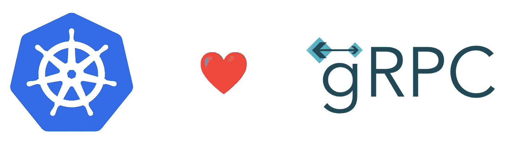

# 带 Kubernetes 1.24+的 gRPC 健康探头

> 原文：<https://medium.com/google-cloud/grpc-health-probes-with-kubernetes-1-24-b5bd26253a4c?source=collection_archive---------2----------------------->



*2022 年 12 月 8 日更新，通过* [*掌舵图*](/google-cloud/246119e46d53) *部署线上精品。*

[Kubernetes](https://kubernetes.io/docs/tasks/configure-pod-container/configure-liveness-readiness-startup-probes/) 使用活跃度探测器了解何时重启容器，使用就绪性探测器了解容器何时准备好开始接受流量。

从 Kubernetes 1.24+ 开始，gRPC 健康探测器现在在 beta [中得到原生支持。在此之前，我们需要在每个](https://kubernetes.io/blog/2022/05/13/grpc-probes-now-in-beta/) `[Dockerfile](https://cloud.google.com/blog/topics/developers-practitioners/health-checking-your-grpc-servers-gke)`中添加`[grpc_health_probe](https://cloud.google.com/blog/topics/developers-practitioners/health-checking-your-grpc-servers-gke)` [二进制。](https://cloud.google.com/blog/topics/developers-practitioners/health-checking-your-grpc-servers-gke)

自从[最近的 v0.4.1 版本](https://github.com/GoogleCloudPlatform/microservices-demo/releases/tag/v0.4.1)以来，[在线精品示例](https://github.com/GoogleCloudPlatform/microservices-demo)提供了一个选项，使其应用程序支持此功能。这允许您利用原生的 Kubernetes 特性，将容器映像的大小减少 4MB(虚拟的)和 11MB(在磁盘上),并减少这个`grpc_health_probe`二进制文件增加的维护和攻击面。

# 旧方法与新的本机 gRPC 健康探测器

有了 Kubernetes 新的原生 gRPC 健康探测器，您不再需要将`grpc_health_probe`二进制文件(像我们以前需要的那样)添加到您的微服务的`Dockerfile`中:

```
RUN GRPC_HEALTH_PROBE_VERSION=v0.4.14 && \
    wget -qO/bin/grpc_health_probe https://github.com/grpc-ecosystem/grpc-health-probe/releases/download/${GRPC_HEALTH_PROBE_VERSION}/grpc_health_probe-linux-amd64 && \
    chmod +x /bin/grpc_health_probe
```

在您的`Deployments`的 Kubernetes 清单中，这里是`readinessProbe`和`livenessProbe`的相关更新:

```
+           grpc:
+             port: 9555
-           exec:
-             command:
-             - /bin/grpc_health_probe
-             - -addr=:9555
```

# 使用这一新特性部署在线精品示例

在版本 1.24+中创建一个 Google Kubernetes engineer(GKE)集群:

```
gcloud container clusters create tests \
    --zone=us-east4-a \
    --machine-type=e2-standard-2 \
    --num-nodes=4 \
    --release-channel=rapid
```

*注:截止 2022 年 11 月 1 日，急速频道*[*【GKE】默认版本为 1.24*](https://cloud.google.com/kubernetes-engine/docs/release-notes-rapid) *。*

从这里开始，让我们部署支持 gRPC 健康探针的在线精品示例。

为此，我们将使用在线精品店的掌舵图:

```
helm upgrade onlineboutique oci://us-docker.pkg.dev/online-boutique-ci/charts/onlineboutique \
    --install \
    --create-namespace \
    -n onlineboutique \
    --set nativeGrpcHealthCheck=true
```

*该部署将允许利用专用容器* `*images*` *:*

```
*-         image: gcr.io/google-samples/microservices-demo/*service:v0.4.1
+         image: gcr.io/google-samples/microservices-demo/*service:v0.4.1-native-grpc-probes*
```

如果你稍微等一等，直到所有的`Pods`都在运行，你应该可以让你的在线精品网站成功运行。

这就是我们如何轻松地利用 Kubernetes 1.24+ 的新[原生 gRPC 健康探针和在线精品样本。](https://kubernetes.io/blog/2022/05/13/grpc-probes-now-in-beta/)

默认情况下，在线精品示例还不支持原生 gRPC 健康探测器，因为 Kubernetes 1.24+还没有被广泛使用。这就是为什么我们需要使用相关的[头盔图](https://github.com/GoogleCloudPlatform/microservices-demo/blob/main/helm-chart/values.yaml#L21)或 [Kustomize 叠加图](https://github.com/GoogleCloudPlatform/microservices-demo/tree/main/kustomize/components/native-grpc-health-check)。

*原贴于*[*Mathieu-Benoit . github . io*](https://mathieu-benoit.github.io/)*。*