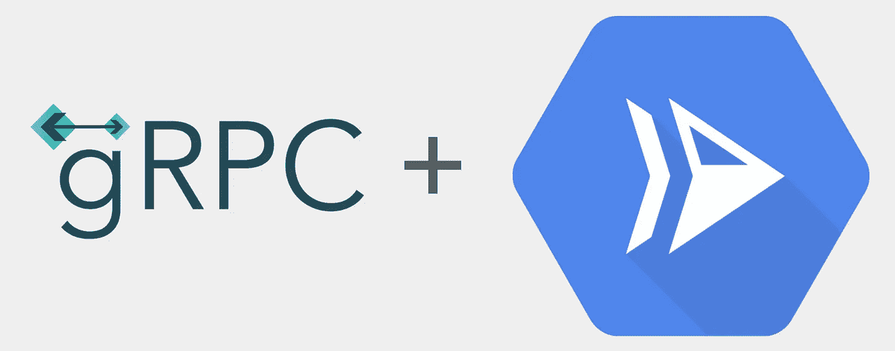
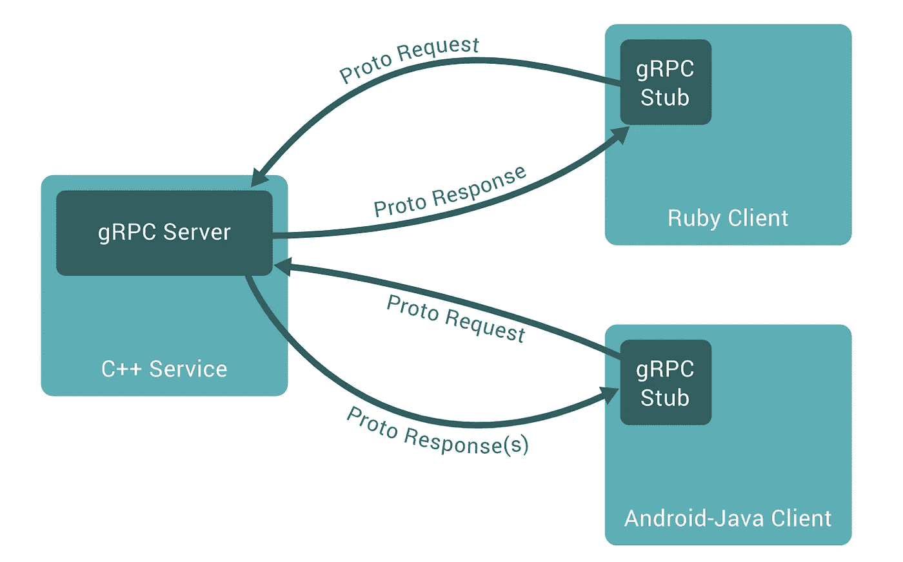

# 云运行上的 gRPC

> 原文：<https://medium.com/google-cloud/grpc-on-cloud-run-743ed586d4ad?source=collection_archive---------1----------------------->



gRPC +云运行

gRPC 是一个现代的、开源的、高性能的远程过程调用(RPC)框架，可以在任何环境中运行。它允许您直接调用客户端应用程序，就像它是一个本地服务一样。您还可以在服务之间高效地传输数据。此外，Google APIs 通过 gRPC 支持请求，允许您构建高效、高吞吐量的系统。

在这篇博文中，我们将介绍 gRPC 协议以及如何在云运行中使用它们！

## 了解 gRPC

gRPC 客户端和服务器可以在各种环境中运行并相互对话——从 Google 内部的服务器到您自己的桌面——并且可以用 gRPC 支持的任何语言编写。例如，您可以轻松地用 Java 创建 gRPC 服务器，用 Go、Python 或 Ruby 创建客户机。

这是一张图片:



一个 C++ gRPC 服务器与一个 Ruby 和 Android 客户端对话。

默认情况下，gRPC 使用 [**协议缓冲区**](https://developers.google.com/protocol-buffers) 进行数据序列化。使用协议缓冲区的第一步是为我们要在`.proto`文件中发送的数据定义*结构*，消息包括如下字段:

```
// A Person message.
// Numbers are used to *identify* fields in the binary encoded data. **message** **Person** {
  **string** name = 1;
  **int32** id = 2;
  **bool** likes_dogecoin = 3;
}
```

`protoc`工具可以基于这个`proto`文件生成语言定义。

> 注:`protoc`可以用`brew install protobuf`和[其他方式](https://grpc.io/docs/protoc-installation/)安装。

## 示例应用程序:计算器

让我们构建一个示例应用程序——一个通过 gRPC 接受计算请求的计算器。首先，让我们看看`calculator.proto`的定义:

包含消息和服务的样本原型文件。

原型文件从一些定义和服务 RPC 接口开始。与普通的函数调用一样，`Calculate` rpc 接受两个浮点数和`ADD`或`SUBTRACT`的操作。该服务期待一个`BinaryOperation`消息并返回一个`CalculationResult`消息。

然后，我们可以编写一个这样的节点服务来侦听 gRPC 请求(不是 HTTP 请求):

带有计算器服务的 gRPC 服务器。

> 注意，我们在这里使用了`createInsecure`方法。Cloud Run 的代理为我们提供了一个 TLS 加密的代理，为我们处理设置证书的麻烦事。从代理到装有 gRPC 服务器的容器的流量通过一个加密的隧道，所以我们不需要担心自己处理它。Cloud Run 原生处理 HTTP/2，所以 gRPC 的传输得到了很好的支持。

当您使用`server.addService`时，您正在向服务器添加 *proto* 服务，这将调用`calculate`函数:

> 完整代码在[https://github . com/grpc-ecosystem/grpc-cloud-run-example/tree/master/node](https://github.com/grpc-ecosystem/grpc-cloud-run-example/tree/master/node)

## 部署到云运行

让我们将这个服务部署到 Cloud Run。如果没有 Dockerfile，源代码将使用 [Google Cloud Buildpacks](https://github.com/GoogleCloudPlatform/buildpacks) ，它将自动检测我们的语言(因为`package.json`而成为节点)并构建我们的容器。

使用 Cloud Run 的一个好处是它支持 gRPC 开箱即用，部署时不需要额外的标志。

> 注意:如果你想用 HTTP/2 流 gRPCs，添加标志`--use-http2` [🔗](https://cloud.google.com/run/docs/configuring/http2)。

使用`—-source`标志部署云跑应用程序:

```
gcloud beta run deploy --source .
```

为了测试服务，我们可以首先获得运行端点，然后使用`[grpcurl](https://github.com/fullstorydev/grpcurl)`，一个类似 cURL 的工具，但是对于 gRPC:

一个用于云运行测试的便捷脚本

嘣。现在你有了一个自动缩放计算器 gRPC 服务！

我们做到了！如果您想了解更多信息，请查看以下链接:

*   🐙[https://github.com/grpc-ecosystem/grpc-cloud-run-example](https://github.com/grpc-ecosystem/grpc-cloud-run-example)
*   📄[https://cloud.google.com/run/docs/triggering/grpc](https://cloud.google.com/run/docs/triggering/grpc)