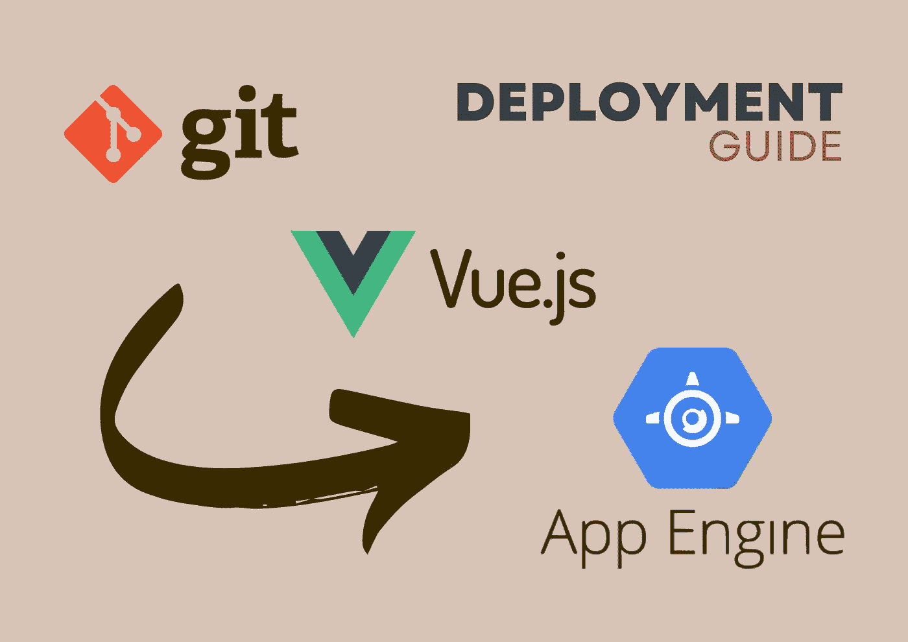

# 使用 Git 存储库的云构建将 Vue.js 应用部署到 Google 应用引擎的指南

> 原文：<https://medium.com/google-cloud/guide-to-deploy-vue-js-app-to-google-app-engine-with-cloud-build-from-git-repository-256c3043155e?source=collection_archive---------0----------------------->

## 本教程展示了从 Git 提交到 Google Cloud 构建，再到 Google App Engine 的逐步部署指南

使用 Git 和 Docker 在 Google App Engine 上部署 Vue.js 的指南。来源:作者

如果您担心自动伸缩、突然的负载峰值等。，你确实可以利用谷歌应用引擎。它帮助您实现自动化…