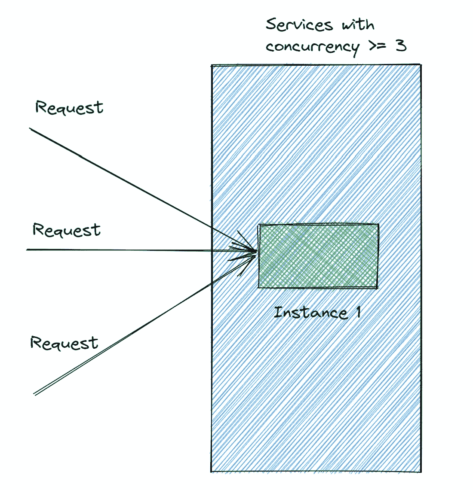

# Hack:使用云功能作为 Golang 的网络服务器

> 原文：<https://medium.com/google-cloud/hack-use-cloud-functions-as-a-webserver-with-golang-42edc7935247?source=collection_archive---------1----------------------->


无服务器是一个新的范例，它改变了开发习惯。“无服务器管理”模式很棒，但是它的对手是 T4。在 FaaS *(作为服务的功能)*，只有**一个功能被暴露**，只有一个单一目的工作负载的入口点。

是云功能的设计。但是，有时候，**你想要(或者需要)做更多的事情**。我已经[写了一篇关于 Python 解决方案的文章](/google-cloud/use-multiple-paths-in-cloud-functions-python-and-flask-fc6780e560d3)，但是这需要外部依赖来构建黑客。这一次，**使用 Golang，可以通过使用本地特性来本地提供多条路径**。

让我们开始讨论细节吧

# 路由传入的请求

按照设计，**云功能是单一用途的**并且只服务于**一个入口点**。

第一步，也是这个黑客的主要目的，是**在这个惟一的入口点上获取请求，并根据 URL *(sub)* 路径将其路由到另一段代码**。
为了实现这一点，我们可以使用 **Go native server 复用器**并根据路径路由请求。

```
var mux = newMux()

func Webserver(w http.ResponseWriter, r *http.Request) {
   mux.ServeHTTP(w, r)
}

func newMux() *http.ServeMux {
   mux := http.NewServeMux()
   mux.HandleFunc("/static/", serveStatic)
   mux.HandleFunc("/hello", hello)
   mux.HandleFunc("/subroute/login", login)
   return mux
}
```

没有外部依赖性，所有特性都内置在 Golang 核心库中。

## 服务动态端点

现在，路由器能够将请求路由到`HandleFunc`，我们可以执行**专用代码来动态处理请求**。
这里举 2 个例子:

```
func hello(w http.ResponseWriter, r *http.Request) {
   fmt.Fprint(w,"Hello World!")
}

func login(w http.ResponseWriter, r *http.Request) {
   fmt.Fprint(w,"Login from /subroute/login")
}
```

## 提供静态资源

我们也可以**服务静态资源**！但这要棘手得多。

首先， **Golang 是一种强大的编译语言**:只有**需要的文件和依赖项被编译**并添加到一个**唯一的二进制**。编译后你没有额外的文件或目录，既不需要**系统或环境依赖**，也不需要 Golang 安装来运行二进制文件。

然而，因为**静态文件不是用 Golang 代码**编译的，它们**也没有嵌入 Golang 二进制代码**。它们被丢弃。

> 如何服务静态文件和目录？

想法是把文件放在 Go 二进制文件之外的某个地方，并为它们服务。这里的**窍门是知道云函数的容器封装是如何**的。

当您部署您的云功能时，您**提交您的源代码**，它被发送到 Cloud Build 来构建容器。在容器构建过程中，**源文件被添加到容器内的一个目录中，该目录位于专用目录** :
`/workspace/src/<Go package name>`

在 Golang 中，为了在运行时以编程的方式知道包名，并且为了避免硬编码的值，你可以在一个哑元类型上使用反射

```
type Empty struct{}

var functionSourceCodeDir = "/workspace/src/" + reflect.TypeOf(Empty{}).PkgPath()
```

现在你有了你的源文件的根路径，你**必须服务它们**，就像这样

```
func serveStatic(w http.ResponseWriter, r *http.Request) {
   file := r.URL.Path
   if strings.HasSuffix(file,"/") {
      // Set the default page
      file+="index.html"
   }
   http.ServeFile(w, r, path.Clean(functionSourceCodeDir+file))
}
```

*注意，本* ***包装结构可以随时更改，恕不另行通知！***

## 基于云功能的网络服务器

所有的部件都在这里，你只需要测试它是否像预期的那样工作。你可以在 [**我的 GitHub 库**](https://github.com/guillaumeblaquiere/cloudfunction-webserver) 中找到**的源代码，按照那个步骤操作:**

*   **使用该命令部署您的功能**

```
# Runtime v1
gcloud beta functions deploy --runtime=v1 \
  --region=us-central1 --allow-unauthenticated \
  --runtime=go113 --trigger-http --entry-point=Webserver webserver# Runtime v2
gcloud beta functions deploy --runtime=v2 \
  --region=us-central1 --allow-unauthenticated \
  --runtime=go113 --trigger-http --entry-point=Webserver webserver
```

*根据需要更改区域、安全性和功能名称。*

*   **测试这些 URL** 路径:

```
# Dynamic content
https://us-central1-<ProjectId>.cloudfunctions.net/webserver/hello
https://us-central1-<ProjectId>.cloudfunctions.net/webserver/subroute/login# Static content
https://us-central1-<ProjectId>.cloudfunctions.net/webserver/static/
https://us-central1-<ProjectId>.cloudfunctions.net/webserver/static/index.html
https://us-central1-<ProjectId>.cloudfunctions.net/webserver/static/subdir/login.html
```

*用自己的项目 ID* 替换 `*<ProjectId>*`

> *这和预期的一样，但是这是一个好主意吗？*

# *V1 运行时:并发问题*

*名为 v1 的**云函数遗留运行时被设计为**每次只为每个实例服务一个请求。**
这意味着，如果您有 4 个并发请求，将会产生 4 个实例并处理这些请求。***

**

*这个设计约束不是中性的，因为:*

*   *您将有 **4 次冷启动**，即实例启动和初始化云函数代码的时间*
*   *您将支付 **4 倍的处理成本**，即您将有 4 个实例，每个请求一个，因此是处理时间&成本的 4 倍。*

*“4”不是随机选择的。这是浏览器为下载资源(如静态资源)而创建的标准并发连接数。*

*还有一个 1000 个并发云函数实例的硬限制**并行**，您可以很快达到这个限制。*

**你可以在* [*我的一篇相当老的文章*](/google-cloud/cloud-run-vs-cloud-functions-whats-the-lowest-cost-728d59345a2e) *中找到更多关于云运行&云函数对比的细节。**

# *V2 运行时:云运行的力量*

*云功能**下一代运行时，命名为 V2，由云运行**提供支持。*

*有了这一巨大改进，您就可以利用云运行并发特性，默认情况下在同一个实例上处理多达 80 个并发请求，通过配置可以处理多达 1000 个请求。*

**

*这一次，当您接收到 4 个(或更多)并发请求时， **v2 运行时能够在同一个实例**上处理它们，因此避免了 V1 运行时以前的缺点。*

# *一个常见的警告:开发者体验*

*就开发者体验而言，**云函数运行时 v1 或 v2 都有同样的问题:本地开发体验**。*

*事实上，你没有任何东西可以在你的工作站上运行，你只有一段代码，一个函数。*

> *那么，如何运行你的函数呢？怎么测试？*

*当你构建复杂的函数时，进行测试和小的迭代尤其重要。总是等待大约 2 分钟来在云功能服务上部署你的代码并测试/验证/调试它是没有效率的。
*[***函数框架***](https://cloud.google.com/functions/docs/functions-framework) ***倾向于根据语言很好地解决*** *的问题，但它的* ***并不总是理想的*** *。***

**你需要**构建一些额外的东西**，一个小的/脏的东西来本地启动你的代码功能，一些能够获得 HTTP 请求的东西**

> **例如网络服务器！**

***我在* [*里已经讲过了，我的第一篇文章*](/google-cloud/cloud-run-and-cloud-function-what-i-use-and-why-12bb5d3798e1) *。* 最后，**你有一个 web 服务器调用你的函数**。准备好部署并且**完全兼容应用引擎或云运行。**
*这里只是运行你的功能代码。如果你* ***有环境依赖值*** *，像云函数容器里的源文件目录，* ***就比较难在本地构建一些等价的东西。*****

> **那么，为什么一个被黑的云函数？**

# **为正确的工作使用正确的工具**

**基于云运行的 V2 运行时是一个不错的选择，没有 V1 运行时的一些缺点。**

> **然而，这个解决方案仍然是一个黑客！**

****产品有自己的优势**并被**相应设计**，更**便携**，更**可扩展**，更**高效**(在性能、成本或开发者体验/生产力方面)！
在这种情况下，**云运行之上的 V2 运行时增加了一些额外的约束。****

> **为什么要用云函数而不是云运行？**

**有了云运行，**本地测试更容易了**，开箱即用的**可移植性更强了**，而且您仍然是容器内运行时环境的**主人**。*你* ***避免任何容器包装的改变*** *这样就可以破解这种黑客攻击，就像静态资源一样。***

**有了云运行，你**可以释放你的可能性**，变得**更加敏捷**！性能和优势将是相同的云功能 V2 和这个黑客，但没有缺点！**